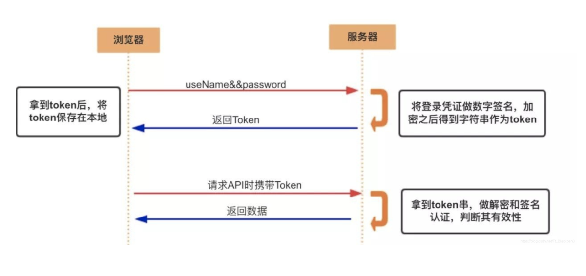

# jwt和token介绍

1. token介绍

   令牌（Token）：在计算机领域，令牌是一种代表某种访问权限或身份认证信息的令牌。它可以是一串随机生成的字符或数字，用于验证用户的身份或授权用户对特定资源的访问。普通的令牌可能以各种形式出现，如访问令牌、身份令牌、刷新令牌等。

   

   简单理解 : 每个用户生成的唯一字符串标识,可以进行用户识别和校验

   类似技术:  天王盖地虎 ,小鸡炖蘑菇

   优势: token验证标识无法直接识别用户的信息,盗取token后也无法\`登录\`程序! 相对安全!

2. jwt介绍

   Token是一项规范和标准(接口)

   JWT(JSON Web Token)是具体可以生成,校验,解析等动作Token的技术(实现类)

   

3. jwt工作流程

   -   用户提供其凭据（通常是用户名和密码）进行身份验证。
   -   服务器对这些凭据进行验证，并在验证成功后创建一个JWT。
   -   服务器将JWT发送给客户端，并客户端在后续的请求中将JWT附加在请求头或参数中。
   -   服务器接收到请求后，验证JWT的签名和有效性，并根据JWT中的声明进行身份验证和授权操作

4. jwt数据组成和包含信息

   JWT由三部分组成: header(头部).payload(载荷).signature(签名)

   

   我们需要理解的是, jwt可以携带很多信息! 一般情况,需要加入:有效时间,签名秘钥,其他用户标识信息!

   有效时间为了保证token的时效性,过期可以重新登录获取!

   签名秘钥为了防止其他人随意解析和校验token数据!

   用户信息为了我们自己解析的时候,知道Token对应的具体用户!

5. jwt使用和测试

   1. 导入依赖

      ```xml
      <dependency>
          <groupId>io.jsonwebtoken</groupId>
          <artifactId>jjwt</artifactId>
          <version>0.9.1</version>
      </dependency>
      
      <dependency>
          <groupId>javax.xml.bind</groupId>
          <artifactId>jaxb-api</artifactId>
          <version>2.3.0</version>
      </dependency>
      ```

   2. 编写配置

      application.yaml

      ```yaml
      #jwt配置
      jwt:
        token:
          tokenExpiration: 120 #有效时间,单位分钟
          tokenSignKey: headline123456  #当前程序签名秘钥 自定义
      ```

   3. 导入工具类

      封装jwt技术工具类

      ```java
      package com.atguigu.utils;
      
      import com.alibaba.druid.util.StringUtils;
      import io.jsonwebtoken.*;
      import lombok.Data;
      import org.springframework.boot.context.properties.ConfigurationProperties;
      import org.springframework.context.annotation.Configuration;
      import org.springframework.stereotype.Component;
      
      import java.util.Date;
      
      @Data
      @Component
      @ConfigurationProperties(prefix = "jwt.token")
      public class JwtHelper {
      
          private  long tokenExpiration; //有效时间,单位毫秒 1000毫秒 == 1秒
          private  String tokenSignKey;  //当前程序签名秘钥
      
          //生成token字符串
          public  String createToken(Long userId) {
              System.out.println("tokenExpiration = " + tokenExpiration);
              System.out.println("tokenSignKey = " + tokenSignKey);
              String token = Jwts.builder()
      
                      .setSubject("YYGH-USER")
                      .setExpiration(new Date(System.currentTimeMillis() + tokenExpiration*1000*60)) //单位分钟
                      .claim("userId", userId)
                      .signWith(SignatureAlgorithm.HS512, tokenSignKey)
                      .compressWith(CompressionCodecs.GZIP)
                      .compact();
              return token;
          }
      
          //从token字符串获取userid
          public  Long getUserId(String token) {
              if(StringUtils.isEmpty(token)) return null;
              Jws<Claims> claimsJws = Jwts.parser().setSigningKey(tokenSignKey).parseClaimsJws(token);
              Claims claims = claimsJws.getBody();
              Integer userId = (Integer)claims.get("userId");
              return userId.longValue();
          }
                      //判断token是否有效
          public  boolean isExpiration(String token){
              try {
                  boolean isExpire = Jwts.parser()
                      .setSigningKey(tokenSignKey)
                      .parseClaimsJws(token)
                      .getBody()
                      .getExpiration().before(new Date());
                  //没有过期，有效，返回false
                  return isExpire;
              }catch(Exception e) {
                  //过期出现异常，返回true
                  return true;
              }
          }
      }
      ```

​    4.  使用和测试

```java
@org.springframework.boot.test.context.SpringBootTest
public class SpringBootTest {

    @Autowired
    private JwtHelper jwtHelper;

    @Test
    public void test(){
        //生成 传入用户标识
        String token = jwtHelper.createToken(1L);
        System.out.println("token = " + token);

        //解析用户标识
        int userId = jwtHelper.getUserId(token).intValue();
        System.out.println("userId = " + userId);

        //校验是否到期! false 未到期 true到期
        boolean expiration = jwtHelper.isExpiration(token);
        System.out.println("expiration = " + expiration);
    }
}
```

-   **1.2  登录功能实现**


# 单点登录（SSO）

**定义与核心思想** 单点登录（Single Sign-On, SSO）是一种身份认证机制，允许用户通过一次登录即可访问多个相互信任的系统，无需重复输入凭证。其核心目标是简化用户操作并提升安全性，常见于企业内部系统（如办公平台、邮箱、CRM等）或同一组织下的多个服务（如百度百科、贴吧等） 

**技术实现方式** SSO的实现通常依赖以下技术：

1. 共享Session/Cookie：通过统一认证服务器生成Token，各子系统共享验证逻辑（如CAS协议）
2. 令牌（Token）机制：用户登录后，认证服务器颁发令牌（如SAML断言、JWT），资源服务器验证令牌有效性后授权访问
3. 协议支持：常见的SSO协议包括CAS、SAML、OAuth 2.0（授权码模式）

**典型流程**

1. 用户访问系统A，未登录则跳转至认证服务器。
2. 用户完成认证后，认证服务器生成令牌并返回给系统A。
3. 用户访问系统B时，系统B通过令牌向认证服务器验证身份，无需重新登录


# 1.OAuth详解

## 1.1 OAuth2.0

### 1.1.1 介绍

- OAuth（Open Authorization）是一个关于授权（authorization）的开放网络标准，允许用户授权第三方 应用访问他们存储在另外的服务提供者上的信息，而不需要将用户名和密码提供给第三方移动应用或分享他 们数据的所有内容。OAuth在全世界得到广泛应用，目前的版本是2.0版。
- **协议特点**
  - 简单：不管是OAuth服务提供者还是应用开发者，都很易于理解与使用
  - 安全：没有涉及到用户密钥等信息，更安全更灵活
  - 开放：任何服务提供商都可以实现OAuth，任何软件开发商都可以使用OAuth

- OAuth的作用就是让"客户端"安全可控地获取"用户"的授权，与"服务提供商"进行交互

### 1.1.2 基本概念

- **Resource owner（资源拥有者）**：拥有该资源的最终用户，他有访问资源的账号密码；
- **Resource server（资源服务器）**：受保护资源所在的服务器，如果请求包含正确的访问令牌，就可以访问受保护的资源；
- **Client（客户端）**：请求访问资源的客户端，可以是浏览器、移动设备或者服务器，客户端会携带访问令牌访问资源服务器上的资源；
- **Authorization server（认证服务器）**：负责认证客户端身份的服务器，如果客户端认证通过，会给客户端发放访问资源服务器的令牌。


### 1.1.3 应用场景

- **原生app授权**：app登录请求后台接口，为了安全认证，所有请求都带token信息，如果登录验证、 请求后台数据
- **前后端分离单页面应用**：前后端分离框架，前端请求后台数据，需要进行oauth2安全认证
- **第三方应用授权登录**，比如QQ，微博，微信的授权登录

### 1.1.4 优缺点

**优点**

- 更安全，客户端不接触用户密码，服务器端更易集中保护
- 广泛传播并被持续采用
- 短寿命和封装的token
- 资源服务器和授权服务器解耦
- 集中式授权，简化客户端
- HTTP/JSON友好，易于请求和传递token
- 考虑多种客户端架构场景
- 客户可以具有不同的信任级别

**缺点**

- 协议框架太宽泛，造成各种实现的兼容性和互操作性差
- 不是一个认证协议，本身并不能告诉你任何用户信息


## 1.2 OAuth2.0举例解释

[OAuth 2.0](https://www.ruanyifeng.com/blog/2014/05/oauth_2_0.html) 是目前最流行的授权机制，用来授权第三方应用，获取用户数据。

这个标准比较抽象，使用了很多术语，初学者不容易理解。其实说起来并不复杂，下面我就通过一个简单的类比，帮助大家轻松理解，OAuth 2.0 到底是什么。

### 1.2.1 授权机制的设计

于是，我设计了一套授权机制。

第一步，门禁系统的密码输入器下面，增加一个按钮，叫做"获取授权"。快递员需要首先按这个按钮，去申请授权。

第二步，他按下按钮以后，屋主（也就是我）的手机就会跳出对话框：有人正在要求授权。系统还会显示该快递员的姓名、工号和所属的快递公司。

我确认请求属实，就点击按钮，告诉门禁系统，我同意给予他进入小区的授权。

第三步，门禁系统得到我的确认以后，向快递员显示一个进入小区的令牌（access token）。令牌就是类似密码的一串数字，只在短期内（比如七天）有效。

第四步，快递员向门禁系统输入令牌，进入小区。

有人可能会问，为什么不是远程为快递员开门，而要为他单独生成一个令牌？这是因为快递员可能每天都会来送货，第二天他还可以复用这个令牌。另外，有的小区有多重门禁，快递员可以使用同一个令牌通过它们。

### 1.2.2 互联网场景

我们把上面的例子搬到互联网，就是 OAuth 的设计了。

首先，居民小区就是储存用户数据的网络服务。比如，微信储存了我的好友信息，获取这些信息，就必须经过微信的"门禁系统"。

其次，快递员（或者说快递公司）就是第三方应用，想要穿过门禁系统，进入小区。

最后，我就是用户本人，同意授权第三方应用进入小区，获取我的数据。

**简单说，OAuth 就是一种授权机制。数据的所有者告诉系统，同意授权第三方应用进入系统，获取这些数据。系统从而产生一个短期的进入令牌（token），用来代替密码，供第三方应用使用。**

### 1.2.3 令牌与密码

令牌（token）与密码（password）的作用是一样的，都可以进入系统，但是有三点差异。

（1）令牌是短期的，到期会自动失效，用户自己无法修改。密码一般长期有效，用户不修改，就不会发生变化。

（2）令牌可以被数据所有者撤销，会立即失效。以上例而言，屋主可以随时取消快递员的令牌。密码一般不允许被他人撤销。

（3）令牌有权限范围（scope），比如只能进小区的二号门。对于网络服务来说，只读令牌就比读写令牌更安全。密码一般是完整权限。

上面这些设计，保证了令牌既可以让第三方应用获得权限，同时又随时可控，不会危及系统安全。这就是 OAuth 2.0 的优点。

注意，只要知道了令牌，就能进入系统。系统一般不会再次确认身份，所以**令牌必须保密，泄漏令牌与泄漏密码的后果是一样的。** 这也是为什么令牌的有效期，一般都设置得很短的原因。

OAuth 2.0 对于如何颁发令牌的细节，规定得非常详细。具体来说，一共分成四种授权类型（authorization grant），即四种颁发令牌的方式，适用于不同的互联网场景。下一篇文章，我就来介绍这四种类型，并给出代码实例。


## 1.3 OAuth授权模式/OAuth 2.0 的四种方式

上一篇文章介绍了 OAuth 2.0 是一种授权机制，主要用来颁发令牌（token）。本文接着介绍颁发令牌的实务操作。

下面我假定，你已经理解了 OAuth 2.0 的含义和设计思想

### 1.3.1 RFC 6749

OAuth 2.0 的标准是 [RFC 6749](https://tools.ietf.org/html/rfc6749) 文件。该文件先解释了 OAuth 是什么。

> OAuth 引入了一个授权层，用来分离两种不同的角色：客户端和资源所有者。......资源所有者同意以后，资源服务器可以向客户端颁发令牌。客户端通过令牌，去请求数据。

这段话的意思就是，**OAuth 的核心就是向第三方应用颁发令牌。**然后，RFC 6749 接着写道：

> （由于互联网有多种场景，）本标准定义了获得令牌的四种授权方式（authorization grant ）。

也就是说，**OAuth 2.0 规定了四种获得令牌的流程。你可以选择最适合自己的那一种，向第三方应用颁发令牌。**下面就是这四种授权方式。

### 1.2.1 四种授权模式

> 不管哪一种授权方式，第三方应用申请令牌之前，都必须先到系统备案，说明自己的身份，然后会拿到两个身份识别码：**客户端 ID（client ID）\**和\**客户端密钥（client secret）**。这是为了防止令牌被滥用，没有备案过的第三方应用，是不会拿到令牌的

- **Authorization Code（授权码模式）**：正宗的`OAuth2`的授权模式，客户端先将用户导向认证服务器的授权页面，用户在授权页面登陆并授权，认证服务器返回授权码给客户端，最后根据授权码获取访问令牌；
- **Implicit（隐藏式）**：和授权码模式相比，取消了获取授权码的过程，直接获取访问令牌；
- **Password（密码模式）**：客户端直接向用户获取用户名和密码，之后向认证服务器获取访问令牌；
- **Client Credentials（客户端凭证模式）**：客户端直接通过客户端认证（比如client_id和client_secret）从认证服务器获取访问令牌。

一般来说，`授权码模式`和`密码模式`是两种常用的授权模式

### 2.2 授权码模式

**授权码（authorization code）方式，指的是第三方应用先申请一个授权码，然后再用该码获取令牌。**

这种方式是最常用的流程，安全性也最高，它适用于那些有后端的 Web 应用。授权码通过前端传送，令牌则是储存在后端，而且所有与资源服务器的通信都在后端完成。这样的前后端分离，可以避免令牌泄漏。

简单流程：

**流程**：

- 客户端将用户导向认证服务器的授权页面;
- 用户在认证服务器页面登录并授权；
- 认证服务器返回授权码给客户端；
- 客户端将授权码传递给客户端所在的后端服务（也可以是自己的认证服务器），由后端服务在后端请求认证服务器获取令牌，并返回给客户端。

**详细介绍：**

第一步，A 网站提供一个链接，用户点击后就会跳转到 B 网站，授权用户数据给 A 网站使用。下面就是 A 网站跳转 B 网站的一个示意链接。

> ```javascript
> https://b.com/oauth/authorize?
> response_type=code&
> client_id=CLIENT_ID&
> redirect_uri=CALLBACK_URL&
> scope=read
> ```

上面 URL 中，`response_type`参数表示要求返回授权码（`code`），`client_id`参数让 B 知道是谁在请求，`redirect_uri`参数是 B 接受或拒绝请求后的跳转网址，`scope`参数表示要求的授权范围（这里是只读）。


第二步，用户跳转后，B 网站会要求用户登录，然后询问是否同意给予 A 网站授权。用户表示同意，这时 B 网站就会跳回`redirect_uri`参数指定的网址。跳转时，会传回一个授权码，就像下面这样。

> ```javascript
> https://a.com/callback?code=AUTHORIZATION_CODE
> ```

上面 URL 中，`code`参数就是授权码。


第三步，A 网站拿到授权码以后，就可以在后端，向 B 网站请求令牌。

> ```javascript
> https://b.com/oauth/token?
> client_id=CLIENT_ID&
> client_secret=CLIENT_SECRET&
> grant_type=authorization_code&
> code=AUTHORIZATION_CODE&
> redirect_uri=CALLBACK_URL
> ```

上面 URL 中，`client_id`参数和`client_secret`参数用来让 B 确认 A 的身份（`client_secret`参数是保密的，因此只能在后端发请求），`grant_type`参数的值是`AUTHORIZATION_CODE`，表示采用的授权方式是授权码，`code`参数是上一步拿到的授权码，`redirect_uri`参数是令牌颁发后的回调网址。


第四步，B 网站收到请求以后，就会颁发令牌。具体做法是向`redirect_uri`指定的网址，发送一段 JSON 数据。

> ```javascript
> {    
> "access_token":"ACCESS_TOKEN",
> "token_type":"bearer",
> "expires_in":2592000,
> "refresh_token":"REFRESH_TOKEN",
> "scope":"read",
> "uid":100101,
> "info":{...}
> }
> ```

上面 JSON 数据中，`access_token`字段就是令牌，A 网站在后端拿到了。


### 隐藏式

有些 Web 应用是纯前端应用，没有后端。这时就不能用上面的方式了，必须将令牌储存在前端。**RFC 6749 就规定了第二种方式，允许直接向前端颁发令牌。这种方式没有授权码这个中间步骤，所以称为（授权码）"隐藏式"（implicit）。**

第一步，A 网站提供一个链接，要求用户跳转到 B 网站，授权用户数据给 A 网站使用。

> ```javascript
> https://b.com/oauth/authorize?
>   response_type=token&
>   client_id=CLIENT_ID&
>   redirect_uri=CALLBACK_URL&
>   scope=read
> ```

上面 URL 中，`response_type`参数为`token`，表示要求直接返回令牌。

第二步，用户跳转到 B 网站，登录后同意给予 A 网站授权。这时，B 网站就会跳回`redirect_uri`参数指定的跳转网址，并且把令牌作为 URL 参数，传给 A 网站。

> ```javascript
> https://a.com/callback#token=ACCESS_TOKEN
> ```

上面 URL 中，`token`参数就是令牌，A 网站因此直接在前端拿到令牌。

注意，令牌的位置是 URL 锚点（fragment），而不是查询字符串（querystring），这是因为 OAuth 2.0 允许跳转网址是 HTTP 协议，因此存在"中间人攻击"的风险，而浏览器跳转时，锚点不会发到服务器，就减少了泄漏令牌的风险。


这种方式把令牌直接传给前端，是很不安全的。因此，只能用于一些安全要求不高的场景，并且令牌的有效期必须非常短，通常就是会话期间（session）有效，浏览器关掉，令牌就失效了。

### 3.3 密码模式

**如果你高度信任某个应用，RFC 6749 也允许用户把用户名和密码，直接告诉该应用。该应用就使用你的密码，申请令牌，这种方式称为"密码式"（password）。**

如果用户信任应用，应用可以直接携带用户的用户名和密码，直接申请令牌

**流程**：

- 客户端要求用户提供用户名和密码；
- 客户端携带用户名和密码，访问授权服务器；
- 授权服务器验证用户身份之后，直接返回令牌。

详细流程：

第一步，A 网站要求用户提供 B 网站的用户名和密码。拿到以后，A 就直接向 B 请求令牌。

> ```javascript
> https://oauth.b.com/token?
>   grant_type=password&
>   username=USERNAME&
>   password=PASSWORD&
>   client_id=CLIENT_ID
> ```

上面 URL 中，`grant_type`参数是授权方式，这里的`password`表示"密码式"，`username`和`password`是 B 的用户名和密码。

第二步，B 网站验证身份通过后，直接给出令牌。注意，这时不需要跳转，而是把令牌放在 JSON 数据里面，作为 HTTP 回应，A 因此拿到令牌。

这种方式需要用户给出自己的用户名/密码，显然风险很大，因此只适用于其他授权方式都无法采用的情况，而且必须是用户高度信任的应用。

### 2.5 凭证式

**最后一种方式是凭证式（client credentials），适用于没有前端的命令行应用，即在命令行下请求令牌。**

第一步，A 应用在命令行向 B 发出请求。

> ```javascript
> https://oauth.b.com/token?
>   grant_type=client_credentials&
>   client_id=CLIENT_ID&
>   client_secret=CLIENT_SECRET
> ```

上面 URL 中，`grant_type`参数等于`client_credentials`表示采用凭证式，`client_id`和`client_secret`用来让 B 确认 A 的身份。

第二步，B 网站验证通过以后，直接返回令牌。

这种方式给出的令牌，是针对第三方应用的，而不是针对用户的，即有可能多个用户共享同一个令牌。

### 2.6 令牌的使用

A 网站拿到令牌以后，就可以向 B 网站的 API 请求数据了。

此时，每个发到 API 的请求，都必须带有令牌。具体做法是在请求的头信息，加上一个`Authorization`字段，令牌就放在这个字段里面。

> ```bash
> curl -H "Authorization: Bearer ACCESS_TOKEN" \
> "https://api.b.com"
> ```

上面命令中，`ACCESS_TOKEN`就是拿到的令牌。

### 2.7 更新令牌

令牌的有效期到了，如果让用户重新走一遍上面的流程，再申请一个新的令牌，很可能体验不好，而且也没有必要。OAuth 2.0 允许用户自动更新令牌。

具体方法是，B 网站颁发令牌的时候，一次性颁发两个令牌，一个用于获取数据，另一个用于获取新的令牌（refresh token 字段）。令牌到期前，用户使用 refresh token 发一个请求，去更新令牌。

> ```javascript
> https://b.com/oauth/token?
>   grant_type=refresh_token&
>   client_id=CLIENT_ID&
>   client_secret=CLIENT_SECRET&
>   refresh_token=REFRESH_TOKEN
> ```

上面 URL 中，`grant_type`参数为`refresh_token`表示要求更新令牌，`client_id`参数和`client_secret`参数用于确认身份，`refresh_token`参数就是用于更新令牌的令牌。

B 网站验证通过以后，就会颁发新的令牌。

写到这里，颁发令牌的四种方式就介绍完了。下一篇文章会编写一个真实的 Demo，演示如何通过 OAuth 2.0 向 GitHub 的 API 申请令牌，然后再用令牌获取数据。


### OAuth2单点认证原理

基于OAuth2的认证方式包含四种，其中单点登录最常用的是授权码模式，其基本的认证过程如下：

1. 用户访问业务应用，业务应用进行登录检查；
2. 业务应用重定向到OAuth2认证服务器，调用获取授权码的认证接口；
3. OAuth2认证服务负责判断登录状态，如果未登录，则跳转到统一认证登录页面，如果已经登录，则直接到步骤5；
4. 用户输入用户名、密码进行授权确认；
5. 授权成功后，OAuth2认证服务携带授权码，重定向到指定的回调地址；
6. 跳转到业务应用后，业务应用收到授权码，然后携带授权码，换取OAuth2的授权token；
7. OAuth2认证服务校验授权码成功，返回授权token；
8. 业务应用携带授权token，调用OAuth2接口获取用户信息；
9. OAuth2认证服务校验授权token成功，返回用户信息；
10. 业务系统根据用户信息，创建本系统的登录信息，单点登录成功。


# 2.三方授权登录设计

## 2.1 需求介绍

自研应用需要扩展时，绕不开的就是集成其他社交软件的三方登录，比如微信/QQ/微博/Github等等，而这用到的模式属于**OAuth的授权码方式授权**，下面我就介绍几种三方授权登录教程，同时给予数据库扩展设计思路

## 2、第三方授权登录数据库设计

> 第三方授权登录的时候，第三方的用户信息是存数据库原有的 user 表还是新建一张表呢 ？答案得看具体项目。三方授权登录之后，第三方用户信息一般都会返回用户唯一的标志 **openid **或者 **unionid **或者 **id**，具体是什么得看第三方，比如 github 的是 id

### 2.1 直接通过注册的方式保存到数据库

- 如果网站**没有注册功能的**，直接通过第三方授权登录，授权成功之后，可以直接把第三的用户信息注册保存到自己数据库的 user 表里面。**典型的例子就是微信公众号的授权登录**。
- 如果网站**有注册功能的**，也可以通过第三方授权登录，授权成功之后，也可以直接**把第三的用户信息注册保存到自己数据库的 user 表里面**（但是密码是后端自动生成的，用户也不知道，只能用第三方授权登录），这样子的第三方的用户和原生注册的用户信息都在同一张表了，这种情况得看自己项目的具体情况。

### 2.2 增加映射表

现实中很多网站都有多种账户登录方式，比如可以用网站的注册 id 登录，还可以用手机号登录，可以用 QQ 登录等等。数据库中都是有映射关系，QQ、手机号等都是映射在网站的注册 id 上。保证不管用什么方式登录，只要去查映射关系，发现是映射在网站注册的哪个 id 上，就让哪个 id 登录成功。

### 2.3 建立一个 oauth 表

**建立一个 oauth 表，一个 id 列，记录对应的用户注册表的 id**，然后你有多少个第三方登陆功能，你就建立多少列，**记录第三方登陆接口返回的 openid**；第三方登陆的时候，通过这个表的记录的 openid 获取 id 信息，如果存在通过 id 读取注册表然后用 session 记录相关信息。不存在就转向用户登陆/注册界面要用户输入本站注册的账户进行 openid 绑定或者新注册账户信息进行绑定。

## 3、数据库实战举例

- 用户表分为**用户基础信息表** + **用户授权信息表**；
- 所有和授权相关，都放在用户信息授权表，**用户信息表和用户授权表是一对多的关系**

用户基础信息表

| id     | user_name | user_password | user_mobile | state    | more     |
| ------ | --------- | ------------- | ----------- | -------- | -------- |
| 用户id | 用户名    | 用户密码      | 手机号码    | 账号状态 | 其他信息 |

用户授权信息表

| id     | user_id | login_type                       | openid               | access_token       |
| ------ | ------- | -------------------------------- | -------------------- | ------------------ |
| 主键id | 用户id  | 第三方登录类型(微信/QQ/GitHub等) | 第三方应用的唯一标识 | 第三方的保存 token |


# 3.OAuth2.0实现GitHub第三方登录示例教程

这组 OAuth 系列教程，[第一篇](https://www.ruanyifeng.com/blog/2019/04/oauth_design.html)介绍了基本概念，[第二篇](https://www.ruanyifeng.com/blog/2019/04/oauth-grant-types.html)介绍了获取令牌的四种方式，今天演示一个实例，如何通过 OAuth 获取 API 数据。

很多网站登录时，允许使用第三方网站的身份，这称为"第三方登录"。


下面就以 GitHub 为例，写一个最简单的应用，演示第三方登录。

## 一、第三方登录的原理

所谓第三方登录，实质就是 OAuth 授权。用户想要登录 A 网站，A 网站让用户提供第三方网站的数据，证明自己的身份。获取第三方网站的身份数据，就需要 OAuth 授权。

举例来说，A 网站允许 GitHub 登录，背后就是下面的流程。

> 1. A 网站让用户跳转到 GitHub。
> 2. GitHub 要求用户登录，然后询问"A 网站要求获得 xx 权限，你是否同意？"
> 3. 用户同意，GitHub 就会重定向回 A 网站，同时发回一个授权码。
> 4. A 网站使用授权码，向 GitHub 请求令牌。
> 5. GitHub 返回令牌.
> 6. A 网站使用令牌，向 GitHub 请求用户数据。

下面就是这个流程的代码实现。


第三方登录的原理是借助OAuth授权来实现，首先用户先向客户端提供第三方网站的数据证明自己的身份获取授权码，然后客户端拿着授权码与授权服务器建立连接获得一个Access Token，之后客户端就可以通过Access Token来与资源服务器进行交互。

使用OAuth的好处是提供给用户一个特定的密钥，用户持有这个密钥可以访问应用中的任何信息，而不需要向网站提供用户名&密码，可以实现跨系统共享用户授权协议。

通过控制用户持有的密钥，可以很方便的控制用户可以访问的资源，以及控制密钥的过期时间。

以下是来自维基百科对于OAuth的介绍

> **开放授权**（OAuth）是一个[开放标准](https://zh.wikipedia.org/wiki/开放标准)，允许用户让第三方应用访问该用户在某一网站上存储的私密的资源（如照片，视频，联系人列表），而无需将用户名和[密码](https://zh.wikipedia.org/wiki/密码)提供给第三方应用。
>
> OAuth允许用户提供一个[令牌](https://zh.wikipedia.org/w/index.php?title=令牌&action=edit&redlink=1)，而不是用户名和密码来访问他们存放在特定服务提供者的数据。每一个令牌授权一个特定的网站（例如，视频编辑网站)在特定的时段（例如，接下来的2小时内）内访问特定的资源（例如仅仅是某一相册中的视频）。这样，OAuth让用户可以授权第三方网站访问他们存储在另外服务提供者的某些特定信息，而非所有内容。
>
> OAuth是[OpenID](https://zh.wikipedia.org/wiki/OpenID)的一个补充，但是完全不同的服务。

交互流程如下：


## 二、应用登记

一个应用要求 OAuth 授权，必须先到对方网站登记，让对方知道是谁在请求。

所以，你要先去 GitHub 登记一下。当然，我已经登记过了，你使用我的登记信息也可以，但为了完整走一遍流程，还是建议大家自己登记。这是免费的。

访问这个[网址](https://github.com/settings/applications/new)，填写登记表。


应用的名称随便填，主页 URL 填写`http://localhost:8080`，跳转网址填写 `http://localhost:8080/oauth/redirect`。

提交表单以后，GitHub 应该会返回客户端 ID（client ID）和客户端密钥（client secret），这就是应用的身份识别码。

- https://www.cnblogs.com/atwood-pan/p/17787904.html

```shell
Client ID:Ov23liFzf3DxOfkvzUOc     Client secrets:fd8c310cd2cb2d332b474fbfa95f348706add840
```

## 三、示例仓库

我写了一个[代码仓库](https://github.com/ruanyf/node-oauth-demo)，请将它克隆到本地。

> ```bash
> $ git clone git@github.com:ruanyf/node-oauth-demo.git
> $ cd node-oauth-demo
> ```

两个配置项要改一下，写入上一步的身份识别码。

> - [`index.js`](https://github.com/ruanyf/node-oauth-demo/blob/master/index.js#L3)：改掉变量`clientID` and `clientSecret`
> - [`public/index.html`](https://github.com/ruanyf/node-oauth-demo/blob/master/public/index.html#L16)：改掉变量`client_id`

然后，安装依赖。

> ```bash
> $ npm install
> ```

启动服务。

> ```bash
> $ node index.js
> ```

浏览器访问`http://localhost:8080`，就可以看到这个示例了。

## 四、浏览器跳转 GitHub

示例的首页很简单，就是一个链接，让用户跳转到 GitHub。


跳转的 URL 如下。

> ```markup
> https://github.com/login/oauth/authorize?
>   client_id=7e015d8ce32370079895&
>   redirect_uri=http://localhost:8080/oauth/redirect
> ```

这个 URL 指向 GitHub 的 OAuth 授权网址，带有两个参数：`client_id`告诉 GitHub 谁在请求，`redirect_uri`是稍后跳转回来的网址。

用户点击到了 GitHub，GitHub 会要求用户登录，确保是本人在操作。

## 五、授权码

登录后，GitHub 询问用户，该应用正在请求数据，你是否同意授权。


用户同意授权， GitHub 就会跳转到`redirect_uri`指定的跳转网址，并且带上授权码，跳转回来的 URL 就是下面的样子。

> ```markup
> http://localhost:8080/oauth/redirect?
>   code=859310e7cecc9196f4af
> ```

后端收到这个请求以后，就拿到了授权码（`code`参数）。

## 六、后端实现

示例的[后端](https://github.com/ruanyf/node-oauth-demo/blob/master/index.js)采用 Koa 框架编写，具体语法请看[教程](https://www.ruanyifeng.com/blog/2017/08/koa.html)。

这里的关键是针对`/oauth/redirect`的请求，编写一个[路由](https://github.com/ruanyf/node-oauth-demo/blob/master/index.js#L16)，完成 OAuth 认证。

> ```javascript
> const oauth = async ctx => {
>   // ...
> };
> 
> app.use(route.get('/oauth/redirect', oauth));
> ```

上面代码中，`oauth`函数就是路由的处理函数。下面的代码都写在这个函数里面。

路由函数的第一件事，是从 URL 取出授权码。

> ```javascript
> const requestToken = ctx.request.query.code;
> ```

## 七、令牌

后端使用这个授权码，向 GitHub 请求令牌。

> ```javascript
> const tokenResponse = await axios({
>   method: 'post',
>   url: 'https://github.com/login/oauth/access_token?' +
>     `client_id=${clientID}&` +
>     `client_secret=${clientSecret}&` +
>     `code=${requestToken}`,
>   headers: {
>     accept: 'application/json'
>   }
> });
> ```

上面代码中，GitHub 的令牌接口`https://github.com/login/oauth/access_token`需要提供三个参数。

> - `client_id`：客户端的 ID
> - `client_secret`：客户端的密钥
> - `code`：授权码

作为回应，GitHub 会返回一段 JSON 数据，里面包含了令牌`accessToken`。

> ```javascript
> const accessToken = tokenResponse.data.access_token;
> ```

## 八、API 数据

有了令牌以后，就可以向 API 请求数据了。

> ```javascript
> const result = await axios({
>   method: 'get',
>   url: `https://api.github.com/user`,
>   headers: {
>     accept: 'application/json',
>     Authorization: `token ${accessToken}`
>   }
> });
> ```

上面代码中，GitHub API 的地址是`https://api.github.com/user`，请求的时候必须在 HTTP 头信息里面带上令牌`Authorization: token 361507da`。

然后，就可以拿到用户数据，得到用户的身份。

> ```javascript
> const name = result.data.name;
> ctx.response.redirect(`/welcome.html?name=${name}`);
> ```

（完）


## 返回的数据

```shell
{"login":"zzxrepository","id":115352453,"node_id":"U_kgDOBuAjhQ","avatar_url":"https://avatars.githubusercontent.com/u/115352453?v=4","gravatar_id":"","url":"https://api.github.com/users/zzxrepository","html_url":"https://github.com/zzxrepository","followers_url":"https://api.github.com/users/zzxrepository/followers","following_url":"https://api.github.com/users/zzxrepository/following{/other_user}","gists_url":"https://api.github.com/users/zzxrepository/gists{/gist_id}","starred_url":"https://api.github.com/users/zzxrepository/starred{/owner}{/repo}","subscriptions_url":"https://api.github.com/users/zzxrepository/subscriptions","organizations_url":"https://api.github.com/users/zzxrepository/orgs","repos_url":"https://api.github.com/users/zzxrepository/repos","events_url":"https://api.github.com/users/zzxrepository/events{/privacy}","received_events_url":"https://api.github.com/users/zzxrepository/received_events","type":"User","user_view_type":"public","site_admin":false,"name":"zzx","company":null,"blog":"","location":null,"email":null,"hireable":null,"bio":null,"twitter_username":null,"notification_email":null,"public_repos":19,"public_gists":0,"followers":3,"following":5,"created_at":"2022-10-08T11:52:18Z","updated_at":"2025-04-19T13:52:13Z"}
```


# 4.OAuth2.0实现QQ三方授权登陆


## 1、概述

> 官方参考文档：https://wiki.connect.qq.com/oauth2-0简介

大体和Github登录类似，QQ登录OAuth2.0总体处理流程如下

- 申请接入，获取appid和apikey；
- 开发应用，并设置协作者帐号进行测试联调；
- 放置QQ登录按钮；
- 通过用户登录验证和授权，获取Access Token；
- 通过Access Token获取用户的OpenID；
- 调用OpenAPI，来请求访问或修改用户授权的资源。

## 2、应用创建

首先没有注册的开发者需要先注册并实名，去[开发者平台](https://app.open.qq.com/)注册并实名，认证通过后进入[QQ 互联管理中心](https://connect.qq.com/manage.html#/)，创建一个**网站应用**新应用（需要先审核个人身份），然后注册应用信息，和 GitHub 的步骤类似

注册后，可以看到应用的 **APP ID、APP Key**，以及被允许的接口，当然只有一个获取用户信息

## 3、QQ授权登录原理

> 参考：https://wiki.connect.qq.com/准备工作_oauth2-0


### 3.1 获取Authorization Code

打开浏览器，访问如下地址（请将client_id，redirect_uri，scope等参数值替换为你自己的）

```bash
GET https://graph.qq.com/oauth2.0/authorize?response_type=code&client_id=[YOUR_APPID]&redirect_uri=[YOUR_REDIRECT_URI]&scope=[THE_SCOPE]
```


如果用户点击**“授权并登录”**，则成功跳转到指定的**redirect_uri**，并跟上**Authorization Code**（注意此code会在10分钟内过期）

- 授权码的方式：<https://wiki.connect.qq.com/%e4%bd%bf%e7%94%a8authorization_code%e8%8e%b7%e5%8f%96access_token>
- 隐藏式的方式：<https://wiki.connect.qq.com/%e4%bd%bf%e7%94%a8implicit_grant%e6%96%b9%e5%bc%8f%e8%8e%b7%e5%8f%96access_token>

### 3.2 通过Authorization Code获取Access Token

> 获取到的access token具有**30天有效期**，用户再次登录时自动刷新，第三方网站可存储access token信息，以便后续调用OpenAPI访问和修改用户信息时使用

```bash
GET https://graph.qq.com/oauth2.0/token?grant_type=authorization_code&client_id=[YOUR_APP_ID]&client_secret=[YOUR_APP_Key]&code=[The_AUTHORIZATION_CODE]&redirect_uri=[YOUR_REDIRECT_URI]
```

### 3.3 使用Access Token获取用户信息

发送请求到如下地址，获取用户的**OpenID**

```bash
GET https://graph.qq.com/oauth2.0/me?access_token=YOUR_ACCESS_TOKEN
```

使用Access Token以及OpenID来访问和修改用户数据，建议网站在用户登录后，即调用get_user_info接口，获得该用户的头像、昵称并显示在网站上，使用户体验统一。

```bash
GET https://graph.qq.com/user/get_user_info?access_token=YOUR_ACCESS_TOKEN&oauth_consumer_key=YOUR_APP_ID&openid=YOUR_OPENID
```

## 4、代码实战

### 4.1 配置环境

依赖和上面一样，主要配置yml配置文件

```yaml
qq:
  qqAppId: 101474821
  qqAppKey: 00d91cc7f636d71faac8629d559f9fee
  directUrl: http://localhost:8080/oauth/qqCallback
```

### 4.2 配置bean类与工具类

state工具类和上文一样，bean类如下

```java
@Data
@Component
@ConfigurationProperties(prefix = "qq")
public class QqOAuthInfo {

    private String qqAppId;

    private String qqAppKey;

    private String directUrl;
}
```

### 4.3 认证与授权

qq的比较麻烦，需要实名认证，创建应用也需要备案域名等

```java
@RestController
@Slf4j
@RequestMapping("/oauth")
public class QqAuthController {

    @Autowired
    private QqOAuthInfo qqOAuthInfo;

    @Autowired
    private OauthService oauthService;

    /**
     * QQ认证服务器地址
     */
    private static final String AUTHORIZE_URL = "https://graph.qq.com/oauth2.0/authorize";

    /**
     * QQ认证令牌服务器地址
     */
    private static final String ACCESS_TOKEN_URL = "https://graph.qq.com/oauth2.0/token";

    /**
     * QQ的openId Url
     */
    private static final String OPEN_ID_URL = "https://graph.qq.com/oauth2.0/me";

    /**
     * QQ的用户数据URL
     */
    private static final String USER_INFO_URL = "https://graph.qq.com/user/get_user_info";

    /**
     * 前端获取认证的URL，由后端拼接好返回前端进行请求
     */
    @GetMapping("/qqLogin")
    public void githubLogin(HttpServletResponse response) throws IOException {

        // 生成并保存state，忽略该参数有可能导致CSRF攻击
        String state = oauthService.genState();
        // 传递参数response_type、client_id、state、redirect_uri
        String param = "response_type=code&" + "client_id=" + qqOAuthInfo.getQqAppId() + "&state=" + state
                + "&redirect_uri=" + qqOAuthInfo.getDirectUrl();

        System.out.println(AUTHORIZE_URL + "?" + param);
        // 请求QQ认证服务器
        response.sendRedirect(AUTHORIZE_URL + "?" + param);
    }

    /**
     * QQ回调方法
     * code 授权码
     * state 应与发送时一致
     */
    @GetMapping("/qqCallback")
    public String githubCallback(String code, String state, HttpServletResponse response) throws Exception {
        // 验证state，如果不一致，可能被CSRF攻击
        if(!oauthService.checkState(state)) {
            throw new Exception("State验证失败");
        }

        // 设置请求参数，fmt参数因历史原因，默认是x-www-form-urlencoded格式，如果填写json，则返回json格式
        String param = "grant_type=authorization_code&code=" + code + "&redirect_uri=" +
                qqOAuthInfo.getDirectUrl() + "&client_id=" + qqOAuthInfo.getQqAppId() +
                "&client_secret=" + qqOAuthInfo.getQqAppKey() + "&fmt=json";


        String accessTokenRequestJson = null;
        try{
            long start = System.currentTimeMillis();
            // 请求accessToken，成功获取到后进行下一步信息获取,这里第一次可能会超时
            accessTokenRequestJson = HttpRequest.get(ACCESS_TOKEN_URL)
                    .body(param)
                    .timeout(30000)
                    .execute().body();
            log.info("请求令牌耗时：{}",System.currentTimeMillis()-start);
        }catch (Exception e){
            log.error("请求令牌API访问异常，异常原因：",e);
            throw new Exception(e);
        }
        /**
         * result示例：
         * 成功：access_token=A24B37194E89A0DDF8DDFA7EF8D3E4F8&expires_in=7776000&refresh_token=BD36DADB0FE7B910B4C8BBE1A41F6783
         */
        log.info("获取到的accessToken为：{}",accessTokenRequestJson);

        JSONObject accessTokenObject = JSONObject.parseObject(accessTokenRequestJson);
        // 如果返回的数据包含error，表示失败，错误原因存储在error_description
        if(accessTokenObject.containsKey("error")) {
            log.error("错误，原因：{}",accessTokenRequestJson);
            throw  new Exception("error_description，令牌获取错误");
        }
        // 如果返回结果中包含access_token，表示成功
        if(!accessTokenObject.containsKey("access_token")) {
            throw  new Exception("获取token失败");
        }

        // 得到token和token_type
        String accessToken = (String) accessTokenObject.get("access_token");
        String meParams = "access_token=" + accessToken;
        String meBody = null;
        try{
            long start = System.currentTimeMillis();
            // 请求accessToken，成功获取到后进行下一步信息获取,这里第一次可能会超时
            meBody = HttpRequest.get(OPEN_ID_URL)
                    .body(meParams)
                    .execute().body();
            log.info("请求令牌耗时：{}",System.currentTimeMillis()-start);
        }catch (Exception e){
            log.error("openId访问异常，异常原因：",e);
            throw new Exception(e);
        }

        // 成功返回如下：callback( {"client_id":"YOUR_APPID","openid":"YOUR_OPENID"} );
        JSONObject meJsonObject = JSONObject.parseObject(meBody);
        // 取出openid
        String openid = meJsonObject.getString("openid");

        // 使用Access Token以及OpenID来访问和修改用户数据
        String userInfoParam = "access_token=" + accessToken + "&oauth_consumer_key=" + qqOAuthInfo.getQqAppId() + "&openid=" + openid;
        String userInfo = null;
        try{
            long start = System.currentTimeMillis();
            // 请求accessToken，成功获取到后进行下一步信息获取,这里第一次可能会超时
            userInfo = HttpRequest.get(USER_INFO_URL)
                    .body(userInfoParam)
                    .timeout(5000)
                    .execute().body();
            log.info("请求令牌耗时：{}",System.currentTimeMillis()-start);
        }catch (Exception e){
            log.error("用户数据访问异常，异常原因：",e);
            throw new Exception(e);
        }

        JSONObject userInfoJson = JSONObject.parseObject(userInfo);

        return userInfoJson.toJSONString();
    }
}
```


# 5.OAuth2.0实现微信三方登录

> 官方文档：https://developers.weixin.qq.com/doc/oplatform/Website_App/WeChat_Login/Wechat_Login.html

微信的账号创建更加麻烦，需要公司认证，过程和上面方法类似，其他可以参考

[Spring Boot + OAuth2.0 实现微信扫码登录，这才叫优雅](https://juejin.cn/post/7093138054935740453)

[Spring boot + Vue 微信第三方登录实践](https://www.jianshu.com/p/549ae94180f0)

[第三方登录之微信扫码登录](https://blog.csdn.net/weixin_45377770/article/details/109901312)

[微信扫码登录很难吗？5步帮你搞定](https://mp.weixin.qq.com/s/FeeXH5_A2nYVbzVkCpE13A)


# 参考文献

主要教程：

- https://blog.csdn.net/lemon_TT/article/details/127500409
- https://blog.csdn.net/CSDN2497242041/article/details/120416969

其它教程：

- https://www.cnblogs.com/zwqh/p/11579275.html

- https://cloud.tencent.com/developer/article/2107116

- https://www.cnblogs.com/tanqingfu1/p/16551954.html

- https://developer.aliyun.com/article/486142 
- https://www.cnblogs.com/zimug/p/11986912.html
- https://cloud.tencent.com/developer/article/1936090

参考文章

- [OAuth2.0 详解](https://zhuanlan.zhihu.com/p/509212673)

- [OAuth2.0简介](https://blog.csdn.net/hbtj_1216/article/details/123765839)

- [github 授权登录教程与如何设计第三方授权登录的用户表](https://developer.aliyun.com/article/918726)

- [GitHub OAuth第三方登录](https://www.jianshu.com/p/471d2b130939)

- [Web 三方登录实现](https://jitwxs.cn/33ad9e35.html)