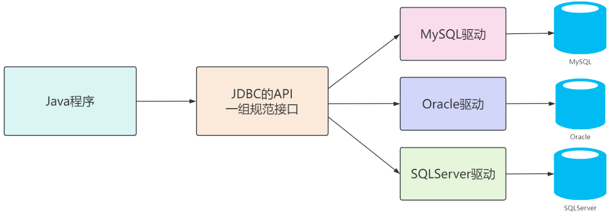

[toc]

# 1 数据库与数据库管理系统

- **数据库**：英文名是`DataBase`，简称`DB`，**它是存储和管理数据的仓库**，数据在数据库中是有组织的进行存储。虽然我们通常会将`MySQL`、`Oracle`、`PostgreSQL`等软件称为数据库，但它们实际上是一种可以操作和管理数据库的软件，**而真正的数据库是指存储数据的仓库**。
- **数据库管理系统**：英文名是`DataBase Management System`，简称`DBMS`，它是管理数据库的大型软件。**我们平时所说的`MySQL`数据库本质是`MySQL`数据库管理系统**，在电脑上安装了数据库管理系统后，就可以通过数据库管理系统创建数据库来存储数据，也可以通过该系统对数据库中的数据进行数据的增删改查相关的操作。

# 2 JDBC与数据库驱动

## 2.1 JDBC

- **JDBC**：英文全称 **Java Database Connectivity**，中文名称为**Java 数据库连接**，是 Java 提供的一组用于操作关系型数据库的标准`API`；它是 由`Java`官方（Sun 公司）制定的一种规范，旨在提供一种独立于具体数据库的统一接口，简化 Java 程序与数据库之间的交互；通过这种设计，`Java`程序只需要面向 `JDBC`规范开发，而具体与数据库的通信细节由厂商提供的驱动程序实现。这种模式允许开发者使用同一套代码切换不同的关系型数据库，只需更换相应的驱动程序。

- **为什么需要JDBC？**
    - 在 Java 开发中，程序需要与关系型数据库（如 MySQL、Oracle 等）进行交互。然而，不同数据库的实现方式和底层细节各不相同。例如，同样的一段 Java 代码可能无法同时操作`MySQL`和`Oracle`数据库。如果开发阶段使用的是 MySQL，而上线后公司选择了 Oracle 数据库，就需要对大量代码进行修改，这将带来巨大的工作量和维护成本。为了避免这种问题，Java 官方定义了一套标准接口——**JDBC**。这套接口规范化了操作关系型数据库的规则，使开发者无需关注底层实现细节，只需遵循统一的 API 即可，这大大提高了代码的可移植性和灵活性。
- **JDBC核心思想是将规范与实现分离：**
    - **JDBC 接口（规范）**：Java 官方提供一组标准的接口，定义了与数据库交互的规则，例如连接数据库、执行 SQL 查询、获取结果等。
    - **数据库驱动（实现）**：各个数据库厂商根据 JDBC 规范提供具体的实现类，并将这些实现类封装成 `.jar` 文件，这就是我们常说的 **数据库驱动包**

- 应用程序使用JDBC访问数据的方式如下图所示：

## 2.2 数据库驱动

- **数据库驱动**是由不同数据库厂商（如 Oracle、MySQL 等）为特定开发语言（如 Java）提供的程序，用于实现统一的数据库调用。它相当于一个“翻译器”，将 Java 等语言的数据库操作请求翻译成具体数据库能够理解的专属语言，从而实现程序与数据库之间的通信。数据库驱动是基于统一的接口规范（如 JDBC）开发的，直接负责与数据库交互，完成连接、操作和数据传输等任务。
- 在实际使用中，数据库驱动通常以 **驱动包** 的形式提供，例如 MySQL 的 `mysql-connector-java.jar` 或 Oracle 的 `ojdbc.jar`。开发者只需将驱动包导入项目，配置数据库连接信息（如地址、用户名和密码），即可通过标准接口与数据库交互，完成高效的数据库操作。

# 3 数据库连接池

## 3.1 什么是数据库连接池

- **数据库连接池**（Database Connection Pooling）是一种用于高效管理和复用数据库连接的技术，旨在解决传统 JDBC 操作中频繁创建和销毁连接所带来的资源浪费和性能开销问题。在传统的数据库操作中，每次访问数据库都需要加载驱动、建立连接、执行操作和关闭连接，尽管在低频访问场景下，这种方式影响较小，但在高频数据库访问中，频繁的连接创建和销毁会消耗大量的 CPU、内存和网络资源，同时增加操作的延迟，严重时甚至会导致系统崩溃。
- **数据库连接池通过池化技术**，在应用程序启动时预先创建一定数量的数据库连接对象，并将其存储在池中；应用程序需要数据库连接时，可以直接从池中获取，操作完成后将连接归还，而不是每次都重新建立一个新的连接；这样，不仅能够避免频繁创建和销毁连接的高开销，还能大幅提升系统的性能和并发处理能力。
- 数据库连接池通常由**连接管理器**、**连接对象**和**连接池**组成。通过对连接池的参数配置，如初始连接数、最小连接数、最大连接数、最大空闲时间等，应用程序能够灵活控制数据库连接的使用，防止连接数过多导致系统资源耗尽，同时确保数据库访问的效率和稳定性。简而言之，数据库连接池的核心作用就是避免数据库连接的频繁创建和销毁，节省系统开销，优化并发处理能力，是现代应用开发中不可或缺的基础组件。
    - 连接管理器负责管理和分配连接
    - 连接对象表示具体的数据库连接
    - 连接池则是存储多个连接对象的地方，确保高效的连接分配和复用

- 数据库连接池示意图如下所示：

## 3.2 常见数据库连接池介绍

- **C3P0(被淘汰：历史悠久，过于复杂，性能差)**

    - **特点**：C3P0 是一个开源的 JDBC 连接池，支持 JDBC 3.0 和 2.0 的标准扩展。它能够通过 JNDI 进行数据源绑定，曾广泛应用于 Hibernate 和 Spring 等开源项目。
    - **优缺点**：C3P0 的设计较为简单，但性能较差，尤其是在高并发场景下容易出现瓶颈。它的代码较为复杂且不易维护，官方也已停止更新，逐渐被淘汰。
- **DBCP (已淘汰：依赖 Commons-Pool，性能差)**

    - **特点**：由 Apache 开发的 JDBC 连接池，基于 Jakarta commons-pool 对象池机制。它通过将数据库连接预先加载到内存中，应用程序可以直接从连接池申请连接。
    - **优缺点**：由于依赖 Commons-Pool，性能相对较差，尤其在高并发环境下表现不佳。没有自动回收空闲连接的功能，不适合要求较高的应用场景，逐步被淘汰。
- **Tomcat JDBC Pool（不推荐，性能没有Druid和HicariCP好）**
    - **特点**：Tomcat 从 7.0 版本开始引入的新连接池模块，兼容 DBCP，基于 Tomcat JULI 日志框架，支持异步连接获取，适用于高并发应用环境。
    - **优缺点**：相较于 DBCP，性能更加优秀，支持更高并发，设计简单，易于集成到现有 Tomcat 环境中。适合需要高性能和稳定性的大型系统，尤其是基于 Tomcat 的 Web 应用。虽然性能较好，但相较于更现代的 HikariCP，仍然略逊一筹，不是性能最优的选择。
- **BoneCP（被淘汰：为解决C3P0/DBCP性能而生，后续出现了更高性能的hikariCP，BoneCP也不再更新）**

    - **特点**：尽管 BoneCP 在性能上表现出色，并且曾在一定时期内广泛使用，但随着 HikariCP 的出现，BoneCP 的优势逐渐被超越。更重要的是，BoneCP 项目已经停止维护，因此不再推荐使用。它不再适应现代应用程序的需求，缺乏对高并发、大规模数据处理的优化，也没有像 HikariCP 那样活跃的社区支持。

    - **优缺点**：尽管 BoneCP 的性能非常好，但它的维护已经停止，并且现在被 HikariCP 所替代，因此不再推荐使用。
- **Druid (德鲁伊) - 推荐**
    - **特点**：Druid 是由阿里巴巴开源的高性能数据库连接池，支持包括 Oracle、MySQL、SQL Server 等常见数据库。Druid 提供了强大的监控功能，能够实时监控数据库连接的状态，支持 SQL 拦截、性能统计、连接泄漏检测以及长时间查询日志等功能。其设计理念注重大数据和高并发环境下的性能表现，尤其适合大规模的数据查询与分析。
    - **优缺点**：Druid 是目前国内使用最广泛的数据库连接池，尤其适用于需要对数据库性能进行实时监控和优化的复杂应用场景。它具有丰富的管理监控功能，如 SQL 执行监控、连接泄漏检测、慢查询日志等，方便开发者调优性能并定位问题。不过，虽然 Druid 提供了极为丰富的功能，但在高并发情况下，它的性能表现略逊于 HikariCP。因此，如果项目对性能有极高的要求，Druid 可能不是最佳选择。Druid 更适用于需要复杂监控和调优的应用，而对于追求极致性能的场景，HikariCP 会是更好的选择。
- **HikariCP - 推荐**

    - **特点**：HikariCP 是目前公认的高性能 JDBC 连接池，专注于极致的性能优化。基于 BoneCP 进行了一系列的优化，注重快速响应和高吞吐量。Spring Boot 2.0 之后，HikariCP 被默认作为连接池。HikariCP 采用了高效的内存管理和高性能的线程池技术，能够在极短的时间内完成数据库连接的获取和释放。
    - **优缺点**：HikariCP 在性能方面的表现无可挑剔，能够处理大量并发请求，吞吐量高，响应时间极短，特别适合高负载、高并发的生产环境。它的配置简单，易于与项目集成，并支持动态管理数据库连接。与 Druid 相比，HikariCP 更加专注于性能提升，虽然其功能相对较少，但对于大多数应用而言，简洁高效的设计是其最大的优势。HikariCP 不提供像 Druid 那样的 SQL 监控、日志统计等高级功能，因此如果项目需要这些功能，则需要额外考虑其他解决方案。对于绝大多数对性能要求较高的应用，HikariCP 是最佳选择。

## 3.3 常见数据库连接池对比

- 上面六个数据库的对比分析：

| 功能             | C3P0                 | DBCP               | Tomcat JDBC Pool   | BoneCP       | Druid            | HikariCP           |
| ---------------- | -------------------- | ------------------ | ------------------ | ------------ | ---------------- | ------------------ |
| 是否支持 PSCache | 是                   | 是                 | 否                 | 否           | 是               | 否                 |
| 监控功能         | 无                   | JMX                | JMX                | JMX          | JMX/log/http     | JMX                |
| 扩展性           | 差                   | 差                 | 较差               | 较差         | 好               | 较差               |
| SQL 拦截及解析   | 无                   | 无                 | 无                 | 无           | 支持             | 无                 |
| 代码复杂度       | 复杂                 | 中等               | 简单               | 简单         | 中等             | 简单               |
| 更新时间         | 2019.03              | 2019.02            | 7.0+ 引入          | -            | 2019.05          | 2019.02            |
| 最新版本         | 0.9.5.4              | 2.60               | 8.5.42             | -            | 1.1.17           | 3.3.1              |
| 连接池管理       | LinkedBlockingDeque  | 数组               | FairBlockingQueue  | -            | 数组             | ThreadLocal + List |
| 特点             | 开源，适用于小型系统 | Apache开发，单线程 | 高并发，Tomcat兼容 | 高效但已淘汰 | 高性能，监控强大 | 性能极致，简单易用 |

- 常见的数据库连接池的性能从高到低的排序为：**HikariCP（BoneCP的进阶版）** > **Druid** > **Tomcat JDBC Pool** > **DBCP** > **C3P0**，下图为`HicariCP`官网给出的性能对比矩形图

## 3.4 总结

- **Tomcat JDBC Pool**：适用于基于 Tomcat 的高并发环境，性能上优于 DBCP，但功能相对简单，缺少一些现代连接池的高级特性。
- **DBCP 和 C3P0**：由于性能较差且维护较为困难，这两个连接池已经逐渐被 HikariCP 和 Druid 等新一代连接池所替代，因此不再推荐使用。
- **HikariCP**：目前性能最优，特别适用于对性能要求极高的应用，如高并发和大规模系统。Spring Boot 2.0 默认使用 HikariCP，它已经成为行业标准。
- **Druid**：功能丰富，适合需要复杂监控、SQL 拦截和数据分析的系统。尽管性能略逊于 HikariCP，但其在可扩展性和功能上的优势使其成为企业级应用的首选。
- **Spring Boot 集成**：在后续的 `Spring Boot` 整合教程中，将只介绍 **HikariCP** 和 **Druid** 这两种连接池。

# 4 数据源

## 4.1 数据源

- 在介绍完数据库连接池后，我们来了解一下**数据源（Data Source）**。顾名思义，数据源指的是数据的来源，通常用于指定数据存储的位置。在应用程序中，数据源的主要作用是管理与数据存储系统（如数据库）的连接。
- 在`Java`中，`javax.sql.DataSource` 接口提供了一种标准化的方式来获取数据库连接。该接口定义了 `getConnection()` 方法，允许应用程序以一致的方式获取数据库连接。通过这种方式，应用程序不需要直接管理数据库连接，而是通过数据源来进行集中管理和分配。
- 不同类型的数据库（如 MySQL、PostgreSQL 等）会有不同的实现类来提供连接。为了提高性能，数据源通常与连接池结合使用，连接池管理多个数据库连接，避免每次请求时都需要重新建立连接，从而显著提升应用程序的效率。
- 使用数据源的好处包括：
    - **简化连接管理**：通过标准化接口，应用程序无需关心底层的数据库连接细节，降低了代码复杂度。
    - **提高资源利用率**：连接池能够复用数据库连接，避免频繁地建立和关闭连接，提高系统资源的利用率。
    - **增强灵活性**：通过数据源，应用程序可以更方便地切换不同的数据存储系统或数据库类型，而无需修改大量代码。

## 4.2 数据库连接池与数据源的关系

- 很多人常常将数据源与连接池混淆，但实际上，它们在概念上是有区别的：
    - **数据源**：数据源是指数据的来源，通常是数据库。它提供连接数据库所需的相关信息，如数据库地址、用户名、密码等。
    - **连接池**：连接池是一种用于缓存和管理数据库连接的技术，它通过池化的方式复用连接，避免频繁创建和销毁连接带来的性能开销。
- 为什么会出现这种混淆呢？这主要是因为在配置数据源时，通常会同时配置连接池的相关参数。因此，很多人误以为数据源就是连接池。实际上，数据源和连接池是紧密配合的，协同完成数据库连接的创建、管理和复用。
- 在 Java 中，许多开源连接池（如 **HikariCP** 和 **Druid**）都基于标准的 `javax.sql.DataSource` 接口实现，这意味着它们既具备数据源的功能，也提供了连接池的管理能力。例如，Druid 提供了 `com.alibaba.druid.pool.DruidDataSource` 类，既是一个数据源实现，又包含了连接池的功能。通过配置 Druid 数据源，应用程序不仅能实现高效的数据库访问，还能利用 Druid 强大的监控和性能优化工具来管理数据库连接。
- **总结**：数据源是数据库连接的入口，应用程序通过数据源获取数据库连接，而无需手动配置驱动和连接细节。数据源通常与数据库连接池结合使用，以实现高效的数据库操作。在现代开发中，数据源和连接池密切配合，尤其是在 Spring Boot 项目中，选择合适的连接池实现（如 HikariCP 或 Druid）并与数据源结合，能显著提高数据库性能和系统稳定性。

# 5 承上启下

- 在后端开发中，数据库作为核心数据存储介质，与其高效交互是每个后端工程师必须面对的重要任务。尤其是在基于 Spring Boot 的项目中，整合数据库更是项目初始化阶段的关键工作之一。
- 在 Spring Boot 中，整合数据库通常包含两大部分：**数据库驱动** 和 **数据库连接池**。
    - **数据库驱动**是应用程序与数据库之间的桥梁，负责建立连接、执行 SQL 查询并返回结果。**为了与 MySQL 数据库进行交互，Spring Boot 使用 MySQL 驱动，该驱动允许 Spring Boot 与 MySQL 数据库进行连接和数据操作；另外，Spring Boot 会自动配置 MySQL 数据源，开发者只需要在配置文件中提供相关的数据库连接信息，如数据库 URL、用户名和密码等。**
    - **数据库连接池**则是优化数据库连接管理的工具，通过复用和管理数据库连接，减少频繁建立和销毁连接的性能开销，从而显著提升应用的响应效率。**在 Spring Boot 项目中，数据库连接池的选择直接影响到应用的性能和稳定性。Spring Boot 提供了多种数据库连接池的选项，其中最常用的是 HikariCP 和 Druid。这两种连接池各有优缺点，开发者可以根据项目需求选择最合适的连接池。**
- 下面是毛毛张关于SpringBoot配置两种常见的数据库连接池的教程：
    - **【SpringBoot教程】SpringBoot整合MySQL驱动和HicariCP连接池**
    - **【SpringBoot教程】SpringBoot整合MySQL驱动和Druid连接池**

