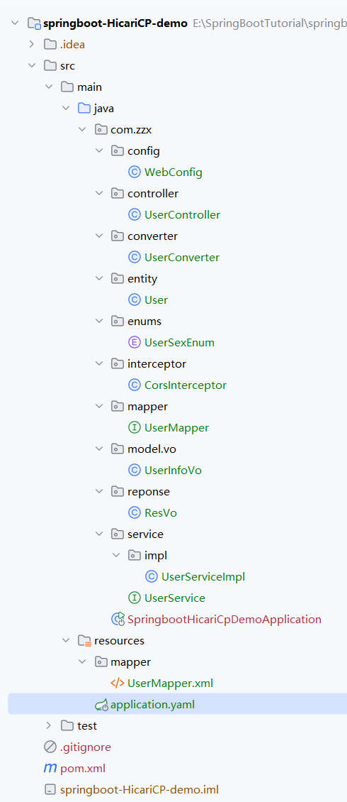
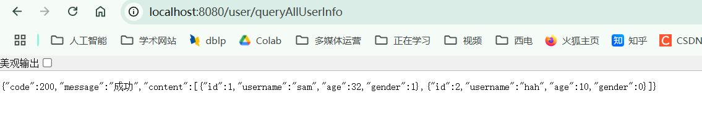

> <font color="green">在前面一篇文章中毛毛张介绍了SpringBoot中数据源与数据库连接池相关概念，今天毛毛张要分享的是关于SpringBoot整合HicariCP连接池相关知识点</font>


[toc]


# 1 HicariCP连接池概述

- 在上面介绍过`HicariCP`是`SpringBoot2.0`之后默认的数据库连接池，特点就是：简单，高效，史称最快的数据库连接池，毛毛张将从以下几个方面展开对`HicariCP`连接池的介绍：
    - 首先简单介绍以下`HicariCP`连接池
    - 然后通过一个案例来帮助大家能够快速使用`HicariCP`连接池
    - 接着通过分析`SpringBoot`的底层代码来解释`SringBoot`默认的数据库连接池为`HicariCP`


## 1.1 HicariCP连接池简介

- **HikariCP 是一个高性能的`JDBC`数据库连接池，基于`BoneCP`做了多项优化，旨在提供更高的并发性能和更低的延迟。自`SpringBoot 2.x`版本后（自然也包括`SpringBoot 3.x`），`HikariCP`成为默认的数据库连接池，只需导入`HikariCP`的`JAR`包并配置相关参数，即可无缝集成并优化数据库连接池管理。**

- **HikariCP 的高性能优化主要体现在以下两个方面：**
    - **FastList 替代 ArrayList**
        - 传统的数据库连接池大多使用`ArrayList`存储`Statement`，HikariCP 自定义了`FastList`来优化这一操作。`FastList`的优化主要体现在两个方面：
            - 取消 `ArrayList` 的 `get()` 方法中的范围检查（range check）。由于数据库连接池管理的 List 中的索引合法性有保证，因此不需要每次访问都进行索引合法性检查。
            - 改变 `ArrayList` 中 `remove()` 操作的遍历方式，采用从尾部开始遍历，而不是从头开始。由于连接池中的连接通常是逆序释放的（后获取的连接先释放），这样优化后，每次关闭连接时可以更高效地找到需要释放的资源，提升了效率。
    - **ConcurrentBag 替代阻塞队列**
        - 大多数传统数据库连接池使用两个阻塞队列（`idle` 和 `busy`）来管理空闲连接和忙碌连接，使用 `Lock` 机制来处理线程竞争，但这种方式在高并发场景下可能会导致性能瓶颈。`HikariCP`通过使用 `ConcurrentBag` 替代了传统的阻塞队列，极大地减少了锁的竞争，提高了并发性能。
        - `ConcurrentBag`的核心工作原理：
            - `sharedList`：存储所有数据库连接的共享队列，使用 `CopyOnWriteArrayList` 类型，支持并发操作。
            - `threadList`：线程本地存储，避免了线程竞争，每个线程会缓存自己获取的连接。
            - `waiters`：等待连接的线程数，使用 `AtomicInteger` 类型。
            - `handoffQueue`：分配数据库连接的核心队列，使用 `SynchronousQueue` 类型，负责将空闲连接分配给请求的线程。
        - 这种设计通过减少线程竞争和优化连接分配，提高了连接池的效率，特别适合高并发的环境。
- 其他优化
    - **字节码精简**：HikariCP 在字节码上进行了优化，编译后的字节码量极少，这样可以使得更多的代码被 CPU 缓存，从而提高程序的执行效率。减少字节码的大小是提高性能的基础，HikariCP 在这方面做得非常好。
    - **优化代理和拦截器**：HikariCP 对代理和拦截器的实现进行了精简。例如，它的 `Statement` 代理类仅有 100 行代码，是 BoneCP 的十分之一。这减少了性能开销，确保数据库连接池在执行 SQL 时更加高效。
    - **自定义集合类型（FastStatementList）**：为了提高对 `Statement` 的管理效率，HikariCP 使用了自定义的集合类型 `FastStatementList` 来替代传统的 `ArrayList`。这样避免了每次获取元素时的范围检查，并且采用逆序遍历的方式来优化 `remove()` 操作，使得关闭连接时更加高效。
    - **自定义集合类型（ConcurrentBag）**：HikariCP 为了优化并发读写效率，采用了 `ConcurrentBag` 代替传统的阻塞队列。这不仅提高了数据库连接分配的效率，而且减少了锁的竞争，显著提升了高并发场景下的性能。
    - **针对 BoneCP 缺陷的优化**：HikariCP 在设计时，针对 BoneCP 中的一些缺陷进行了优化，特别是在处理 CPU 时间片内的耗时方法调用时，进一步提高了性能。

> 接下来毛毛张将结合一个完整的项目案例来介绍`SpringBoot`整合

# 2 快速入门案例

- 案例内容：基于`Spring Boot`，使用`MyBatis-Plus`框架，结合`HikariCP`连接池，查询并展示数据库中的全部用户信息

## 2.1 后端代码

### 2.1.1 创建项目

- 如何快速创建一个`SpringBoot`新项目可以参见毛毛张的这篇博客：[【SpringBoot教程】IDEA快速搭建正确的SpringBoot版本和Java版本的项目](https://blog.csdn.net/weixin_48235955/article/details/144807998)
- 下面是毛毛张的完整后端代码文件结构如下图：



### 2.1.2 导入依赖

- 在 Spring Boot 项目中，默认使用 HikariCP 作为数据库连接池，因此在大多数情况下无需手动引入该依赖。若项目中使用了以下某些 starter 依赖，`HikariCP` 会自动作为连接池配置：
    - `spring-boot-starter-jdbc`
    - `spring-boot-starter-data-jpa`
    - `mybatis-spring-boot-starter`
    - `mybatis-plus-boot-starter`

- 需要特别注意的是，`mybatis` 和 `mybatis-plus` 已经间接依赖了 `spring-boot-starter-jdbc`，因此这两个 starter 会自动引入 `HikariCP`，从而避免重复配置。

#### **方式1：手动导入 `HikariCP` 依赖**

- 如果没有导入`HikariCP`，我们可以通过下面的方式手动导入`HikariCP`依赖

    ```xml
    <dependency>
       <groupId>com.zaxxer</groupId>
       <artifactId>HikariCP</artifactId>
       <version>6.2.1</version>
    </dependency>
    ```

#### 方式 2：自动引入依赖 - 推荐

- 在使用`SpringBoot`默认配置时，不需要手动添加 `HikariCP` 依赖，可以通过导入下面依赖的方式来自动引入`HikariCP`依赖：

    ```xml
    <!-- 引入 Spring Boot JDBC 模块 -->
    <dependency>
        <groupId>org.springframework.boot</groupId>
        <artifactId>spring-boot-starter-jdbc</artifactId>
    </dependency>
    
    <!-- 引入 Spring Boot JPA 模块 -->
    <dependency>
        <groupId>org.springframework.boot</groupId>
        <artifactId>spring-boot-starter-data-jpa</artifactId>
    </dependency>
    
    <!-- 引入 MyBatis Plus 模块 -->
    <dependency>
        <groupId>com.baomidou</groupId>
        <artifactId>mybatis-plus-boot-starter</artifactId>
        <version>3.4.2</version>
    </dependency>
    ```

#### 本项目完整依赖

- **需要注意的是，在使用 HikariCP 作为连接池的同时，还需要单独导入 MySQL 数据库驱动，通常通过引入 `mysql-connector-java` 依赖来实现**

- **毛毛张在这个任务中为了方便，使用了`Mybatis-plus`框架，整个项目的`pom.xml`文件为：**

    ```xml
    <?xml version="1.0" encoding="UTF-8"?>
    <project xmlns="http://maven.apache.org/POM/4.0.0" xmlns:xsi="http://www.w3.org/2001/XMLSchema-instance"
             xsi:schemaLocation="http://maven.apache.org/POM/4.0.0 https://maven.apache.org/xsd/maven-4.0.0.xsd">
        <modelVersion>4.0.0</modelVersion>
    
    
        <groupId>com.zzx</groupId>
        <artifactId>springboot-HicariCP-demo</artifactId>
        <version>0.0.1-SNAPSHOT</version>
        <name>springboot-HicariCP-demo</name>
        <description>springboot-HicariCP-demo</description>
    
        <parent>
            <groupId>org.springframework.boot</groupId>
            <artifactId>spring-boot-parent</artifactId>
            <version>2.7.6</version>
        </parent>
    
    
        <properties>
            <java.version>1.8</java.version>
            <project.build.sourceEncoding>UTF-8</project.build.sourceEncoding>
            <project.reporting.outputEncoding>UTF-8</project.reporting.outputEncoding>
            <spring-boot.version>2.7.6</spring-boot.version>
        </properties>
    
    
        <dependencies>
            <dependency>
                <groupId>org.springframework.boot</groupId>
                <artifactId>spring-boot-starter-web</artifactId>
            </dependency>
    
            <!-- MySQL 数据库驱动 -->
            <dependency>
                <groupId>mysql</groupId>
                <artifactId>mysql-connector-java</artifactId>
                <scope>runtime</scope> <!-- 运行时依赖 -->
            </dependency>
    
            <!-- MybatisPlus 核心库 -->
            <dependency>
                <groupId>com.baomidou</groupId>
                <artifactId>mybatis-plus-boot-starter</artifactId>
                <version>3.4.2</version>
            </dependency>
    
            <!-- 热部署 -->
            <dependency>
                <groupId>org.springframework.boot</groupId>
                <artifactId>spring-boot-devtools</artifactId>
                <scope>runtime</scope>
                <optional>true</optional>
            </dependency>
    
            <dependency>
                <groupId>org.projectlombok</groupId>
                <artifactId>lombok</artifactId>
                <optional>true</optional>
            </dependency>
    
            <dependency>
                <groupId>org.springframework.boot</groupId>
                <artifactId>spring-boot-starter-test</artifactId>
                <scope>test</scope>
            </dependency>
    
        </dependencies>
        <dependencyManagement>
            <dependencies>
                <dependency>
                    <groupId>org.springframework.boot</groupId>
                    <artifactId>spring-boot-dependencies</artifactId>
                    <version>${spring-boot.version}</version>
                    <type>pom</type>
                    <scope>import</scope>
                </dependency>
            </dependencies>
        </dependencyManagement>
    
        <build>
            <plugins>
                <plugin>
                    <groupId>org.apache.maven.plugins</groupId>
                    <artifactId>maven-compiler-plugin</artifactId>
                    <version>3.8.1</version>
                    <configuration>
                        <source>1.8</source>
                        <target>1.8</target>
                        <encoding>UTF-8</encoding>
                    </configuration>
                </plugin>
                <plugin>
                    <groupId>org.springframework.boot</groupId>
                    <artifactId>spring-boot-maven-plugin</artifactId>
                    <version>${spring-boot.version}</version>
                    <configuration>
                        <mainClass>com.zzx.SpringbootHicariCpDemoApplication</mainClass>
                        <skip>true</skip>
                    </configuration>
                    <executions>
                        <execution>
                            <id>repackage</id>
                            <goals>
                                <goal>repackage</goal>
                            </goals>
                        </execution>
                    </executions>
                </plugin>
            </plugins>
        </build>
    
    </project>
    ```

### 2.1.3 编写配置文件

- 下面是整个项目的配置文件`application.yaml`，关键部分已被注释出来了，更多详细的解释可以参见第三节的内容

    ```yaml
    server:
      port: 8080
    spring:
      # HikariCP 连接池配置
      datasource:
        url: jdbc:mysql://localhost:3306/springboot?useSSL=false&autoReconnect=true&characterEncoding=utf8&allowPublicKeyRetrieval=true&serverTimezone=UTC
        driver-class-name: com.mysql.cj.jdbc.Driver
        username: root
        password: abc123
        # 指定数据源类型为 HikariDataSource
        type: com.zaxxer.hikari.HikariDataSource
        # Hikari 连接池的详细配置
        hikari:
          # 连接池名称
          pool-name: HikariCP
          # 最小空闲连接数
          minimum-idle: 5
          # 空闲连接超时时间（毫秒）
          idle-timeout: 600000
          # 连接池的最大大小
          maximum-pool-size: 10
          # 是否自动提交事务
          auto-commit: true
          # 连接的最大生命周期（毫秒）
          max-lifetime: 1800000
          # 连接超时时间（毫秒）
          connection-timeout: 30000
          # 测试连接的 SQL 语句
          connection-test-query: SELECT 1
    
    logging:
      level:
        org.springframework.jdbc.core.JdbcTemplate: DEBUG
    
    
    mybatis-plus:
      # xml扫描，多个目录用逗号或者分号分隔（告诉 Mapper 所对应的 XML 文件位置）
      mapper-locations: classpath:mapper/*.xml
      configuration:
        auto-mapping-behavior: full
        # 开启驼峰映射
        map-underscore-to-camel-case: true
        # 如果查询结果中包含空值的列，则 MyBatis 在映射的时候，不会映射这个字段
        call-setters-on-nulls: true
        # 这个配置会将执行的sql打印出来，在开发或测试的时候可以用
        log-impl: org.apache.ibatis.logging.stdout.StdOutImpl
    ```

### 2.1.4 初始化数据库并创建对应实体类

- 创建名为`springboot`的数据库，并创建`user_info`表：

    ```mysql
    -- 创建数据库
    CREATE DATABASE IF NOT EXISTS springboot CHARACTER SET utf8mb4 COLLATE utf8mb4_0900_ai_ci;
    USE springboot;
    
    -- 删除已存在的 user_info 表（如果存在）
    DROP TABLE IF EXISTS `user_info`;
    
    -- 创建 user_info 表
    CREATE TABLE `user_info`  (
      `id` INT NOT NULL AUTO_INCREMENT,
      `user_name` VARCHAR(255) CHARACTER SET utf8mb4 COLLATE utf8mb4_0900_ai_ci NULL DEFAULT NULL,
      `pass_word` VARCHAR(255) CHARACTER SET utf8mb4 COLLATE utf8mb4_0900_ai_ci NULL DEFAULT NULL,
      `age` INT NULL DEFAULT NULL,
      `gender` VARCHAR(10) CHARACTER SET utf8mb4 COLLATE utf8mb4_0900_ai_ci NULL DEFAULT NULL,
      PRIMARY KEY (`id`) USING BTREE
    ) ENGINE = InnoDB AUTO_INCREMENT = 3 
      DEFAULT CHARSET = utf8mb4 
      COLLATE = utf8mb4_0900_ai_ci 
      ROW_FORMAT = Dynamic;
    
    -- 插入示例数据
    INSERT INTO `user_info` (`id`, `user_name`, `pass_word`, `age`, `gender`) VALUES 
    (1, 'sam', 'password123', 32, 'M'),
    (2, 'hah', 'password456', 10, 'F');
    
    -- 确保外键检查被重新启用
    SET FOREIGN_KEY_CHECKS = 1;

- 对应实体类`User`：

    ```java
    package com.zzx.entity;
    
    
    import com.baomidou.mybatisplus.annotation.TableName;
    import lombok.Data;
    
    @Data
    @TableName("user_info")
    public class User {
        private Integer id;        // 对应数据库中的 `u_id`
        private String userName;   // 对应数据库中的 `u_username`
        private String passWord;   // 对应数据库中的 `u_password`
        private Integer age;       // 对应数据库中的 `u_age`
        private String gender;     // 对应数据库中的 `u_gender`
    }
    
    ```

### 2.1.5 编写响应封装与前端展示VO

- 定义统一的响应封装类 ResVo：

    ```java
    package com.zzx.reponse;
    
    public class ResVo<T> {
        private Integer code;      // 状态码
        private String message;    // 消息内容
        private T content;         // 内容，可以是任何类型的数据
    
        // 构造方法
        public ResVo(Integer code, String message, T content) {
            this.code = code;
            this.message = message;
            this.content = content;
        }
    
        // 成功的返回，通常是常用的，内容可以为空
        public static <T> ResVo<T> success(T content) {
            return new ResVo<>(200, "成功", content);
        }
    
        // 失败的返回，通常返回错误信息
        public static <T> ResVo<T> error(Integer code, String message) {
            return new ResVo<>(code, message, null);
        }
    
        // Getters and Setters
        public Integer getCode() {
            return code;
        }
    
        public void setCode(Integer code) {
            this.code = code;
        }
    
        public String getMessage() {
            return message;
        }
    
        public void setMessage(String message) {
            this.message = message;
        }
    
        public T getContent() {
            return content;
        }
    
        public void setContent(T content) {
            this.content = content;
        }
    }
    
    ```

- 前端展示对象`UserInfoVo`，在查询用户信息时通过是把查询到的结果封装在一个实体类中，但是返回给前端的信息不一定是用户的全部信息，例如用户的密码就不能直接返回给前端，或者不要返回，所以毛毛张设计了一个这个类：

    ```java
    package com.zzx.model.vo;
    
    import lombok.Data;
    
    @Data
    public class UserInfoVo {
        //返回给前端展示的数据，密码不能展示，性别转化成数字
        private Integer id;
        private String username;
        private Integer age;
        private Integer gender;
    }
    
    ```

- 为了节省传输的字符，毛毛张将用户的信息对应的内容转化成数字再返回给前端，因此设计了一个枚举类型`UserSexEnum`：

    ```java
    package com.zzx.enums;
    
    public enum UserSexEnum {
        M(1, "男"), // M对应男，值为 1
        F(0, "女"); // F对应女，值为 0
    
        private int code;         // 对应的数字值（1 或 0）
        private String description; // 性别描述（男 或 女）
    
        // 构造方法，用于设置枚举常量的描述和对应的代码
        UserSexEnum(int code, String description) {
            this.code = code;
            this.description = description;
        }
    
        // 获取性别描述
        public String getDescription() {
            return description;
        }
    
        // 获取对应的数字代码
        public int getCode() {
            return code;
        }
    
        // 根据传入的字符串 'M' 或 'F' 获取对应的性别枚举
        public static UserSexEnum fromString(String sexStr) {
            for (UserSexEnum sex : UserSexEnum.values()) {
                if (sex.name().equalsIgnoreCase(sexStr)) {
                    return sex;
                }
            }
            throw new IllegalArgumentException("无效的性别字符串: " + sexStr);
        }
    
        // 根据 'M' 或 'F' 获取对应的数字代码
        public static int getCodeByString(String sexStr) {
            UserSexEnum sex = fromString(sexStr);
            return sex.getCode();
        }
    }
    ```

- 由于`User`类和`UserInfoVo`不是完全一一对应的，所以为了数据转换的方便，毛毛张再这里专门写了一个转换类`UserConverter`：

    ```java
    package com.zzx.converter;
    
    import com.zzx.entity.User;
    import com.zzx.enums.UserSexEnum;
    import com.zzx.model.vo.UserInfoVo;
    
    import java.util.List;
    import java.util.stream.Collectors;
    
    public class UserConverter{
        // 单个转换
        public static UserInfoVo toUserInfoDTO(User user) {
            UserInfoVo userInfoVo = new UserInfoVo();
            userInfoVo.setId(user.getId());
            userInfoVo.setUsername(user.getUserName());
            userInfoVo.setAge(user.getAge());
            userInfoVo.setGender(UserSexEnum.getCodeByString(user.getGender()));
            return userInfoVo;
        }
    
        // 批量转换
        public static List<UserInfoVo> toUserInfoDTOList(List<User> users) {
            // 使用 Java 8 的 stream API 进行批量转换
            return users.stream()
                    .map(UserConverter::toUserInfoDTO)  // 对每个 User 对象进行转换
                    .collect(Collectors.toList());     // 收集成 List<UserInfoDTO>
        }
    }
    ```

### 2.1.6 编写业务逻辑

- controller层`UserController`：

    ```java
    package com.zzx.controller;
    
    import com.zzx.converter.UserConverter;
    import com.zzx.model.vo.UserInfoVo;
    import com.zzx.reponse.ResVo;
    import com.zzx.entity.User;
    import com.zzx.service.UserService;
    import org.springframework.web.bind.annotation.GetMapping;
    import org.springframework.web.bind.annotation.RequestMapping;
    import org.springframework.web.bind.annotation.RestController;
    
    import javax.annotation.Resource;
    import java.util.List;
    
    @RestController
    @RequestMapping("user")
    public class UserController {
        @Resource
        private UserService userService;
    
        @GetMapping("queryAllUserInfo")  // 使用 GET 请求
        public ResVo<List<UserInfoVo>> queryAllUserInfo() {
            List<User> userInfoList = userService.queryAllUserInfo();
            return ResVo.success(UserConverter.toUserInfoDTOList(userInfoList));
        }
    }
    
    
    ```

- `service`层接口`UserService`：

    ```java
    package com.zzx.service;
    
    import com.zzx.entity.User;
    
    import java.util.List;
    
    
    public interface UserService {
    
        List<User> queryAllUserInfo();
    }
    ```

- 服务层实现类`UserServiceImpl`：

    ```java
    package com.zzx.service.impl;
    
    
    import com.zzx.entity.User;
    import com.zzx.mapper.UserMapper;
    import com.zzx.service.UserService;
    import org.springframework.stereotype.Service;
    
    import javax.annotation.Resource;
    import java.util.List;
    
    @Service
    public class UserServiceImpl implements UserService {
        @Resource
        private UserMapper userMapper;
    
        @Override
        public List<User> queryAllUserInfo() {
            return userMapper.queryAllUserInfo();
        }
    }
    ```

- mapper层`UserMapper`：

    ```java
    package com.zzx.mapper;
    
    
    import com.baomidou.mybatisplus.core.mapper.BaseMapper;
    import com.zzx.entity.User;
    
    import java.util.List;
    
    public interface UserMapper extends BaseMapper<User> {
        List<User> queryAllUserInfo();
    }
    
    ```

- Mapper 层 SQL 映射配置文件`UserMapper.xml`：

    ```xml
    <?xml version="1.0" encoding="UTF-8"?>
    <!DOCTYPE mapper PUBLIC "-//mybatis.org//DTD Mapper 3.0//EN" "http://mybatis.org/dtd/mybatis-3-mapper.dtd">
    <mapper namespace="com.zzx.mapper.UserMapper">
        <!-- 声明标签写sql语句  crud  select  insert update  delete
              每个标签对应接口的一个方法！  方法的一个实现！
              注意：mapper接口不能重载！！！ 因为mapper.xml无法识别！ 根据方法名识别！
         -->
        <!-- 查询所有用户 -->
        <select id="queryAllUserInfo" resultType="com.zzx.entity.User">
            SELECT id, user_name, pass_word, age, gender FROM user_info
        </select>
    
    </mapper>
    ```

### 2.1.7 跨域资源共享

- 由于毛毛张这个代码还有前端代码，涉及到和前端交互，还需要做一个跨域资源共享的配置，毛毛张没有使用`@CrossOrigin`，而是通过拦截器的方式实现的：

    ```java
    package com.zzx.interceptor;
    
    import org.springframework.web.servlet.HandlerInterceptor;
    
    import javax.servlet.http.HttpServletRequest;
    import javax.servlet.http.HttpServletResponse;
    
    public class CorsInterceptor implements HandlerInterceptor {
    
        @Override
        public boolean preHandle(HttpServletRequest request, HttpServletResponse response, Object handler) throws Exception {
            response.setHeader("Access-Control-Allow-Origin", "*");  // 允许所有来源
            response.setHeader("Access-Control-Allow-Methods", "GET, POST, PUT, DELETE");
            response.setHeader("Access-Control-Allow-Headers", "Origin, Content-Type, Accept, Authorization");
            response.setHeader("Access-Control-Allow-Credentials", "true");
    
            // 处理OPTIONS请求
            if ("OPTIONS".equalsIgnoreCase(request.getMethod())) {
                response.setStatus(HttpServletResponse.SC_OK);
                return false;  // 返回false，表示不再执行后续的Controller方法
            }
    
            return true;  // 继续执行其他拦截器或Controller方法
        }
    }
    
    ```

- 配置类：

    ```java
    package com.zzx.config;
    
    import com.zzx.interceptor.CorsInterceptor;
    import org.springframework.context.annotation.Configuration;
    import org.springframework.web.servlet.config.annotation.InterceptorRegistry;
    import org.springframework.web.servlet.config.annotation.WebMvcConfigurer;
    
    @Configuration
    public class WebConfig implements WebMvcConfigurer {
    
        @Override
        public void addInterceptors(InterceptorRegistry registry) {
            // 注册 CORS 拦截器
            registry.addInterceptor(new CorsInterceptor())
                    .addPathPatterns("/**")  // 拦截所有路径
                    .excludePathPatterns("/login", "/error");  // 排除登录和错误页面
        }
    }
    ```

### 2.1.8 启动类

- 启动类`SpringbootHicariCpDemoApplication`：

    ```java
    package com.zzx;
    
    import org.mybatis.spring.annotation.MapperScan;
    import org.springframework.boot.SpringApplication;
    import org.springframework.boot.autoconfigure.SpringBootApplication;
    
    @SpringBootApplication
    @MapperScan("com.zzx.mapper")
    public class SpringbootHicariCpDemoApplication {
    
        public static void main(String[] args) {
            SpringApplication.run(SpringbootHicariCpDemoApplication.class, args);
        }
    
    }
    ```

### 2.1.9 测试

- 启动后端程序，可以在浏览器中输入`http://localhost:8080/user/queryAllUserInfo`，返回结果如下则表示后端代码正确无误：



## 2.2 前端代码

- 前端代码和之前毛毛张介绍的`Mybatis`教程的代码是一样的，毛毛张在这里不做过多的介绍了，感兴趣的可以查看毛毛张的相关博客：
- 前端展示源码：


# 3 配置详解

### 2.1.3 编写配置文件

- 下面是`HicariCP`连接池常见的配置：

    ```yaml
    spring:
      # HikariCP 连接池配置
      # 参考链接：https://www.cnblogs.com/goloving/p/14884802.html
      datasource:
        url: jdbc:mysql://localhost:3306/springboot?useSSL=false&autoReconnect=true&characterEncoding=utf8&allowPublicKeyRetrieval=true&serverTimezone=UTC
        driver-class-name: com.mysql.cj.jdbc.Driver
        username: root
        password: abc123
        # 指定数据源类型为 HikariDataSource
        type: com.zaxxer.hikari.HikariDataSource
        # Hikari 连接池的详细配置
        hikari:
          # 连接池名称
          pool-name: HikariCP
          # 最小空闲连接数
          minimum-idle: 5
          # 空闲连接超时时间（毫秒）
          idle-timeout: 600000
          # 连接池的最大大小
          maximum-pool-size: 10
          # 是否自动提交事务
          auto-commit: true
          # 连接的最大生命周期（毫秒）
          max-lifetime: 1800000
          # 连接超时时间（毫秒）
          connection-timeout: 30000
          # 测试连接的 SQL 语句
          connection-test-query: SELECT 1
    
    logging:
      level:
        org.springframework.jdbc.core.JdbcTemplate: DEBUG
    ```

- 更具体的可以看[官方配置](https://github.com/brettwooldridge/HikariCP)或者如下[深蓝Blog总结翻译的配置](http://www.lanxinbase.com/?p=2482)

| 属性                      | 描述                                                         | 构造器默认值                   | 默认配置validate之后的值                                     | validate重置                                                 |
| ------------------------- | ------------------------------------------------------------ | ------------------------------ | ------------------------------------------------------------ | ------------------------------------------------------------ |
| autoCommit                | 自动提交从池中返回的连接                                     | TRUE                           | TRUE                                                         | –                                                            |
| connectionTimeout         | 等待来自池的连接的最大毫秒数                                 | SECONDS.toMillis(30) = 30000   | 30000                                                        | 如果小于250毫秒，则被重置回30秒                              |
| idleTimeout               | 连接允许在池中闲置的最长时间 MINUTES.toMillis(10) = 600000   | 600000                         | 如果idleTimeout+1秒>maxLifetime 且 maxLifetime>0，则会被重置为0（代表永远不会退出）；如果idleTimeout!=0且小于10秒，则会被重置为10秒 |                                                              |
| maxLifetime               | 池中连接最长生命周期                                         | MINUTES.toMillis(30) = 1800000 | 1800000                                                      | 如果不等于0且小于30秒则会被重置回30分钟                      |
| connectionTestQuery       | 如果您的驱动程序支持JDBC4，我们强烈建议您不要设置此属性      | null                           | null                                                         | –                                                            |
| minimumIdle               | 池中维护的最小空闲连接数                                     | -1                             | 10                                                           | minIdle<0或者minIdle>maxPoolSize,则被重置为maxPoolSize       |
| maximumPoolSize           | 池中最大连接数，包括闲置和使用中的连接                       | -1                             | 10                                                           | 如果maxPoolSize小于1，则会被重置。当minIdle<=0被重置为DEFAULT_POOL_SIZE则为10;如果minIdle>0则重置为minIdle的值 |
| metricRegistry            | 该属性允许您指定一个 Codahale / Dropwizard MetricRegistry 的实例，供池使用以记录各种指标 | null                           | null                                                         | –                                                            |
| healthCheckRegistry       | 该属性允许您指定池使用的Codahale / Dropwizard HealthCheckRegistry的实例来报告当前健康信息 | null                           | null                                                         | –                                                            |
| poolName                  | 连接池的用户定义名称，主要出现在日志记录和JMX管理控制台中以识别池和池配置 | null                           | HikariPool-1                                                 | –                                                            |
| initializationFailTimeout | 如果池无法成功初始化连接，则此属性控制池是否将 fail fast     | 1                              | 1                                                            | –                                                            |
| isolateInternalQueries    | 是否在其自己的事务中隔离内部池查询，例如连接活动测试         | FALSE                          | FALSE                                                        | –                                                            |
| allowPoolSuspension       | 控制池是否可以通过JMX暂停和恢复                              | FALSE                          | FALSE                                                        | –                                                            |
| readOnly                  | 从池中获取的连接是否默认处于只读模式                         | FALSE                          | FALSE –                                                      |                                                              |
| registerMbeans            | 是否注册JMX管理Bean（MBeans）                                | FALSE                          | FALSE –                                                      |                                                              |
| catalog                   | 为支持 catalog 概念的数据库设置默认 catalog driver           | default                        | null                                                         | –                                                            |
| connectionInitSql         | 该属性设置一个SQL语句，在将每个新连接创建后，将其添加到池中之前执行该语句。 | null                           | null                                                         | –                                                            |
| driverClassName           | HikariCP将尝试通过仅基于jdbcUrl的DriverManager解析驱动程序，但对于一些较旧的驱动程序，还必须指定driverClassName | null                           | null                                                         | –                                                            |
| transactionIsolation      | 控制从池返回的连接的默认事务隔离级别                         | null                           | null                                                         | –                                                            |
| validationTimeout         | 连接将被测试活动的最大时间量                                 | SECONDS.toMillis(5) = 5000     | 5000                                                         | 如果小于250毫秒，则会被重置回5秒                             |
| leakDetectionThreshold    | 记录消息之前连接可能离开池的时间量，表示可能的连接泄漏       | 0                              | 0                                                            | 如果大于0且不是单元测试，则进一步判断：(leakDetectionThreshold < SECONDS.toMillis(2) or (leakDetectionThreshold > maxLifetime && maxLifetime > 0)，会被重置为0 . 即如果要生效则必须>0，而且不能小于2秒，而且当maxLifetime > 0时不能大于maxLifetime |
| dataSource                | 这个属性允许你直接设置数据源的实例被池包装，而不是让HikariCP通过反射来构造它 | null                           | null                                                         | –                                                            |
| schema                    | 该属性为支持模式概念的数据库设置默认模式 driver              | default                        | null                                                         | –                                                            |
| threadFactory             | 此属性允许您设置将用于创建池使用的所有线程的java.util.concurrent.ThreadFactory的实例。 | null                           | null                                                         | –                                                            |
| scheduledExecutor         | 此属性允许您设置将用于各种内部计划任务的java.util.concurrent.ScheduledExecutorService实例 | null                           | null                                                         | –                                                            |


# 4 底层源码解析


# 参考文献

- <https://juejin.cn/post/7329033419328307226>
- <https://zhuanlan.zhihu.com/p/686960884>
- <https://blog.csdn.net/hansome_hong/article/details/124320410>
- <https://juejin.cn/post/7224499191962714171#heading-2>
- <https://blog.csdn.net/hansome_hong/article/details/124320410>
- <https://pdai.tech/md/spring/springboot/springboot-x-mysql-HikariCP.html>
- <https://blog.csdn.net/doubiy/article/details/131578389>
- <https://www.cnblogs.com/lyluoye/p/16627840.html>
- <https://github.com/brettwooldridge/HikariCP>
- <https://www.cnblogs.com/zhaojinhui/p/17579010.html>
- <https://javabetter.cn/springboot/mysql-druid.html>

