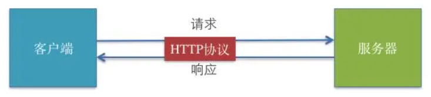
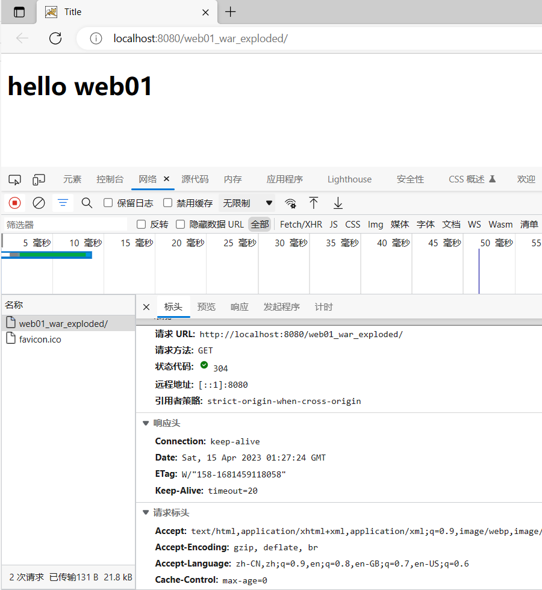
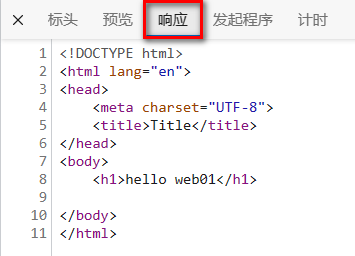

# 1.HTTP协议

## 1.1 HTTP概述

### 1.1.1 简介

- **HTTP 超文本传输协议** (HTTP-Hyper Text transfer protocol)，是一个属于应用层的面向对象的协议，由于其简捷、快速的方式，适用于分布式超媒体信息系统。它于1990年提出，经过十几年的使用与发展，得到不断地完善和扩展。**它是一种详细规定了浏览器和万维网服务器之间互相通信的规则**，通过因特网传送万维网文档的数据传送协议。客户端与服务端通信时传输的内容我们称之为**报文**。**HTTP协议就是规定报文的格式。**HTTP就是一个通信规则，这个规则规定了客户端发送给服务器的报文格式，也规定了服务器发送给客户端的报文格式。实际我们要学习的就是这两种报文**。客户端发送给服务器的称为"请求报文**"，**服务器发送给客户端的称为"响应报文"**。




### 1.1.1 发展历程

> HTTP/0.9 

+ 蒂姆伯纳斯李是一位英国计算机科学家，也是万维网的发明者。他在 1989 年创建了单行 HTTP 协议。它只是返回一个网页。这个协议在 1991 年被命名为 HTTP/0.9。 

>  HTTP/1.0

+  1996 年，HTTP/1.0 发布。该规范是显著扩大，并且支持三种请求方法：GET，Head，和POST。 
+  HTTP/1.0 相对于 HTTP/0.9 的改进如下：
   + 每个请求都附加了 HTTP 版本。
   + 在响应开始时发送状态代码。
   + 请求和响应都包含 HTTP 报文头。
   + 内容类型能够传输 HTML 文件以外的文档。
+  但是，HTTP/1.0 不是官方标准。

> HTTP/1.1

+ HTTP 的第一个标准化版本 HTTP/1.1 ( RFC 2068 ) 于 1997 年初发布，支持七种请求方法：OPTIONS，GET，HEAD，POST，PUT，DELETE，和TRACE 

+ HTTP/1.1 是 HTTP 1.0 的增强：

  + 虚拟主机允许从单个 IP 地址提供多个域。

  + 持久连接和流水线连接允许 Web 浏览器通过单个持久连接发送多个请求。

  + 缓存支持节省了带宽并使响应速度更快。

+ HTTP/1.1 在接下来的 15 年左右将非常稳定。 

+ 在此期间，出现了 HTTPS（安全超文本传输协议）。它是使用 SSL/TLS 进行安全加密通信的 HTTP 的安全版本。 

> HTTP/2

+  由IETF在2015年发布。HTTP/2旨在提高Web性能，减少延迟，增加安全性，使Web应用更加快速、高效和可靠。 

- 多路复用：HTTP/2 允许同时发送多个请求和响应，而不是像 HTTP/1.1 一样只能一个一个地处理。这样可以减少延迟，提高效率，提高网络吞吐量。
- 二进制传输：HTTP/2 使用二进制协议，与 HTTP/1.1 使用的文本协议不同。二进制协议可以更快地解析，更有效地传输数据，减少了传输过程中的开销和延迟。
- 头部压缩：HTTP/2 使用 HPACK 算法对 HTTP 头部进行压缩，减少了头部传输的数据量，从而减少了网络延迟。
- 服务器推送：HTTP/2 支持服务器推送，允许服务器在客户端请求之前推送资源，以提高性能。
- 改进的安全性：HTTP/2 默认使用 TLS（Transport Layer Security）加密传输数据，提高了安全性。
- 兼容 HTTP/1.1：HTTP/2 可以与 HTTP/1.1 共存，服务器可以同时支持 HTTP/1.1 和 HTTP/2。如果客户端不支持 HTTP/2，服务器可以回退到 HTTP/1.1。

> HTTP/3

+ 于 2021 年 5 月 27 日发布 , HTTP/3 是一种新的、快速、可靠且安全的协议，适用于所有形式的设备。 HTTP/3 没有使用 TCP，而是使用谷歌在 2012 年开发的新协议 QUIC 
+ HTTP/3 是继 HTTP/1.1 和 HTTP/2之后的第三次重大修订。 

+ HTTP/3 带来了革命性的变化，以提高 Web 性能和安全性。设置 HTTP/3 网站需要服务器和浏览器支持。

+ 目前，谷歌云、Cloudflare和Fastly支持 HTTP/3。Chrome、Firefox、Edge、Opera 和一些移动浏览器支持 HTTP/3。

### 1.1.2 HTTP协议的会话方式

- 浏览器与服务器之间的通信过程要经历四个步骤


-   浏览器与WEB服务器的连接过程是短暂的，每次连接只处理一个请求和响应。对每一个页面的访问，浏览器与WEB服务器都要建立一次单独的连接。
-   浏览器到WEB服务器之间的所有通讯都是完全独立分开的请求和响应对。


### 1.1.3 HTTP1.0和HTTP1.1的区别

- **在HTTP1.0版本中，浏览器请求一个带有图片的网页，会由于下载图片而与服务器之间开启一个新的连接；但在HTTP1.1版本中，允许浏览器在拿到当前请求对应的全部资源后再断开连接，提高了效率。**


### 1.1.4 在浏览器中通过F12工具抓取请求响应报文包

- **几乎所有的PC端浏览器都支持了F12开发者工具,只不过不同的浏览器工具显示的窗口有差异**




## 1.2 请求和响应报文

### 1.2.1 报文的格式

> 主体上分为报文首部和报文主体,中间空行隔开


> 报文部首可以继续细分为  "行" 和 "头"


### 1.2.2 请求报文

> 客户端发给服务端的报文

+ 请求报文格式
  -   请求首行（**请求行**）；    GET/POST   资源路径?参数   HTTP/1.1
  -   请求头信息（**请求头**）；
  -   空行；
  -   请求体；POST请求才有请求体

> 浏览器 f12 网络下查看请求数据包


> form表单发送GET请求特点

1、由于请求参数在请求首行中已经携带了，所以没有请求体，也没有请求空行
2、请求参数拼接在url地址中，地址栏可见\[url?name1=value1\&name2=value2]，不安全
3、由于参数在地址栏中携带，所以由大小限制\[地址栏数据大小一般限制为4k]，只能携带纯文本
4、get请求参数只能上传文本数据
5、没有请求体。所以封装和解析都快，效率高， 浏览器默认提交的请求都是get请求比如：地址栏输入回车,超链接,表单默认的提交方式

> 查看GET请求行,请求头,请求体

+ 请求行组成部分
  + 请求方式  GET
  + 访问服务器的资源路径?参数1=值1&参数2=值2 ... ...
  + 协议及版本 HTTP/1.1

``` http
GET /05_web_tomcat/login_success.html?username=admin&password=123213 HTTP/1.1
```

+ 请求头

```  http
-主机虚拟地址
Host: localhost:8080   
-长连接
Connection: keep-alive 
-请求协议的自动升级[http的请求，服务器却是https的，浏览器自动会将请求协议升级为https的]
Upgrade-Insecure-Requests: 1  
- 用户系统信息
User-Agent: Mozilla/5.0 (Windows NT 6.1; WOW64) AppleWebKit/537.36 (KHTML, like Gecko) Chrome/68.0.3440.75 Safari/537.36
- 浏览器支持的文件类型
Accept:text/html,application/xhtml+xml,application/xml;q=0.9,image/webp,image/apng,*/*;q=0.8
- 当前页面的上一个页面的路径[当前页面通过哪个页面跳转过来的]：   可以通过此路径跳转回上一个页面， 广告计费，防止盗链
Referer: http://localhost:8080/05_web_tomcat/login.html
- 浏览器支持的压缩格式
Accept-Encoding: gzip, deflate, br
- 浏览器支持的语言
Accept-Language: zh-CN,zh;q=0.9,en-US;q=0.8,en;q=0.7
```

+ 请求空行

+ 请求体
  + GET请求数据不放在请求体

> form表单发送post请求特点

1、POST请求有请求体，而GET请求没有请求体。
2、post请求数据在请求体中携带，请求体数据大小没有限制，可以用来上传所有内容\[文件、文本]
3、只能使用post请求上传文件
4、post请求报文多了和请求体相关的配置\[请求头]
5、地址栏参数不可见，相对安全
6、post效率比get低

+ POST请求要求将form标签的method的属性设置为post


> 查看post的请求行 请求头 请求体

+ 请求行组成部分
  + 请求方式 POST
  + 访问服务器的资源路径?参数1=值1&参数2=值2 ... ...
  + 协议及版本 HTTP/1.1

``` http
POST /05_web_tomcat/login_success.html HTTP/1.1
```

+ 请求头

```  http
Host: localhost:8080
Connection: keep-alive
Content-Length: 31     -请求体内容的长度
Cache-Control: max-age=0  -无缓存
Origin: http://localhost:8080
Upgrade-Insecure-Requests: 1  -协议的自动升级
Content-Type: application/x-www-form-urlencoded   -请求体内容类型[服务器根据类型解析请求体参数]
User-Agent: Mozilla/5.0 (Windows NT 6.1; WOW64) AppleWebKit/537.36 (KHTML, like Gecko) Chrome/68.0.3440.75 Safari/537.36
Accept:text/html,application/xhtml+xml,application/xml;q=0.9,image/webp,image/apng,*/*;q=0.8
Referer: http://localhost:8080/05_web_tomcat/login.html
Accept-Encoding: gzip, deflate, br
Accept-Language: zh-CN,zh;q=0.9,en-US;q=0.8,en;q=0.7
Cookie:JSESSIONID-
```

+ 请求空行

+ 请求体:浏览器提交给服务器的数据

``` http
username=admin&password=1232131
```

### 1.2.3 响应报文

> 响应报文格式

-   响应首行（**响应行**）； 协议/版本  状态码    状态码描述
-   响应头信息（**响应头**）；
-   空行；
-   响应体；




+ 响应行组成部分
  + 协议及版本 HTTP/1.1
  + 响应状态码 200
  + 状态描述   OK  (缺省)

``` http
HTTP/1.1 200 OK
说明：响应协议为HTTP1.1，响应状态码为200，表示请求成功； 
```

+ 响应头

``` http
Server: Apache-Coyote/1.1   服务器的版本信息
Accept-Ranges: bytes
ETag: W/"157-1534126125811"
Last-Modified: Mon, 13 Aug 2018 02:08:45 GMT
Content-Type: text/html    响应体数据的类型[浏览器根据类型解析响应体数据]
Content-Length: 157   响应体内容的字节数
Date: Mon, 13 Aug 2018 02:47:57 GMT  响应的时间，这可能会有8小时的时区差
```

+ 响应体

``` html
<!--需要浏览器解析使用的内容[如果响应的是html页面，最终响应体内容会被浏览器显示到页面中]-->

<!DOCTYPE html>
<html>
  <head>
    <meta charset="UTF-8">
    <title>Insert title here</title>
  </head>
  <body>
    恭喜你，登录成功了...
  </body>
</html>
```

> 响应状态码:响应码对浏览器来说很重要，它告诉浏览器响应的结果。比较有代表性的响应码如下：

+ **200：** 请求成功，浏览器会把响应体内容（通常是html）显示在浏览器中；
+ **302：** 重定向，当响应码为302时，表示服务器要求浏览器重新再发一个请求，服务器会发送一个响应头Location指定新请求的URL地址；
+ **304：** 使用了本地缓存
+ **404：** 请求的资源没有找到，说明客户端错误的请求了不存在的资源；
+ **405：** 请求的方式不允许
+ **500：** 请求资源找到了，但服务器内部出现了错误；

> 更多的响应状态码

| 状态码 | 状态码英文描述                  | 中文含义                                                     |
| :----- | :------------------------------ | :----------------------------------------------------------- |
| 1**    |                                 |                                                              |
| 100    | Continue                        | 继续。客户端应继续其请求                                     |
| 101    | Switching Protocols             | 切换协议。服务器根据客户端的请求切换协议。只能切换到更高级的协议，例如，切换到HTTP的新版本协议 |
| 2**    |                                 |                                                              |
| 200    | OK                              | 请求成功。一般用于GET与POST请求                              |
| 201    | Created                         | 已创建。成功请求并创建了新的资源                             |
| 202    | Accepted                        | 已接受。已经接受请求，但未处理完成                           |
| 203    | Non-Authoritative Information   | 非授权信息。请求成功。但返回的meta信息不在原始的服务器，而是一个副本 |
| 204    | No Content                      | 无内容。服务器成功处理，但未返回内容。在未更新网页的情况下，可确保浏览器继续显示当前文档 |
| 205    | Reset Content                   | 重置内容。服务器处理成功，用户终端（例如：浏览器）应重置文档视图。可通过此返回码清除浏览器的表单域 |
| 206    | Partial Content                 | 部分内容。服务器成功处理了部分GET请求                        |
| 3**    |                                 |                                                              |
| 300    | Multiple Choices                | 多种选择。请求的资源可包括多个位置，相应可返回一个资源特征与地址的列表用于用户终端（例如：浏览器）选择 |
| 301    | Moved Permanently               | 永久移动。请求的资源已被永久的移动到新URI，返回信息会包括新的URI，浏览器会自动定向到新URI。今后任何新的请求都应使用新的URI代替 |
| 302    | Found                           | 临时移动。与301类似。但资源只是临时被移动。客户端应继续使用原有URI |
| 303    | See Other                       | 查看其它地址。与301类似。使用GET和POST请求查看               |
| 304    | Not Modified                    | 未修改。所请求的资源未修改，服务器返回此状态码时，不会返回任何资源。客户端通常会缓存访问过的资源，通过提供一个头信息指出客户端希望只返回在指定日期之后修改的资源 |
| 305    | Use Proxy                       | 使用代理。所请求的资源必须通过代理访问                       |
| 306    | Unused                          | 已经被废弃的HTTP状态码                                       |
| 307    | Temporary Redirect              | 临时重定向。与302类似。使用GET请求重定向                     |
| 4**    |                                 |                                                              |
| 400    | Bad Request                     | 客户端请求的语法错误，服务器无法理解                         |
| 401    | Unauthorized                    | 请求要求用户的身份认证                                       |
| 402    | Payment Required                | 保留，将来使用                                               |
| 403    | Forbidden                       | 服务器理解请求客户端的请求，但是拒绝执行此请求               |
| 404    | Not Found                       | 服务器无法根据客户端的请求找到资源（网页）。通过此代码，网站设计人员可设置"您所请求的资源无法找到"的个性页面 |
| 405    | Method Not Allowed              | 客户端请求中的方法被禁止                                     |
| 406    | Not Acceptable                  | 服务器无法根据客户端请求的内容特性完成请求                   |
| 407    | Proxy Authentication Required   | 请求要求代理的身份认证，与401类似，但请求者应当使用代理进行授权 |
| 408    | Request Time-out                | 服务器等待客户端发送的请求时间过长，超时                     |
| 409    | Conflict                        | 服务器完成客户端的 PUT 请求时可能返回此代码，服务器处理请求时发生了冲突 |
| 410    | Gone                            | 客户端请求的资源已经不存在。410不同于404，如果资源以前有现在被永久删除了可使用410代码，网站设计人员可通过301代码指定资源的新位置 |
| 411    | Length Required                 | 服务器无法处理客户端发送的不带Content-Length的请求信息       |
| 412    | Precondition Failed             | 客户端请求信息的先决条件错误                                 |
| 413    | Request Entity Too Large        | 由于请求的实体过大，服务器无法处理，因此拒绝请求。为防止客户端的连续请求，服务器可能会关闭连接。如果只是服务器暂时无法处理，则会包含一个Retry-After的响应信息 |
| 414    | Request-URI Too Large           | 请求的URI过长（URI通常为网址），服务器无法处理               |
| 415    | Unsupported Media Type          | 服务器无法处理请求附带的媒体格式                             |
| 416    | Requested range not satisfiable | 客户端请求的范围无效                                         |
| 417    | Expectation Failed              | 服务器无法满足Expect的请求头信息                             |
| 5**    |                                 |                                                              |
| 500    | Internal Server Error           | 服务器内部错误，无法完成请求                                 |
| 501    | Not Implemented                 | 服务器不支持请求的功能，无法完成请求                         |
| 502    | Bad Gateway                     | 作为网关或者代理工作的服务器尝试执行请求时，从远程服务器接收到了一个无效的响应 |
| 503    | Service Unavailable             | 由于超载或系统维护，服务器暂时的无法处理客户端的请求。延时的长度可包含在服务器的Retry-After头信息中 |
| 504    | Gateway Time-out                | 充当网关或代理的服务器，未及时从远端服务器获取请求           |
| 505    | HTTP Version not supported      | 服务器不支持请求的HTTP协议的版本，无法完成处理               |


# JSON格式

## JSON简介

- JSON（JavaScript Object Notation）是一种轻量级的数据交换格式，广泛应用于前后端数据传输和存储中
- JSON 就是一种字符串格式，这种格式无论是在前端还是在后端，都可以很容易的转换成对象，所以常用于前后端数据传递

## JSON格式

- JSON由键值对组成，使用大括号 {} 表示对象，每个键值对由键（key）和值（value）组成，键和值之间用冒号 : 分隔，键值对之间用逗号 , 分隔
- 值可以是字符串、数字、布尔值（true或false）、对象、数组或null。字符串需要使用双引号 " 括起来，例如 “name”: “John”

示例：

```javascript
{
  "name": "John",
  "age": 30,
  "isStudent": false,
  "address": {
    "street": "123 Main St",
    "city": "New York"
  },
  "hobbies": ["reading", "coding", "traveling"]
}

1234567891011
```

### 4.4.2 JSON格式

>  JSON（JavaScript Object Notation, JS对象简谱）是一种轻量级的数据交换格式。它基于ECMAScript（European Computer Manufacturers Association, 欧洲计算机协会的一个子集，采用完全独立于编程语言的文本格式来存储和表示数据。简洁和清晰的层次结构使得 JSON 成为理想的数据交换语言。 易于人阅读和编写，同时也易于机器解析和生成，并有效地提升网络传输效率 <font color="red">简单来说,JSON 就是一种字符串格式,这种格式无论是在前端还是在后端,都可以很容易的转换成对象,所以常用于前后端数据传递</font>

+ 说明

  + JSON的语法

    ​		var obj="{'属性名':'属性值','属性名':{'属性名':'属性值'},'属性名':['值1','值1','值3']}"

  + JSON字符串一般用于传递数据,所以字符串中的函数就显得没有意义,在此不做研究

  + 通过JSON.parse()方法可以将一个JSON串转换成对象

  + 通过JSON.stringify()方法可以将一个对象转换成一个JSON格式的字符串

+ 代码

``` javascript
/* 定义一个JSON串 */
var personStr ='{"name":"张小明","age":20,"girlFriend":{"name":"铁铃","age":23},"foods":["苹果","香蕉","橘子","葡萄"],"pets":[{"petName":"大黄","petType":"dog"},{"petName":"小花","petType":"cat"}]}'
console.log(personStr)
console.log(typeof personStr)
/* 将一个JSON串转换为对象 */
var person =JSON.parse(personStr);
console.log(person)
console.log(typeof person)
/* 获取对象属性值 */
console.log(person.name)
console.log(person.age)
console.log(person.girlFriend.name)
console.log(person.foods[1])
console.log(person.pets[1].petName)
console.log(person.pets[1].petType)
```


``` javascript
/* 定义一个对象 */
var person={
    'name':'张小明',
    'age':20,
    'girlFriend':{
        'name':'铁铃',
        'age':23
    },
    'foods':['苹果','香蕉','橘子','葡萄'],
    'pets':[
        {
            'petName':'大黄',
            'petType':'dog'
        },
        {
            'petName':'小花',
            'petType':'cat'
        }
    ]
}

/* 获取对象属性值 */
console.log(person.name)
console.log(person.age)
console.log(person.girlFriend.name)
console.log(person.foods[1])
console.log(person.pets[1].petName)
console.log(person.pets[1].petType)
/* 将对象转换成JSON字符串 */
var personStr =JSON.stringify(person)
console.log(personStr)
console.log(typeof personStr)
```

+ 前后端传递数据


## JSON在服务器端的使用

- 应用反射技术
- 在Java代码中使用JSON通常涉及以下几个方面：生成JSON、解析JSON、与客户端交互和处理JSON数据

- 使用Java中的第三方库（如Jackson、Gson等）可以方便地将[Java对象转换为JSON格式](https://so.csdn.net/so/search?q=Java对象转换为JSON格式&spm=1001.2101.3001.7020)的字符串和将JSON字符串解析为Java对象

例如，使用Jackson库可以这样生成JSON：

```java
ObjectMapper objectMapper = new ObjectMapper();
String json = objectMapper.writeValueAsString(myObject);
12
```

- myObject是要转换成json格式的对象

例如，使用Jackson库可以这样解析JSON：

```java
ObjectMapper objectMapper = new ObjectMapper();
MyObject myObject = objectMapper.readValue(json, MyObject.class);
12
```

- json是符合MyObject类对象格式的json字符串，MyObject.class利用反射获取MyObject类对象


# 2.前端处理发送JSON数据

## 2.1 Ajax

### 2.1.1 什么是ajax

+ **AJAX** 是 **Asynchronous JavaScript and XML**（异步的 JavaScript 和 XML）的缩写

+ 它不是一种新的编程语言，而是一种基于现有标准的开发方法。

+ **AJAX** 的最大优点是在不重新加载整个页面的情况下，可以与服务器交换数据并更新网页的部分内容。
+ **AJAX** 不需要任何浏览器插件，但需要用户允许浏览器执行 JavaScript。
+ **XMLHttpRequest** 是实现 AJAX 的一种方式，主要用于异步地与服务器进行数据交互。AJAX 应用的核心是在页面不刷新的情况下，通过脚本操纵 HTTP 请求与服务器交换数据。
+ **AJAX 允许页面在后台与服务器交换数据，而不影响用户与页面的互动体验**

- **ajax工作原理：**


- **请求发送方式简介**
  - **传统请求方式**：
    - 之前的请求通常是通过 HTML 的 `form` 表单标签或 `a` 标签发送。这些方式会导致页面刷新或跳转，向服务器发送请求后，浏览器会加载新的页面或重新加载当前页面。
  - **通过 JavaScript 动态发送请求**：
    - 现在我们可以通过运行 JavaScript 代码动态地决定何时以及如何发送请求。
    - 使用 JavaScript 发送的请求可以在不跳转或刷新整个页面的情况下与服务器通信，是否跳转页面完全由 JavaScript 代码控制。
    - 在接收到服务器响应后，可以通过 DOM 操作将数据渲染到页面的某个部分，实现局部更新。

- **发送请求的四种方式**
  - **方式 1**：浏览器地址栏输入 URL，按回车键。例如输入 `www.atguigu.com`。
  - **方式 2**：自动请求，由 HTML 标签如 `script`、`link`、`img` 等触发，无需手动操作。
  - **方式 3**：通过 `a` 标签或 `form` 表单手动提交。这种方式通常会导致页面跳转或刷新，响应信息通常会在新页面显示。
  - **方式 4**：通过 JavaScript 代码发送请求。这种方式由事件触发，发送请求后，可以通过 JavaScript 动态决定是否跳转页面，或者将响应数据通过 DOM 操作渲染在页面某个部分。


- 同步交互：


- 异步交互：


- Ajax 的实现可以分为不同的层次，取决于你使用的是原生 JavaScript 还是现代框架和工具。以下是常见的三种实现方式：

**方式 1：原生 JavaScript 实现**

- **描述**：通过 `XMLHttpRequest` 或 `Fetch API` 使用原生 JavaScript 手动编写 Ajax 请求。

- **优点**：直接控制请求的各个细节，没有额外的依赖。

- **缺点**：代码较为繁琐，尤其是涉及到回调函数、错误处理、异步逻辑嵌套等问题时，代码难以维护。

- **例子**：

  ```javascript
  var xhr = new XMLHttpRequest();
  xhr.open("GET", "https://api.example.com/data", true);
  xhr.onreadystatechange = function() {
    if (xhr.readyState === 4 && xhr.status === 200) {
      console.log(xhr.responseText);
    }
  };
  xhr.send();
  ```

- **类比**：就像使用原生的 JDBC 操作数据库，虽然灵活，但代码冗长，维护复杂。

**方式 2：使用第三方库（如 jQuery）**

- **描述**：通过第三方工具库如 `jQuery`，简化了 Ajax 请求的实现，提供了封装好的方法来发送和处理请求。

- **优点**：代码简洁，减少了处理回调和异常的复杂性，jQuery 提供了跨浏览器兼容性。

- **缺点**：需要引入额外的第三方库，现代前端框架逐渐减少对 jQuery 的依赖。

- **例子**：

  ```javascript
  $.ajax({
    url: "https://api.example.com/data",
    method: "GET",
    success: function(response) {
      console.log(response);
    },
    error: function(error) {
      console.error("Error:", error);
    }
  });
  ```

- **类比**：类似于使用封装好的 `BaseDAO` 操作数据库，提供了便捷的抽象层，简化了原生 JDBC 的操作。

**方式 3：使用现代框架（如 Vue 和 Axios）**

- **描述**：在现代前端框架如 `Vue`、`React` 中，通常会配合使用 `Axios` 等库来实现 Ajax 请求，简化了异步操作和响应处理。

- **优点**：支持 `Promise` 和 `async/await`，代码更加简洁和现代化，便于处理复杂的异步请求逻辑。更适合大型应用的开发。

- **缺点**：需要学习和使用相关框架和工具库。

- **例子**：

  ```javascript
  axios.get('https://api.example.com/data')
    .then(response => {
      console.log(response.data);
    })
    .catch(error => {
      console.error("Error:", error);
    });
  ```

- **类比**：类似于使用 `MyBatis` 等框架操作数据库，提供了更高级的抽象层和便利的工具，支持复杂应用开发。

- 总结
  - **原生 JavaScript 实现**：灵活但繁琐，代码可控但维护复杂。
  - **第三方库（如 jQuery）实现**：简化了操作，但引入了额外的库，适合快速开发。
  - **现代框架（如 Vue + Axios）实现**：使用更加现代的工具和语法，简洁、可维护性强，适合大型或复杂的前端项目开发。

## 2.2 原生javascript方式实现Ajax请求

- 了解即可

``` html
<script>
  function loadXMLDoc(){
    var xmlhttp=new XMLHttpRequest();
      // 设置回调函数处理响应结果
    xmlhttp.onreadystatechange=function(){
      if (xmlhttp.readyState==4 && xmlhttp.status==200)
      {
        document.getElementById("myDiv").innerHTML=xmlhttp.responseText;
      }
    }
      // 设置请求方式和请求的资源路径
    xmlhttp.open("GET","/try/ajax/ajax_info.txt",true);
      // 发送请求
    xmlhttp.send();
  }
</script> 
```

## 2.3  jQuery实现Ajax请求

Ajax用于无需刷新整个页面而进行浏览器与服务器的通信，服务器将不再返回整个页面，而是返回部分数据，通过JavaScript的DOM操作对节点进行更新。数据传输格式有xml、json等格式，但常用的是json格式。
我们可以使用JavaScript的对象[XMLHttpRequest](https://so.csdn.net/so/search?q=XMLHttpRequest&spm=1001.2101.3001.7020)来实现原生Ajax，但这种方法比较复杂，不易编写。jQuery已经封装了Ajax，使得发起Ajax请求比较容易，本文简单介绍jQuery实现Ajax的过程：

**1、在`<head>`标记中引入jquery.js文件**`

（1）新浪CDN

```java
 <script src="https://lib.sinaapp.com/js/jquery/2.0.2/jquery-2.0.2.min.js"></script>
```

（2）百度CDN

```java
<script src="https://apps.bdimg.com/libs/jquery/2.1.4/jquery.min.js"></script>
```

（3）Google CDN

```java
<script src="https://ajax.googleapis.com/ajax/libs/jquery/1.10.2/jquery.min.js"></script>
```

（4）Staticfile CDN

```java
<script src="https://cdn.staticfile.org/jquery/1.10.2/jquery.min.js"></script>
```

（5）又拍云 CDN

```java
<script src="https://upcdn.b0.upaiyun.com/libs/jquery/jquery-2.0.2.min.js"></script>
```

注意：引入jquery.js时，格式要用`<script></script>`，而不要用`<script/>`，否则会出错。
（6）使用本地下载的jquery.js文件
下载地址：[jquery.com](https://jquery.com/download/)

**2、几种常见jQuery的Ajax方法**

**（1）$.ajax()**
①url：链接地址，字符串表示
②data：(可选) 要发送给服务器的数据，GET与POST都可以，将自动转换为请求字符串格式，以 Key/value 的键值对形式表示，会做为QueryString附加到请求URL中，格式为{A: ‘…’, B: ‘…’}
③type：“POST” 或 “GET”，请求类型
④timeout：请求超时时间，单位为毫秒，数值表示
⑤cache：是否缓存请求结果，bool表示
⑥contentType：内容类型，默认为"application/x-www-form-urlencoded"
⑦dataType：服务器响应的数据类型，字符串表示；当填写为json时，回调函数中无需再对数据反序列化为json
⑧success：请求成功后，服务器回调的函数
⑨error：请求失败后，服务器回调的函数
⑩complete：请求完成后调用的函数，无论请求是成功还是失败，都会调用该函数；如果设置了success与error函数，则该函数在它们之后被调用
⑪async：是否异步处理，bool表示，默认为true；设置该值为false后，JS不会向下执行，而是原地等待服务器返回数据，并完成相应的回调函数后，再向下执行
⑫username：访问认证请求中携带的用户名，字符串表示
⑬password：返回认证请求中携带的密码，字符串表示

```java
 <script type="text/javascript">
        function login1(){
            $.ajax({
                //${pageContext.request.contextPath}用于取后端方法的绝对路径的项目名
                url: "${pageContext.request.contextPath}/user/returnJson",
                type: "GET",
                data:'{name: 'James'}', //必须是字符串格式
                contentType:"application/json", //指定内容格式
                dataType:json,
                success: function(data) {  //括号里的data是服务器返回的数据
                    console.log(data);
                    document.getElementById("myDiv").innerText=data["name"];
                }
            });
        }
    </script>
12345678910111213141516
```

**（2）$.post()**

使用POST方式执行Ajax请求，从服务器加载数据。
形式：$.post(url, data, func, dataType);
可选参数：
①url：链接地址，字符串表示
②data：需要发送到服务器的数据，格式为{A: ‘…’, B: ‘…’}
③func：请求成功后，服务器回调的函数；function(data, status, xhr)，其中data为服务器回传的数据，status为响应状态，xhr为XMLHttpRequest对象，个人感觉关注data参数即可
④dataType：服务器返回数据的格式

```java
<script type="text/javascript">
        function login2(){
            $.post(
                "${pageContext.request.contextPath}/user/returnJson",
                 '{name: 'James'}',
                  "application/json",
                 function(data) {
                    console.log(data);
                    document.getElementById("myDiv").innerText=data["name"];
                }
            );
        }
    </script>
12345678910111213
```

**（3）$.get()**

使用GET方式执行Ajax请求，从服务器加载数据。
形式：$.get(url, data, func, dataType);

```java
<script type="text/javascript">
        function login3(){
            $.get(
                "${pageContext.request.contextPath}/user/returnJson",
                function(data) {
                    console.log(data);
                    document.getElementById("myDiv").innerText=data["name"];
                }
            );
        }
    </script>
1234567891011
```

**（4）$.getJSON()**

形式：$.getJSON(url, data, func);
使用GET方式执行Ajax请求，从服务器加载JSON格式数据。

```java
<script type="text/javascript">
        function login4(){
            $.getJSON(
                "${pageContext.request.contextPath}/user/returnJson",
                function(data) {
                    console.log(data);
                    document.getElementById("myDiv").innerText=data["name"];
                }
            );
        }
    </script>
1234567891011
```

注意：因为确定服务器返回的数据格式为json，因此该方法不必再指定dataType。

**（5）$.load()**

将服务器加载的数据直接插入到指定DOM中的某个节点中。
形式：$.load(url, data, func);
其中data如果存在则使用POST方式发送请求，不存在则使用GET方式发送请求。

```java
		<div id="myRes"></div>
		function login5() {
            $('#myRes').load(
                "${pageContext.request.contextPath}/user/returnJson",  
                '{name: 'James'}',
                "application/json"
            );
            }
```


## 2.4 通过axios实现Ajax请求

### 2.4.0 预讲知识-promise

#### 2.4.0.1 普通函数和回调函数

> 普通函数: 正常调用的函数,一般函数执行完毕后才会继续执行下一行代码

``` html
<script>
    let fun1 = () =>{
        console.log("fun1 invoked")
    }
    // 调用函数
    fun1()
    // 函数执行完毕,继续执行后续代码
    console.log("other code processon")
</script>
```

> 回调函数: 一些特殊的函数,表示未来才会执行的一些功能,后续代码不会等待该函数执行完毕就开始执行了

```html
<script>
    // 设置一个2000毫秒后会执行一次的定时任务
    setTimeout(function (){
        console.log("setTimeout invoked")
    },2000)
    console.log("other code processon")
</script>
```

#### 2.4.0.2 Promise 简介

- 前端中的异步编程技术，类似Java中的多线程+线程结果回调！

  + Promise 是异步编程的一种解决方案，比传统的解决方案——回调函数和事件——更合理和更强大。它由社区最早提出和实现，ES6将其写进了语言标准，统一了用法，原生提供了`Promise`对象。


  + 所谓`Promise`，简单说就是一个容器，里面保存着某个未来才会结束的事件（通常是一个异步操作）的结果。从语法上说，Promise 是一个对象，从它可以获取异步操作的消息。Promise 提供统一的 API，各种异步操作都可以用同样的方法进行处理。


- `Promise`对象有以下两个特点：
  - Promise对象代表一个异步操作，有三种状态：`Pending`（进行中）、`Resolved`（已完成，又称 Fulfilled）和`Rejected`（已失败）。只有异步操作的结果，可以决定当前是哪一种状态，任何其他操作都无法改变这个状态。这也是`Promise`这个名字的由来，它的英语意思就是“承诺”，表示其他手段无法改变。
  - 一旦状态改变，就不会再变，任何时候都可以得到这个结果。Promise对象的状态改变，只有两种可能：从`Pending`变为`Resolved`和从`Pending`变为`Rejected`。只要这两种情况发生，状态就凝固了，不会再变了，会一直保持这个结果。


#### 2.4.0.3 Promise 基本用法

> ES6规定，Promise对象是一个构造函数，用来生成Promise实例。

```html
    <script>
        
       /*  
        1.实例化promise对象,并且执行(类似Java创建线程对象,并且start)
        参数: resolve,reject随意命名,但是一般这么叫!
        参数: resolve,reject分别处理成功和失败的两个函数! 成功resolve(结果)  失败reject(结果)
        参数: 在function中调用这里两个方法,那么promise会处于两个不同的状态
        状态: promise有三个状态
                pending   正在运行
                resolved  内部调用了resolve方法
                rejected  内部调用了reject方法
        参数: 在第二步回调函数中就可以获取对应的结果 
        */
        let promise =new Promise(function(resolve,reject){
            console.log("promise do some code ... ...")
            //resolve("promise success")
            reject("promise fail")
        })
        console.log('other code1111 invoked')
        //2.获取回调函数结果  then在这里会等待promise中的运行结果,但是不会阻塞代码继续运行
        promise.then(
            function(value){console.log(`promise中执行了resolve:${value}`)},
            function(error){console.log(`promise中执行了reject:${error}`)}
        )
        // 3 其他代码执行   
        console.log('other code2222 invoked')
    </script>
```

#### 2.4.0.4 Promise catch()

> `Promise.prototype.catch`方法是`.then(null, rejection)`的别名，用于指定发生错误时的回调函数。

```html
<script>
    let promise =new Promise(function(resolve,reject){
        console.log("promise do some code ... ...")
        // 故意响应一个异常对象
        throw new Error("error message")
    })
    console.log('other code1111 invoked')
    /* 
        then中的reject()的对应方法可以在产生异常时执行,接收到的就是异常中的提示信息
        then中可以只留一个resolve()的对应方法,reject()方法可以用后续的catch替换
        then中的reject对应的回调函数被后续的catch替换后,catch中接收的数据是一个异常对象
        */
    promise.then(
        function(resolveValue){console.log(`promise中执行了resolve:${resolveValue}`)}
        //,
        //function(rejectValue){console.log(`promise中执行了reject:${rejectValue}`)}
    ).catch(
        function(error){console.log(error)} 
    )
    console.log('other code2222 invoked')
</script>
```

####  2.4.0.5 async和await的使用

> &#x20;async和await是ES6中用于处理异步操作的新特性。通常，异步操作会涉及到Promise对象，而async/await则是在Promise基础上提供了更加直观和易于使用的语法。

>  async 用于标识函数的

1. async标识函数后,async函数的返回值会变成一个promise对象

2. 如果函数内部返回的数据是一个非promise对象,async函数的结果会返回一个成功状态 promise对象

3. 如果函数内部返回的是一个promise对象,则async函数返回的状态与结果由该对象决定

4. 如果函数内部抛出的是一个异常,则async函数返回的是一个失败的promise对象

``` html
<script>

    /* 
        async 用于标识函数的
            1. async标识函数后,async函数的返回值会变成一个promise对象
            2. 如果函数内部返回的数据是一个非promise对象,async函数的结果会返回一个成功状态 promise对象
            3. 如果函数内部返回的是一个promise对象,则async函数返回的状态与结果由该对象决定
            4. 如果函数内部抛出的是一个异常,则async函数返回的是一个失败的promise对象

        */
    	async function fun1(){
            //return 10
            //throw new Error("something wrong")
            let promise = Promise.reject("heihei")
            return promise
        }

        let promise =fun1()

        promise.then(
            function(value){
                console.log("success:"+value)
            }
        ).catch(
            function(value){
                console.log("fail:"+value)
            }
        )
</script>
```

> await

1. await右侧的表达式一般为一个promise对象,但是也可以是一个其他值
2. 如果表达式是promise对象,await返回的是promise成功的值
3. await会等右边的promise对象执行结束,然后再获取结果,后续代码也会等待await的执行
4. 如果表达式是其他值,则直接返回该值
5. await必须在async函数中,但是async函数中可以没有await
6. 如果await右边的promise失败了,就会抛出异常,需要通过 try ... catch捕获处理

``` html
<script>
    /* 
            1. await右侧的表达式一般为一个promise对象,但是也可以是一个其他值
            2. 如果表达式是promise对象,await返回的是promise成功的值
            3. await会等右边的promise对象执行结束,然后再获取结果,后续代码也会等待await的执行
            4. 如果表达式是其他值,则直接返回该值
            5. await必须在async函数中,但是async函数中可以没有await
            6. 如果await右边的promise失败了,就会抛出异常,可以通过 try ... catch捕获处理
        */

		async function fun1(){
            return 10
        
        }

        async function fun2(){
            try{
                
                let res = await fun1()
                //let res = await Promise.reject("something wrong")
            }catch(e){
                console.log("catch got:"+e)   
            }
            
            console.log("await got:"+res)
        }

        fun2()
</script>
```

### 2.4.1 Axios介绍

+ Axios 是一个基于 [*promise*](https://javascript.info/promise-basics "promise") 网络请求库，作用于[node.js](https://nodejs.org/ "node.js") 和浏览器中。 它是 [*isomorphic*](https://www.lullabot.com/articles/what-is-an-isomorphic-application "isomorphic") 的(即同一套代码可以运行在浏览器和node.js中)。在服务端它使用原生 node.js `http` 模块, 而在客户端 (浏览端) 则使用 XMLHttpRequests。它有如下特性
  + 从浏览器创建 [XMLHttpRequests](https://developer.mozilla.org/en-US/docs/Web/API/XMLHttpRequest "XMLHttpRequests")
  + 从 node.js 创建 [http](http://nodejs.org/api/http.html "http") 请求
  + 支持 [Promise](https://developer.mozilla.org/en-US/docs/Web/JavaScript/Reference/Global_Objects/Promise "Promise") API
  + 拦截请求和响应
  + 转换请求和响应数据
  + 取消请求
  + 自动转换JSON数据
  + 客户端支持防御[XSRF](http://en.wikipedia.org/wiki/Cross-site_request_forgery "XSRF")

- 详细介绍：<https://axios-http.com/zh/docs/intro>

### 2.4.2 Axios 入门案例

> 1 案例需求:请求后台获取随机土味情话

+ 请求的url

``` http
https://api.uomg.com/api/rand.qinghua?format=json    或者使用  http://forum.atguigu.cn/api/rand.qinghua?format=json
```

+ 请求的方式

``` http
GET/POST
```

+ 数据返回的格式

```json
{"code":1,"content":"我努力不是为了你而是因为你。"}
```

> 2 准备项目

```javascript
npm create vite
npm install 
/*npm install vue-router@4 --save
npm install pinia */
```

>  3 安装axios

```shell
npm install axios
```

> 4 设计页面（App.Vue）

```html
<script setup type="module">
  import axios from 'axios'
  import { onMounted,reactive } from 'vue';
    
  let jsonData =reactive({code:1,content:'我努力不是为了你而是因为你'})

  let getLoveMessage =()=>{
    axios({
      method:"post", // 请求方式
      url:"https://api.uomg.com/api/rand.qinghua?format=json",  // 请求的url
      data:{ // 当请求方式为post时,data下的数据以JSON串放入请求体,否则以key=value形式放url后
        username:"123456"
      }
    }).then( function (response){//响应成功时要执行的函数
      console.log(response)
      Object.assign(jsonData,response.data)
    }).catch(function (error){// 响应失败时要执行的函数
      console.log(error)
    })
  }

  /* 通过onMounted生命周期,自动加载一次 */
  onMounted(()=>{
    getLoveMessage()
  })
</script>

<template>
    <div>
      <h1>今日土味情话:{{jsonData.content}}</h1>
      <button  @click="getLoveMessage">获取今日土味情话</button>
    </div>
</template>

<style scoped>
</style>

```

>  5 启动测试

```shell
npm run dev
```

> 异步响应的数据结构

+ 响应的数据是经过包装返回的！一个请求的响应包含以下信息。

```json
{
  // `data` 由服务器提供的响应
  data: {},
  // `status` 来自服务器响应的 HTTP 状态码
  status: 200,
  // `statusText` 来自服务器响应的 HTTP 状态信息
  statusText: 'OK',
  // `headers` 是服务器响应头
  // 所有的 header 名称都是小写，而且可以使用方括号语法访问
  // 例如: `response.headers['content-type']`
  headers: {},
  // `config` 是 `axios` 请求的配置信息
  config: {},
  // `request` 是生成此响应的请求
  // 在node.js中它是最后一个ClientRequest实例 (in redirects)，
  // 在浏览器中则是 XMLHttpRequest 实例
  request: {}
}
```

+ then取值

```javascript
then(function (response) {
    console.log(response.data);
    console.log(response.status);
    console.log(response.statusText);
    console.log(response.headers);
    console.log(response.config);
});
```


> 6 通过async和await处理异步请求

```html
<script setup type="module">
  import axios from 'axios'
  import { onMounted,reactive } from 'vue';
    
  let jsonData =reactive({code:1,content:'我努力不是为了你而是因为你'})

  let getLoveWords = async ()=>{
    return await axios({
      method:"post",
      url:"https://api.uomg.com/api/rand.qinghua?format=json",
      data:{
        username:"123456"
      }
    })
  }

  let getLoveMessage =()=>{
   	 let {data}  = await getLoveWords()
     Object.assign(message,data)
  }

  /* 通过onMounted生命周期,自动加载一次 */
  onMounted(()=>{
    getLoveMessage()
  })
</script>

<template>
    <div>
      <h1>今日土味情话:{{jsonData.content}}</h1>
      <button  @click="getLoveMessage">获取今日土味情话</button>
    </div>
</template>

<style scoped>
</style>

```

>  axios在发送异步请求时的可选配置：

```json
{
  // `url` 是用于请求的服务器 URL
  url: '/user',
  // `method` 是创建请求时使用的方法
  method: 'get', // 默认值
  // `baseURL` 将自动加在 `url` 前面，除非 `url` 是一个绝对 URL。
  // 它可以通过设置一个 `baseURL` 便于为 axios 实例的方法传递相对 URL
  baseURL: 'https://some-domain.com/api/',
  // `transformRequest` 允许在向服务器发送前，修改请求数据
  // 它只能用于 'PUT', 'POST' 和 'PATCH' 这几个请求方法
  // 数组中最后一个函数必须返回一个字符串， 一个Buffer实例，ArrayBuffer，FormData，或 Stream
  // 你可以修改请求头。
  transformRequest: [function (data, headers) {
    // 对发送的 data 进行任意转换处理
    return data;
  }],
  // `transformResponse` 在传递给 then/catch 前，允许修改响应数据
  transformResponse: [function (data) {
    // 对接收的 data 进行任意转换处理
    return data;
  }],
  // 自定义请求头
  headers: {'X-Requested-With': 'XMLHttpRequest'},
  // `params` 是与请求一起发送的 URL 参数
  // 必须是一个简单对象或 URLSearchParams 对象
  params: {
    ID: 12345
  },
  // `paramsSerializer`是可选方法，主要用于序列化`params`
  // (e.g. https://www.npmjs.com/package/qs, http://api.jquery.com/jquery.param/)
  paramsSerializer: function (params) {
    return Qs.stringify(params, {arrayFormat: 'brackets'})
  },
  // `data` 是作为请求体被发送的数据
  // 仅适用 'PUT', 'POST', 'DELETE 和 'PATCH' 请求方法
  // 在没有设置 `transformRequest` 时，则必须是以下类型之一:
  // - string, plain object, ArrayBuffer, ArrayBufferView, URLSearchParams
  // - 浏览器专属: FormData, File, Blob
  // - Node 专属: Stream, Buffer
  data: {
    firstName: 'Fred'
  },
  // 发送请求体数据的可选语法
  // 请求方式 post
  // 只有 value 会被发送，key 则不会
  data: 'Country=Brasil&City=Belo Horizonte',
  // `timeout` 指定请求超时的毫秒数。
  // 如果请求时间超过 `timeout` 的值，则请求会被中断
  timeout: 1000, // 默认值是 `0` (永不超时)
  // `withCredentials` 表示跨域请求时是否需要使用凭证
  withCredentials: false, // default
  // `adapter` 允许自定义处理请求，这使测试更加容易。
  // 返回一个 promise 并提供一个有效的响应 （参见 lib/adapters/README.md）。
  adapter: function (config) {
    /* ... */
  },
  // `auth` HTTP Basic Auth
  auth: {
    username: 'janedoe',
    password: 's00pers3cret'
  },
  // `responseType` 表示浏览器将要响应的数据类型
  // 选项包括: 'arraybuffer', 'document', 'json', 'text', 'stream'
  // 浏览器专属：'blob'
  responseType: 'json', // 默认值
  // `responseEncoding` 表示用于解码响应的编码 (Node.js 专属)
  // 注意：忽略 `responseType` 的值为 'stream'，或者是客户端请求
  // Note: Ignored for `responseType` of 'stream' or client-side requests
  responseEncoding: 'utf8', // 默认值
  // `xsrfCookieName` 是 xsrf token 的值，被用作 cookie 的名称
  xsrfCookieName: 'XSRF-TOKEN', // 默认值
  // `xsrfHeaderName` 是带有 xsrf token 值的http 请求头名称
  xsrfHeaderName: 'X-XSRF-TOKEN', // 默认值
  // `onUploadProgress` 允许为上传处理进度事件
  // 浏览器专属
  onUploadProgress: function (progressEvent) {
    // 处理原生进度事件
  },
  // `onDownloadProgress` 允许为下载处理进度事件
  // 浏览器专属
  onDownloadProgress: function (progressEvent) {
    // 处理原生进度事件
  },
  // `maxContentLength` 定义了node.js中允许的HTTP响应内容的最大字节数
  maxContentLength: 2000,
  // `maxBodyLength`（仅Node）定义允许的http请求内容的最大字节数
  maxBodyLength: 2000,
  // `validateStatus` 定义了对于给定的 HTTP状态码是 resolve 还是 reject promise。
  // 如果 `validateStatus` 返回 `true` (或者设置为 `null` 或 `undefined`)，
  // 则promise 将会 resolved，否则是 rejected。
  validateStatus: function (status) {
    return status >= 200 && status < 300; // 默认值
  },
  // `maxRedirects` 定义了在node.js中要遵循的最大重定向数。
  // 如果设置为0，则不会进行重定向
  maxRedirects: 5, // 默认值
  // `socketPath` 定义了在node.js中使用的UNIX套接字。
  // e.g. '/var/run/docker.sock' 发送请求到 docker 守护进程。
  // 只能指定 `socketPath` 或 `proxy` 。
  // 若都指定，这使用 `socketPath` 。
  socketPath: null, // default
  // `httpAgent` and `httpsAgent` define a custom agent to be used when performing http
  // and https requests, respectively, in node.js. This allows options to be added like
  // `keepAlive` that are not enabled by default.
  httpAgent: new http.Agent({ keepAlive: true }),
  httpsAgent: new https.Agent({ keepAlive: true }),
  // `proxy` 定义了代理服务器的主机名，端口和协议。
  // 您可以使用常规的`http_proxy` 和 `https_proxy` 环境变量。
  // 使用 `false` 可以禁用代理功能，同时环境变量也会被忽略。
  // `auth`表示应使用HTTP Basic auth连接到代理，并且提供凭据。
  // 这将设置一个 `Proxy-Authorization` 请求头，它会覆盖 `headers` 中已存在的自定义 `Proxy-Authorization` 请求头。
  // 如果代理服务器使用 HTTPS，则必须设置 protocol 为`https`
  proxy: {
    protocol: 'https',
    host: '127.0.0.1',
    port: 9000,
    auth: {
      username: 'mikeymike',
      password: 'rapunz3l'
    }
  },
  // see https://axios-http.com/zh/docs/cancellation
  cancelToken: new CancelToken(function (cancel) {
  }),
  // `decompress` indicates whether or not the response body should be decompressed 
  // automatically. If set to `true` will also remove the 'content-encoding' header 
  // from the responses objects of all decompressed responses
  // - Node only (XHR cannot turn off decompression)
  decompress: true // 默认值
}
```

### 2.4.3 Axios get和post方法

> 配置添加语法

``` javascript
axios.get(url[, config])

axios.get(url,{
   上面指定配置key:配置值,
   上面指定配置key:配置值
})

axios.post(url[, data[, config]])

axios.post(url,{key:value //此位置数据，没有空对象即可{}},{
   上面指定配置key:配置值,
   上面指定配置key:配置值
})
```

> 测试get参数

``` html
<script setup type="module">
  import axios from 'axios'
  import { onMounted,ref,reactive,toRaw } from 'vue';
  let jsonData =reactive({code:1,content:'我努力不是为了你而是因为你'})

  let getLoveWords= async ()=>{
    try{
      return await axios.get(
        'https://api.uomg.com/api/rand.qinghua',
        {
          params:{// 向url后添加的键值对参数
            format:'json',
            username:'zhangsan',
            password:'123456'
          },
          headers:{// 设置请求头
            'Accept' : 'application/json, text/plain, text/html,*/*'
          }
        }
      )
    }catch (e){
      return await e
    }
  }

  let getLoveMessage =()=>{
     let {data}  = await getLoveWords()
     Object.assign(message,data)
  }
  /* 通过onMounted生命周期,自动加载一次 */
  onMounted(()=>{
    getLoveMessage()
  })
</script>

<template>
    <div>
      <h1>今日土味情话:{{jsonData.content}}</h1>
      <button  @click="getLoveMessage">获取今日土味情话</button>
    </div>
</template>

<style scoped>
</style>

```

> 测试post参数

```html
<script setup type="module">
  import axios from 'axios'
  import { onMounted,ref,reactive,toRaw } from 'vue';
  let jsonData =reactive({code:1,content:'我努力不是为了你而是因为你'})

  let getLoveWords= async ()=>{
    try{
      return await axios.post(
        'https://api.uomg.com/api/rand.qinghua',
        {//请求体中的JSON数据
            username:'zhangsan',
            password:'123456'
        },
        {// 其他参数
         	params:{// url上拼接的键值对参数
            	format:'json',
          	},
          	headers:{// 请求头
            	'Accept' : 'application/json, text/plain, text/html,*/*',
            	'X-Requested-With': 'XMLHttpRequest'
          	}
        }
      )
    }catch (e){
      return await e
    }
  }

  let getLoveMessage =()=>{
     let {data}  = await getLoveWords()
     Object.assign(message,data)
  }
  /* 通过onMounted生命周期,自动加载一次 */
  onMounted(()=>{
    getLoveMessage()
  })
</script>

<template>
    <div>
      <h1>今日土味情话:{{jsonData.content}}</h1>
      <button  @click="getLoveMessage">获取今日土味情话</button>
    </div>
</template>

<style scoped>
</style>

```

### 2.4.4 Axios 拦截器

> 如果想在axios发送请求之前,或者是数据响应回来在执行then方法之前做一些额外的工作,可以通过拦截器完成

```javascript
// 添加请求拦截器 请求发送之前
axios.interceptors.request.use(
  function (config) {
    // 在发送请求之前做些什么
    return config;
  }, 
  function (error) {
    // 对请求错误做些什么
    return Promise.reject(error);
  }
);

// 添加响应拦截器 数据响应回来
axios.interceptors.response.use(
  function (response) {
    // 2xx 范围内的状态码都会触发该函数。
    // 对响应数据做点什么
    return response;
  }, 
  function (error) {
    // 超出 2xx 范围的状态码都会触发该函数。
    // 对响应错误做点什么
    return Promise.reject(error);
  }
);
```

+ 定义src/axios.js提取拦截器和配置语法

```javascript
import axios from 'axios'


//  创建instance实例
const instance = axios.create({
    baseURL:'https://api.uomg.com',
    timeout:10000
})

//  添加请求拦截
instance.interceptors.request.use(
    // 设置请求头配置信息
    config=>{
        //处理指定的请求头
        console.log("before request")
        config.headers.Accept = 'application/json, text/plain, text/html,*/*'
        return config
    },
    // 设置请求错误处理函数
    error=>{
        console.log("request error")
        return Promise.reject(error)
    }
)
// 添加响应拦截器
instance.interceptors.response.use(
    // 设置响应正确时的处理函数
    response=>{
        console.log("after success response")
        console.log(response)
        return response
    },
    // 设置响应异常时的处理函数
    error=>{
        console.log("after fail response")
        console.log(error)
        return Promise.reject(error)
    }
)
// 默认导出
export default instance
```

+ App.vue

```html
<script setup type="module">
  // 导入我们自己定义的axios.js文件,而不是导入axios依赖  
  import axios from './axios.js'
  import { onMounted,ref,reactive,toRaw } from 'vue';
  let jsonData =reactive({code:1,content:'我努力不是为了你而是因为你'})

  let getLoveWords= async ()=>{
    try{
      return await axios.post(
        'api/rand.qinghua',
        {
            username:'zhangsan',
            password:'123456'
        },//请求体中的JSON数据
        {
          params:{
            format:'json',
          }
        }// 其他键值对参数
      )
    }catch (e){
      return await e
    }
  }

  let getLoveMessage =()=>{
    // 这里返回的是一个fullfilled状态的promise
    getLoveWords().then(
        (response) =>{
          console.log("after getloveWords")
          console.log(response)
          Object.assign(jsonData,response.data)
        }
    )
  }
  /* 通过onMounted生命周期,自动加载一次 */
  onMounted(()=>{
    getLoveMessage()
  })
</script>

<template>
    <div>
      <h1>今日土味情话:{{jsonData.content}}</h1>
      <button  @click="getLoveMessage">获取今日土味情话</button>
    </div>
   
</template>

<style scoped>
</style>
```


## 2.5 总结

在前端开发中，数据交互是非常重要的一部分。Ajax、jQuery Ajax、Axios和Fetch等技术被广泛用于与服务器进行数据交换。每种技术都有其独特的优势和适用场景，本文将详细比较它们的区别。

Ajax（Asynchronous JavaScript and XML）

Ajax是一种基于浏览器的技术，允许网页在不重新加载整个页面的情况下，从服务器获取数据。这种技术的核心是XMLHttpRequest对象，它可以创建异步HTTP请求。虽然Ajax功能强大，但是使用起来较为繁琐，需要对原生的JavaScript有较深的了解。

jQuery Ajax

jQuery是一个JavaScript库，提供了更简洁的API来处理Ajax。使用jQuery Ajax，你可以很容易地发起HTTP请求并处理响应。然而，jQuery Ajax依赖于jQuery库，如果你的项目没有使用jQuery，那么引入jQuery库可能会增加项目的体积。

Axios

Axios是一个基于Promise的HTTP客户端，可以在浏览器和node.js中使用。它提供了一个API来发起XMLHttpRequests和HTTP请求。Axios具有许多强大的功能，如拦截请求和响应、转换请求和响应数据、取消请求等。此外，Axios还支持ES6的async/await语法，使得异步代码更易读和易写。

Fetch

Fetch是一个现代的、基于Promise的[网络](https://cloud.baidu.com/product/et.html)API，用于在浏览器中发起HTTP请求。Fetch返回一个Promise对象，使得你可以使用.then()和.catch()方法来处理响应和错误。Fetch的优点是它是浏览器原生支持的，不需要额外的库。然而，Fetch的API相对较为底层，对于一些高级功能（如请求和响应的拦截、取消请求等），需要额外的封装或使用其他库。

对比总结

- **Ajax**：原生JavaScript实现，功能强大但使用繁琐。
- **jQuery Ajax**：简化Ajax操作，但依赖于jQuery库。
- **Axios**：功能丰富，支持Promise和async/await，适用于大型项目和复杂场景。
- **Fetch**：原生支持，基于Promise，适合现代浏览器环境，但对于一些高级功能需要额外封装。

选择哪种技术取决于项目的需求和你个人的偏好。例如，如果你正在使用一个已经包含了jQuery的项目，那么使用jQuery Ajax可能是更好的选择。如果你需要一个功能丰富且易于使用的HTTP客户端，那么Axios可能是一个更好的选择。如果你的项目需要尽可能减少依赖和体积，那么原生的Fetch可能是一个更好的选择。

# 3.后端处理JSON数据

## 3.1 发送 JSON 数据

### 3.1.1 使用SpringMVC的@RestController注解

- `@RestController` 注解实际上是 `@ResponseBody` 和 `@Controller` 这两个注解的组合形式。它提供了一种简便的方式来创建 RESTful Web 服务接口
  - `@Controller` 注解：主要用于标记那些负责处理 HTTP 请求并返回视图的类。当一个控制器方法的返回值是 `String` 类型时，`Spring MVC` 框架会将这个字符串解释为视图名称，并且通过视图解析器找到对应的视图资源（如 JSP 页面）。例如，如果控制器方法返回 `"welcome"`，框架将会查找名为 `welcome` 的视图，并将控制权交给该视图进行渲染。
  - `@ResponseBody` 注解：用于标记那些需要直接向客户端返回数据而不是视图的方法。这意味着当一个方法被 `@ResponseBody` 标记后，它的返回值将直接被写入到 HTTP 响应体中，而不是作为视图名传递给视图解析器。如果返回的是一个 Java 对象，`Spring MVC` 会自动利用序列化工具（默认情况下是 Jackson 库）将其转换为 JSON 格式的数据，然后发送给前端。

- 使用 `@RestController` 注解可以简化代码，因为它同时包含了 `@Controller` 和 `@ResponseBody` 的功能。这意味着任何被 `@RestController` 标记的方法都将自动返回数据到客户端，而不会尝试跳转到视图页面。因此，当开发 RESTful API 时，通常会使用 `@RestController` 来声明一个控制器类，以便于直接返回数据，而无需关心视图渲染。
- 当控制层(controller)的方法返回一个对象时，`Spring MVC`会通过合适的转换器（如`Jackson`库）将对象转换为特定格式（通常是`JSON`或`XML`），然后写入到 `HttpServletResponse` 的 `body` 区域。这种方法特别适用于需要返回结构化数据的应用场景，如`JSON`数据或`XML`数据。使用 `@ResponseBody` 后，`Spring MVC`不再调用视图解析器，而是直接将数据写入到输出流中，其效果类似于直接使用 `HttpServletResponse` 对象来输出数据。

### 3.1.2 jackson库

- 简介：`Jackson`是一个简单的基于`Java`的库，用于将`Java`对象序列化为`JSON`，也可以把`JSON`转换为`Java`对象；是`SpringBoot`默认序列化`Json`库，当你在`SpringBoot`项目中引入 `spring-boot-starter-web` 依赖时，它会自动引入`Jackson`相关的依赖，因此通常不需要额外添加`Jackson`的依赖；此外，`SpringBoot`还允许你通过配置文件（如 `application.properties` 或 `application.yml`）来自定义`Jackson`的行为，例如设置日期格式、时区、序列化选项等；在`SpringBoot`中，你可以直接使用`Jackson`提供的注解，如 `@JsonProperty`、`@JsonFormat` 等，来控制 JSON 的序列化和反序列化过程
- 特点：
  - 易于使用：Jackson API提供了高级外观，以简化常用使用。
  - 无需创建映射：Jackson API为大多数序列化的对象提供了默认映射。
  - 性能：Jackson轻便快速，内存占用少，适用于大型对象图或系统。
  - 干净的JSON：Jackson创建了简洁的JSON，易于阅读。
  - 没有依赖关系：Jackson库除JDK以外不需要任何其他库。
  - 开源：Jackson库是开源的，可以免费使用。

#### 3.1.3.1 配置

- Maven相关依赖导入：

  ```xml
  <!-- json -->
  <dependency>
      <groupId>com.fasterxml.jackson.core</groupId>
      <artifactId>jackson-annotations</artifactId>
      <version>${jackson.version}</version>
  </dependency>
  
  <dependency>
      <groupId>com.fasterxml.jackson.core</groupId>
      <artifactId>jackson-core</artifactId>
      <version>${jackson.version}</version>
  </dependency>
  
  <dependency>
      <groupId>com.fasterxml.jackson.core</groupId>
      <artifactId>jackson-databind</artifactId>
      <version>${jackson.version}</version>
  </dependency>
  ```

- Spring Boot 提供了对 Jackson 的自动配置支持，这主要通过 `spring-boot-starter-json` 依赖实现。当你的项目中包含这个依赖时，Spring Boot 会自动配置一个 `ObjectMapper` 实例，用于序列化和反序列化 JSON 数据。这个自动配置的 `ObjectMapper` 可以通过一些配置属性进行自定义：

| 枚举类                                                  | 属性                                            | 值                                                           |
| ------------------------------------------------------- | ----------------------------------------------- | ------------------------------------------------------------ |
| `com.fasterxml.jackson.databind.DeserializationFeature` | `spring.jackson.deserialization.<feature_name>` | `true`, `false`                                              |
| `com.fasterxml.jackson.core.JsonGenerator.Feature`      | `spring.jackson.generator.<feature_name>`       | `true`, `false`                                              |
| `com.fasterxml.jackson.databind.MapperFeature`          | `spring.jackson.mapper.<feature_name>`          | `true`, `false`                                              |
| `com.fasterxml.jackson.core.JsonParser.Feature`         | `spring.jackson.parser.<feature_name>`          | `true`, `false`                                              |
| `com.fasterxml.jackson.databind.SerializationFeature`   | `spring.jackson.serialization.<feature_name>`   | `true`, `false`                                              |
| `com.fasterxml.jackson.annotation.JsonInclude.Include`  | `spring.jackson.default-property-inclusion`     | `always`, `non_null`, `non_absent`, `non_default`, `non_empty` |

#### 3.1.3.2 使用案例

```java
import com.fasterxml.jackson.databind.ObjectMapper;
import org.springframework.http.HttpStatus;
import org.springframework.http.ResponseEntity;
import org.springframework.web.bind.annotation.*;

@RestController
@RequestMapping("/users")
public class UserController {
	//ObjectMapper 类是 Jackson 库中负责序列化和反序列化 JSON 数据的核心类。在构造函数中注入了该类
    private final ObjectMapper objectMapper;

    public UserController(ObjectMapper objectMapper) {
        this.objectMapper = objectMapper;
    }
	
    //getUserById 方法演示了如何使用 ObjectMapper 将用户对象转换为 JSON 字符串，然后返回给客户端
    @GetMapping("/{id}")
    public ResponseEntity<String> getUserById(@PathVariable Long id) throws Exception {
        // 模拟从数据库中获取用户信息
        User user = new User();
        user.setId(id);
        user.setUsername("john_doe");
        user.setEmail("john@example.com");

        // 使用 Jackson 将用户对象转换为 JSON 字符串
        String userJson = objectMapper.writeValueAsString(user);
        return ResponseEntity.ok(userJson);
    }
	
    //createUser 方法演示了如何使用 ObjectMapper 将接收到的 JSON 字符串转换为用户对象，然后保存到数据库并返回创建成功的用户信息
    @PostMapping
    public ResponseEntity<User> createUser(@RequestBody String userJson) throws Exception {
        // 使用 Jackson 将 JSON 字符串转换为用户对象
        User user = objectMapper.readValue(userJson, User.class);

        // 模拟保存用户信息到数据库
        // 返回保存成功的用户信息
        return ResponseEntity.status(HttpStatus.CREATED).body(user);
    }
}
```

```java
@Controller
@RequestMapping("/login")
public class TestController {

    @RequestMapping("/test")
    public void test(HttpServletResponse response) throws IOException {
        SysUser sysUser=new SysUser();
        sysUser.setLoginPass("123456");
        sysUser.setLoginAccount("小明");
        JsonFactory factory = mapper.getJsonFactory();
        response.setContentType("text/html;charset=utf-8");
        JsonGenerator responseJsonGenerator = factory.createJsonGenerator(response.getOutputStream(), JsonEncoding.UTF8);
		responseJsonGenerator.writeObject(obj);
    }
}
//结果如下：
//{"loginAccount":"小明","roles":[],"loginPass":"123456","info":{"phone":"1223456","status":"ok"}}
```

- 在使用的时候，如果觉得每次手动处理很麻烦，可以封装一个工具类：

```java
import com.fasterxml.jackson.core.JsonProcessingException;
import com.fasterxml.jackson.databind.ObjectMapper;
import com.fasterxml.jackson.databind.SerializationFeature;
import com.fasterxml.jackson.databind.module.SimpleModule;
import com.fasterxml.jackson.datatype.jsr310.JavaTimeModule;

import java.io.IOException;
import java.text.SimpleDateFormat;

public class JsonUtil {
   
   

    private static final ObjectMapper objectMapper;

    static {
   
   
        objectMapper = new ObjectMapper();
        objectMapper.configure(SerializationFeature.WRITE_DATES_AS_TIMESTAMPS, false);
        objectMapper.registerModule(new JavaTimeModule());
        objectMapper.setDateFormat(new SimpleDateFormat("yyyy-MM-dd HH:mm:ss"));
        SimpleModule module = new SimpleModule();
        // 在此注册自定义的序列化器和反序列化器
        // module.addSerializer(User.class, new UserSerializer());
        // module.addDeserializer(User.class, new UserDeserializer());
        objectMapper.registerModule(module);
    }

    /**
     * 将对象序列化为 JSON 字符串
     *
     * @param object 要序列化的对象
     * @return JSON 字符串
     * @throws JsonProcessingException 如果序列化过程中发生错误
     */
    public static String toJson(Object object) throws JsonProcessingException {
   
   
        return objectMapper.writeValueAsString(object);
    }

    /**
     * 将 JSON 字符串反序列化为对象
     *
     * @param json   JSON 字符串
     * @param clazz  目标对象的类
     * @param <T>    目标对象的类型
     * @return 反序列化后的对象
     * @throws JsonProcessingException 如果反序列化过程中发生错误
     */
    public static <T> T fromJson(String json, Class<T> clazz) throws JsonProcessingException {
   
   
        return objectMapper.readValue(json, clazz);
    }

    /**
     * 格式化 JSON 字符串
     *
     * @param json JSON 字符串
     * @return 格式化后的 JSON 字符串
     * @throws IOException 如果格式化过程中发生错误
     */
    public static String formatJson(String json) throws IOException {
   
   
        Object obj = objectMapper.readValue(json, Object.class);
        return objectMapper.writerWithDefaultPrettyPrinter().writeValueAsString(obj);
    }
}
```


#### 3.1.3.3 常见注解

- 常见注解使用分类：<https://blog.csdn.net/blwinner/article/details/98532847>

##### `1.@JsonProperty` - 字段命名

`@JsonProperty` 注解用于在序列化时按照给定的字段名命名，在反序列化时，在 json 串中的注解字段给该字段设置属性值。

下面是注解的简单示例：

```Java
package org.example;
 
import com.fasterxml.jackson.annotation.JsonProperty;
 
public class PersonProperty {
    @JsonProperty("first_name")
    private String firstName;
 
    public PersonProperty() {
    }
 
    public String getFirstName() {
        return firstName;
    }
 
    public void setFirstName(String firstName) {
        this.firstName = firstName;
    }
}
 
---
public static void jsonPropertyDemo() {
    ObjectMapper objectMapper = new ObjectMapper();
    PersonProperty pp = new PersonProperty();
    pp.setFirstName("Alice");
 
    String jsonString = null;
    try {
        jsonString = objectMapper.writeValueAsString(pp);
        System.out.println("json property: " + jsonString);
    } catch (Exception e) {
        e.printStackTrace();
    }
 
    try {
        PersonProperty pp1 = objectMapper.readValue(jsonString, PersonProperty.class);
        System.out.println(pp1.getFirstName());
    } catch (Exception e) {
        e.printStackTrace();
    }
}
---
```

##### `2.@JsonPropertyOrder` - 字段序列化顺序

`@JsonPropertyOrder`加在类上，用以规定数据序列化时字段出现的顺序。

```Java
package org.example;
 
import com.fasterxml.jackson.annotation.JsonPropertyOrder;
 
// {"name":"Bob","id":"111","age":25,"phone":"12345678910"}
@JsonPropertyOrder({"name", "id", "age", "phone"}) 
// 没有定义顺序，就按照字典序排列，{"age":25,"id":"111","name":"Bob","phone":"12345678910"}
// @JsonPropertyOrder(alphabetic = true) 
public class PersonPropertyOrder {
    private String id;
 
    private String name;
 
    private int age;
 
    private String phone;
 
    public PersonPropertyOrder() {
    }
 
    public String getId() {
        return id;
    }
 
    public void setId(String id) {
        this.id = id;
    }
 
    public String getName() {
        return name;
    }
 
    public void setName(String name) {
        this.name = name;
    }
 
    public int getAge() {
        return age;
    }
 
    public void setAge(int age) {
        this.age = age;
    }
 
    public String getPhone() {
        return phone;
    }
 
    public void setPhone(String phone) {
        this.phone = phone;
    }
}
 
---
public static void jsonPropertyOrder() {
    ObjectMapper objectMapper = new ObjectMapper();
    PersonPropertyOrder ppo = new PersonPropertyOrder();
    ppo.setAge(25);
    ppo.setId("111");
    ppo.setName("Bob");
    ppo.setPhone("12345678910");
 
    String jsonString = null;
    try {
        jsonString = objectMapper.writeValueAsString(ppo);
        System.out.println("json property: " + jsonString);
    } catch (Exception e) {
        e.printStackTrace();
    }
}
 
---
```

##### `3.@JsonAlias` - 字段别名，反序列化

在数据反序列化时，通过 `@JsonAlias` 注解来设置字段的值，只要是 alias中的和字段本身都可以正常反序列化。

```Java
package org.example;
 
import com.fasterxml.jackson.annotation.JsonAlias;
 
public class PersonAlias {
    @JsonAlias({"firstName", "personName"})
    private String name;
 
    public PersonAlias() {
    }
 
    public String getName() {
        return name;
    }
 
    public void setName(String name) {
        this.name = name;
    }
}
---
public static void jsonAlias() {
    String jsonString1 = "{"name":"Bob"}";
    String jsonString2 = "{"firstName":"Bob"}";
    String jsonString3 = "{"personName":"Bob"}";
 
    ObjectMapper objectMapper = new ObjectMapper();
    try {
        PersonAlias p1 = objectMapper.readValue(jsonString1, PersonAlias.class);
        PersonAlias p2 = objectMapper.readValue(jsonString2, PersonAlias.class);
        PersonAlias p3 = objectMapper.readValue(jsonString3, PersonAlias.class);
 
        System.out.printf("p1: %s, p2: %s, p3: %s", p1.getName(),p2.getName(), p3.getName());
    } catch (Exception e) {
        e.printStackTrace();
    }
}
---
```

##### `4.@JsonIgnore` -序列化时忽略字段

`@JsonIgnore` 加在字段上，用以在序列化时，忽略其，在反序列化时，仅赋值null。

```Java
package org.example;
 
import com.fasterxml.jackson.annotation.JsonIgnore;
 
 
public class PersonIgnore {
    private String name;
    @JsonIgnore // 不将其序列化，忽略该字段
    private String[] hobbies;
 
    public PersonIgnore() {
    }
 
    public String getName() {
        return name;
    }
 
    public void setName(String name) {
        this.name = name;
    }
 
    public String[] getHobbies() {
        return hobbies;
    }
 
    public void setHobbies(String[] hobbies) {
        this.hobbies = hobbies;
    }
}
 
---
public static void jsonIgnore() {
    ObjectMapper objectMapper = new ObjectMapper();
    String jsonString = null;
 
    try {
        PersonIgnore pi = new PersonIgnore();
        pi.setName("Cathy");
        pi.setHobbies(null);
 
        jsonString = objectMapper.writeValueAsString(pi);
        System.out.println(jsonString);
    } catch (Exception e) {
        e.printStackTrace();
    }
}    
---
```

##### `5.@JsonIgnoreProperties` - 序列化时忽略某些字段

`@JsonIgnoreProperties` 加在类上，用于在序列化时，忽略给定的某些字段。

```Java
package org.example;
 
import com.fasterxml.jackson.annotation.JsonIgnoreProperties;
 
@JsonIgnoreProperties({"age"})
public class PersonIgnoreProperties {
    private String name = "Alice";
    private int age;
 
    public PersonIgnoreProperties() {
    }
 
    public String getName() {
        return name;
    }
 
    public void setName(String name) {
        this.name = name;
    }
 
    public int getAge() {
        return age;
    }
 
    public void setAge(int age) {
        this.age = age;
    }
}
---
public static void jsonIgnoreProperties() {
    ObjectMapper objectMapper = new ObjectMapper();
    PersonIgnoreProperties pip = new PersonIgnoreProperties();
    pip.setName("Bob");
    pip.setAge(18);
 
    try {
        String jsonString = objectMapper.writeValueAsString(pip);
        System.out.println(jsonString);
    } catch (Exception e) {
        e.printStackTrace();
    }
}
---
```

##### `6.@JsonInclude` - 序列化时作用于满足条件的

`@JsonInclude`可以加在类上，也可以加在字段上。该注解表示满足某些条件(
NON_NULL,
NON_ABSENT,
NON_EMPTY,
NON_DEFAULT,
等)的才能序列化，e.g.如果加在类上，表示只要对象有null 就忽略该对象，加在字段上，如果字段是null，则忽略该字段。

```Java
package org.example;
 
import com.fasterxml.jackson.annotation.JsonInclude;
 
@JsonInclude(JsonInclude.Include.NON_NULL)
public class PersonInclude {
    private int id;
 
    private String name;
    @JsonInclude(JsonInclude.Include.NON_NULL)
    private String[] hobbies;
 
    public PersonInclude() {
    }
 
    public int getId() {
        return id;
    }
 
    public void setId(int id) {
        this.id = id;
    }
 
    public String getName() {
        return name;
    }
 
    public void setName(String name) {
        this.name = name;
    }
 
    public String[] getHobbies() {
        return hobbies;
    }
 
    public void setHobbies(String[] hobbies) {
        this.hobbies = hobbies;
    }
}
---
public static void jsonInclude() {
    ObjectMapper objectMapper = new ObjectMapper();
    PersonInclude pi = new PersonInclude();
 
    pi.setName("Cathy");
    pi.setId(1111);
 
    try {
        String jsonString = objectMapper.writeValueAsString(pi);
        System.out.println(jsonString);
    } catch (Exception e) {
        e.printStackTrace();
    }
}
---
```

##### `7.@JsonFormat` - 设置格式，如日期时间等

用于设置时间格式，或者是数字，或者是日期格式。

```Java
package org.example;
 
import com.fasterxml.jackson.annotation.JsonFormat;
 
import java.time.LocalDate;
import java.util.Date;
 
public class PersonFormat {
    @JsonFormat(shape = JsonFormat.Shape.STRING, pattern = "yyyy-MM-dd hh:mm:ss", timezone = "GMT+8")
    private Date birthDate;
 
    public PersonFormat() {
    }
 
    public Date getBirthDate() {
        return birthDate;
    }
 
    public void setBirthDate(Date birthDate) {
        this.birthDate = birthDate;
    }
}
 
---
public static void jsonFormat() {
    ObjectMapper objectMapper = new ObjectMapper();
    PersonFormat pf = new PersonFormat();
    pf.setBirthDate(new Date());
 
    try {
        String jsonString = objectMapper.writeValueAsString(pf);
        System.out.println(jsonString);
    } catch (Exception e) {
        e.printStackTrace();
    }
}
---
```

##### `8.@JacksonInject` - 反序列化时注入到 java 对象

该注解用于在数据反序列化时将其他字段注入进 Java对象。

```Java
package org.example;
 
import com.fasterxml.jackson.annotation.JacksonInject;
 
import java.time.LocalDate;
import java.time.LocalDateTime;
 
public class PersonInject {
 
    private String name;
    
    private int age;
    
    @JacksonInject("responseTime")
    private LocalDateTime responseTime;
 
    public PersonInject() {
    }
 
    public String getName() {
        return name;
    }
 
    public void setName(String name) {
        this.name = name;
    }
 
    public int getAge() {
        return age;
    }
 
    public void setAge(int age) {
        this.age = age;
    }
 
    public LocalDateTime getResponseTime() {
        return responseTime;
    }
 
    public void setResponseTime(LocalDateTime responseTime) {
        this.responseTime = responseTime;
    }
}
 
---
 
public static void jsonInject() {
    InjectableValues.Std iv = new InjectableValues.Std();
    ObjectMapper objectMapper = new ObjectMapper();
    iv.addValue("responseTime", LocalDateTime.now());
 
    //将JSON字符串反序列化为java对象
    String jsonString = "{"name":"Alice","age":23}";
    objectMapper.setInjectableValues(iv);
 
    try {
        PersonInject pi = objectMapper.readValue(jsonString, PersonInject.class);
        System.out.println(pi.getResponseTime());
    } catch (Exception e) {
        e.printStackTrace();
    }
}
---
```

##### `9.@JsonCreator && @ConstructorProperties` - 反序列化时采用的构造方法

`@JsonCreator` 用于在json数据反序列化到实例对象时采用哪个构造方法，同时搭配 `@JsonProperty` 注解用于相关属性的。

```Java
package org.example;
 
import com.fasterxml.jackson.annotation.JsonCreator;
import com.fasterxml.jackson.annotation.JsonProperty;
import com.fasterxml.jackson.databind.ObjectMapper;
 
public class PersonCreator {
    private String name;
 
    private int age;
 
    // 构造方法1
    public PersonCreator(String name) {
        this.name = name;
    }
 
    // 构造方法2
    @JsonCreator // 用于反序列化时的处理
    public PersonCreator(@JsonProperty("username") String name,
                         @JsonProperty("age") int age) {
        this.name = name;
        this.age = age;
    }
 
    @Override
    public String toString() {
        return "Test{" +
                "name='" + name + ''' +
                ", age='" + age + ''' +
                '}';
    }
 
    public static void main(String[] args) throws Exception {
        String jsonString = "{"username": "Alice", "age": 18}"; // username -> name
        ObjectMapper objectMapper = new ObjectMapper();
 
        try {
            PersonCreator pc = objectMapper.readValue(jsonString, PersonCreator.class);
            System.out.println(pc);
        } catch (Exception e) {
            e.printStackTrace();
        }
    }
}
 
```

`@ConstructorProperties` 也用于构造方法，但相比 `@JsonCreator` 的使用要简单，可以认为 `@ConstructorProperties = @JsonCreator + @JsonProperty`。

```Java
package org.example;
 
import com.fasterxml.jackson.databind.ObjectMapper;
 
import java.beans.ConstructorProperties;
 
public class PersonConstructorProperties {
    private String username;
 
    private int age;
 
    public PersonConstructorProperties(String username) {
        this.username = username;
    }
 
    @ConstructorProperties({"name", "age"})
    public PersonConstructorProperties(String username, int age) {
        System.out.println("全参构造函数...");
        this.username = username;
        this.age = age;
    }
 
    @Override
    public String toString() {
        return "Test{" +
                "username='" + username + ''' +
                ", age='" + age + ''' +
                '}';
    }
 
    public static void main(String[] args) {
        String jsonString = "{"name": "Bob", "age": 29}";
        ObjectMapper objectMapper = new ObjectMapper();
 
        try {
            PersonConstructorProperties pcp = objectMapper.readValue(jsonString, PersonConstructorProperties.class);
            System.out.println(pcp);
        } catch (Exception e) {
            e.printStackTrace();
        }
    }
}
 
```

`10.@JsonSerialize && @JsonDeserialize` - 自定义序列化方法

这两个注解用于实现自定义的序列化和反序列化的处理，比如我们有个需求，需要将小数的某个字段规定精确位数，为空时输出空字符串。

```
@JsonSerialize
package org.example;
 
import com.fasterxml.jackson.core.JsonGenerator;
import com.fasterxml.jackson.databind.JsonSerializer;
import com.fasterxml.jackson.databind.SerializerProvider;
import com.fasterxml.jackson.databind.annotation.JsonSerialize;
 
import java.io.IOException;
import java.math.RoundingMode;
import java.text.DecimalFormat;
 
public class PersonSerialize {
    @JsonSerialize(using = CustomDoubleSerialize.class, nullsUsing = NullNumberSerialize.class)
    private Double model;
 
    @JsonSerialize(nullsUsing = NullNumberSerialize.class)
    private Double business;
 
    private String name;
 
    public PersonSerialize() {
    }
 
    public Double getModel() {
        return model;
    }
 
    public void setModel(Double model) {
        this.model = model;
    }
 
    public Double getBusiness() {
        return business;
    }
 
    public void setBusiness(Double business) {
        this.business = business;
    }
 
    public String getName() {
        return name;
    }
 
    public void setName(String name) {
        this.name = name;
    }
}
 
/**
 * Double保留4位小数，输出string
 */
class CustomDoubleSerialize extends JsonSerializer<Double> {
    private static final DecimalFormat df = new DecimalFormat("#.####");
 
    @Override
    public void serialize(Double value, JsonGenerator gen, SerializerProvider serializers) throws IOException {
        df.setRoundingMode(RoundingMode.HALF_UP); // 4
        gen.writeString(df.format(value));
    }
}
 
/**
 * 任意类型null值，改为空字符串输出
 */
class NullNumberSerialize extends JsonSerializer<Object> {
 
    @Override
    public void serialize(Object value, JsonGenerator gen, SerializerProvider serializers) throws IOException {
        gen.writeString("");
    }
}
 
---
public static void jsonSerialize() {
    ObjectMapper objectMapper = new ObjectMapper();
    PersonSerialize ps = new PersonSerialize();
    ps.setName("Alice");
    ps.setModel(1.2345678);
 
    try {
        String jsonString = objectMapper.writeValueAsString(ps);
        System.out.println(jsonString); // {"model":"1.2346","business":"","name":"Alice"}
    } catch (Exception e) {
        e.printStackTrace();
    }
}
---
@JsonDeserialize
package org.example;
 
import com.fasterxml.jackson.core.JsonGenerator;
import com.fasterxml.jackson.core.JsonParser;
import com.fasterxml.jackson.databind.DeserializationContext;
import com.fasterxml.jackson.databind.JsonDeserializer;
import com.fasterxml.jackson.databind.JsonSerializer;
import com.fasterxml.jackson.databind.SerializerProvider;
import com.fasterxml.jackson.databind.annotation.JsonDeserialize;
import com.fasterxml.jackson.databind.annotation.JsonSerialize;
 
import java.io.IOException;
import java.time.LocalDateTime;
import java.time.format.DateTimeFormatter;
import java.time.format.FormatStyle;
 
public class PersonDeserialize {
    @JsonSerialize(using = LocalDatetimeSerialize.class)
    @JsonDeserialize(using = LocalDatetimeDeserialize.class)
    private LocalDateTime birthDate;
 
    private String name;
 
    public PersonDeserialize() {
    }
 
    public LocalDateTime getBirthDate() {
        return birthDate;
    }
 
    public void setBirthDate(LocalDateTime birthDate) {
        this.birthDate = birthDate;
    }
 
    public String getName() {
        return name;
    }
 
    public void setName(String name) {
        this.name = name;
    }
}
 
class LocalDatetimeSerialize extends JsonSerializer<LocalDateTime> {
    static final DateTimeFormatter DATE_FORMATTER = DateTimeFormatter.ofLocalizedDateTime(FormatStyle.MEDIUM);
 
    @Override
    public void serialize(LocalDateTime value, JsonGenerator gen, SerializerProvider provider) throws IOException {
        String str = value.format(DATE_FORMATTER);
        gen.writeString(str);
    }
}
 
class LocalDatetimeDeserialize extends JsonDeserializer<LocalDateTime> {
    @Override
    public LocalDateTime deserialize(JsonParser p, DeserializationContext ctx) throws IOException {
        String str = p.getText();
        return LocalDateTime.parse(str, LocalDatetimeSerialize.DATE_FORMATTER);
    }
}
---
public static void jsonDeserialize() {
    ObjectMapper objectMapper = new ObjectMapper();
    PersonDeserialize pd = new PersonDeserialize();
    pd.setName("Dav");
    pd.setBirthDate(LocalDateTime.of(2000, 12, 5, 0, 0));
 
    String jsonString = null;
 
    // serialize
    try {
        jsonString = objectMapper.writeValueAsString(pd);
        System.out.println(jsonString); // {"birthDate":"2000年12月5日 00:00:00","name":"Dav"}
    } catch (Exception e) {
        e.printStackTrace();
    }
 
    // deserialize
    try {
        PersonDeserialize pd1 = objectMapper.readValue(jsonString, PersonDeserialize.class);
        // person -> name: Dav, birthdate: 2000-12-05T00:00
        System.out.printf("person -> name: %s, birthdate: %s\n", pd1.getName(), pd1.getBirthDate());
    } catch (Exception e) {
        e.printStackTrace();
    }
}
---
```

##### `11.@JsonAnyGetter && @JsonANySetter` - 序列化对map字段的处理

这两个注解用于在序列化和反序列化时 map 结构的处理，具体说来：

- @JsonAnyGetter，加在 getField() 上，用于序列化时将此map字段的键值对移至json中的键值对
- @JsonAnySetter，加在字段上或者 setField() 都可以，加一个即可，用于反序列化时构造类实例，设置类实例属性，将json中的非明确定义的键值对都设置到map结构的字段中

```Java
package org.example;
 
import com.fasterxml.jackson.annotation.JsonAnyGetter;
import com.fasterxml.jackson.annotation.JsonAnySetter;
 
import java.util.HashMap;
import java.util.Map;
 
public class PersonGetAndSet {
    private String username;
 
    private String pwd;
 
    private int age;
 
    // @JsonAnySetter // 加方法或者属性都可以，但1个即可
    private Map<String, String> map;
 
    public PersonGetAndSet() {
        this.map = new HashMap<>();
    }
 
    public String getUsername() {
        return username;
    }
 
    public void setUsername(String username) {
        this.username = username;
    }
 
    public String getPwd() {
        return pwd;
    }
 
    public void setPwd(String pwd) {
        this.pwd = pwd;
    }
 
    public int getAge() {
        return age;
    }
 
    public void setAge(int age) {
        this.age = age;
    }
 
    @JsonAnyGetter // serialize, {"username":"Ada","pwd":"123456","age":26,"key1":"val1","key2":"val2"}
    public Map<String, String> getMap() {
        return map;
    }
 
    @JsonAnySetter // deserialize, pwd: 123456, age: 26, map: {key1=val1, key2=val2}
    public void setMap(String key, String value) {
        this.map.put(key, value);
    }
}
---
public static void jsonGetterAndSetter() {
    PersonGetAndSet pgs = new PersonGetAndSet();
    pgs.setUsername("Ada");
    pgs.setAge(26);
    pgs.setPwd("123456");
    pgs.setMap("key1", "val1");
    pgs.setMap("key2", "val2");
 
    ObjectMapper objectMapper = new ObjectMapper();
 
    String jsonString = null;
 
    try {
        jsonString = objectMapper.writeValueAsString(pgs);
        System.out.println(jsonString);
    } catch (Exception e) {
        e.printStackTrace();
    }
 
    try {
        PersonGetAndSet pgs1 = objectMapper.readValue(jsonString, PersonGetAndSet.class);
        System.out.printf("person -> username: %s, pwd: %s, age: %d, map: %s\n", pgs1.getUsername(), pgs1.getPwd(), pgs1.getAge(), pgs1.getMap());
    } catch (Exception e) {
        e.printStackTrace();
    }
}
---
```

##### `12.@JsonNaming` - 序列化时输出格式

`@JsonNaming` 加在类上，用以规范序列化时输出的字段键值的形式，主要有以下格式：

- SnakeCaseStrategy, 蛇形体， 如 first_name
- UpperCamelCaseStrategy, 大写驼峰体，如 FirstName
- LowerCaseStratey, 小写连体，如 firstname
- LowerDotCaseStratey, 小写点分，如 first.name

```Java
package org.example;
 
import com.fasterxml.jackson.databind.ObjectMapper;
import com.fasterxml.jackson.databind.PropertyNamingStrategy;
import com.fasterxml.jackson.databind.annotation.JsonNaming;
 
//@JsonNaming(value = PropertyNamingStrategy.SnakeCaseStrategy.class) // 蛇形体：{"first_name":"Matt","second_name":"Damon"}
//@JsonNaming(value = PropertyNamingStrategy.UpperCamelCaseStrategy.class)  // {"FirstName":"Matt","SecondName":"Damon"}
//@JsonNaming(value = PropertyNamingStrategy.LowerCaseStrategy.class)  // {"firstname":"Matt","secondname":"Damon"}
@JsonNaming(value = PropertyNamingStrategy.LowerDotCaseStrategy.class)  // {"first.name":"Matt","second.name":"Damon"}
public class PersonNaming {
    private String firstName;
 
    private String secondName;
 
    public PersonNaming() {
    }
 
    public PersonNaming(String firstName, String secondName) {
        this.firstName = firstName;
        this.secondName = secondName;
    }
 
    public String getFirstName() {
        return firstName;
    }
 
    public void setFirstName(String firstName) {
        this.firstName = firstName;
    }
 
    public String getSecondName() {
        return secondName;
    }
 
    public void setSecondName(String secondName) {
        this.secondName = secondName;
    }
 
    public static void main(String[] args) {
        PersonNaming pn = new PersonNaming();
        pn.setFirstName("Matt");
        pn.setSecondName("Damon");
 
        ObjectMapper objectMapper = new ObjectMapper();
 
        try {
            String jsonString = objectMapper.writeValueAsString(pn);
            System.out.println(jsonString);
        } catch (Exception e) {
            e.printStackTrace();
        }
    }
}
```

##### `13.staic 和 transient 字段`

- 如果字段属性中有这两个修饰符，则在序列化处理时忽略相关字段

### 3.1.3 fastjson库

- 简介：`fastjson`是阿里巴巴的开源`JSON`解析库，它可以解析`JSON`格式的字符串，支持将`Java Bean`序列化为`JSON`字符串，也可以从`JSON`字符串反序列化到`JavaBean`

- Maven导入：

  ```xml
  <dependency>
      <groupId>com.alibaba</groupId>
      <artifactId>fastjson</artifactId>
      <version>1.2.58</version>
  </dependency>
  ```

- **优点：**
  - 速度快：fastjson相对其他JSON库的特点是快，从2011年fastjson发布1.1.x版本之后，其性能从未被其他Java实现的JSON库超越。
  - 使用广泛：fastjson在阿里巴巴大规模使用，在数万台服务器上部署，fastjson在业界被广泛接受。在2012年被开源中国评选为最受欢迎的国产开源软件之一。
  - 测试完备：fastjson有非常多的testcase，在1.2.11版本中，testcase超过3321个。每次发布都会进行回归测试，保证质量稳定。

- **使用：**

  ```java
  @Controller
  @RequestMapping("/login")
  public class TestController {
  
      @RequestMapping("/test")
      public void test(HttpServletResponse response) throws IOException {
          SysUser sysUser=new SysUser();
          sysUser.setLoginPass("123456");
          sysUser.setLoginAccount("小明");
          // 将 object 转 JSONObject，
          JSONObject jsonObject= (JSONObject) JSONObject.toJSON(sysUser);
          Map<String,String>map=new HashMap<>();
          map.put("phone","1223456");
          map.put("status","ok");
          jsonObject.put("info",map);
          response.setContentType("text/html;charset=utf-8");
          // 并通过 response 对象将 json 格式的数据返回给前端 
          response.getWriter().write(jsonObject.toJSONString());
      }
  }
  //结果如下：
  //{"loginAccount":"小明","roles":[],"loginPass":"123456","info":{"phone":"1223456","status":"ok"}}
  ```

### 3.1.4 总结

#### 3.1.4.1 Fastjson和Jackson区别

- 性能

  - **FastJSON：** FastJSON在序列化方面通常具有良好的性能，特别是在处理大型JSON数据时。反序列化方面，FastJSON的性能相对较差，尤其是在处理大型JSON数据时可能表现不佳。

  - **Jackson：** Jackson在反序列化方面通常具有较好的性能，尤其是在处理大型JSON数据时。在序列化方面，Jackson的性能也相对不错。

- 调用方式：

  - **FastJSON：** FastJSON提供了大量静态方法，使得调用非常简洁方便。你可以直接使用这些静态方法进行JSON的序列化和反序列化操作。

  - **Jackson：** Jackson需要实例化类来进行操作，这可能相对繁琐一些。但你可以通过封装成JSON工具类来简化调用过程。

- 灵活性

  - **FastJSON：** FastJSON提供了很多选项和功能，使得你可以对JSON的序列化和反序列化过程进行更多的定制和控制。

  - **Jackson：** Jackson也提供了丰富的配置选项和功能，使得你可以对JSON的处理过程进行灵活的定制。

- 对标准的支持

  - **FastJSON：** FastJSON在一些较新的JSON标准方面可能支持不够完善，可能存在一些兼容性问题。

  - **Jackson：** Jackson通常对JSON标准的支持比较全面，能够很好地处理各种JSON数据格式。

#### 3.1.4.2 选择FastJSON还是Jackson？

- 推荐：选择Jackson
  - Spring生态中默认采用Jackson作为JSON处理库，因此选择Jackson可以确保与其他Spring项目和插件的兼容性和一致性。这意味着你的代码将更容易集成到Spring生态系统中，并且不太可能出现兼容性问题。
  - 由于Spring生态中的其他优秀开源项目也几乎都会使用Jackson，因此选择Jackson可以获得更好的生态系统支持。这样的话可以更轻松地集成和使用其他Spring项目和插件，而不必担心兼容性问题。
  - 某种意义上，FastJSON会比Jackson简单，不过为了得到更高的兼容性以及更好的性能，将Jackson常用的操作封装成工具类，这样的话使用起来就比Fastjson还要简单了。

## 3.2 后端接收 JSONObject 的方法

### 3.2.1 @RequestBody

- **作用**：`@RequestBody` 注解用于读取请求体(`body`)中的数据，并通过系统配置的 `HttpMessageConverter` 进行解析。解析后的数据会绑定到指定的对象上，再将其作为参数传递给 `controller` 方法。
- **适用场景**：`@RequestBody` 主要用于接收前端传递的 `JSON` 数据，常见的应用是处理 `POST` 请求时的请求体数据。

#### 3.2.1.1 使用方式

1. **通过实体类接收 JSON 对象**
   当前端传递一个 `JSON` 对象时，可以使用实体类直接接收并自动绑定数据。

   ```java
   public void receiveJson(@RequestBody Student stu){
       System.out.println(stu.name);
   }
   ```

2. **通过 `Map` 接收 JSON 对象**
   使用 `Map` 作为参数来接收 `JSON` 对象。

   ```java
   public void receiveJson(@RequestBody Map<String,String> map){
       System.out.println(map.get("password"));
       System.out.println(map.get("name"));
   }
   ```

3. **通过 `List` 接收 JSON 数组**
   当前端传递的是 `JSON` 数组时，可以用 `List<POJO>` 或 `List<Map>` 来接收数据。

   ```java
   public void receiveJson(@RequestBody List<Student> list){
       for (Student stu : list) {
           System.out.println(stu.toString());
       }
   }
   
   public void returnJson(@RequestBody List<Map<String,String>> list){
       for (Map<String, String> map : list) {
           System.out.println(map.toString());
       }
   }
   ```

#### 3.2.1.2 注意事项：

1. `@RequestBody` 只能接收请求体中的 `JSON` 数据。
2. 请求类型必须为 `POST`，因为 `@RequestBody` 需要从请求体中读取数据。
3. 前端发送 `JSON` 数据时，`contentType` 必须设置为 `"application/json"`，以表明发送的内容是 `JSON` 数据。如果使用 `Ajax` 请求，且 `data` 属性是 `JSON` 对象时，`contentType` 会自动设置为 `application/json`。
4. 若出现错误 `Content type 'application/json;charset=UTF-8' not supported (415)`, 可能是 Spring 未配置 `HttpMessageConverter`，需要检查相关配置。

### 3.2.2 @RequestParam 和 @RequestBody 区别

- **@RequestBody**：接收的是请求体中的数据，适用于 `POST` 请求和 `application/json` 类型的数据。
- **@RequestParam**：接收的是 `key-value` 形式的参数，适用于表单提交或 URL 参数。

#### 3.2.2.1 @RequestParam

- 如果参数标注了 `@RequestParam(xxx)`，则前端必须传递对应的 `xxx` 参数名称（可以为空）。该注解的 `required` 属性可以指定是否为必传参数。
- 如果未标注 `@RequestParam`，前端可选择性传递参数，后台会自动匹配传入的参数。

#### 3.2.2.2 @RequestBody

- 当后端参数为对象且用 `@RequestBody` 修饰时，前端传递的 `JSON` 参数需要满足以下条件：
  1. 后端会根据 `JSON` 数据中的 `key` 与实体类的属性进行匹配，匹配成功时会通过 `setter` 方法赋值。
  2. 若 `value` 为空字符串 `""`，则对于 `String` 类型的属性，会赋值为空字符串，而 `Integer`、`Double` 等类型的属性则会赋值为 `null`。
  3. 若 `value` 为 `null`，则会接收到 `null`。
  4. 若某字段不存在，可以选择不传递该字段，或将其值设置为 `null` 或空字符串。

### 3.2.3 后端接收JSON字符串

- 当前端要给后端传复杂对象时，可以前端先将对象转换为 JSON 字符串，后端用 String 类型变量接收，然后再将转换为 JSONObject。

- 代码演示：

  - 前端发送JSON字符串

    ```javascript
    const student = {
      name: "John",
      age: 20,
      major: "Computer Science"
    };
    
    const jsonString = JSON.stringify(student);
    
    // 使用 Fetch API 发送到后端
    fetch("/api/receiveJson", {
      method: "POST",
      headers: {
        "Content-Type": "application/json"
      },
      body: jsonString
    });
    
    ```

  - 后端接收JSON字符串

    ```java
    import org.springframework.web.bind.annotation.PostMapping;
    import org.springframework.web.bind.annotation.RequestBody;
    import org.springframework.web.bind.annotation.RestController;
    import org.json.JSONObject;
    
    @RestController
    public class StudentController {
    
        @PostMapping("/api/receiveJson")
        public void receiveJson(@RequestBody String jsonString) {
            // 将 JSON 字符串解析为 JSONObject
            JSONObject jsonObject = new JSONObject(jsonString);
    
            // 获取字段
            String name = jsonObject.getString("name");
            int age = jsonObject.getInt("age");
            String major = jsonObject.getString("major");
    
            // 打印解析结果
            System.out.println("Name: " + name);
            System.out.println("Age: " + age);
            System.out.println("Major: " + major);
        }
    }
    ```

    

## 3.3 常见错误和问题

- 在接收JSON数据时，可能会遇到各种各样的错误和问题。下面是一些常见的错误和问题以及解决方法。

### 3.3.1 JSON数据格式不正确

当JSON数据格式不正确时，Spring Boot会抛出`HttpMessageNotReadableException`异常。这通常是由于JSON数据中缺少必要的属性或属性值不正确导致的。解决方法是检查JSON数据格式是否正确，并确保它与Java对象匹配。

```js
{
  "name": "John",
  "age": 30,
  "email": "john@example.com"
}
```

如果Java对象定义了一个phoneNumber属性，但是JSON数据中没有该属性，则在使用@RequestBody注解接收该JSON数据时，Spring Boot会抛出HttpMessageNotReadableException异常，因为JSON数据格式不正确。

### 3.3.2 Java对象定义错误

当Java对象定义错误时，Spring Boot会抛出`HttpMessageConversionException`异常。这通常是由于Java对象中缺少必要的属性或属性类型不正确导致的。解决方法是检查Java对象的定义是否正确，并确保它与JSON数据匹配。

```java
java代码解读复制代码public class User {
  private String name;
  private int age;
  private String email;
  private int phoneNumber; // 应该是String类型

  // getter和setter方法
}
```

如果JSON数据中包含一个phoneNumber属性，但是Java对象中定义的phoneNumber属性类型为int，则在使用@RequestBody注解接收该JSON数据时，Spring Boot会抛出HttpMessageConversionException异常，因为Java对象定义错误。

### 3.3.3 控制器中使用了多个@RequestBody注解

在控制器中，只能使用一个`@RequestBody`注解来接收HTTP请求主体。如果使用多个`@RequestBody`注解，Spring Boot会抛出`IllegalStateException`异常。解决方法是将请求主体中的数据组合到一个对象中，然后使用一个`@RequestBody`注解来接收该对象。

```java
java代码解读复制代码@PostMapping("/users")
public ResponseEntity<User> createUser(@RequestBody User user, @RequestBody Address address) {
    // do something with user and address
    return ResponseEntity.ok(user);
}
```

如果在控制器中使用多个@RequestBody注解，Spring Boot会抛出IllegalStateException异常。解决方法是将请求主体中的数据组合到一个对象中，然后使用一个@RequestBody注解来接收该对象。例如：

```java
java代码解读复制代码@PostMapping("/users")
public ResponseEntity<User> createUser(@RequestBody CreateUserRequest request) {
    User user = request.getUser();
    Address address = request.getAddress();
    // do something with user and address
    return ResponseEntity.ok(user);
}

public class CreateUserRequest {
    private User user;
    private Address address;
    // getters and setters
}
```


# 参考文献

- <https://blog.csdn.net/IT__learning/article/details/113703468>
- <https://blog.csdn.net/IT__learning/article/details/113729948>
- <https://juejin.cn/post/7278245697173389346>
- <https://cloud.baidu.com/article/3236000>
- <https://blog.csdn.net/wuzhenbin11/article/details/137999658?ops_request_misc=%257B%2522request%255Fid%2522%253A%252208485154-F892-4B94-82D8-CF14577C2BC3%2522%252C%2522scm%2522%253A%252220140713.130102334..%2522%257D&request_id=08485154-F892-4B94-82D8-CF14577C2BC3&biz_id=0&utm_medium=distribute.pc_search_result.none-task-blog-2~all~sobaiduend~default-1-137999658-null-null.142^v100^pc_search_result_base6&utm_term=%E5%90%8E%E7%AB%AF%E5%A4%84%E7%90%86json%E6%95%B0%E6%8D%AE&spm=1018.2226.3001.4187>