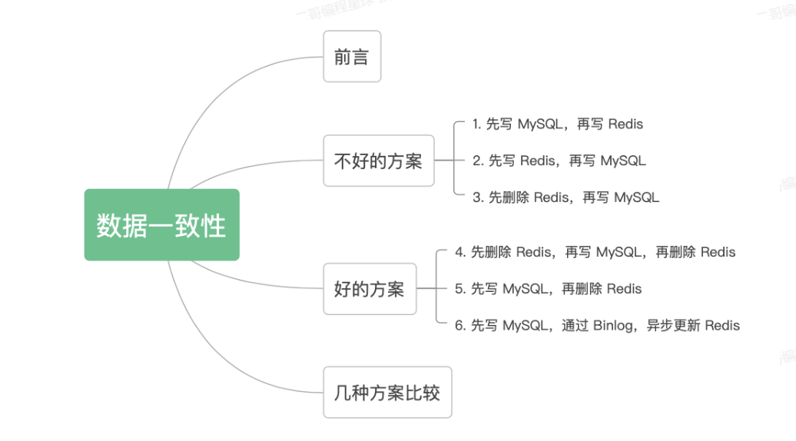
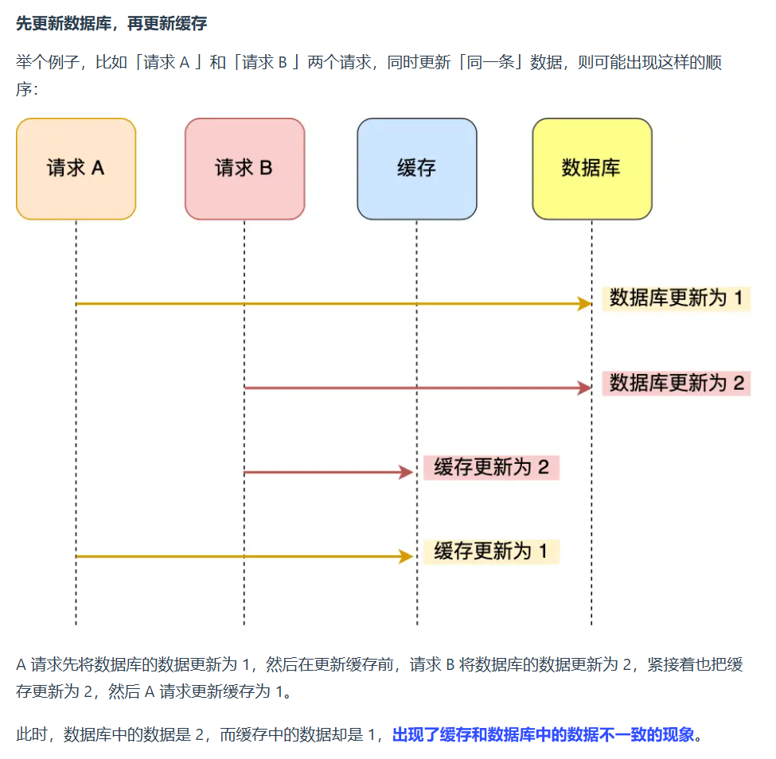
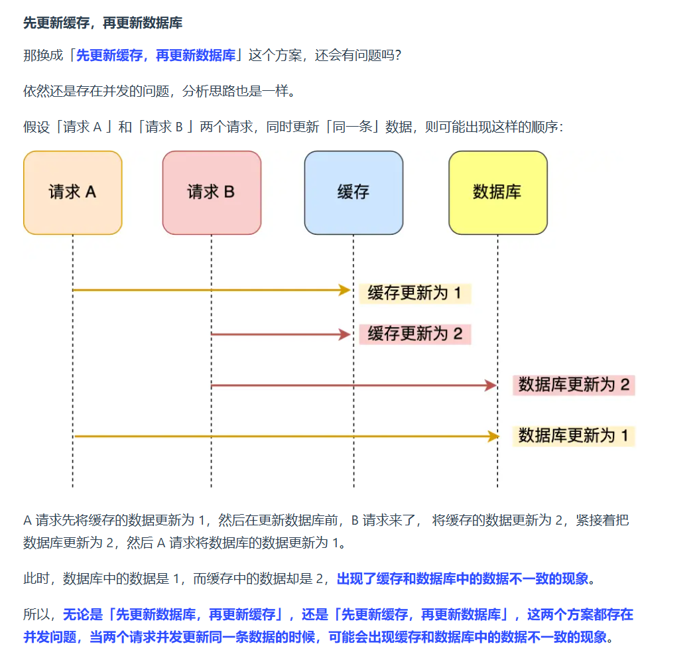
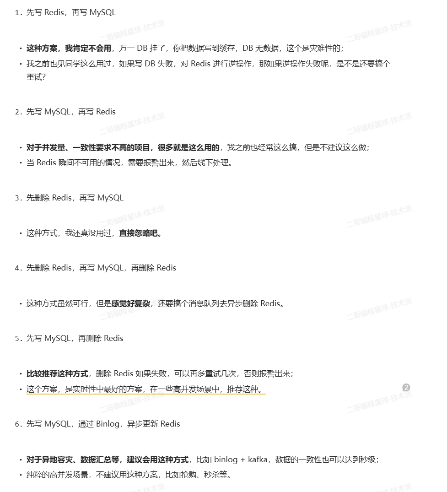
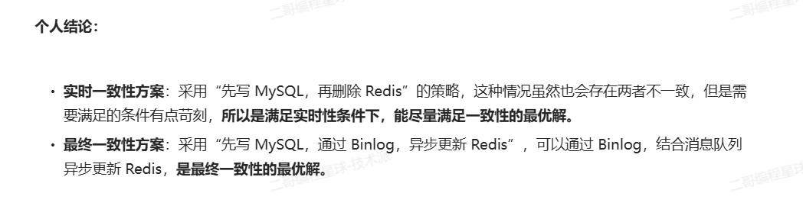

不好的方案

- 先更新数据库，再更新缓存：当高并发问题的时候会出现缓存和数据库中不一致的现象



- 先更新缓存，再更新数据库





### 先更新数据库，还是先删除缓存？

阿旺定位出问题后，思考了一番后，决定在更新数据时，**不更新缓存，而是删除缓存中的数据。然后，到读取数据时，发现缓存中没了数据之后，再从数据库中读取数据，更新到缓存中。**

阿旺想的这个策略是有名字的，是叫 **Cache Aside 策略**，中文是叫旁路缓存策略。

该策略又可以细分为「读策略」和「写策略」。


**写策略的步骤：**

- 更新数据库中的数据；
- 删除缓存中的数据。

**读策略的步骤：**

- 如果读取的数据命中了缓存，则直接返回数据；
- 如果读取的数据没有命中缓存，则从数据库中读取数据，然后将数据写入到缓存，并且返回给用户。

阿旺在想到「写策略」的时候，又陷入更深层次的思考，到底该选择哪种顺序呢？

- 先删除缓存，再更新数据库；
- 先更新数据库，再删除缓存。

阿旺这次经过上次教训，不再「想当然」的乱选方案，因为老板这次给的饼很大啊，必须把握住。

于是阿旺用并发的角度来分析，看看这两种方案哪个可以保证数据库与缓存的数据一致性。


- 先删除缓存，再更新数据库

假设某个用户的年龄是 20，请求 A 要更新用户年龄为 21，所以它会删除缓存中的内容。这时，另一个请求 B 要读取这个用户的年龄，它查询缓存发现未命中后，会从数据库中读取到年龄为 20，并且写入到缓存中，然后请求 A 继续更改数据库，将用户的年龄更新为 21。


最终，该用户年龄在缓存中是 20（旧值），在数据库中是 21（新值），缓存和数据库的数据不一致。

可以看到，**先删除缓存，再更新数据库，在「读 + 写」并发的时候，还是会出现缓存和数据库的数据不一致的问题**


> 针对「先删除缓存，再更新数据库」方案在「读 + 写」并发请求而造成缓存不一致的解决办法是「**延迟双删**」。

先删除缓存，再更新数据库，再删除缓存

延迟双删实现的伪代码如下：

```text
#删除缓存
redis.delKey(X)
#更新数据库
db.update(X)
#睡眠
Thread.sleep(N)
#再删除缓存
redis.delKey(X)
```

加了个睡眠时间，主要是为了确保请求 A 在睡眠的时候，请求 B 能够在这这一段时间完成「从数据库读取数据，再把缺失的缓存写入缓存」的操作，然后请求 A 睡眠完，再删除缓存。

所以，请求 A 的睡眠时间就需要大于请求 B 「从数据库读取数据 + 写入缓存」的时间。

但是具体睡眠多久其实是个**玄学**，很难评估出来，所以这个方案也只是**尽可能**保证一致性而已，极端情况下，依然也会出现缓存不一致的现象。

因此，还是比较建议用「先更新数据库，再删除缓存」的方案


- 先更新数据库，再删除缓存

假如某个用户数据在缓存中不存在，请求 A 读取数据时从数据库中查询到年龄为 20，在未写入缓存中时另一个请求 B 更新数据。它更新数据库中的年龄为 21，并且清空缓存。这时请求 A 把从数据库中读到的年龄为 20 的数据写入到缓存中。


最终，该用户年龄在缓存中是 20（旧值），在数据库中是 21（新值），缓存和数据库数据不一致。

从上面的理论上分析，先更新数据库，再删除缓存也是会出现数据不一致性的问题，**但是在实际中，这个问题出现的概率并不高**。

**因为缓存的写入通常要远远快于数据库的写入**，所以在实际中很难出现请求 B 已经更新了数据库并且删除了缓存，请求 A 才更新完缓存的情况。

而一旦请求 A 早于请求 B 删除缓存之前更新了缓存，那么接下来的请求就会因为缓存不命中而从数据库中重新读取数据，所以不会出现这种不一致的情况。

所以，**「先更新数据库 + 再删除缓存」的方案，是可以保证数据一致性的**。

而且阿旺为了确保万无一失，还给缓存数据加上了「**过期时间**」，就算在这期间存在缓存数据不一致，有过期时间来兜底，这样也能达到最终一致。

事情哪有这么顺利呢？结果又没过多久，老板又收到客户的投诉了，**说自己明明更新了数据，但是数据要过一段时间才生效**，客户接受不了。

老板面无表情的找上阿旺，让阿旺尽快查出问题。

阿旺得知又有 Bug 就更慌了，立马就登录服务器去排查问题，查看日志后得知了原因。

「先更新数据库， 再删除缓存」其实是两个操作，前面的所有分析都是建立在这两个操作都能同时执行成功，而这次客户投诉的问题就在于，**在删除缓存（第二个操作）的时候失败了，导致缓存中的数据是旧值**。

好在之前给缓存加上了过期时间，所以才会出现客户说的过一段时间才更新生效的现象，假设如果没有这个过期时间的兜底，那后续的请求读到的就会一直是缓存中的旧数据，这样问题就更大了。

所以新的问题来了，**如何保证「先更新数据库 ，再删除缓存」这两个操作能执行成功？**


「先更新数据库，再删除缓存」的方案虽然保证了数据库与缓存的数据一致性，但是每次更新数据的时候，缓存的数据都会被删除，这样会对缓存的命中率带来影响。

所以，**如果我们的业务对缓存命中率有很高的要求，我们可以采用「更新数据库 + 更新缓存」的方案，因为更新缓存并不会出现缓存未命中的情况**。

但是这个方案前面我们也分析过，在两个更新请求并发执行的时候，会出现数据不一致的问题，因为更新数据库和更新缓存这两个操作是独立的，而我们又没有对操作做任何并发控制，那么当两个线程并发更新它们的话，就会因为写入顺序的不同造成数据的不一致。

所以我们得增加一些手段来解决这个问题，这里提供两种做法：

- 在更新缓存前先加个**分布式锁**，保证同一时间只运行一个请求更新缓存，就会不会产生并发问题了，当然引入了锁后，对于写入的性能就会带来影响。
- 在更新完缓存时，给缓存加上较短的**过期时间**，这样即时出现缓存不一致的情况，缓存的数据也会很快过期，对业务还是能接受的。


### 如何保证两个操作都能执行成功？

这次用户的投诉是因为在删除缓存（第二个操作）的时候失败了，导致缓存还是旧值，而数据库是最新值，造成数据库和缓存数据不一致的问题，会对敏感业务造成影响。

举个例子，来说明下。

应用要把数据 X 的值从 1 更新为 2，先成功更新了数据库，然后在 Redis 缓存中删除 X 的缓存，但是这个操作却失败了，这个时候数据库中 X 的新值为 2，Redis 中的 X 的缓存值为 1，出现了数据库和缓存数据不一致的问题。


那么，后续有访问数据 X 的请求，会先在 Redis 中查询，因为缓存并没有 诶删除，所以会缓存命中，但是读到的却是旧值 1。

其实不管是先操作数据库，还是先操作缓存，只要第二个操作失败都会出现数据一致的问题。

问题原因知道了，该怎么解决呢？有两种方法：

- 消息队列重试机制。
- 订阅 MySQL binlog，再操作缓存。

先来说第一种。

##### [#](https://xiaolincoding.com/redis/architecture/mysql_redis_consistency.html#消息队列重试机制)消息队列重试机制

我们可以引入**消息队列**，将第二个操作（删除缓存）要操作的数据加入到消息队列，由消费者来操作数据。

- 如果应用**删除缓存失败**，可以从消息队列中重新读取数据，然后再次删除缓存，这个就是**重试机制**。当然，如果重试超过的一定次数，还是没有成功，我们就需要向业务层发送报错信息了。
- 如果**删除缓存成功**，就要把数据从消息队列中移除，避免重复操作，否则就继续重试。

举个例子，来说明重试机制的过程。


这个方案缺点是，对代码入侵性比较强，因为需要改造原本业务的代码。

##### [#](https://xiaolincoding.com/redis/architecture/mysql_redis_consistency.html#订阅-mysql-binlog-再操作缓存)订阅 MySQL binlog，再操作缓存

「**先更新数据库，再删缓存**」的策略的第一步是更新数据库，那么更新数据库成功，就会产生一条变更日志，记录在 binlog 里。

于是我们就可以通过订阅 binlog 日志，拿到具体要操作的数据，然后再执行缓存删除，阿里巴巴开源的 Canal 中间件就是基于这个实现的。

Canal 模拟 MySQL 主从复制的交互协议，把自己伪装成一个 MySQL 的从节点，向 MySQL 主节点发送 dump 请求，MySQL 收到请求后，就会开始推送 Binlog 给 Canal，Canal 解析 Binlog 字节流之后，转换为便于读取的结构化数据，供下游程序订阅使用。

下图是 Canal 的工作原理：


前面我们说到直接用消息队列重试机制方案的话，会对代码造成入侵，那么 Canal 方案就能很好的规避这个问题，因为它是直接订阅 binlog 日志的，和业务代码没有藕合关系，因此我们可以通过 Canal+ 消息队列的方案来保证数据缓存的一致性。

具体的做法是：**将binlog日志采集发送到MQ队列里面，然后编写一个简单的缓存删除消息者订阅binlog日志，根据更新log删除缓存，并且通过ACK机制确认处理这条更新log，保证数据缓存一致性**

这里有一个很关键的点，**必须是删除缓存成功，再回 ack 机制给消息队列**，否则可能会造成消息丢失的问题，比如消费服务从消息队列拿到事件之后，直接回了 ack，然后再执行删除缓存操作的话，如果删除缓存的操作还是失败了，那么因为提前给消息队列回 ack了，就没办重试了。

所以，如果要想保证「先更新数据库，再删缓存」策略第二个操作能执行成功，我们可以使用：

- 消息队列来重试缓存的删除，优点是保证缓存一致性的问题，缺点会对业务代码入侵
- 订阅 MySQL binlog + 消息队列 + 重试缓存的删除，优点是规避了代码入侵问题，也很好的保证缓存一致性的问题，缺点就是引入的组件比较多，对团队的运维能力比较有高要求。

这两种方法有一个共同的特点，都是采用**异步操作缓存**。


- 先更新数据库，通过Binlog，异步更新缓存






## 读者提问

> 为什么是删除缓存，而不是更新缓存呢？

删除一个数据，相比更新一个数据更加轻量级，出问题的概率更小。在实际业务中，缓存的数据可能不是直接来自数据库表，也许来自多张底层数据表的聚合。

比如商品详情信息，在底层可能会关联商品表、价格表、库存表等，如果更新了一个价格字段，那么就要更新整个数据库，还要关联的去查询和汇总各个周边业务系统的数据，这个操作会非常耗时。 从另外一个角度，不是所有的缓存数据都是频繁访问的，更新后的缓存可能会长时间不被访问，所以说，从计算资源和整体性能的考虑，更新的时候删除缓存，等到下次查询命中再填充缓存，是一个更好的方案。

系统设计中有一个思想叫 Lazy Loading，适用于那些加载代价大的操作，删除缓存而不是更新缓存，就是懒加载思想的一个应用。
