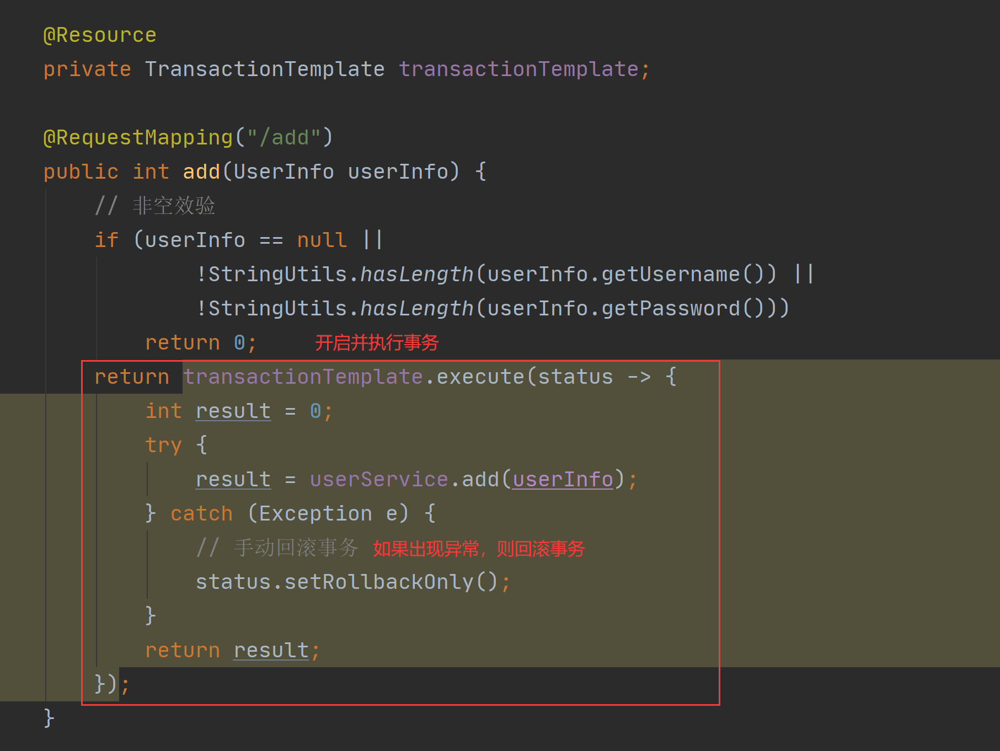
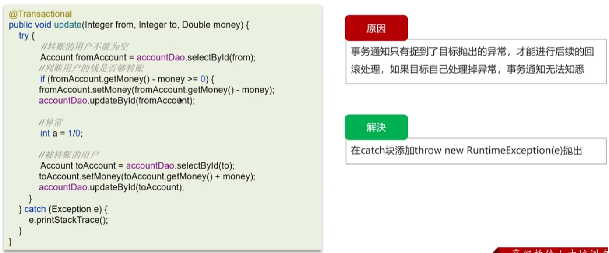

> Spring事务详解


# 1.事务概述

## 1.1 什么是事务？

**事务是逻辑上的一组操作，要么都执行，要么都不执行。**主要是针对数据库而言的，比如说 MySQL。

相信大家应该都能背上面这句话了，下面我结合我们日常的真实开发来谈一谈。我们系统的每个业务方法可能包括了多个原子性的数据库操作，比如下面的 `savePerson()` 方法中就有两个原子性的数据库操作。这些原子性的数据库操作是有依赖的，它们要么都执行，要不就都不执行。

```java
public void savePerson() {
	personDao.save(person);
	personDetailDao.save(personDetail);
}
```

另外，需要格外注意的是：**事务能否生效数据库引擎是否支持事务是关键。比如常用的 MySQL 数据库默认使用支持事务的 `innodb`引擎。但是，如果把数据库引擎变为 `myisam`，那么程序也就不再支持事务了！**

事务最经典也经常被拿出来说例子就是转账了。假如小明要给小红转账 1000 元，这个转账会涉及到两个关键操作就是：

> 1. 将小明的余额减少 1000 元。
> 2. 将小红的余额增加 1000 元。

万一在这两个操作之间突然出现错误比如银行系统崩溃或者网络故障，导致小明余额减少而小红的余额没有增加，这样就不对了。事务就是保证这两个关键操作要么都成功，要么都要失败。


```java
public class OrdersService {
  private AccountDao accountDao;

  public void setOrdersDao(AccountDao accountDao) {
    this.accountDao = accountDao;
  }

  @Transactional(propagation = Propagation.REQUIRED,
                isolation = Isolation.DEFAULT, readOnly = false, timeout = -1)
  public void accountMoney() {
    //小红账户多1000
    accountDao.addMoney(1000,xiaohong);
    //模拟突然出现的异常，比如银行中可能为突然停电等等
    //如果没有配置事务管理的话会造成，小红账户多了1000而小明账户没有少钱
    int i = 10 / 0;
    //小王账户少1000
    accountDao.reduceMoney(1000,xiaoming);
  }
}
```

## 1.2 事务的特性ACID

事务具有四个基本特性，也就是通常所说的 ACID 特性，即原子性、一致性、隔离性和持久性。主要作用是保证数据库操作的一致性。

1. **原子性**（`Atomicity`）：事务是最小的执行单位，不允许分割；事务的原子性确保动作要么全部完成，要么完全不起作用。（如果事务中的任何一个操作失败了，整个事务都会回滚到事务开始之前的状态，如同这些操作从未被执行过一样。）
2. **一致性**（`Consistency`）：执行事务前后，数据保持一致。例如转账业务中，无论事务是否成功，转账者和收款人的总额应该是不变的。
3. **隔离性**（`Isolation`）：在数据库并发访问场景下，每个用户的事务都能独立运行，不受其他事务干扰，确保各并发事务间的数据访问互不影响 。
   1. 隔离性主要是为了解决事务并发执行时可能出现的问题，如脏读、不可重复读、幻读等。
   2. 数据库系统通过事务隔离级别（如读未提交、读已提交、可重复读、串行化）来实现事务的隔离性。
4. **持久性**（`Durability`）：一个事务被提交之后，它对数据库中数据的改变是持久的，即使数据库发生故障，也能恢复到最近一次提交的状态。
   1. 通常，持久性是通过数据库的恢复和日志机制来实现的，确保提交的事务更改不会丢失。

**只有保证了事务的持久性、原子性、隔离性之后，一致性才能得到保障。也就是说 A、I、D 是手段，C 是目的！** 如下图所示：


> Atomicity, isolation, and durability are properties of the database, whereas consis‐ tency (in the ACID sense) is a property of the application. The application may rely on the database’s atomicity and isolation properties in order to achieve consistency, but it’s not up to the database alone.
>
> 翻译过来的意思是：原子性，隔离性和持久性是数据库的属性，而一致性（在 ACID 意义上）是应用程序的属性。应用可能依赖数据库的原子性和隔离属性来实现一致性，但这并不仅取决于数据库。因此，字母 C 不属于 ACID 。

这里再多提一下一个非常重要的知识点：**MySQL 怎么保证原子性的？**

我们知道如果想要保证事务的原子性，就需要在异常发生时，对已经执行的操作进行**回滚**，在 MySQL 中，恢复机制是通过 **回滚日志（undo log）** 实现的，所有事务进行的修改都会先记录到这个回滚日志中，然后再执行相关的操作。如果执行过程中遇到异常的话，我们直接利用 **回滚日志** 中的信息将数据回滚到修改之前的样子即可！并且，回滚日志会先于数据持久化到磁盘上。这样就保证了即使遇到数据库突然宕机等情况，当用户再次启动数据库的时候，数据库还能够通过查询回滚日志来回滚之前未完成的事务。

> ⚠️ 再提醒一次：你的程序是否支持事务首先取决于数据库 ，比如使用 MySQL 的话，如果你选择的是 innodb 引擎，那么恭喜你，是可以支持事务的。但是，如果你的 MySQL 数据库使用的是 myisam 引擎的话，那不好意思，从根上就是不支持事务的。

# 2.详谈 Spring 对事务的支持

- Spring支持事务管理的方式有两种：
  - 编程式事务管理
  - 声明式事务管理（推荐）

## 2.1 编程式事务管理

- 在Spring中实现编程式事务又有两种实现方法：
  - 使用 TransactionTemplate 对象实现编程式事务；
  - 使用更加底层的 TransactionManager 对象实现编程式事务。

- **使用`TransactionTemplate` 进行编程式事务管理时，需要先将 TransactionTemplate注入到当前类中 ，然后再使用它提供的 execute 方法执行事务并返回相应的执行结果，如果程序在执行途中出现了异常，那么就可以使用代码手动回滚事务，具体实现代码如下：**



```
@Autowired
private TransactionTemplate transactionTemplate;
public void testTransaction() {

        transactionTemplate.execute(new TransactionCallbackWithoutResult() {
            @Override
            protected void doInTransactionWithoutResult(TransactionStatus transactionStatus) {

                try {

                    // ....  业务代码
                } catch (Exception e){
                    //回滚
                    transactionStatus.setRollbackOnly();
                }

            }
        });
}
```

- 使用 `TransactionManager` 进行编程式事务管理的实现相对麻烦一点，它需要使用两个对象：TransactionManager 的子类，加上 TransactionDefinition 事务定义对象，再通过调用 TransactionManager 的 getTransaction 获取并开启事务，然后调用 TransactionManager 提供的 commit 方法提交事务，或使用它的另一个方法 rollback 回滚事务，它的具体实现代码如下：

.png)

```java
@Autowired
private PlatformTransactionManager transactionManager;

public void testTransaction() {

  TransactionStatus status = transactionManager.getTransaction(new DefaultTransactionDefinition());
          try {
               // ....  业务代码
              transactionManager.commit(status);
          } catch (Exception e) {
              transactionManager.rollback(status);
          }
}
```

> 从上述代码可以看出，**使用编程式事务更加灵活，但写法比较麻烦**，因此，实际应用中很少使用，但是对于你理解 Spring 事务管理原理有帮助。

## 2.2 声明式事务管理（推荐）

- 声明式事务管理推荐使用，因为代码侵入性最小，实际是通过 AOP 实现（基于`@Transactional` 的全注解方式使用最多）。

- 使用 `@Transactional`注解进行事务管理的示例代码如下：

  ```java
  @Transactional(propagation = Propagation.REQUIRED)
  public void aMethod {
    //do something
    B b = new B();
    C c = new C();
    b.bMethod();
    c.cMethod();
  }
  ```

- 声明式事务的实现比较简单，**只需要在方法上或类上添加 @Transactional 注解即可，当加入了 @Transactional 注解就可以实现在方法执行前，自动开启事务；在方法成功执行完，自动提交事务；如果方法在执行期间，出现了异常，那么它会自动回滚事务。**
  它的具体使用如下：

.png)

- 当然，@Transactional 支持很多参数的设置，它的参数设置列表如下：

| 参数                   | 类型                                       | 描述                                                         |
| ---------------------- | ------------------------------------------ | ------------------------------------------------------------ |
| value                  | String                                     | 指定要使用的事务管理器的可选限定符。                         |
| propagation            | enum : Propagation                         | 可选传播设置。                                               |
| isolation              | enum : Isolation                           | 可选隔离级别。仅适用于传播值 REQUIRED 或者 REQUIRES_NEW。    |
| timeout                | int (以秒为单位)                           | 可选事务超时。仅适用于传播值 REQUIRED 或者 REQUIRES_NEW。    |
| readOnly               | boolean                                    | 读写事务与只读事务。仅适用于以下值 REQUIRED 或者 REQUIRES_NEW。 |
| rollbackFor            | 数组 Class 对象，这些对象必须从 Throwable. | 必须导致回滚的异常类的可选数组。                             |
| rollbackForClassName   | 类名数组。这些类必须从 Throwable.          | 必须导致回滚的异常类名的可选数组。                           |
| noRollbackFor          | 数组 Class 对象，这些对象必须从 Throwable. | 不能导致回滚的异常类的可选数组。                             |
| noRollbackForClassName | 数组 String 类名，必须从 Throwable.        | 不能导致回滚的异常类名的可选数组。                           |

- 参数的设置方法如下：

.png)

## 2.3 Spring事务管理接口介绍

- Spring 框架中，事务管理相关最重要的 3 个接口如下：

  - **`PlatformTransactionManager`**：（平台）事务管理器，Spring 事务策略的核心。

  - **`TransactionDefinition`**：事务定义信息(事务隔离级别、传播行为、超时、只读、回滚规则)。

  - **`TransactionStatus`**：事务运行状态。

- 我们可以把 **`PlatformTransactionManager`** 接口可以被看作是事务上层的管理者，而 **`TransactionDefinition`** 和 **`TransactionStatus`** 这两个接口可以看作是事务的描述。
  - **`PlatformTransactionManager`** 会根据 **`TransactionDefinition`** 的定义比如事务超时时间、隔离级别、传播行为等来进行事务管理 ，
  - 而 **`TransactionStatus`** 接口则提供了一些方法来获取事务相应的状态比如是否新事务、是否可以回滚等等。

### 2.3.1 PlatformTransactionManager：事务管理接口是：**`PlatformTransactionManager`** 。

通过这个接口，Spring 为各个平台如：JDBC(`DataSourceTransactionManager`)、Hibernate(`HibernateTransactionManager`)、JPA(`JpaTransactionManager`)等都提供了对应的事务管理器，但是具体的实现就是各个平台自己的事情了。

**`PlatformTransactionManager` 接口的具体实现如下:**


`PlatformTransactionManager`接口中定义了三个方法：

```java
package org.springframework.transaction;

import org.springframework.lang.Nullable;

public interface PlatformTransactionManager {
    //获得事务
    TransactionStatus getTransaction(@Nullable TransactionDefinition var1) throws TransactionException;
    //提交事务
    void commit(TransactionStatus var1) throws TransactionException;
    //回滚事务
    void rollback(TransactionStatus var1) throws TransactionException;
}
```

**这里多插一嘴。为什么要定义或者说抽象出来`PlatformTransactionManager`这个接口呢？**

主要是因为要将事务管理行为抽象出来，然后不同的平台去实现它，这样我们可以保证提供给外部的行为不变，方便我们扩展。

我前段时间在我的[知识星球](https://javaguide.cn/about-the-author/zhishixingqiu-two-years.html)分享过：**“为什么我们要用接口？”** 。

> 《设计模式》（GOF 那本）这本书在很多年前都提到过说要基于接口而非实现编程，你真的知道为什么要基于接口编程么？
>
> 纵观开源框架和项目的源码，接口是它们不可或缺的重要组成部分。要理解为什么要用接口，首先要搞懂接口提供了什么功能。我们可以把接口理解为提供了一系列功能列表的约定，接口本身不提供功能，它只定义行为。但是谁要用，就要先实现我，遵守我的约定，然后再自己去实现我定义的要实现的功能。
>
> 举个例子，我上个项目有发送短信的需求，为此，我们定了一个接口，接口只有两个方法:
>
> 1.发送短信 2.处理发送结果的方法。
>
> 刚开始我们用的是阿里云短信服务，然后我们实现这个接口完成了一个阿里云短信的服务。后来，我们突然又换到了别的短信服务平台，我们这个时候只需要再实现这个接口即可。这样保证了我们提供给外部的行为不变。几乎不需要改变什么代码，我们就轻松完成了需求的转变，提高了代码的灵活性和可扩展性。
>
> 什么时候用接口？当你要实现的功能模块设计抽象行为的时候，比如发送短信的服务，图床的存储服务等等。

### 2.3.2 TransactionDefinition:事务属性

事务管理器接口 **`PlatformTransactionManager`** 通过 **`getTransaction(TransactionDefinition definition)`** 方法来得到一个事务，这个方法里面的参数是 **`TransactionDefinition`** 类 ，这个类就定义了一些基本的事务属性。

**什么是事务属性呢？** 事务属性可以理解成事务的一些基本配置，描述了事务策略如何应用到方法上。

事务属性包含了 5 个方面：

- 隔离级别
- 传播行为
- 回滚规则
- 是否只读
- 事务超时

`TransactionDefinition` 接口中定义了 5 个方法以及一些表示事务属性的常量比如隔离级别、传播行为等等。

```java
package org.springframework.transaction;

import org.springframework.lang.Nullable;

public interface TransactionDefinition {
    int PROPAGATION_REQUIRED = 0;
    int PROPAGATION_SUPPORTS = 1;
    int PROPAGATION_MANDATORY = 2;
    int PROPAGATION_REQUIRES_NEW = 3;
    int PROPAGATION_NOT_SUPPORTED = 4;
    int PROPAGATION_NEVER = 5;
    int PROPAGATION_NESTED = 6;
    int ISOLATION_DEFAULT = -1;
    int ISOLATION_READ_UNCOMMITTED = 1;
    int ISOLATION_READ_COMMITTED = 2;
    int ISOLATION_REPEATABLE_READ = 4;
    int ISOLATION_SERIALIZABLE = 8;
    int TIMEOUT_DEFAULT = -1;
    // 返回事务的传播行为，默认值为 REQUIRED。
    int getPropagationBehavior();
    //返回事务的隔离级别，默认值是 DEFAULT
    int getIsolationLevel();
    // 返回事务的超时时间，默认值为-1。如果超过该时间限制但事务还没有完成，则自动回滚事务。
    int getTimeout();
    // 返回是否为只读事务，默认值为 false
    boolean isReadOnly();

    @Nullable
    String getName();
}
```

#### 2.3.3 TransactionStatus:事务状态

`TransactionStatus`接口用来记录事务的状态 该接口定义了一组方法,用来获取或判断事务的相应状态信息。

`PlatformTransactionManager.getTransaction(…)`方法返回一个 `TransactionStatus` 对象。

**TransactionStatus 接口内容如下：**

```java
public interface TransactionStatus{
    boolean isNewTransaction(); // 是否是新的事务
    boolean hasSavepoint(); // 是否有恢复点
    void setRollbackOnly();  // 设置为只回滚
    boolean isRollbackOnly(); // 是否为只回滚
    boolean isCompleted; // 是否已完成
}
```

### 2.3.3 事务属性详解

实际业务开发中，大家一般都是使用 `@Transactional` 注解来开启事务，很多人并不清楚这个注解里面的参数是什么意思，有什么用。为了更好的在项目中使用事务管理，强烈推荐好好阅读一下下面的内容。

#### 2.3.3.1 事务传播行为

**事务传播行为是为了解决业务层方法之间互相调用的事务问题**。

当事务方法被另一个事务方法调用时，必须指定事务应该如何传播。例如：方法可能继续在现有事务中运行，也可能开启一个新事务，并在自己的事务中运行。

举个例子：我们在 A 类的`aMethod()`方法中调用了 B 类的 `bMethod()` 方法。这个时候就涉及到业务层方法之间互相调用的事务问题。如果我们的 `bMethod()`如果发生异常需要回滚，如何配置事务传播行为才能让 `aMethod()`也跟着回滚呢？这个时候就需要事务传播行为的知识了，如果你不知道的话一定要好好看一下。

```java
@Service
Class A {
    @Autowired
    B b;
    @Transactional(propagation = Propagation.xxx)
    public void aMethod {
        //do something
        b.bMethod();
    }
}

@Service
Class B {
    @Transactional(propagation = Propagation.xxx)
    public void bMethod {
       //do something
    }
}
```

在`TransactionDefinition`定义中包括了如下几个表示传播行为的常量：

```java
public interface TransactionDefinition {
    int PROPAGATION_REQUIRED = 0;
    int PROPAGATION_SUPPORTS = 1;
    int PROPAGATION_MANDATORY = 2;
    int PROPAGATION_REQUIRES_NEW = 3;
    int PROPAGATION_NOT_SUPPORTED = 4;
    int PROPAGATION_NEVER = 5;
    int PROPAGATION_NESTED = 6;
    ......
}
```

不过，为了方便使用，Spring 相应地定义了一个枚举类：`Propagation`

```java
package org.springframework.transaction.annotation;

import org.springframework.transaction.TransactionDefinition;

public enum Propagation {

    REQUIRED(TransactionDefinition.PROPAGATION_REQUIRED),

    SUPPORTS(TransactionDefinition.PROPAGATION_SUPPORTS),

    MANDATORY(TransactionDefinition.PROPAGATION_MANDATORY),

    REQUIRES_NEW(TransactionDefinition.PROPAGATION_REQUIRES_NEW),

    NOT_SUPPORTED(TransactionDefinition.PROPAGATION_NOT_SUPPORTED),

    NEVER(TransactionDefinition.PROPAGATION_NEVER),

    NESTED(TransactionDefinition.PROPAGATION_NESTED);

    private final int value;

    Propagation(int value) {
        this.value = value;
    }

    public int value() {
        return this.value;
    }

}
```

**正确的事务传播行为可能的值如下**：

**1.`TransactionDefinition.PROPAGATION_REQUIRED`**

使用的最多的一个事务传播行为，我们平时经常使用的`@Transactional`注解默认使用就是这个事务传播行为。如果当前存在事务，则加入该事务；如果当前没有事务，则创建一个新的事务。也就是说：

- 如果外部方法没有开启事务的话，`Propagation.REQUIRED`修饰的内部方法会新开启自己的事务，且开启的事务相互独立，互不干扰。
- 如果外部方法开启事务并且被`Propagation.REQUIRED`的话，所有`Propagation.REQUIRED`修饰的内部方法和外部方法均属于同一事务 ，只要一个方法回滚，整个事务均回滚。

举个例子：如果我们上面的`aMethod()`和`bMethod()`使用的都是`PROPAGATION_REQUIRED`传播行为的话，两者使用的就是同一个事务，只要其中一个方法回滚，整个事务均回滚。

```java
@Service
Class A {
    @Autowired
    B b;
    @Transactional(propagation = Propagation.REQUIRED)
    public void aMethod {
        //do something
        b.bMethod();
    }
}
@Service
Class B {
    @Transactional(propagation = Propagation.REQUIRED)
    public void bMethod {
       //do something
    }
}
```

**`2.TransactionDefinition.PROPAGATION_REQUIRES_NEW`**

创建一个新的事务，如果当前存在事务，则把当前事务挂起。也就是说不管外部方法是否开启事务，`Propagation.REQUIRES_NEW`修饰的内部方法会新开启自己的事务，且开启的事务相互独立，互不干扰。

举个例子：如果我们上面的`bMethod()`使用`PROPAGATION_REQUIRES_NEW`事务传播行为修饰，`aMethod`还是用`PROPAGATION_REQUIRED`修饰的话。如果`aMethod()`发生异常回滚，`bMethod()`不会跟着回滚，因为 `bMethod()`开启了独立的事务。但是，如果 `bMethod()`抛出了未被捕获的异常并且这个异常满足事务回滚规则的话,`aMethod()`同样也会回滚，因为这个异常被 `aMethod()`的事务管理机制检测到了。

```java
@Service
Class A {
    @Autowired
    B b;
    @Transactional(propagation = Propagation.REQUIRED)
    public void aMethod {
        //do something
        b.bMethod();
    }
}

@Service
Class B {
    @Transactional(propagation = Propagation.REQUIRES_NEW)
    public void bMethod {
       //do something
    }
}
```

**3.`TransactionDefinition.PROPAGATION_NESTED`**:

如果当前存在事务，就在嵌套事务内执行；如果当前没有事务，就执行与`TransactionDefinition.PROPAGATION_REQUIRED`类似的操作。也就是说：

- 在外部方法开启事务的情况下，在内部开启一个新的事务，作为嵌套事务存在。
- 如果外部方法无事务，则单独开启一个事务，与 `PROPAGATION_REQUIRED` 类似。

这里还是简单举个例子：如果 `bMethod()` 回滚的话，`aMethod()`不会回滚。如果 `aMethod()` 回滚的话，`bMethod()`会回滚。

```java
@Service
Class A {
    @Autowired
    B b;
    @Transactional(propagation = Propagation.REQUIRED)
    public void aMethod {
        //do something
        b.bMethod();
    }
}

@Service
Class B {
    @Transactional(propagation = Propagation.NESTED)
    public void bMethod {
       //do something
    }
}
```

**4.`TransactionDefinition.PROPAGATION_MANDATORY`**

如果当前存在事务，则加入该事务；如果当前没有事务，则抛出异常。（mandatory：强制性）

这个使用的很少，就不举例子来说了。

**若是错误的配置以下 3 种事务传播行为，事务将不会发生回滚，这里不对照案例讲解了，使用的很少。**

- **`TransactionDefinition.PROPAGATION_SUPPORTS`**: 如果当前存在事务，则加入该事务；如果当前没有事务，则以非事务的方式继续运行。
- **`TransactionDefinition.PROPAGATION_NOT_SUPPORTED`**: 以非事务方式运行，如果当前存在事务，则把当前事务挂起。
- **`TransactionDefinition.PROPAGATION_NEVER`**: 以非事务方式运行，如果当前存在事务，则抛出异常。

#### 2.3.3.2 事务隔离级别

`TransactionDefinition` 接口中定义了五个表示隔离级别的常量：

```java
public interface TransactionDefinition {
    ......
    int ISOLATION_DEFAULT = -1;
    int ISOLATION_READ_UNCOMMITTED = 1;
    int ISOLATION_READ_COMMITTED = 2;
    int ISOLATION_REPEATABLE_READ = 4;
    int ISOLATION_SERIALIZABLE = 8;
    ......
}
```

和事务传播行为那块一样，为了方便使用，Spring 也相应地定义了一个枚举类：`Isolation`

```java
public enum Isolation {

  DEFAULT(TransactionDefinition.ISOLATION_DEFAULT),

  READ_UNCOMMITTED(TransactionDefinition.ISOLATION_READ_UNCOMMITTED),

  READ_COMMITTED(TransactionDefinition.ISOLATION_READ_COMMITTED),

  REPEATABLE_READ(TransactionDefinition.ISOLATION_REPEATABLE_READ),

  SERIALIZABLE(TransactionDefinition.ISOLATION_SERIALIZABLE);

  private final int value;

  Isolation(int value) {
    this.value = value;
  }

  public int value() {
    return this.value;
  }

}
```

下面我依次对每一种事务隔离级别进行介绍：

- **`TransactionDefinition.ISOLATION_DEFAULT`** :使用后端数据库默认的隔离级别，MySQL 默认采用的 `REPEATABLE_READ` 隔离级别 Oracle 默认采用的 `READ_COMMITTED` 隔离级别.
- **`TransactionDefinition.ISOLATION_READ_UNCOMMITTED`** :最低的隔离级别，使用这个隔离级别很少，因为它允许读取尚未提交的数据变更，**可能会导致脏读、幻读或不可重复读**
- **`TransactionDefinition.ISOLATION_READ_COMMITTED`** : 允许读取并发事务已经提交的数据，**可以阻止脏读，但是幻读或不可重复读仍有可能发生**
- **`TransactionDefinition.ISOLATION_REPEATABLE_READ`** : 对同一字段的多次读取结果都是一致的，除非数据是被本身事务自己所修改，**可以阻止脏读和不可重复读，但幻读仍有可能发生。**
- **`TransactionDefinition.ISOLATION_SERIALIZABLE`** : 最高的隔离级别，完全服从 ACID 的隔离级别。所有的事务依次逐个执行，这样事务之间就完全不可能产生干扰，也就是说，**该级别可以防止脏读、不可重复读以及幻读**。但是这将严重影响程序的性能。通常情况下也不会用到该级别。

#### 2.3.3.3 事务超时属性

所谓事务超时，就是指一个事务所允许执行的最长时间，如果超过该时间限制但事务还没有完成，则自动回滚事务。在 `TransactionDefinition` 中以 int 的值来表示超时时间，其单位是秒，默认值为-1，这表示事务的超时时间取决于底层事务系统或者没有超时时间。

#### 2.3.3.4 事务只读属性

```java
package org.springframework.transaction;

import org.springframework.lang.Nullable;

public interface TransactionDefinition {
    ......
    // 返回是否为只读事务，默认值为 false
    boolean isReadOnly();

}
```

对于只有读取数据查询的事务，可以指定事务类型为 readonly，即只读事务。只读事务不涉及数据的修改，数据库会提供一些优化手段，适合用在有多条数据库查询操作的方法中。

很多人就会疑问了，为什么我一个数据查询操作还要启用事务支持呢？

拿 MySQL 的 innodb 举例子，根据官网 https://dev.mysql.com/doc/refman/5.7/en/innodb-autocommit-commit-rollback.html 描述：

> MySQL 默认对每一个新建立的连接都启用了`autocommit`模式。在该模式下，每一个发送到 MySQL 服务器的`sql`语句都会在一个单独的事务中进行处理，执行结束后会自动提交事务，并开启一个新的事务。

但是，如果你给方法加上了`Transactional`注解的话，这个方法执行的所有`sql`会被放在一个事务中。如果声明了只读事务的话，数据库就会去优化它的执行，并不会带来其他的什么收益。

如果不加`Transactional`，每条`sql`会开启一个单独的事务，中间被其它事务改了数据，都会实时读取到最新值。

分享一下关于事务只读属性，其他人的解答：

- 如果你一次执行单条查询语句，则没有必要启用事务支持，数据库默认支持 SQL 执行期间的读一致性；
- 如果你一次执行多条查询语句，例如统计查询，报表查询，在这种场景下，多条查询 SQL 必须保证整体的读一致性，否则，在前条 SQL 查询之后，后条 SQL 查询之前，数据被其他用户改变，则该次整体的统计查询将会出现读数据不一致的状态，此时，应该启用事务支持

#### 2.3.3.5 事务回滚规则

这些规则定义了哪些异常会导致事务回滚而哪些不会。默认情况下，事务只有遇到运行期异常（`RuntimeException` 的子类）时才会回滚，`Error` 也会导致事务回滚，但是，在遇到检查型（Checked）异常时不会回滚。


如果你想要回滚你定义的特定的异常类型的话，可以这样：

```java
@Transactional(rollbackFor= MyException.class)
```

### 2.3.4 @Transactional 注解使用详解

#### 2.3.4.1 `@Transactional` 的作用范围

1. **方法**：推荐将注解使用于方法上，不过需要注意的是：**该注解只能应用到 public 方法上，否则不生效。**
2. **类**：如果这个注解使用在类上的话，表明该注解对该类中所有的 public 方法都生效。
3. **接口**：不推荐在接口上使用。

#### 2.3.4.2 @Transactional` 的常用配置参数

`@Transactional`注解源码如下，里面包含了基本事务属性的配置：

```java
@Target({ElementType.TYPE, ElementType.METHOD})
@Retention(RetentionPolicy.RUNTIME)
@Inherited
@Documented
public @interface Transactional {

  @AliasFor("transactionManager")
  String value() default "";

  @AliasFor("value")
  String transactionManager() default "";

  Propagation propagation() default Propagation.REQUIRED;

  Isolation isolation() default Isolation.DEFAULT;

  int timeout() default TransactionDefinition.TIMEOUT_DEFAULT;

  boolean readOnly() default false;

  Class<? extends Throwable>[] rollbackFor() default {};

  String[] rollbackForClassName() default {};

  Class<? extends Throwable>[] noRollbackFor() default {};

  String[] noRollbackForClassName() default {};

}
```

**`@Transactional` 的常用配置参数总结（只列出了 5 个我平时比较常用的）：**

| 属性名      | 说明                                                         |
| :---------- | :----------------------------------------------------------- |
| propagation | 事务的传播行为，默认值为 REQUIRED，可选的值在上面介绍过      |
| isolation   | 事务的隔离级别，默认值采用 DEFAULT，可选的值在上面介绍过     |
| timeout     | 事务的超时时间，默认值为-1（不会超时）。如果超过该时间限制但事务还没有完成，则自动回滚事务。 |
| readOnly    | 指定事务是否为只读事务，默认值为 false。                     |
| rollbackFor | 用于指定能够触发事务回滚的异常类型，并且可以指定多个异常类型。 |

#### 2.3.4.3 @Transactional` 事务注解原理

面试中在问 AOP 的时候可能会被问到的一个问题。简单说下吧！

我们知道，**`@Transactional` 的工作机制是基于 AOP 实现的，AOP 又是使用动态代理实现的。如果目标对象实现了接口，默认情况下会采用 JDK 的动态代理，如果目标对象没有实现了接口,会使用 CGLIB 动态代理。**

🤐 多提一嘴：`createAopProxy()` 方法 决定了是使用 JDK 还是 Cglib 来做动态代理，源码如下：

```java
public class DefaultAopProxyFactory implements AopProxyFactory, Serializable {

  @Override
  public AopProxy createAopProxy(AdvisedSupport config) throws AopConfigException {
    if (config.isOptimize() || config.isProxyTargetClass() || hasNoUserSuppliedProxyInterfaces(config)) {
      Class<?> targetClass = config.getTargetClass();
      if (targetClass == null) {
        throw new AopConfigException("TargetSource cannot determine target class: " +
            "Either an interface or a target is required for proxy creation.");
      }
      if (targetClass.isInterface() || Proxy.isProxyClass(targetClass)) {
        return new JdkDynamicAopProxy(config);
      }
      return new ObjenesisCglibAopProxy(config);
    }
    else {
      return new JdkDynamicAopProxy(config);
    }
  }
  .......
}
```

如果一个类或者一个类中的 public 方法上被标注`@Transactional` 注解的话，Spring 容器就会在启动的时候为其创建一个代理类，在调用被`@Transactional` 注解的 public 方法的时候，实际调用的是，`TransactionInterceptor` 类中的 `invoke()`方法。这个方法的作用就是在目标方法之前开启事务，方法执行过程中如果遇到异常的时候回滚事务，方法调用完成之后提交事务。

> `TransactionInterceptor` 类中的 `invoke()`方法内部实际调用的是 `TransactionAspectSupport` 类的 `invokeWithinTransaction()`方法。由于新版本的 Spring 对这部分重写很大，而且用到了很多响应式编程的知识，这里就不列源码了。

#### 2.3.4.4 Spring AOP 自调用问题

当一个方法被标记了`@Transactional` 注解的时候，Spring 事务管理器只会在被其他类方法调用的时候生效，而不会在一个类中方法调用生效。

这是因为 Spring AOP 工作原理决定的。因为 Spring AOP 使用动态代理来实现事务的管理，它会在运行的时候为带有 `@Transactional` 注解的方法生成代理对象，并在方法调用的前后应用事物逻辑。如果该方法被其他类调用我们的代理对象就会拦截方法调用并处理事务。但是在一个类中的其他方法内部调用的时候，我们代理对象就无法拦截到这个内部调用，因此事务也就失效了。

`MyService` 类中的`method1()`调用`method2()`就会导致`method2()`的事务失效。

```java
@Service
public class MyService {

private void method1() {
     method2();
     //......
}
@Transactional
 public void method2() {
     //......
  }
}
```

解决办法就是避免同一类中自调用或者使用 AspectJ 取代 Spring AOP 代理。

[issue #2091](https://github.com/Snailclimb/JavaGuide/issues/2091)补充了一个例子：

```java
@Service
public class MyService {

private void method1() {
     ((MyService)AopContext.currentProxy()).method2(); // 先获取该类的代理对象，然后通过代理对象调用method2。
     //......
}
@Transactional
 public void method2() {
     //......
  }
}
```

上面的代码确实可以在自调用的时候开启事务，但是这是因为使用了 `AopContext.currentProxy()` 方法来获取当前类的代理对象，然后通过代理对象调用 `method2()`。这样就相当于从外部调用了 `method2()`，所以事务注解才会生效。我们一般也不会在代码中这么写，所以可以忽略这个特殊的例子。

#### 2.3.4.5 `@Transactional` 的使用注意事项总结

- `@Transactional` 注解只有作用到 public 方法上事务才生效，不推荐在接口上使用；
- 避免同一个类中调用 `@Transactional` 注解的方法，这样会导致事务失效；
- 正确的设置 `@Transactional` 的 `rollbackFor` 和 `propagation` 属性，否则事务可能会回滚失败;
- 被 `@Transactional` 注解的方法所在的类必须被 Spring 管理，否则不生效；
- 底层使用的数据库必须支持事务机制，否则不生效；


- https://blog.csdn.net/heihaozi/article/details/129982981
- https://cloud.tencent.com/developer/article/2388140


# 3.MySQL事务八股

## 3.1 何谓事务？

我们设想一个场景，这个场景中我们需要插入多条相关联的数据到数据库，不幸的是，这个过程可能会遇到下面这些问题：

- 数据库中途突然因为某些原因挂掉了。
- 客户端突然因为网络原因连接不上数据库了。
- 并发访问数据库时，多个线程同时写入数据库，覆盖了彼此的更改。
- ……

上面的任何一个问题都可能会导致数据的不一致性。为了保证数据的一致性，系统必须能够处理这些问题。事务就是我们抽象出来简化这些问题的首选机制。事务的概念起源于数据库，目前，已经成为一个比较广泛的概念。

**何为事务？** 一言蔽之，**事务是逻辑上的一组操作，要么都执行，要么都不执行。**

事务最经典也经常被拿出来说例子就是转账了。假如小明要给小红转账 1000 元，这个转账会涉及到两个关键操作，这两个操作必须都成功或者都失败。

1. 将小明的余额减少 1000 元
2. 将小红的余额增加 1000 元。

事务会把这两个操作就可以看成逻辑上的一个整体，这个整体包含的操作要么都成功，要么都要失败。这样就不会出现小明余额减少而小红的余额却并没有增加的情况。


## 3.2 何谓数据库事务？

大多数情况下，我们在谈论事务的时候，如果没有特指**分布式事务**，往往指的就是**数据库事务**。

数据库事务在我们日常开发中接触的最多了。如果你的项目属于单体架构的话，你接触到的往往就是数据库事务了。

**那数据库事务有什么作用呢？**

简单来说，数据库事务可以保证多个对数据库的操作（也就是 SQL 语句）构成一个逻辑上的整体。构成这个逻辑上的整体的这些数据库操作遵循：**要么全部执行成功,要么全部不执行** 。

```mysql
# 开启一个事务
START TRANSACTION;
# 多条 SQL 语句
SQL1,SQL2...
## 提交事务
COMMIT;
```


另外，关系型数据库（例如：`MySQL`、`SQL Server`、`Oracle` 等）事务都有 **ACID** 特性：


1. **原子性**（`Atomicity`）：事务是最小的执行单位，不允许分割。事务的原子性确保动作要么全部完成，要么完全不起作用；
2. **一致性**（`Consistency`）：执行事务前后，数据保持一致，例如转账业务中，无论事务是否成功，转账者和收款人的总额应该是不变的；
3. **隔离性**（`Isolation`）：并发访问数据库时，一个用户的事务不被其他事务所干扰，各并发事务之间数据库是独立的；
4. **持久性**（`Durability`）：一个事务被提交之后。它对数据库中数据的改变是持久的，即使数据库发生故障也不应该对其有任何影响。

🌈 这里要额外补充一点：**只有保证了事务的持久性、原子性、隔离性之后，一致性才能得到保障。也就是说 A、I、D 是手段，C 是目的！** 想必大家也和我一样，被 ACID 这个概念被误导了很久! 我也是看周志明老师的公开课[《周志明的软件架构课》](https://time.geekbang.org/opencourse/intro/100064201)才搞清楚的（多看好书！！！）。


> Atomicity, isolation, and durability are properties of the database, whereas consistency (in the ACID sense) is a property of the application. The application may rely on the database’s atomicity and isolation properties in order to achieve consistency,but it’s not up to the database alone.
>
> 翻译过来的意思是：原子性，隔离性和持久性是数据库的属性，而一致性（在 ACID 意义上）是应用程序的属性。应用可能依赖数据库的原子性和隔离属性来实现一致性，但这并不仅取决于数据库。因此，字母 C 不属于 ACID 。


## 3.3 并发事务带来了哪些问题?

在典型的应用程序中，多个事务并发运行，经常会操作相同的数据来完成各自的任务（多个用户对同一数据进行操作）。并发虽然是必须的，但可能会导致以下的问题。

- 脏读
- 丢失修改
- 不可重复读
- 幻读

### 3.3.1 脏读（Dirty read）

一个事务读取数据并且对数据进行了修改，这个修改对其他事务来说是可见的，即使当前事务没有提交。这时另外一个事务读取了这个还未提交的数据，但第一个事务突然回滚，导致数据并没有被提交到数据库，那第二个事务读取到的就是脏数据，这也就是脏读的由来。

例如：事务 1 读取某表中的数据 A=20，事务 1 修改 A=A-1，事务 2 读取到 A = 19,事务 1 回滚导致对 A 的修改并未提交到数据库， A 的值还是 20。


### 3.3.2 丢失修改（Lost to modify）

在一个事务读取一个数据时，另外一个事务也访问了该数据，那么在第一个事务中修改了这个数据后，第二个事务也修改了这个数据。这样第一个事务内的修改结果就被丢失，因此称为丢失修改。

例如：事务 1 读取某表中的数据 A=20，事务 2 也读取 A=20，事务 1 先修改 A=A-1，事务 2 后来也修改 A=A-1，最终结果 A=19，事务 1 的修改被丢失。


### 3.3.3 不可重复读（Unrepeatable read）

指在一个事务内多次读同一数据。在这个事务还没有结束时，另一个事务也访问该数据。那么，在第一个事务中的两次读数据之间，由于第二个事务的修改导致第一个事务两次读取的数据可能不太一样。这就发生了在一个事务内两次读到的数据是不一样的情况，因此称为不可重复读。

例如：事务 1 读取某表中的数据 A=20，事务 2 也读取 A=20，事务 1 修改 A=A-1，事务 2 再次读取 A =19，此时读取的结果和第一次读取的结果不同。


### 3.3.4 幻读（Phantom read）

幻读与不可重复读类似。它发生在一个事务读取了几行数据，接着另一个并发事务插入了一些数据时。在随后的查询中，第一个事务就会发现多了一些原本不存在的记录，就好像发生了幻觉一样，所以称为幻读。

例如：事务 2 读取某个范围的数据，事务 1 在这个范围插入了新的数据，事务 2 再次读取这个范围的数据发现相比于第一次读取的结果多了新的数据。


## 3.4 不可重复读和幻读有什么区别？

- 不可重复读的重点是内容修改或者记录减少比如多次读取一条记录发现其中某些记录的值被修改；
- 幻读的重点在于记录新增比如多次执行同一条查询语句（DQL）时，发现查到的记录增加了。

幻读其实可以看作是不可重复读的一种特殊情况，单独把幻读区分出来的原因主要是解决幻读和不可重复读的方案不一样。

举个例子：执行 `delete` 和 `update` 操作的时候，可以直接对记录加锁，保证事务安全。而执行 `insert` 操作的时候，由于记录锁（Record Lock）只能锁住已经存在的记录，为了避免插入新记录，需要依赖间隙锁（Gap Lock）。也就是说执行 `insert` 操作的时候需要依赖 Next-Key Lock（Record Lock+Gap Lock） 进行加锁来保证不出现幻读。

## 3.5 并发事务的控制方式有哪些？

MySQL 中并发事务的控制方式无非就两种：**锁** 和 **MVCC**。锁可以看作是悲观控制的模式，多版本并发控制（MVCC，Multiversion concurrency control）可以看作是乐观控制的模式。

**锁** 控制方式下会通过锁来显式控制共享资源而不是通过调度手段，MySQL 中主要是通过 **读写锁** 来实现并发控制。

- **共享锁（S 锁）**：又称读锁，事务在读取记录的时候获取共享锁，允许多个事务同时获取（锁兼容）。
- **排他锁（X 锁）**：又称写锁/独占锁，事务在修改记录的时候获取排他锁，不允许多个事务同时获取。如果一个记录已经被加了排他锁，那其他事务不能再对这条记录加任何类型的锁（锁不兼容）。

读写锁可以做到读读并行，但是无法做到写读、写写并行。另外，根据根据锁粒度的不同，又被分为 **表级锁(table-level locking)** 和 **行级锁(row-level locking)** 。InnoDB 不光支持表级锁，还支持行级锁，默认为行级锁。行级锁的粒度更小，仅对相关的记录上锁即可（对一行或者多行记录加锁），所以对于并发写入操作来说， InnoDB 的性能更高。不论是表级锁还是行级锁，都存在共享锁（Share Lock，S 锁）和排他锁（Exclusive Lock，X 锁）这两类。

**MVCC** 是多版本并发控制方法，即对一份数据会存储多个版本，通过事务的可见性来保证事务能看到自己应该看到的版本。通常会有一个全局的版本分配器来为每一行数据设置版本号，版本号是唯一的。

MVCC 在 MySQL 中实现所依赖的手段主要是: **隐藏字段、read view、undo log**。

- undo log : undo log 用于记录某行数据的多个版本的数据。
- read view 和 隐藏字段 : 用来判断当前版本数据的可见性。

# 4.MySQL事务隔离级别详解

## 4.1 SQL 标准定义了哪些事务隔离级别?

SQL 标准定义了四个隔离级别：

- **READ-UNCOMMITTED(读取未提交)** ：最低的隔离级别，允许读取尚未提交的数据变更，可能会导致脏读、幻读或不可重复读。
- **READ-COMMITTED(读取已提交)** ：允许读取并发事务已经提交的数据，可以阻止脏读，但是幻读或不可重复读仍有可能发生。
- **REPEATABLE-READ(可重复读)** ：对同一字段的多次读取结果都是一致的，除非数据是被本身事务自己所修改，可以阻止脏读和不可重复读，但幻读仍有可能发生。
- **SERIALIZABLE(可串行化)** ：最高的隔离级别，完全服从 ACID 的隔离级别。所有的事务依次逐个执行，这样事务之间就完全不可能产生干扰，也就是说，该级别可以防止脏读、不可重复读以及幻读。

**整理成表格如下：**

|     隔离级别     | 脏读 | 不可重复读 | 幻读 |
| :--------------: | :--: | :--------: | :--: |
| READ-UNCOMMITTED |  √   |     √      |  √   |
|  READ-COMMITTED  |  ×   |     √      |  √   |
| REPEATABLE-READ  |  ×   |     ×      |  √   |
|   SERIALIZABLE   |  ×   |     ×      |  ×   |

## 4.2 MySQL 的默认隔离级别是什么?

MySQL InnoDB 存储引擎的默认支持的隔离级别是 **REPEATABLE-READ（可重读）**。我们可以通过`SELECT @@tx_isolation;`命令来查看，MySQL 8.0 该命令改为`SELECT @@transaction_isolation;`

```mysql
MySQL> SELECT @@tx_isolation;
+-----------------+
| @@tx_isolation  |
+-----------------+
| REPEATABLE-READ |
+-----------------+
```

从上面对 SQL 标准定义了四个隔离级别的介绍可以看出，标准的 SQL 隔离级别定义里，REPEATABLE-READ(可重复读)是不可以防止幻读的。

但是！InnoDB 实现的 REPEATABLE-READ 隔离级别其实是可以解决幻读问题发生的，主要有下面两种情况：

- **快照读**：由 MVCC 机制来保证不出现幻读。
- **当前读**：使用 Next-Key Lock 进行加锁来保证不出现幻读，Next-Key Lock 是行锁（Record Lock）和间隙锁（Gap Lock）的结合，行锁只能锁住已经存在的行，为了避免插入新行，需要依赖间隙锁。

因为隔离级别越低，事务请求的锁越少，所以大部分数据库系统的隔离级别都是 **READ-COMMITTED** ，但是你要知道的是 InnoDB 存储引擎默认使用 **REPEATABLE-READ** 并不会有任何性能损失。

InnoDB 存储引擎在分布式事务的情况下一般会用到 SERIALIZABLE 隔离级别。

《MySQL 技术内幕：InnoDB 存储引擎(第 2 版)》7.7 章这样写到：

> InnoDB 存储引擎提供了对 XA 事务的支持，并通过 XA 事务来支持分布式事务的实现。分布式事务指的是允许多个独立的事务资源（transactional resources）参与到一个全局的事务中。事务资源通常是关系型数据库系统，但也可以是其他类型的资源。全局事务要求在其中的所有参与的事务要么都提交，要么都回滚，这对于事务原有的 ACID 要求又有了提高。另外，在使用分布式事务时，InnoDB 存储引擎的事务隔离级别必须设置为 SERIALIZABLE。


## 4.3 MySQL 的隔离级别是基于锁实现的吗？/ 事务的隔离级别是如何实现的？

**简要回答：**

MySQL/事务的隔离级别基于锁和 MVCC 机制共同实现的。具体如下：

- **SERIALIZABLE**：完全通过锁机制实现，读操作加共享锁，写操作加排他锁，直到事务结束才释放。
- **REPEATABLE-READ**：主要基于 MVCC 实现，事务开始时生成一个 ReadView，后续读操作基于此 ReadView 保持一致性；但在防止幻读时会使用锁机制。
- **READ-COMMITTED**：基于 MVCC 实现，每次读操作生成新的 ReadView，读取最新的已提交数据；写操作可能涉及锁机制。
- **READ-UNCOMMITTED**：不使用锁机制，允许读取未提交的数据（脏读）。

**详细解释：**

| 隔离级别                         | 实现机制                                                     |
| :------------------------------- | :----------------------------------------------------------- |
| **串行化（SERIALIZABLE）**       | 通过表级锁实现：<br> - 事务在读操作时，必须先加表级共享锁（S 锁），直到事务结束才释放，防止其他事务对表进行写操作。<br> - 事务在写操作时，必须先加表级排他锁（X 锁），直到事务结束才释放，防止其他事务对表进行读写操作。 |
| **可重复读（REPEATABLE-READ）**  | 主要基于 MVCC 机制实现，在事务启动时生成一个 ReadView，后续的所有读操作都基于该 ReadView，保证事务内多次读取同一数据的结果一致（不会看到其他事务未提交或已提交但较晚的数据）。但在某些情况下（如当前读）需要加锁，例如防止幻读等。 |
| **读已提交（READ-COMMITTED）**   | 也主要基于 MVCC 机制实现，但每次读操作都会生成一个新的 ReadView，只读取当前已提交且版本号小于等于当前事务版本号的数据版本，从而保证读取到的数据是最新的已提交数据版本。但在某些写操作时可能也会用到行级锁。 |
| **读未提交（READ-UNCOMMITTED）** | 不提供任何锁机制来保护读取的数据，允许读取未提交的数据（即脏读）。此时事务隔离性最弱，读操作不会对数据加锁。 |

## 4.4 事务隔离级别代码演示

在下面我会使用 2 个命令行 MySQL ，模拟多线程（多事务）对同一份数据的脏读问题。

MySQL 命令行的默认配置中事务都是自动提交的，即执行 SQL 语句后就会马上执行 COMMIT 操作。如果要显式地开启一个事务需要使用命令：`START TRANSACTION`。

我们可以通过下面的命令来设置隔离级别。

```mysql
SET [SESSION|GLOBAL] TRANSACTION ISOLATION LEVEL [READ UNCOMMITTED|READ COMMITTED|REPEATABLE READ|SERIALIZABLE]
```

我们再来看一下我们在下面实际操作中使用到的一些并发控制语句：

- `START TRANSACTION` |`BEGIN`：显式地开启一个事务。
- `COMMIT`：提交事务，使得对数据库做的所有修改成为永久性。
- `ROLLBACK`：回滚会结束用户的事务，并撤销正在进行的所有未提交的修改。

### 4.4.1 读未提交->脏读

%E5%AE%9E%E4%BE%8B.jpg)

### 4.4.2 读已提交->避免脏读,但是会发生不可重复读

**虽然避免的脏读，但是出现了不可重复读的问题**


### 4.4.3 可重复读->避免不可重复读，但是会发生幻读

**可重复度情况演示：**


#### A 事务未提交，B 事务上查询到的是旧值还是新值？

在 MySQL 的默认隔离级别（可重复读）下，如果事务 A 修改了数据但未提交，事务 B 将看到修改之前的数据。

这是因为在可重复读隔离级别下，MySQL 将通过多版本并发控制（MVCC）机制来保证一个事务不会看到其他事务未提交的数据，从而确保读一致性。

### 4.4.4 幻读

#### 4.4.4.1 演示幻读出现的情况

下面代码：SQL 脚本 1 在第一次查询工资为 500 的记录时只有一条，SQL 脚本 2 插入了一条工资为 500 的记录，提交之后；SQL 脚本 1 在同一个事务中再次使用当前读查询发现出现了两条工资为 500 的记录这种就是幻读。


#### 4.4.5.2 解决幻读的方法

- 解决幻读的方式有很多，但是它们的核心思想就是一个事务在操作某张表数据的时候，另外一个事务不允许新增或者删除这张表中的数据了。
- 解决幻读的方式主要有以下几种：**只用记前面**
  - **将事务隔离级别调整为 串行化(`SERIALIZABLE`) ，但会导致大量的锁竞争**：将事务隔离级别设置为串行化，能确保同一时间只有一个事务可以操作数据，有效避免幻读。但这种方式会导致大量的锁竞争，严重影响系统并发性能，在高并发场景下不推荐使用。
  - **在可重复读的事务级别下给事务操作的这张表添加表锁**：在可重复读的事务级别下，给事务操作的表添加表锁，使其他事务无法对该表进行数据新增或删除，从而避免幻读。不过，表锁的粒度较大，会降低系统并发度，在有频繁读写操作的场景中，可能会导致性能瓶颈。
  - **在可重复读的事务级别下给事务操作的这张表添加 `Next-key Lock（Record Lock+Gap Lock）`**：Next-key Lock 是记录锁（Record Lock）和间隙锁（Gap Lock）的组合，在可重复读事务级别下使用。它不仅锁住记录本身，还锁住记录之间的间隙，防止其他事务在间隙范围内插入数据，有效避免幻读，同时相对表锁，对并发性能的影响较小 。
  - **利用 MVCC 机制（多版本并发控制）：在可重复读的隔离级别下，MVCC 机制为每个事务维护一个快照**。事务在读取数据时，只能读取到快照中的数据，不会读取到其他事务插入的数据，从而避免幻读。这种方式通过多版本控制，减少了锁的使用，提高了并发性能，是一种较为常用的解决幻读的方式。

## 4.5 ACID 靠什么保证的呢？

MySQL 通过事务、undo log、redo log 来确保 ACID。


### 4.5.1 如何保证原子性？

MySQL 通过 undo log 来确保原子性（Atomicity）。

当事务开始时，MySQL 会在`undo log`中记录事务开始前的旧值。如果事务执行失败，MySQL 会使用`undo log`中的旧值来回滚事务开始前的状态；如果事务执行成功，MySQL 会在某个时间节点将`undo log`删除。

### 4.5.1 如何保证一致性？

如果其他三个特性都得到了保证，那么一致性就自然而然得到保证了。

### 4.5.2 如何保证隔离性？

MySQL 定义了多种隔离级别，通过 MVCC 来确保每个事务都有专属自己的数据版本，从而实现隔离性（Isolation）。

在 MVCC 中，每行记录都有一个版本号，当事务尝试读取记录时，会根据事务的隔离级别和记录的版本号来决定是否可以读取。

### 4.5.3 如何保证持久性？

redo log 是一种物理日志，当执行写操作时，MySQL 会先将更改记录到 redo log 中。当 redo log 填满时，MySQL 再将这些更改写入数据文件中。

如果 MySQL 在写入数据文件时发生崩溃，可以通过 redo log 来恢复数据文件，从而确保持久性（Durability）。

### 4.5.4 事务会不会自动提交？

在 MySQL 中，默认情况下事务是 自动提交 的。每执行一条 SQL 语句（如 INSERT、UPDATE），都会被当作一个事务自动提交。

如果需要手动控制事务，可以使用 START TRANSACTION 开启事务，并通过 COMMIT 或 ROLLBACK 完成事务。

# 5.对Spring事务传播行为的理解

Spring 在 TransactionDefinition 接口中规定了 7 种类型的事务传播行为。事务传播行为是 Spring 框架独有的事务增强特性，他不属于的事务实际提供方数据库行为。这是 Spring 为我们提供的强大的工具箱，使用事务传播行可以为我们的开发工作提供许多便利。但是人们对他的误解也颇多，你一定也听过“service 方法事务最好不要嵌套”的传言。要想正确的使用工具首先需要了解工具。本文对七种事务传播行为做详细介绍，内容主要代码示例的方式呈现。

## 5.1 基础概念

### 5.1.1 什么是事务传播行为？

事务传播行为用来描述由某一个事务传播行为修饰的方法被嵌套进另一个方法的时事务如何传播。

用伪代码说明：

```java
 public void methodA(){
    methodB();
    //doSomething
 }

 @Transaction(Propagation=XXX)
 public void methodB(){
    //doSomething
 }
```

代码中`methodA()`方法嵌套调用了`methodB()`方法，`methodB()`的事务传播行为由`@Transaction(Propagation=XXX)`设置决定。这里需要注意的是`methodA()`并没有开启事务，某一个事务传播行为修饰的方法并不是必须要在开启事务的外围方法中调用。

### 5.1.2 Spring 中七种事务传播行为

| 事务传播行为类型          | 说明                                                         |
| ------------------------- | ------------------------------------------------------------ |
| PROPAGATION_REQUIRED      | 如果当前没有事务，就新建一个事务，如果已经存在一个事务中，加入到这个事务中。这是最常见的选择。 |
| PROPAGATION_SUPPORTS      | 支持当前事务，如果当前没有事务，就以非事务方式执行。         |
| PROPAGATION_MANDATORY     | 使用当前的事务，如果当前没有事务，就抛出异常。               |
| PROPAGATION_REQUIRES_NEW  | 新建事务，如果当前存在事务，把当前事务挂起。                 |
| PROPAGATION_NOT_SUPPORTED | 以非事务方式执行操作，如果当前存在事务，就把当前事务挂起。   |
| PROPAGATION_NEVER         | 以非事务方式执行，如果当前存在事务，则抛出异常。             |
| PROPAGATION_NESTED        | 如果当前存在事务，则在嵌套事务内执行。如果当前没有事务，则执行与 PROPAGATION_REQUIRED 类似的操作。 |

> 定义非常简单，也很好理解，下面我们就进入代码测试部分，验证我们的理解是否正确。

## 5.2 代码验证

文中代码以传统三层结构中两层呈现，即 Service 和 Dao 层，由 Spring 负责依赖注入和注解式事务管理，DAO 层由 Mybatis 实现，你也可以使用任何喜欢的方式，例如，`Hibernate`,`JPA`,`JDBCTemplate`等。数据库使用的是`MySQL`数据库，你也可以使用任何支持事务的数据库，并不会影响验证结果。

首先我们在数据库中创建两张表：

**user1**

```mysql
CREATE TABLE `user1` (
  `id` INTEGER UNSIGNED NOT NULL AUTO_INCREMENT,
  `name` VARCHAR(45) NOT NULL DEFAULT '',
  PRIMARY KEY(`id`)
)
ENGINE = InnoDB;
```

**user2**

```mysql
CREATE TABLE `user2` (
  `id` INTEGER UNSIGNED NOT NULL AUTO_INCREMENT,
  `name` VARCHAR(45) NOT NULL DEFAULT '',
  PRIMARY KEY(`id`)
)
ENGINE = InnoDB;
```

然后编写相应的 Bean 和 DAO 层代码：

**User1**

```java
public class User1 {
    private Integer id;
    private String name;
   //get和set方法省略...
}
```

**User2**

```java
public class User2 {
    private Integer id;
    private String name;
   //get和set方法省略...
}
```

**User1Mapper**

```java
public interface User1Mapper {
    int insert(User1 record);
    User1 selectByPrimaryKey(Integer id);
    //其他方法省略...
}
```

**User2Mapper**

```java
public interface User2Mapper {
    int insert(User2 record);
    User2 selectByPrimaryKey(Integer id);
    //其他方法省略...
}
```

最后也是具体验证的代码由 service 层实现，下面我们分情况列举。

### 5.2.1 PROPAGATION_REQUIRED

我们为 User1Service 和 User2Service 相应方法加上`Propagation.REQUIRED`属性。

**User1Service 方法：**

```java
@Service
public class User1ServiceImpl implements User1Service {
    //省略其他...
    @Override
    @Transactional(propagation = Propagation.REQUIRED)
    public void addRequired(User1 user){
        user1Mapper.insert(user);
    }
}
```

**User2Service 方法：**

```java
@Service
public class User2ServiceImpl implements User2Service {
    //省略其他...
    @Override
    @Transactional(propagation = Propagation.REQUIRED)
    public void addRequired(User2 user){
        user2Mapper.insert(user);
    }
    @Override
    @Transactional(propagation = Propagation.REQUIRED)
    public void addRequiredException(User2 user){
        user2Mapper.insert(user);
        throw new RuntimeException();
    }

}
```

#### 场景一

此场景外围方法没有开启事务。

**验证方法 1：**

```java
    @Override
    public void notransaction_exception_required_required(){
        User1 user1=new User1();
        user1.setName("张三");
        user1Service.addRequired(user1);

        User2 user2=new User2();
        user2.setName("李四");
        user2Service.addRequired(user2);

        throw new RuntimeException();
    }
```

**验证方法 2：**

```java
    @Override
    public void notransaction_required_required_exception(){
        User1 user1=new User1();
        user1.setName("张三");
        user1Service.addRequired(user1);

        User2 user2=new User2();
        user2.setName("李四");
        user2Service.addRequiredException(user2);
    }
```

分别执行验证方法，结果：


**结论：通过这两个方法我们证明了在外围方法未开启事务的情况下`Propagation.REQUIRED`修饰的内部方法会新开启自己的事务，且开启的事务相互独立，互不干扰。**

#### 场景二

外围方法开启事务，这个是使用率比较高的场景。

**验证方法 1：**

```java
   @Override
    @Transactional(propagation = Propagation.REQUIRED)
    public void transaction_exception_required_required(){
        User1 user1=new User1();
        user1.setName("张三");
        user1Service.addRequired(user1);

        User2 user2=new User2();
        user2.setName("李四");
        user2Service.addRequired(user2);

        throw new RuntimeException();
    }
```

**验证方法 2：**

```java
    @Override
    @Transactional(propagation = Propagation.REQUIRED)
    public void transaction_required_required_exception(){
        User1 user1=new User1();
        user1.setName("张三");
        user1Service.addRequired(user1);

        User2 user2=new User2();
        user2.setName("李四");
        user2Service.addRequiredException(user2);
    }
```

**验证方法 3：**

```java
    @Transactional
    @Override
    public void transaction_required_required_exception_try(){
        User1 user1=new User1();
        user1.setName("张三");
        user1Service.addRequired(user1);

        User2 user2=new User2();
        user2.setName("李四");
        try {
            user2Service.addRequiredException(user2);
        } catch (Exception e) {
            System.out.println("方法回滚");
        }
    }
```

分别执行验证方法，结果：


**结论：以上试验结果我们证明在外围方法开启事务的情况下`Propagation.REQUIRED`修饰的内部方法会加入到外围方法的事务中，所有`Propagation.REQUIRED`修饰的内部方法和外围方法均属于同一事务，只要一个方法回滚，整个事务均回滚。**

### 5.2.2 PROPAGATION_REQUIRES_NEW

我们为 User1Service 和 User2Service 相应方法加上`Propagation.REQUIRES_NEW`属性。**User1Service 方法：**

```java
@Service
public class User1ServiceImpl implements User1Service {
    //省略其他...
    @Override
    @Transactional(propagation = Propagation.REQUIRES_NEW)
    public void addRequiresNew(User1 user){
        user1Mapper.insert(user);
    }
    @Override
    @Transactional(propagation = Propagation.REQUIRED)
    public void addRequired(User1 user){
        user1Mapper.insert(user);
    }
}
```

**User2Service 方法：**

```java
@Service
public class User2ServiceImpl implements User2Service {
    //省略其他...
    @Override
    @Transactional(propagation = Propagation.REQUIRES_NEW)
    public void addRequiresNew(User2 user){
        user2Mapper.insert(user);
    }

    @Override
    @Transactional(propagation = Propagation.REQUIRES_NEW)
    public void addRequiresNewException(User2 user){
        user2Mapper.insert(user);
        throw new RuntimeException();
    }
}
```

#### 场景一

外围方法没有开启事务。

**验证方法 1：**

```java
    @Override
    public void notransaction_exception_requiresNew_requiresNew(){
        User1 user1=new User1();
        user1.setName("张三");
        user1Service.addRequiresNew(user1);

        User2 user2=new User2();
        user2.setName("李四");
        user2Service.addRequiresNew(user2);
        throw new RuntimeException();

    }
```

**验证方法 2：**

```java
    @Override
    public void notransaction_requiresNew_requiresNew_exception(){
        User1 user1=new User1();
        user1.setName("张三");
        user1Service.addRequiresNew(user1);

        User2 user2=new User2();
        user2.setName("李四");
        user2Service.addRequiresNewException(user2);
    }
```

分别执行验证方法，结果：


**结论：通过这两个方法我们证明了在外围方法未开启事务的情况下`Propagation.REQUIRES_NEW`修饰的内部方法会新开启自己的事务，且开启的事务相互独立，互不干扰。**

#### 场景二

外围方法开启事务。

**验证方法 1：**

```java
    @Override
    @Transactional(propagation = Propagation.REQUIRED)
    public void transaction_exception_required_requiresNew_requiresNew(){
        User1 user1=new User1();
        user1.setName("张三");
        user1Service.addRequired(user1);

        User2 user2=new User2();
        user2.setName("李四");
        user2Service.addRequiresNew(user2);

        User2 user3=new User2();
        user3.setName("王五");
        user2Service.addRequiresNew(user3);
        throw new RuntimeException();
    }
```

**验证方法 2：**

```java
    @Override
    @Transactional(propagation = Propagation.REQUIRED)
    public void transaction_required_requiresNew_requiresNew_exception(){
        User1 user1=new User1();
        user1.setName("张三");
        user1Service.addRequired(user1);

        User2 user2=new User2();
        user2.setName("李四");
        user2Service.addRequiresNew(user2);

        User2 user3=new User2();
        user3.setName("王五");
        user2Service.addRequiresNewException(user3);
    }
```

**验证方法 3：**

```java
    @Override
    @Transactional(propagation = Propagation.REQUIRED)
    public void transaction_required_requiresNew_requiresNew_exception_try(){
        User1 user1=new User1();
        user1.setName("张三");
        user1Service.addRequired(user1);

        User2 user2=new User2();
        user2.setName("李四");
        user2Service.addRequiresNew(user2);
        User2 user3=new User2();
        user3.setName("王五");
        try {
            user2Service.addRequiresNewException(user3);
        } catch (Exception e) {
            System.out.println("回滚");
        }
    }
```

分别执行验证方法，结果：


**结论：在外围方法开启事务的情况下`Propagation.REQUIRES_NEW`修饰的内部方法依然会单独开启独立事务，且与外部方法事务也独立，内部方法之间、内部方法和外部方法事务均相互独立，互不干扰。**

### 5.2.3 PROPAGATION_NESTED

我们为 User1Service 和 User2Service 相应方法加上`Propagation.NESTED`属性。**User1Service 方法：**

```java
@Service
public class User1ServiceImpl implements User1Service {
    //省略其他...
    @Override
    @Transactional(propagation = Propagation.NESTED)
    public void addNested(User1 user){
        user1Mapper.insert(user);
    }
}
```

**User2Service 方法：**

```java
@Service
public class User2ServiceImpl implements User2Service {
    //省略其他...
    @Override
    @Transactional(propagation = Propagation.NESTED)
    public void addNested(User2 user){
        user2Mapper.insert(user);
    }

    @Override
    @Transactional(propagation = Propagation.NESTED)
    public void addNestedException(User2 user){
        user2Mapper.insert(user);
        throw new RuntimeException();
    }
}
```

#### 场景一

此场景外围方法没有开启事务。

**验证方法 1：**

```java
    @Override
    public void notransaction_exception_nested_nested(){
        User1 user1=new User1();
        user1.setName("张三");
        user1Service.addNested(user1);

        User2 user2=new User2();
        user2.setName("李四");
        user2Service.addNested(user2);
        throw new RuntimeException();
    }
```

**验证方法 2：**

```java
    @Override
    public void notransaction_nested_nested_exception(){
        User1 user1=new User1();
        user1.setName("张三");
        user1Service.addNested(user1);

        User2 user2=new User2();
        user2.setName("李四");
        user2Service.addNestedException(user2);
    }
```

分别执行验证方法，结果：


**结论：通过这两个方法我们证明了在外围方法未开启事务的情况下`Propagation.NESTED`和`Propagation.REQUIRED`作用相同，修饰的内部方法都会新开启自己的事务，且开启的事务相互独立，互不干扰。**

#### 场景二

外围方法开启事务。

**验证方法 1：**

```java
    @Transactional
    @Override
    public void transaction_exception_nested_nested(){
        User1 user1=new User1();
        user1.setName("张三");
        user1Service.addNested(user1);

        User2 user2=new User2();
        user2.setName("李四");
        user2Service.addNested(user2);
        throw new RuntimeException();
    }
```

**验证方法 2：**

```java
    @Transactional
    @Override
    public void transaction_nested_nested_exception(){
        User1 user1=new User1();
        user1.setName("张三");
        user1Service.addNested(user1);

        User2 user2=new User2();
        user2.setName("李四");
        user2Service.addNestedException(user2);
    }
```

**验证方法 3：**

```java
    @Transactional
    @Override
    public void transaction_nested_nested_exception_try(){
        User1 user1=new User1();
        user1.setName("张三");
        user1Service.addNested(user1);

        User2 user2=new User2();
        user2.setName("李四");
        try {
            user2Service.addNestedException(user2);
        } catch (Exception e) {
            System.out.println("方法回滚");
        }
    }
```

分别执行验证方法，结果：


**结论：以上试验结果我们证明在外围方法开启事务的情况下`Propagation.NESTED`修饰的内部方法属于外部事务的子事务，外围主事务回滚，子事务一定回滚，而内部子事务可以单独回滚而不影响外围主事务和其他子事务**

### 5.2.4 REQUIRED,REQUIRES_NEW,NESTED 异同

由“1.2 场景二”和“3.2 场景二”对比，我们可知：**NESTED 和 REQUIRED 修饰的内部方法都属于外围方法事务，如果外围方法抛出异常，这两种方法的事务都会被回滚。但是 REQUIRED 是加入外围方法事务，所以和外围事务同属于一个事务，一旦 REQUIRED 事务抛出异常被回滚，外围方法事务也将被回滚。而 NESTED 是外围方法的子事务，有单独的保存点，所以 NESTED 方法抛出异常被回滚，不会影响到外围方法的事务。**

由“2.2 场景二”和“3.2 场景二”对比，我们可知：**NESTED 和 REQUIRES_NEW 都可以做到内部方法事务回滚而不影响外围方法事务。但是因为 NESTED 是嵌套事务，所以外围方法回滚之后，作为外围方法事务的子事务也会被回滚。而 REQUIRES_NEW 是通过开启新的事务实现的，内部事务和外围事务是两个事务，外围事务回滚不会影响内部事务。**

### 5.2.5 其他事务传播行为

鉴于文章篇幅问题，其他事务传播行为的测试就不在此一一描述了，感兴趣的读者可以去源码中自己寻找相应测试代码和结果解释。传送门：**https://github.com/TmTse/transaction-test**

## 5.3 模拟用例

介绍了这么多事务传播行为，我们在实际工作中如何应用呢？下面我来举一个示例：

假设我们有一个注册的方法，方法中调用添加积分的方法，如果我们希望添加积分不会影响注册流程（即添加积分执行失败回滚不能使注册方法也回滚），我们会这样写：

```java
   @Service
   public class UserServiceImpl implements UserService {

        @Transactional
        public void register(User user){

            try {
                membershipPointService.addPoint(Point point);
            } catch (Exception e) {
               //省略...
            }
            //省略...
        }
        //省略...
   }
```

我们还规定注册失败要影响`addPoint()`方法（注册方法回滚添加积分方法也需要回滚），那么`addPoint()`方法就需要这样实现：

```java
   @Service
   public class MembershipPointServiceImpl implements MembershipPointService{

        @Transactional(propagation = Propagation.NESTED)
        public void addPoint(Point point){

            try {
                recordService.addRecord(Record record);
            } catch (Exception e) {
               //省略...
            }
            //省略...
        }
        //省略...
   }
```

我们注意到了在`addPoint()`中还调用了`addRecord()`方法，这个方法用来记录日志。他的实现如下：

```java
   @Service
   public class RecordServiceImpl implements RecordService{

        @Transactional(propagation = Propagation.NOT_SUPPORTED)
        public void addRecord(Record record){


            //省略...
        }
        //省略...
   }
```

我们注意到`addRecord()`方法中`propagation = Propagation.NOT_SUPPORTED`，因为对于日志无所谓精确，可以多一条也可以少一条，所以`addRecord()`方法本身和外围`addPoint()`方法抛出异常都不会使`addRecord()`方法回滚，并且`addRecord()`方法抛出异常也不会影响外围`addPoint()`方法的执行。

通过这个例子相信大家对事务传播行为的使用有了更加直观的认识，通过各种属性的组合确实能让我们的业务实现更加灵活多样。

# 6.Spring事务八股

Spring 事务的本质其实就是数据库对事务的支持，没有数据库的事务支持，Spring 是无法提供事务功能的。Spring 只提供统一事务管理接口，具体实现都是由各数据库自己实现，数据库事务的提交和回滚是通过数据库自己的事务机制实现。

### Spring 事务的种类？

在 Spring 中，事务管理可以分为两大类：声明式事务管理和编程式事务管理。

#### 介绍一下编程式事务管理？

编程式事务可以使用TransactionTemplate和PlatformTransactionManager来实现，需要显式执行事务。允许我们在代码中直接控制事务的边界，通过编程方式明确指定事务的开始、提交和回滚。

```java
public class AccountService {
    private TransactionTemplate transactionTemplate;

    public void setTransactionTemplate(TransactionTemplate transactionTemplate) {
        this.transactionTemplate = transactionTemplate;
    }

    public void transfer(final String out, final String in, final Double money) {
        transactionTemplate.execute(new TransactionCallbackWithoutResult() {
            @Override
            protected void doInTransactionWithoutResult(TransactionStatus status) {
                // 转出
                accountDao.outMoney(out, money);
                // 转入
                accountDao.inMoney(in, money);
            }
        });
    }
}
```

在上面的代码中，**我们使用了 TransactionTemplate 来实现编程式事务，通过execute方法来执行事务**，这样就可以在方法内部实现事务的控制。

#### 介绍一下声明式事务管理？

声明式事务是建立在 AOP 之上的。其本质是通过 AOP 功能，对方法前后进行拦截，将事务处理的功能编织到拦截的方法中，也就是在目标方法开始之前启动一个事务，在目标方法执行完之后根据执行情况提交或者回滚事务。

相比较编程式事务，优点是不需要在业务逻辑代码中掺杂事务管理的代码，Spring推荐通过@Transactional注解的方式来实现声明式事务管理，也是日常开发中最常用的。

不足的地方是，**声明式事务管理最细粒度只能作用到方法级别，无法像编程式事务那样可以作用到代码块级别。**

```java
@Service
public class AccountService {
    @Autowired
    private AccountDao accountDao;

    @Transactional
    public void transfer(String out, String in, Double money) {
        // 转出
        accountDao.outMoney(out, money);
        // 转入
        accountDao.inMoney(in, money);
    }
}
```

#### 说说两者的区别？

- **编程式事务管理**：需要在代码中显式调用事务管理的 API 来控制事务的边界，比较灵活，但是代码侵入性较强，不够优雅。
- **声明式事务管理**：这种方式使用 Spring 的 AOP 来声明事务，将事务管理代码从业务代码中分离出来。优点是代码简洁，易于维护。但缺点是不够灵活，只能在预定义的方法上使用事务。

> 1. [Java 面试指南（付费）](https://javabetter.cn/zhishixingqiu/mianshi.html)收录的京东同学 10 后端实习一面的原题：Spring 事务怎么实现的
> 2. [Java 面试指南（付费）](https://javabetter.cn/zhishixingqiu/mianshi.html)收录的农业银行面经同学 7 Java 后端面试原题：Spring 如何保证事务
> 3. [Java 面试指南（付费）](https://javabetter.cn/zhishixingqiu/mianshi.html)收录的比亚迪面经同学 12 Java 技术面试原题：Spring的事务用过吗，在项目里面怎么使用的
> 4. [Java 面试指南（付费）](https://javabetter.cn/zhishixingqiu/mianshi.html)收录的虾皮面经同学 13 一面面试原题：spring事务
> 5. [Java 面试指南（付费）](https://javabetter.cn/zhishixingqiu/mianshi.html)收录的阿里云面经同学 22 面经：如何使用spring实现事务

### 说说 Spring 的事务隔离级别？

好，事务的隔离级别定义了一个事务可能受其他并发事务影响的程度。SQL 标准定义了四个隔离级别，Spring 都支持，并且提供了对应的机制来配置它们，定义在 **TransactionDefinition** 接口中。

①、ISOLATION_DEFAULT：使用数据库默认的隔离级别，MySQL 默认的是可重复读，Oracle 默认的读已提交。

②、ISOLATION_READ_UNCOMMITTED：读未提交，允许事务读取未被其他事务提交的更改。这是隔离级别最低的设置，可能会导致“脏读”问题。

③、ISOLATION_READ_COMMITTED：读已提交，确保事务只能读取已经被其他事务提交的更改。这可以防止“脏读”，但仍然可能发生“不可重复读”和“幻读”问题。

④、ISOLATION_REPEATABLE_READ：可重复读，确保事务可以多次从一个字段中读取相同的值，即在这个事务内，其他事务无法更改这个字段，从而避免了“不可重复读”，但仍可能发生“幻读”问题。

⑤、ISOLATION_SERIALIZABLE：串行化，这是最高的隔离级别，它完全隔离了事务，确保事务序列化执行，以此来避免“脏读”、“不可重复读”和“幻读”问题，但性能影响也最大。

> 1. [Java 面试指南（付费）](https://javabetter.cn/zhishixingqiu/mianshi.html)收录的华为面经同学 8 技术二面面试原题：Spring 中的事务的隔离级别，事务的传播行为？
> 2. [Java 面试指南（付费）](https://javabetter.cn/zhishixingqiu/mianshi.html)收录的小米面经同学 E 第二个部门 Java 后端技术一面面试原题：spring 的隔离机制，默认是哪一种

### Spring 的事务传播机制？

事务的传播机制**定义了方法在被另一个事务方法调用时的事务行为**，这些行为**定义了事务的边界和事务上下文如何在方法调用链中传播**。

7种事务传播机制/行为：

1. **REQUIRED**：默认机制。若当前无事务，新建事务；若存在事务，则加入该事务。

2. **SUPPORTS**：支持当前事务。若无事务，以非事务方式执行操作。

   ```java
   public List<ProductDTO> listProducts() {   // 没有 @Transactional
       return productService.queryAll();      // SUPPORTS
   }
   
   @Service
   @Transactional(propagation = Propagation.SUPPORTS)
   public class ProductService {
       public List<ProductDTO> queryAll() {
           // SELECT * FROM product ...
       }
   }
   
   ```

3. **MANDATORY**：必须使用当前事务。若无事务，抛出异常。

4. **REQUIRED_NEW**：始终新建事务。若存在事务，挂起当前事务。

5. **NOT_SUPPORTED**：以非事务方式执行操作，如果当前存在事务，就把当前事务挂起。举例：记录操作日志，不希望和订单一起回滚，执行完毕之后，再恢复外层事务

   ```java
   // 写订单，要求主逻辑失败则回滚 ↓
   @Transactional
   public void placeOrder(OrderDTO order) {
       orderMapper.insert(order);//如果 insert 抛异常，订单回滚，但日志仍已成功落库。
       // 记录操作日志，不希望和订单一起回滚
       logService.writeOperateLog(order);  // NOT_SUPPORTED
   }
   
   @Service
   @Transactional(propagation = Propagation.NOT_SUPPORTED)
   public class LogService {
       public void writeOperateLog(OrderDTO order){ ... }
   }
   
   ```

6. **NEVER** ：以非事务方式执行，如果当前存在事务，则抛出异常。

7. **NESTED**：若存在事务，在事务内嵌套执行；若无事务，行为等同于 `REQUIRED`。

Spring 的默认传播行为是 PROPAGATION_REQUIRED，即如果当前存在事务，则加入该事务；如果当前没有事务，则创建一个新的事务。

事务传播机制是使用 [ThreadLocal](https://javabetter.cn/thread/ThreadLocal.html) 实现的，所以，如果调用的方法是在新线程中，事务传播会失效。

```java
@Transactional
public void parentMethod() {
    new Thread(() -> childMethod()).start();
}

public void childMethod() {
    // 这里的操作将不会在 parentMethod 的事务范围内执行
}
```

Spring 默认的事务传播行为是 PROPAFATION_REQUIRED，即如果多个 `ServiceX#methodX()` 都工作在事务环境下，且程序中存在这样的调用链 `Service1#method1()->Service2#method2()->Service3#method3()`，那么这 3 个服务类的 3 个方法都通过 Spring 的事务传播机制工作在同一个事务中。

#### protected 和 private 加事务会生效吗

在 Spring 中，**只有通过 Spring 容器的 AOP 代理调用的公开方法（public method）上的`@Transactional`注解才会生效**。

如果在 protected、private 方法上使用`@Transactional`，这些事务注解将不会生效，原因：Spring 默认使用基于 JDK 的动态代理（当接口存在时）或基于 CGLIB 的代理（当只有类时）来实现事务。这两种代理机制都只能代理公开的方法。

> 1. [Java 面试指南（付费）](https://javabetter.cn/zhishixingqiu/mianshi.html)收录的京东同学 10 后端实习一面的原题：事务的传播机制
> 2. [Java 面试指南（付费）](https://javabetter.cn/zhishixingqiu/mianshi.html)收录的小米春招同学 K 一面面试原题：事务传播，protected 和 private 加事务会生效吗,还有那些不生效的情况
> 3. [Java 面试指南（付费）](https://javabetter.cn/zhishixingqiu/mianshi.html)收录的华为面经同学 8 技术二面面试原题：Spring 中的事务的隔离级别，事务的传播行为？
> 4. [Java 面试指南（付费）](https://javabetter.cn/zhishixingqiu/mianshi.html)收录的oppo 面经同学 8 后端开发秋招一面面试原题：讲一下Spring事务传播机制
> 5. [Java 面试指南（付费）](https://javabetter.cn/zhishixingqiu/mianshi.html)收录的阿里云面经同学 22 面经：介绍事务传播模型

### 声明式事务实现原理了解吗？

**Spring 的声明式事务管理是通过 AOP（面向切面编程）和代理机制实现的。**

第一步，**在 Bean 初始化阶段创建代理对象**：

Spring 容器在初始化单例 Bean 的时候，会遍历所有的 BeanPostProcessor 实现类，并执行其 postProcessAfterInitialization 后置处理器方法。

在执行 postProcessAfterInitialization 方法时会遍历容器中所有的切面，查找与当前 Bean 匹配的切面，这里会获取事务的属性切面，也就是 `@Transactional` 注解及其属性值。

然后根据得到的切面创建一个代理对象，默认使用 JDK 动态代理创建代理，如果目标类是接口，则使用 JDK 动态代理，否则使用 Cglib。

第二步，**在执行目标方法时进行事务增强操作**：

当通过代理对象调用 Bean 方法的时候，会触发对应的 AOP 增强拦截器，声明式事务是一种环绕增强，对应接口为`MethodInterceptor`，事务增强对该接口的实现为`TransactionInterceptor`，类图如下：


事务拦截器`TransactionInterceptor`在`invoke`方法中，通过调用父类`TransactionAspectSupport`的`invokeWithinTransaction`方法进行事务处理，包括开启事务、事务提交、异常回滚等。

> 1. [Java 面试指南（付费）](https://javabetter.cn/zhishixingqiu/mianshi.html)收录的京东同学 10 后端实习一面的原题：Spring 事务怎么实现的

### 声明式事务在哪些情况下会失效？

Spring Boot通过Spring框架的事务管理模块来支持事务操作。事务管理在Spring Boot中通常是通过 @Transactional 注解来实现的。事务可能会失效的一些常见情况包括以下五种：

#### @Transactional 应用在非public修饰的方法上

如果 Transactional 注解应用在非 public 修饰的方法上，Transactional 将会失效。

是因为在 Spring AOP 代理时，TransactionInterceptor （事务拦截器）在目标方法执行前后进行拦截，DynamicAdvisedInterceptor（CglibAopProxy 的内部类）的 intercept 方法或 JdkDynamicAopProxy 的 invoke 方法会间接调用 AbstractFallbackTransactionAttributeSource 的 **computeTransactionAttribute**方法，获取 Transactional 注解的事务配置信息。

```java
protected TransactionAttribute computeTransactionAttribute(Method method, Class<?> targetClass) {
        // Don't allow no-public methods as required.
        if (allowPublicMethodsOnly() && !Modifier.isPublic(method.getModifiers())) {
        return null;
    }
}
```

此方法会检查目标方法的修饰符是否为 public，不是 public 则不会获取 @Transactional 的属性配置信息。

#### @Transactional 注解中事务传播行为属性设置错误

- TransactionDefinition.PROPAGATION_SUPPORTS：如果当前存在事务，则加入该事务；如果当前没有事务，则以非事务方式执行；错误使用场景：在业务逻辑必须运行在事务环境下以确保数据一致性的情况下使用 SUPPORTS。
- TransactionDefinition.PROPAGATION_NOT_SUPPORTED：总是以非事务方式执行，如果当前存在事务，则挂起该事务。错误使用场景：在需要事务支持的操作中使用 NOT_SUPPORTED。
- TransactionDefinition.PROPAGATION_NEVER：总是以非事务方式执行，如果当前存在事务，则抛出异常。错误使用场景：在应该在事务环境下执行的操作中使用 NEVER。

#### @Transactional 注解中事务回滚属性设置错误

原因是，Spring 默认抛出未检查 unchecked 异常（继承自 RuntimeException 的异常）或者 Error 才回滚事务，其他异常不会触发回滚事务。@Transactional 注解属性 rollbackFor 设置错误。rollbackFor 用来指定能够触发事务回滚的异常类型。


```java
// 希望自定义的异常可以进行回滚
@Transactional(propagation= Propagation.REQUIRED,rollbackFor= MyException.class)
```

若在目标方法中抛出的异常是 rollbackFor 指定的异常的子类，事务同样会回滚。

#### 异常被捕获处理



#### 同一个类中方法调用，导致@Transactional 失效

开发中避免不了会对同一个类里面的方法调用，比如有一个类 Test，它的一个方法 A，A 调用本类的方法 B（不论方法 B 是用 public 还是 private 修饰），但方法 A 没有声明注解事务，而 B 方法有。

则外部调用方法 A 之后，方法 B 的事务是不会起作用的。这也是经常犯错误的一个地方。

那为啥会出现这种情况呢？其实还是由 Spring AOP 代理造成的，**因为只有事务方法被当前类以外的代码调用时，才会由 Spring 生成的代理对象来管理。**

```java
 //@Transactional
@GetMapping("/test")
private Integer A() throws Exception {
    CityInfoDict cityInfoDict = new CityInfoDict();
    cityInfoDict.setCityName("2");
    /**
     * B 插入字段为 3的数据
     */
    this.insertB();
    /**
     * A 插入字段为 2的数据
     */
    int insert = cityInfoDictMapper.insert(cityInfoDict);
    return insert;
}

@Transactional()
public Integer insertB() throws Exception {
    CityInfoDict cityInfoDict = new CityInfoDict();
    cityInfoDict.setCityName("3");
    cityInfoDict.setParentCityId(3);

    return cityInfoDictMapper.insert(cityInfoDict);
}
```

这种情况是最常见的一种@Transactional 注解失效场景。

```java
@Transactional
private Integer A() throws Exception {
    int insert = 0;
    try {
        CityInfoDict cityInfoDict = new CityInfoDict();
        cityInfoDict.setCityName("2");
        cityInfoDict.setParentCityId(2);
        /**
         * A 插入字段为 2的数据
         */
        insert = cityInfoDictMapper.insert(cityInfoDict);
        /**
         * B 插入字段为 3的数据
        */
        b.insertB();
    } catch (Exception e) {
        e.printStackTrace();
    }
}
```

如果 B 方法内部抛了异常，而 A 方法此时 try catch 了 B 方法的异常，那这个事务就不能正常回滚了，会抛出异常：

```java
org.springframework.transaction.UnexpectedRollbackException: Transaction rolled back because it has been marked as rollback-only
```

> 1. [Java 面试指南（付费）](https://javabetter.cn/zhishixingqiu/mianshi.html)收录的小米春招同学 K 一面面试原题：事务传播，protected 和 private 加事务会生效吗,还有那些不生效的情况


### Spring的事务，使用this调用是否生效？

不能生效。

因为Spring事务是通过代理对象来控制的，只有通过代理对象的方法调用才会应用事务管理的相关规则。当使用`this`直接调用时，是绕过了Spring的代理机制，因此不会应用事务设置。


# 参考文献

- JavaGuide：
  - <https://javaguide.cn/system-design/framework/spring/spring-transaction.html#%E4%BA%8B%E5%8A%A1%E5%B1%9E%E6%80%A7%E8%AF%A6%E8%A7%A3>
  - <https://javaguide.cn/database/mysql/transaction-isolation-level.html>
  - <https://javaguide.cn/database/mysql/mysql-questions-01.html#MySQL-%E4%BA%8B%E5%8A%A1>
- 更多关于事务传播行为的内容请看这篇文章：[《太难了~面试官让我结合案例讲讲自己对 Spring 事务传播行为的理解。》](https://mp.weixin.qq.com/s?__biz=Mzg2OTA0Njk0OA==&mid=2247486668&idx=2&sn=0381e8c836442f46bdc5367170234abb&chksm=cea24307f9d5ca11c96943b3ccfa1fc70dc97dd87d9c540388581f8fe6d805ff548dff5f6b5b&token=1776990505&lang=zh_CN#rd)

