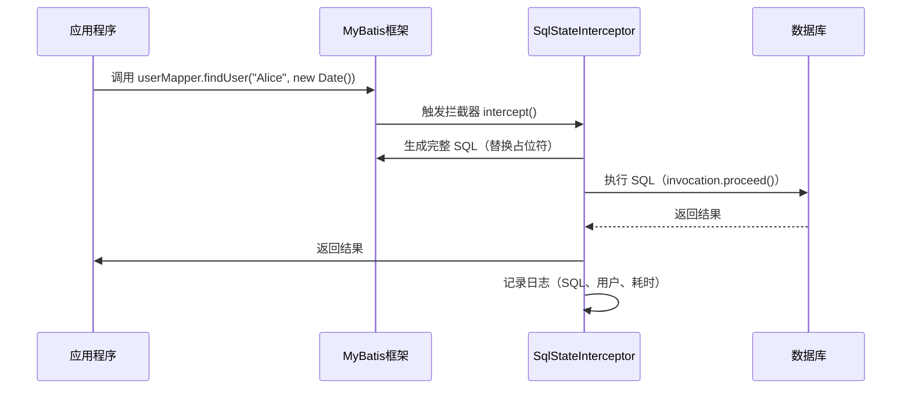

技术派

- https://www.javaxing.com/2024/01/30/SpringBoot%E5%AE%9E%E7%8E%B0%E5%A4%9A%E6%95%B0%E6%8D%AE%E6%BA%90%E5%88%87%E6%8D%A2%E7%9A%84%E5%A4%9A%E7%A7%8D%E6%96%B9%E6%B3%95/index.html
- https://www.cnblogs.com/xfeiyun/p/16185740.html

