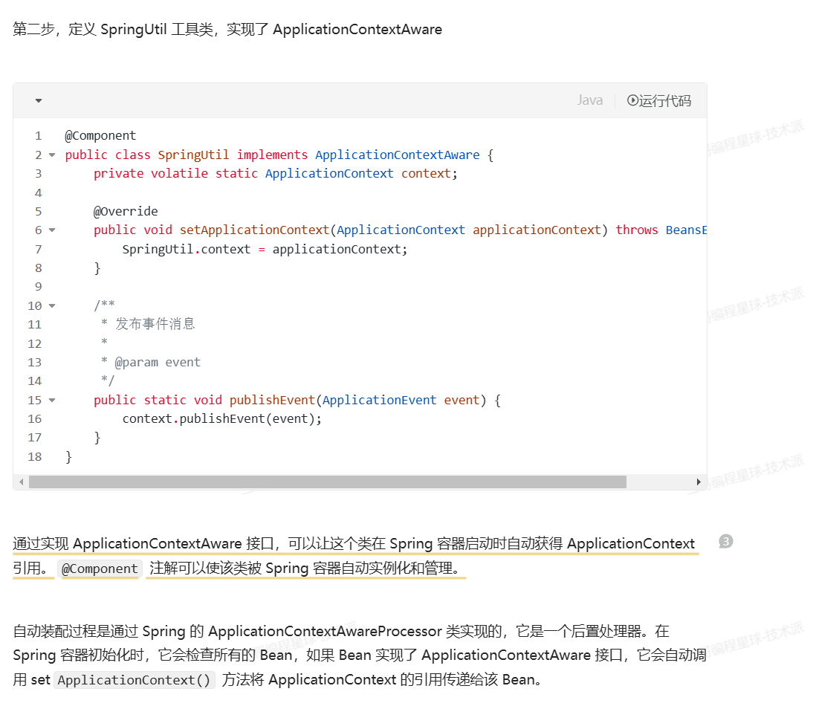

[toc]


# Spring的事件监听

- https://www.shell101.com/framework/springboot/sprongboot%E4%BA%8B%E4%BB%B6%E7%9B%91%E5%90%AC%E5%AE%9E%E8%B7%B5.html#%E4%BB%A3%E7%A0%81%E5%AE%9E%E7%8E%B0


# SpringBoot事件监听器实践，实现代码解耦(同步异步)

### [前言](https://www.shell101.com/framework/springboot/sprongboot事件监听实践.html#前言)

SpringBoot事件监听器(Event Listener)是一种机制，用于响应应用程序内部发生的特定事件。事件监听器模式允许开发者在应用程序的某个部分发生特定事件时，执行一些操作或处理逻辑。

我们在开发过程中可能会遇到当一个行为完成后，要触发一个或者多个其他行为，此时事件监听器模式就很好的处理了这样的场景，并且实现了代码解耦。

例如，你可能想要在用户登录成功后执行一些额外的操作，比如计算用户积分，或者给他的粉丝发送消息，或者在应用程序启动时进行一些初始化设置。通过使用事件监听器，你可以在不修改原有代码逻辑的情况下，灵活地添加这些额外的功能。

### [事件监听器实现--同步](https://www.shell101.com/framework/springboot/sprongboot事件监听实践.html#事件监听器实现-同步)

Spring Boot 事件监听器的实现通常涉及到以下几个步骤：

1. **定义事件**：创建一个继承自 `ApplicationEvent` 的类，表示你想要监听的事件类型。
2. **创建监听器**：实现 `ApplicationListener` 接口或使用 `@EventListener` 注解的方法，来定义当事件被触发时应该执行的操作。
3. **发布事件**：在应用程序的适当位置，使用 `ApplicationEventPublisher` 发布你定义的事件。
4. **注册监听器**：确保你的监听器被 Spring 容器管理，这样 Spring Boot 就可以自动检测并注册它们。

使用事件监听器可以提高应用程序的模块化和可扩展性，使得代码更加清晰和易于维护。

### [代码实现](https://www.shell101.com/framework/springboot/sprongboot事件监听实践.html#代码实现)

**1、定义自定义事件类**


```
@Getter
public class MyCustomEvent extends ApplicationEvent {

    private String message;

    public MyCustomEvent(Object source, String message) {
        super(source);
        this.message = message;
    }

}
```

这里的事件类，采用的是继承了`org.springframework.context.ApplicationEvent`,当然也可以不继承，仅使用一个普通的类也是可以的，例如：


```
@Getter
public class MyCustomCommonEvent{

    private String message;

    public MyCustomCommonEvent(String message) {
        this.message = message;
    }

}
```

不过对于事件类，还是推荐进行继承的方式来创建，也是Spring推荐的做法，`ApplicationEvent`类提供了一个构造函数，允许将事件的来源（source）作为参数传递。这可以用于在事件处理逻辑中访问事件的来源对象。

**2、创建监听器（同步）**

监听器的实现有两种方式：

1. 实现`ApplicationListener`接口
2. 使用`@EventListener`注解


```
//1.事件监听器（实现ApplicationListener接口方式）
@Component
public class MyCustomEventListener implements ApplicationListener<MyCustomEvent> {

    @Override
    public void onApplicationEvent(MyCustomEvent event) {
        String message = event.getMessage();
        System.out.println("Interface Received custom event - " + message);
        // 这里可以添加更多的处理逻辑
    }
}
```

或者


```
//2. 事件监听器（注解方式）
@Component
public class MyCustomEventAnnotationListener {

    @EventListener
    public void handleEvent(MyCustomEvent event) {
        String message = event.getMessage();
        System.out.println("Annotation Received custom event - " + message);
        // 这里可以添加更多的处理逻辑
    }
}
```

**3、发布事件**

在应用程序的适当位置，使用`ApplicationEventPublisher`发布事件


```
@Component
public class EventPublisher {

    @Autowired
    private ApplicationEventPublisher applicationEventPublisher;

    public void publishEvent(String message) {
        MyCustomEvent myCustomEvent = new MyCustomEvent(this, message);
        System.out.println("Event published: " + message);
        applicationEventPublisher.publishEvent(myCustomEvent);
    }
}
```

**4、注册监听器**

确保你的监听器被Spring容器管理。在上面的示例中，我们使用了`@Component`注解来自动注册监听器。

**5、测试**


```
@SpringBootTest
class SpringbootEventDemoApplicationTests {

    @Autowired
    private EventPublisher eventPublisher;
    @Autowired
    private EventCommonPublisher eventCommonPublisher;

    @Test
    void contextLoads() {
        eventPublisher.publishEvent("Hello！This is a event!");
    }

}
```

结果输出：


```
结果输出：
Event published: Hello！This is a event! threadName: main
Interface Received custom event - Hello！This is a event! threadName: main
Annotation Received custom event - Hello！This is a event! threadName: main
```

到此我们完成了事件监听器同步的方式实现，默认下SpringBoot事件监听器是同步执行的，其实刚才测试中的事件还是在一个线程中完成, 我们将线程名字打印出来，可以看到都是在主线程中执行的。

### [事件监听器实现--异步](https://www.shell101.com/framework/springboot/sprongboot事件监听实践.html#事件监听器实现-异步)

SpringBoot也提供了异步的事件监听处理方式。通过给事件监听器方法添加`@Async`注解来处理事件，从而不会阻塞主线程。此外，还需要在应用程序的启动类上添加`@EnableAsync`注解来开启异步执行器功能。

**1、创建监听器（异步）**


```
@Component
public class MyCustomEventAnnotationListener {

    @Async
    @EventListener
    public void handleEvent(MyCustomEvent event) {
        String message = event.getMessage();
        System.out.println("Annotation Received custom event - " + message + " threadName: " + Thread.currentThread().getName());
        // 这里可以添加更多的处理逻辑
    }
}
```

在类或者方法上加上`@Async`注解来实现异步处理

**2、启动类增加@EnableAsync开启异步**


```
@SpringBootApplication
@EnableAsync
public class SpringbootEventDemoApplication {

    public static void main(String[] args) {
        SpringApplication.run(SpringbootEventDemoApplication.class, args);
    }

}
```

**3、测试**


```
结果输出：
Event published: Hello！This is a event! threadName: main
Annotation Received custom event - Hello！This is a event! threadName: task-2
Interface Received custom event - Hello！This is a event! threadName: task-1
```

此时看到三个执行代码在三个线程中执行，不会阻塞，完成了异步方式。

**加餐**

如果监听器想有序执行如何处理呢？比如一个复杂的事件处理链中，监听器的执行或者调度顺序要指定怎么处理？很多小伙伴应该想到了，Spring框架中的`@Order`或`@Priority`注解可以用来指定监听器的执行顺序。


```
@Async
@Component
@Order(999)
public class MyCustomEventListener implements ApplicationListener<MyCustomEvent> {

    @Override
    public void onApplicationEvent(MyCustomEvent event) {
        String message = event.getMessage();
        System.out.println("Interface Received custom event - " + message + " threadName: " + Thread.currentThread().getName());
        // 这里可以添加更多的处理逻辑
    }
}

@Component
@Order(1)
public class MyCustomEventAnnotationListener {

    @Async
    @EventListener
    public void handleEvent(MyCustomEvent event) {
        String message = event.getMessage();
        System.out.println("Annotation Received custom event - " + message + " threadName: " + Thread.currentThread().getName());
        // 这里可以添加更多的处理逻辑
    }
}
```

注意，`@Order`注解的值越小，监听器的优先级越高，将越先执行。如果你不使用`@Order`注解，Spring将按照它们被检测到的顺序来调用监听器，这通常是按照它们被定义的顺序。

### [总结](https://www.shell101.com/framework/springboot/sprongboot事件监听实践.html#总结)

使用事件监听的方式有很多好处，但也会引入一些问题。

使用事件的好处：

1. **解耦**：事件驱动架构允许应用程序的不同部分之间保持松散耦合。生产者和消费者之间不需要直接通信，它们通过事件进行交互，这有助于降低系统的复杂性。
2. **灵活性**：事件系统提供了一种灵活的方式来响应应用程序中的状态变化。开发者可以定义和使用事件来触发特定的行为，而不需要修改现有的代码。
3. **扩展性**：随着应用程序的增长，事件系统可以很容易地扩展。新的事件监听器可以被添加到系统中，以响应新类型的事件，而不需要对现有代码进行重大更改。
4. **异步处理**：事件可以被设计为异步处理，这有助于提高应用程序的响应性，应用程序可以在不阻塞主线程的情况下执行长时间的任务。
5. **模块化**：事件系统促进了模块化设计。不同的模块可以独立地响应事件，从而使得应用程序更容易维护和测试。
6. **重用性**：事件监听器可以被设计为通用的组件，可以被多个事件触发，从而增加了代码的重用性。

使用事件的弊端：

1. **复杂性**：对于简单的应用程序，引入事件系统可能会增加不必要的复杂性。对于这些情况，直接的方法调用可能更简单、更直观。
2. **调试困难**：由于事件可能在应用程序的多个地方被触发，跟踪事件的流动和确定事件的来源可能会比较困难，这使得调试变得更加复杂。
3. **性能开销**：事件系统可能会引入额外的性能开销，尤其是在事件处理逻辑复杂或事件频繁触发的情况下。
4. **数据一致性**：在事件驱动的系统中，确保数据的一致性可能更加困难，因为事件的消费者可能在不同的时间点响应相同的事件。
5. **顺序依赖**：如果事件处理依赖于特定的顺序，那么在异步环境中管理这种顺序可能会变得复杂。
6. **资源消耗**：如果事件监听器执行的是资源密集型操作，可能会消耗大量的系统资源，尤其是在高频率事件触发的情况下。
7. **过度使用**：如果过度使用事件，可能会导致应用程序逻辑分散在多个监听器中，这可能会使应用程序的流程变得难以追踪和理解。

总的来说，事件系统是一种强大的设计模式，可以在适当的场景下提供很多好处。然而，它们也带来了一些挑战，需要谨慎使用以避免潜在的问题。

### [完整代码](https://www.shell101.com/framework/springboot/sprongboot事件监听实践.html#完整代码)

完整代码：[GitHub](https://github.com/codeagles/springboot-demo)


# 技术派代码解释



解释：

### 1. **`ApplicationContextAware` 接口**

`ApplicationContextAware` 是 Spring 提供的一个接口，它的作用是让一个类能够在 Spring 容器启动时获取到 `ApplicationContext` 的引用。

- `ApplicationContext` 是 Spring 框架中最核心的接口之一，代表了整个 Spring 容器。它用于管理应用中的所有 Bean 对象，并提供很多与容器相关的功能，比如加载 Bean、发布事件、获取环境变量等。

当一个类实现了 `ApplicationContextAware` 接口时，Spring 容器会自动调用该类的 `setApplicationContext(ApplicationContext applicationContext)` 方法，并将当前的 `ApplicationContext` 作为参数传入。这样，该类就可以在运行时访问到 Spring 容器。

#### 举个例子：

```
java复制编辑import org.springframework.context.ApplicationContext;
import org.springframework.context.ApplicationContextAware;
import org.springframework.stereotype.Component;

@Component
public class MyBean implements ApplicationContextAware {
    private ApplicationContext context;

    // Spring 会自动调用这个方法，并把当前的 ApplicationContext 传给它
    @Override
    public void setApplicationContext(ApplicationContext applicationContext) {
        this.context = applicationContext;
    }

    public void doSomething() {
        // 通过 context 访问容器中的其他 Bean
        MyOtherBean otherBean = context.getBean(MyOtherBean.class);
        otherBean.doWork();
    }
}
```

在这个例子中，`MyBean` 实现了 `ApplicationContextAware` 接口，Spring 会自动把当前的 `ApplicationContext` 注入到 `setApplicationContext()` 方法中。这样，`MyBean` 就可以在它的方法中访问 Spring 容器中的其他 Bean（例如 `MyOtherBean`）。

### 2. **`@Component` 注解**

`@Component` 注解是 Spring 的一种标记注解，用于将类声明为一个 Spring 管理的 Bean。当你在类上加上 `@Component` 注解后，Spring 会自动将该类的实例创建并管理到 Spring 容器中。

- 这样，Spring 就可以在整个应用程序中自动创建并管理这个类的实例，而不需要手动创建。

举个简单的例子：

```
java复制编辑import org.springframework.stereotype.Component;

@Component
public class MyService {
    public void performTask() {
        System.out.println("Task is being performed.");
    }
}
```

当 Spring 容器启动时，它会自动扫描类路径中所有带有 `@Component` 注解的类，并将它们自动注册为 Bean。因此，`MyService` 类的实例就会被创建并放入 Spring 容器中，可以被其他类访问和使用。

### 3. **结合 `@Component` 和 `ApplicationContextAware`**

当你将 `@Component` 注解和 `ApplicationContextAware` 接口结合使用时，Spring 会自动实例化该类，并且自动注入当前的 `ApplicationContext` 到这个类中。

所以，当你写 `@Component` 注解时，Spring 会：

1. 自动实例化该类。
2. 自动调用 `setApplicationContext()` 方法，将 `ApplicationContext` 注入到该类中。

#### 举个实际例子：

```
java复制编辑import org.springframework.context.ApplicationContext;
import org.springframework.context.ApplicationContextAware;
import org.springframework.stereotype.Component;

@Component
public class SpringUtil implements ApplicationContextAware {
    private static ApplicationContext context;

    @Override
    public void setApplicationContext(ApplicationContext applicationContext) {
        SpringUtil.context = applicationContext;
    }

    public static ApplicationContext getContext() {
        return context;
    }
}
```

在这个例子中，`SpringUtil` 是一个 `@Component` 类，Spring 会自动将 `SpringUtil` 注册到容器中，并且在容器启动时，通过实现 `ApplicationContextAware` 接口，自动注入 `ApplicationContext`。`SpringUtil` 类就可以通过静态方法 `getContext()` 来访问 Spring 容器的上下文。

### 总结

- **`ApplicationContextAware`**：让类能够在 Spring 容器启动时自动获得 `ApplicationContext` 引用，这样你就可以在该类中访问 Spring 容器，获取其他 Bean 或执行容器相关操作。
- **`@Component`**：将类标记为 Spring 容器中的一个 Bean，Spring 会自动管理类的生命周期，创建实例并注入依赖。

这两个特性结合使用，可以方便地获取容器上下文，并通过容器管理的 Bean 来实现应用逻辑。


# 参考文献

- <https://www.cnblogs.com/xfeiyun/p/17610953.html>
- <https://blog.csdn.net/reinsunshine/article/details/126094351>
- <https://www.cnblogs.com/caicz/p/17301782.html>
- <https://blog.csdn.net/hxf_yxh/article/details/134991159>