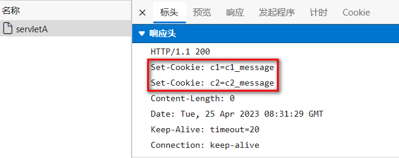
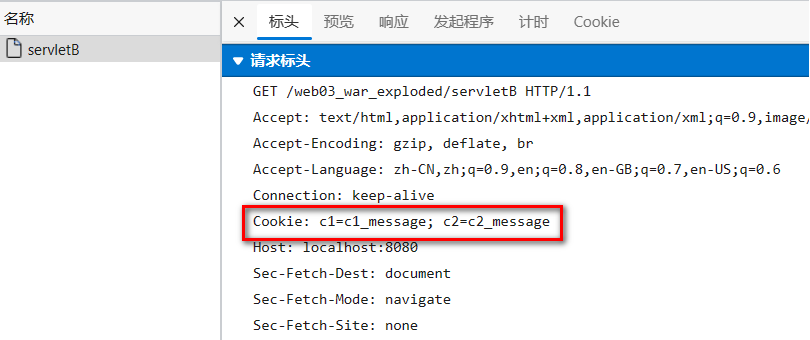
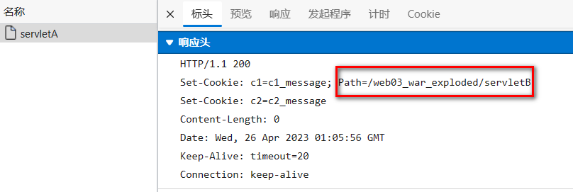
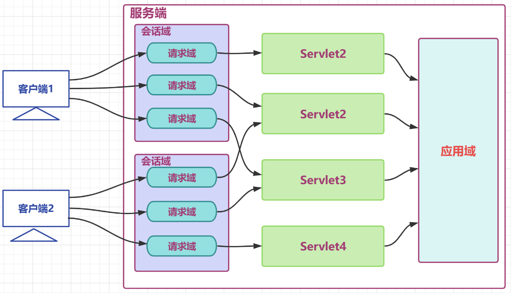

# 会话管理与会话跟踪技术：Cookie、Session 和 Token 的奥秘


[toc]

在浏览网站的过程中，经常会遇到需要登录的情况，有些页面只有登录之后才可以访问。在登录之后可以连续访问很多次网站，但是有时候过一段时间就需要重新登录。还有一些网站，在打开浏览器时就自动登录了，而且在很长时间内都不会失效，这又是什么情况？其实这里面涉及Cookie、Session以及token等相关知识，现在就来揭开它们的神秘面纱。


# 1 身份认证与授权

- 在 Web 应用中，服务器需要区分不同用户，以提供个性化服务，例如：
    - 购物网站要知道「你是谁」，才能展示你的购物车内容。
    - 银行系统必须确认「你是你自己」，才能允许你访问账户信息。
    - 企业内部系统需要识别员工身份，分配不同权限。

- 要实现这些功能，就必须有 **身份认证（Authentication）** 和 **授权（Authorization）** 机制。

## 1.1 什么是认证（Authentication）

- **认证（AuthN, Authentication）** 主要用于 **验证用户的身份**，即 **证明“你是你自己”**。


- **日常生活中的认证：**

    -  **指纹/人脸识别**：上班打卡时，系统验证你的指纹是否匹配。

    - **刷身份证**：进入机场或车站，需要出示身份证进行身份核验。

- **互联网中的认证方式：**

    - **用户名+密码**（最常见）

    - **邮箱验证**（发送验证码或登录链接）

    - **手机验证码**（短信登录）

    - **第三方登录**（微信、GitHub、Google 授权登录）


## 1.2 什么是授权（Authorization）

- **授权（AuthZ, Authorization）** 是指 **用户授予某个系统或应用访问特定资源的权限**。


- **现实生活中的授权：**

    - 你安装某个 APP 时，APP 可能会请求访问你的相册、麦克风、地理位置等权限。

    - 你用微信登录某个小程序时，它会询问是否允许获取你的头像、昵称等信息。

- **互联网中的授权方式：**

    - **基于 Cookie / Session**（传统方案）

    - **基于 Token**（JWT、OAuth 等）

    - **OAuth 认证**（第三方授权，如 Google、微信登录）

## 1.3 什么是凭证（Credentials）

- **实现认证和授权的前提是需要一种媒介/证书来标记访问者的身份，这个东西就是凭证**
- **现实世界的凭证：**
    - **身份证**：证明你的身份，允许你办理各种业务。
    - **银行卡**：证明你的账户，允许你消费、转账。

- **互联网中的凭证：**

    - **Cookie**（浏览器存储的小型身份标识）

    - **Session ID**（服务器端存储的会话信息）

    - **Token（令牌）**（用于无状态身份认证）

- 举例解释：在互联网应用中，一般网站（如掘金）会有两种模式，游客模式和登录模式。
    - 游客模式下，可以正常浏览网站上面的文章，一旦想要点赞/收藏/分享文章，就需要登录或者注册账号。
    - 当用户登录成功后，服务器会给该用户使用的浏览器颁发一个**Token**（令牌），这个令牌用来表明你的身份，每次浏览器发送请求时会带上这个令牌，就可以使用游客模式下无法使用的功能。

# 2 会话管理概述

- 在上面，我们提到，用户在成功认证后，服务器通常会颁发 **Cookie** 、 **Session ID**或**Token** 来表示用户身份。但仅仅颁发凭证是不够的，**服务器还需要在多次请求之间维持用户的身份信息**，否则每次请求都需要重新认证，用户体验会变得极差。

- 但是，**HTTP 是无状态协议**，服务器默认不会记住之前的请求。因此，我们需要 **会话管理** 来维护用户的身份状态，让用户在一段时间内无需重复登录。

- **举个例子**：

    - 你在某个网站（比如京东）登录成功后，关闭了当前页面，几分钟后重新打开该网站，你仍然是登录状态，不需要重新输入账号密码。

    - 这是因为服务器在 **你的登录请求和后续请求之间维持了一个会话（Session）**，能够识别你的身份。

- 因此，**会话管理是身份认证的重要补充部分**，确保用户登录后能够持续使用系统，而不用每次都重新认证。

## 2.1 HTTP的无状态协议

- **HTTP无状态协议**是指该协议对事件的处理过程没有记忆能力，当后续的步骤需要上一步的信息时，则需要重传，即需要携带上一次的信息。因此，对于存在依赖性的访问请求，则下一次的传递需要携带上一次传递的信息，依次不断的叠加，会导致传输的信息量会越来越大，服务器响应较慢。


- 在90年代，浏览器刚出现的时候，它的作用也仅仅是浏览一些文本而已，**彼此之间不存在依赖关系（在后面的学习中，我们把这种依赖关系理解为会话）**。因此，服务器不需要做任何的记录，浏览器请求什么，服务器就返回什么，彼此之间清清楚楚，不存在任何的爱恨情仇，双方的关系非常的融洽。

- 随着技术的发展，特别是当客户端与服务器进行动态交互的Web应用程序出现之后，HTTP的无状态特征严重影响了这类Web应用程序，Web应用的交互是双向，需要承前启后的，总不能每次都失忆。如简单的购物车程序也要知道用户到底在之前选择了什么商品，总不能所有用户都使用一个购物车吧，所以需要把每个用户都区分开，服务器需要记录每个用户的会话，又因为HTTP是无状态的，那么就要想办法为每个用户保持一个会话。

- 因此市面上出现了两种保持HTTP连接状态的技术：`Cookie`和`Session`。Cookie是客户端保持HTTP会话状态的技术，而Session是服务端保持HTTP会话状态的技术；通常情况下，这两种技术是结合使用的。今天毛毛张将介绍Cookie、Session，并针对它们的不足，学习Token的原理与使用。

## 2.2 什么是会话？

- 在我们日常生活当中，会话指的就是谈话、交谈。**在web开发当中，会话指的就是浏览器与服务器之间的一次连接，我们就称为一次会话**。

- **注意：**

    - 在用户打开浏览器第一次访问服务器的时候，这个会话就建立了，直到有任何一方断开连接，此时会话就结束了。
    - 在一次会话当中，是可以包含多次请求和响应的。

- **举例解释：** 打开了浏览器来访问web服务器上的资源（浏览器不能关闭、服务器不能断开），以京东为例，只要浏览器和服务器都没有关闭，以下3次请求都属于一次会话当中完成的

    - 第1次：访问的是登录的接口，完成登录操作

    - 第2次：访问的是商品展示接口，查询所有相关商品数据

    - 第3次：访问的是购物车接口，查询购物车数据

- **会话的特点：**
    - 会话是和**浏览器**关联的，不同浏览器的请求属于不同的会话。
    - 同一个浏览器，在未关闭前的多次请求都属于同一个会话。
    - 关闭浏览器后，会话结束；关闭服务器，则所有会话都结束。

## 2.3 什么是会话跟踪？

- **会话跟踪：**一种维护浏览器状态的方法，服务器需要识别多次请求是否来自于同一浏览器，以便在同一次会话的多次请求间共享数据。
    - **详细解释：** 服务器会接收很多的请求，但是服务器是需要识别出这些请求是不是同一个浏览器发出来的。比如：1和2这两个请求是不是同一个浏览器发出来的，3和5这两个请求不是同一个浏览器发出来的。如果是同一个浏览器发出来的，就说明是同一个会话。如果是不同的浏览器发出来的，就说明是不同的会话。而识别多次请求是否来自于同一浏览器的过程，这就称为会话跟踪。

- **会话跟踪的目的**：我们使用会话跟踪技术就是要完成在同一个会话中，多个请求之间进行共享数据，让用户在一段时间内无需重复认证。
- 为什么需要共享数据呢？：由于HTTP是无状态协议，在后面请求中怎么拿到前一次请求生成的数据呢？此时就需要在一次会话的多次请求之间进行数据共享。

- 无状态就是不保存状态，即无状态协议(stateless)，HTTP协议自身不对请求和响应之间的通信状态进行保存，也就是说，在HTTP协议这个级别，协议对于发送过的请求或者响应都不做持久化处理
    - 简单理解：浏览器发送请求，服务器接收并响应，但是服务器不记录请求是否来自哪个浏览器，服务器没记录浏览器的特征，就是客户端的状态
    - “无状态” 的含义：默认情况下 HTTP 协议的客户端和服务器之间的这次通信，和下次通信之间没有直接的联系。
    - 举例解释：张三去一家饭馆点了几道菜,觉得味道不错,第二天又去了,对老板说,还点上次的那几道菜
        - 无状态: 老板没有记录张三是否来过,更没有记录上次他点了那些菜,张三只能重新再点一遍
        - 有状态: 老板把每次来吃饭的用户都做好记录,查阅一下之前的记录,查到了张三之前的菜单,直接下单

## 2.4 会话跟踪技术

- 在 Web 开发中，由于 HTTP 是无状态协议，每次请求都是独立的，服务器无法自动识别用户身份。因此，需要通过**会话跟踪技术**来维持用户的登录状态和交互信息，**主要有以下几种方式：**
- Cookie 技术（客户端存储）
    - **原理**：服务器向客户端发送一个小型数据（Cookie），客户端存储后，在后续请求中自动携带该数据，服务器根据 Cookie 识别用户身份。
    - 特点：由客户端（浏览器）存储，易受篡改，安全性较低。适用于简单的身份标识，例如“记住我”功能。
- Session 技术（服务器存储）

    - **原理**：服务器在内存或数据库中维护用户会话数据，并分配一个 Session ID，客户端通过 Cookie 或 URL 传递该 ID，服务器根据 Session ID 识别用户身份。

    - 特点：由服务器管理，安全性更高。适用于需要存储较多用户信息的场景。
- Token 认证（无状态身份验证）

    - **原理**：服务器颁发 Token（通常是 JWT），用户每次请求时携带该 Token，服务器解析后确认身份，无需存储会话状态。

    - 特点：服务器无状态，适合分布式系统和微服务架构。常见于 API 认证，如 OAuth、JWT 方案。


# 3 Cookie技术

- **HTTP 是无状态协议，对事务处理无记忆能力，每次请求都是独立的，服务器无法自动识别用户身份，也难以判断多个请求是否来自同一客户端。这意味着，如果没有额外的机制，用户每次访问网页都需要重新登录，严重影响用户体验。**

- 为了解决这一问题，需要一种 **会话跟踪** 机制，使服务器能够识别用户的连续请求是否来自同一个浏览器。为此，**Cookie 诞生了**。Cookie 是存储在浏览器中的小型数据，服务器在响应请求时向客户端发送 Cookie，客户端在后续请求时会自动携带该 Cookie，从而让服务器识别用户身份。这种机制就像给用户分配了一张“通行证”，每次访问时都携带它，服务器便能确认用户的身份。

- 从本质上讲，**Cookie 仅仅是一种浏览器提供的数据存储功能，它不会主动与服务器通信，而是由浏览器在请求时自动附带**。由于 Cookie 的数据保存在客户端，它属于 **客户端会话技术**，用于在一定时间内维持用户的身份信息，实现状态管理。

- 官方的定义：Cookie是保存在客户端浏览器中的文本文件（key-value形式），这个文件与访问的特定的Web页面(文档)关联在一起，并且保存在本地的客户端中，Cookie 最根本的用途是帮助 Web 站点保存有关访问者的信息。
  - 举例：当客户端浏览器访问服务端时，服务端会记录每个用户的访问信息并以`Cookie文件`的形式保存在客户端，当用户再次访问服务端的特定页面时，服务端会首先检查客户端携带的Cookie中的用户身份信息，从而保持了会话的进行。


## 2.1 Cookie概述

- 在计算机领域，“Cookie” 通常译为 “会话跟踪文件”“浏览器缓存文件”，但最常见的译法是 “（网络）Cookie” 或 “（网络）信息记录块” Cookies中文名称为小型文本文件，指某些网站为了辨别用户身份而储存在用户本地终端（Client Side）上的数据（通常经过加密）。它满足RFC6265标准。 
- **Cookie 存储在客户端：**Cookie 是服务器发送到用户浏览器并保存在本地的一小块数据，它会在浏览器下次向同一服务器再发起请求时被携带并发送到服务器上，服务器检查该`Cookie`，以此来辨认用户状态。因此，服务端脚本就可以读、写存储在客户端的Cookie的值。
- **注意**：`Cookie`功能需要浏览器的支持。如果浏览器不支持`Cookie`（如大部分手机中的浏览器）或者把`Cookie`禁用了，`Cookie`功能就会失效。不同的浏览器采用不同的方式保存`Cookie`。`IE`浏览器会以文本文件形式保存，一个文本文件保存一个`Cookie`。
- **Cookie 是不可跨域的：**  
    - 它绑定在特定域名下，无法在其他域名获取使用，只能在该域名及其子域（二级域名）下生效。根据`Cookie`规范，浏览器访问`Google`只会携带`Google`的`Cookie`，而不会携带`Baidu`的`Cookie`
    - 不过，同域名不同端口是可以共享 Cookie 的，而一级域名与子域（二级域名）间能共享则依赖于 Cookie 的 domain 属性，这种机制既保障了网络安全，也能满足业务在不同域名下共享用户信息等需求。

- **下面通过浏览器中的Cookie来真实查看感受一下Cookie是怎么样的，下面毛毛张以查看CSDN官网为例展示如何查看Cookie**

  - **首先打开CSDN首页：https://www.csdn.net/?spm=1001.2100.3001.4476**

  - **然后按F12键打开浏览器控制台，选择应用，就会进入如下图所示的界面了**


> 图片中的Cookie包含很多值，下面毛毛张就来一一介绍这些组成的含义

## 2.2 Cookie的组成

- **name(名称)=value(值)**：键值对，该属性是设置Cookie的名称及相对应的值，都必须是字符串类型（name不区分大小写），该值通常是保留在Cookie中的用户信息。对于认证Cookie，Value值包括Web服务器所提供的访问令牌
  - 如果值为 Unicode 字符，需要为字符编码。 

  - 如果值为二进制数据，则需要使用Base64编码。

- **Expires：** 该属性是设置Cookie的生存周期，采用 GMT 时间格式，当浏览器端本地的当前时间超过这个时间时，Cookie 便会失效。
  - 若客户端和服务器时间不一致，使用 expires 就可能存在偏差。 
  - 一般浏览器的 cookie 都是默认储存的，关闭浏览器结束会话时，部分设置了该属性的 Cookie 可能会被删除。  
  - 格式如：expires=Wed, 21 Oct 2015 07:28:00 GMT。
  - 在默认情况下，Cookie是临时存在的。
  - 当一个浏览器窗口打开时，可以设置Cookie，只要该浏览器窗口没有关闭，Cookie就一直有效，而一旦浏览器窗口关闭后，Cookie也就随之消失。
  - 如果想要cookie在浏览器窗口之后还能继续使用，就需要为Cookie设置一个生存期。所谓生存期也就是Cookie的终止日期，在这个终止日期到达之前，浏览器都可以读取该Cookie。一旦终止日期到达之后，该cookie将会从cookie文件中删除。

- **Max-Age**：Cookie 存活时间，单位为秒。 
  - 若为正数，则该 Cookie 在 Max-Age 秒后失效。  
  - 若为负数，该 Cookie 为临时 Cookie，关闭浏览器即失效，浏览器也不会以任何形式保存。  
  - 若为 0，表示删除该 Cookie。默认为 -1，且优先级高于 expires。

- **Path属性**：定义了Web站点上可以访问该Cookie的`目录`；用于限制 Cookie 在部分路径下生效，指的是网站的路由。
  - 默认的 path=/，即在所有路径下生效。 设置为`"/"`表示允许当前域名下的所有路径都可以使用该Cookie。
  - 若设置为 path=/abc，则只在 /abc 路径下生效，如jzplp.com/abc、jzplp.com/abc/def可访问到该 Cookie，而jzplp.com、jzplp.com/qaz、jzplp.com/qaz/abc则无法访问。

- **Domain属性**：指定了可以访问该 Cookie 的 `Web 站点`或`域`，默认为当前域。Cookie 生效的域名，即 Cookie 在哪个网站生效
  - 如当前域是www.simon.item，那么它的子域www.simon.item.count共享父域的Cookie，对于不同的域或者平行域则无法共享该Cookie。
  - 例如在a.jzplp.com下设置的 Cookie，就只在这个域名下生效。但设置了 domain=jzplp.com，则该 Cookie 可在jzplp.com下的任何域名内生效，如jzplp.com、a.jzplp.com、b.jzplp.com。  
  - domain 只能设置为当前服务器的域。

- **Secure属性**：`secure`是 cookie 的安全标志，指定是否使用`HTTPS`安全协议发送Cookie。该 Cookie 是否仅被使用安全协议传输，安全协议有 HTTPS、SSL 等，在网络上传输数据前先将数据加密，默认为 false。  
  - 当 Secure 值为 true 时，Cookie 在 HTTP 中无效，仅在 HTTPS 中有效。

- **HTTPOnly 属性**：用于防止客户端脚本通过`document.cookie`属性访问Cookie，有助于保护Cookie不被跨站脚本攻击窃取或篡改。
  - 若给某个 Cookie 设置了 HttpOnly 属性，则无法通过 js 读写该 Cookie 的信息，但可在 Application 中手动修改，在一定程度上可防止 CSRF 攻击，但并非绝对安全。

- **SameSite**：用于设置是否允许跨站请求时发送 Cookie。
- **Priority**：当 Cookie 的数量超过限制时，会清除一部分 Cookie，该属性用来定义 Cookie 的优先级，低优先级的 Cookie 会优先被清除，有 Low、Medium、High 三种。

## 2.3 Cookie工作原理

> 下面毛毛张将通过登陆为例来介绍一下Cookie的工作原理

- 当用户第一次访问并登录一个网站时，Cookie 的设置与发送过程包括以下四个步骤：
  1. **客户端发起请求**：客户端发送请求数据。此时，客户端（浏览器）尚未存储该网站的 Cookie，因此 HTTP 请求头中**不包含** `Cookie` 字段。请求可能包含表单数据（如用户名、密码）或其他认证信息。
  2. **服务端生成并发送 Cookie**：服务端验证用户凭证。如果用户名和密码匹配，服务端会生成一个Cookie对象（需要自己**new**出来），并将其放入响应对象中（例如HttpServletResponse），发送一个 HTTP 响应。Tomcat 容器将 Cookie 转换为 `Set-Cookie` 响应头，并返回给客户端。如果有多个 Cookie，会使用多个 `Set-Cookie` 头。
  3. **客户端保存 Cookie 并发送请求**：客户端保存 Cookie。之后，每次向服务器发送请求时，客户端会根据之前收到的 `Set-Cookie` 响应头，在请求中携带该 Cookie。浏览器会在本地硬盘查找与该 URL 相关的 Cookie。如果该 Cookie 存在（且未过期），浏览器会将其添加到 `request header` 的 `Cookie` 字段中，并随 `http 请求` 一起发送到服务器。服务器的 HTTP 请求中会包含一个 Cookie 头部，进而判断用户是否已登录，并根据登录状态进行相应处理。
  4. **服务端返回响应数据**：服务端根据客户端的请求，进行处理并返回响应数据。


- **注意：** 
  - Cookie 被添加到 `request header` 中是浏览器的默认行为，存储在 Cookie 中的数据会被浏览器「自动」每次放入 HTTP 请求中。过多的 Cookie 信息会增加网络流量，因此，我们需要谨慎决定哪些数据应放入 Cookie，通常用于存储身份验证信息。
  - Cookie是一种键值对格式的数据，从Tomcat8.5开始可以保存中文，但是不推荐

## 2.4 Cookie详解

+ 服务端设置Cookie方式：
  + **开发者显式创建对象**：在服务端代码中（如 Java Servlet），需主动实例化 `Cookie` 对象，设置名称、值及属性（有效期、作用域等）。
  + **容器隐式协议转换**：服务器容器（如 Tomcat）将开发者定义的 `Cookie` 对象自动转换为符合 HTTP 标准的 `Set-Cookie` 响应头，无需手动拼接格式，然后返回给客户端；如果存在多个Cookie，每个 Cookie 都会通过一个单独的 `Set-Cookie` 头发送，并且每个 Cookie 的属性独立生效，互不影响。

- **客户端设置Cookie方法**：通过 JavaScript 逐条设置（每次仅操作一个 Cookie）

  ```javascript
  // 基础设置（仅名称+值）
  document.cookie = "user=alice;";
  
  // 带属性和作用域限制
  document.cookie = "lang=zh; expires=Sat, 08 Aug 2026 12:00:00 GMT; domain=.example.org; path=/docs; secure";
  ```

- **注意事项：**
  - **传输内容**：仅 `name=value` 会通过请求头的 `Cookie` 字段发送至服务端，其他属性（如 `expires`、`path`）仅用于客户端行为控制。
  - **Cookie属性分隔**：属性间统一使用 `; `（分号+空格）分隔，如 `domain=.example.com; path=/; secure`。
  - Cookie数量限制：每个域的Cookie总数是有限的，不同浏览器之间各有不同。RFC 2965标准不允许浏览器保存超过300个Cookie，为每个Web服务器保存的Cookie数不能超过20个（是对整个服务器而言，而不仅仅指服务器上的页面和站点），而且，每个Cookie保存的数据不能超过4KB。实际上，现代浏览器允许Cookie总数超过300个，但是部分浏览器对单个Cookie大小仍然有4KB的限制。如Firefox限制每个域最多50个cookie，IE限制50个，Chrome对于每个域的Cookie数量没有规定
  - Cookie大小限制：大多数浏览器限制Cookie的大小为4KB

+ **上面介绍过Cookie是存储在客户端的数据，比较容易暴露，一般不存储一些敏感或者影响安全的数据**
  + **如果用Cookie来做登陆认证**：一般来说不会在用户登陆后将用户的用户名和密码设置到 Cookie 中，从而直接在请求头拿到用户名和密码，然后去判断用户是否登陆，这些信息过于敏感，暴露出来十分危险。**通常情况下，正确的做法应该是不管用户是否登录，都应该通过Cookie给用户返回一个标志(通常称为session_id或者token 等)，并需要设置过期时间、HttpOnly、Path等属性值。每次用户请求时，都根据这个标志在服务端去取根据这个标志存在服务端的用户的信息。**

- 由于Cookie的出现可以解决HTTP的无状态，维持会话的正常进行，我们使用Cookie的应用场景通常有以下几种：
  - 购物车（网购）
  - 自动登录（登录账号时的自动登录）
  - 精准广告

## 2.5  Cookie的时效性

> 默认情况下Cookie的有效期是一次会话范围内，我们可以通过cookie的setMaxAge()方法让Cookie持久化保存到浏览器上

-   会话级Cookie
    -   服务器端并没有明确指定Cookie的存在时间
    -   在浏览器端，Cookie数据存在于内存中
    -   只要浏览器还开着，Cookie数据就一直都在
    -   浏览器关闭，内存中的Cookie数据就会被释放
-   持久化Cookie
    -   服务器端明确设置了Cookie的存在时间
    -   在浏览器端，Cookie数据会被保存到硬盘上
    -   Cookie在硬盘上存在的时间根据服务器端限定的时间来管控，不受浏览器关闭的影响
    -   持久化Cookie到达了预设的时间会被释放

> cookie.setMaxAge(int expiry)参数单位是秒，表示cookie的持久化时间，如果设置参数为0，表示将浏览器中保存的该cookie删除

## 2.6 Cookie代码实战

- **下面毛毛张将通过一个登陆案例介绍一下Cookie的用法**

### 2.6.2 Cookie的使用

> servletA向响应中增加Cookie

``` java
@WebServlet("/servletA")
public class ServletA extends HttpServlet {
    @Override
    protected void service(HttpServletRequest req, HttpServletResponse resp) throws ServletException, IOException {
        // 创建Cookie
        Cookie cookie1 =new Cookie("c1","c1_message");
        Cookie cookie2 =new Cookie("c2","c2_message");
        // 将cookie放入响应对象
        resp.addCookie(cookie1);
        resp.addCookie(cookie2);
    }
}
```




> servletB从请求中读取Cookie

``` java
@WebServlet("/servletB")
public class ServletB extends HttpServlet {
    @Override
    protected void service(HttpServletRequest req, HttpServletResponse resp) throws ServletException, IOException {
        //获取请求中的cookie
        Cookie[] cookies = req.getCookies();
        //迭代cookies数组
        if (null != cookies && cookies.length!= 0) {
            for (Cookie cookie : cookies) {
                System.out.println(cookie.getName()+":"+cookie.getValue());
            }
        }
    }
}
```




+ servletA设置一个Cookie为持久化cookie

``` java
@WebServlet("/servletA")
public class ServletA extends HttpServlet {
    @Override
    protected void service(HttpServletRequest req, HttpServletResponse resp) throws ServletException, IOException {
        // 创建Cookie
        Cookie cookie1 =new Cookie("c1","c1_message");
        cookie1.setMaxAge(60);
        Cookie cookie2 =new Cookie("c2","c2_message");
        // 将cookie放入响应对象
        resp.addCookie(cookie1);
        resp.addCookie(cookie2);
    }
}
```


+ servletB接收Cookie,浏览器中间发生一次重启再请求servletB测试

``` java
@WebServlet("/servletB")
public class ServletB extends HttpServlet {
    @Override
    protected void service(HttpServletRequest req, HttpServletResponse resp) throws ServletException, IOException {
        //获取请求中的cookie
        Cookie[] cookies = req.getCookies();
        //迭代cookies数组
        if (null != cookies && cookies.length!= 0) {
            for (Cookie cookie : cookies) {
                System.out.println(cookie.getName()+":"+cookie.getValue());
            }
        }
    }
}
```


### 1.2.3 Cookie的提交路径

> 访问互联网资源时不能每次都需要把所有Cookie带上。访问不同的资源时,可以携带不同的cookie,我们可以通过cookie的setPath(String path) 对cookie的路径进行设置

+ 从ServletA中获取cookie

``` java
public class ServletA extends HttpServlet {
    @Override
    protected void service(HttpServletRequest req, HttpServletResponse resp) throws ServletException, IOException {
        // 创建Cookie
        Cookie cookie1 =new Cookie("c1","c1_message");
        // 设置cookie的提交路径
        cookie1.setPath("/web03_war_exploded/servletB");
        Cookie cookie2 =new Cookie("c2","c2_message");
        // 将cookie放入响应对象
        resp.addCookie(cookie1);
        resp.addCookie(cookie2);
    }
}

```



+ 向ServletB请求时携带携带了 c1


+ 向其他资源请求时就不携带c1了


> 由于Cookie存储信息的大小不仅有限制，而且还存在信息安全问题，因此，必须想办法把一些具体的信息存储到服务端上。因此，Session的出现可以解决这个问题。

# 4 Session技术

## 4.1 Session概述

- **`session`是另一种记录服务器和客户端会话状态的机制**
- **`session`是基于`cookie`实现的，`session`存储在服务器端，`sessionId`会被存储到客户端的`cookie`中**
- `Session`在计算机中被称为`会话控制`。

## 4.2 Session工作原理

- `Session对象`可以存储特定用户会话所需的`属性`及`配置信息`，它通过给不同的用户发送session_id并放在Cookie中，然后具体的数据则是保存在session中。

- **`session`认证流程：**
    - 用户第一次请求服务器的时候，服务器根据用户提交的相关信息，创建对应的 Session

    - 请求返回时将此 Session 的唯一标识 SessionID 返回给浏览器

    - 浏览器接收到服务器返回的 SessionID 后，会将此信息存入到 Cookie 中，同时 Cookie 记录此 SessionID 属于哪个域名

    - 当用户第二次访问服务器的时候，请求会自动把此域名下的 Cookie 信息也发送给服务端，服务端会从 Cookie 中获取 SessionID，再根据 SessionID 查找对应的 Session 信息，如果没有找到说明用户没有登录或者登录失效，如果找到 Session 证明用户已经登录可执行后面操作。

- 根据以上流程可知，**SessionID 是连接 Cookie 和 Session 的一道桥梁**，具体的认证流程图如下图所示，大部分系统也是根据此原理来验证用户登录状态。

    - 第一次登陆

    

    - 第二次登陆：

    

## 4.3 Session时效性

**Session的生命周期**：Session 是由服务器端维护的会话数据，通常与用户的唯一标识符（例如Session ID）相关。Session 数据存储在服务器内存中，而客户端则通过Cookie（通常是 `JSESSIONID`）保存一个标识符（Session ID），该标识符用于跟踪客户端和服务器之间的会话。

- **有效期设置：**
  - **`session timeout`：** 服务器会话的过期时间是由服务器端设置的。这个过期时间通常会在用户无操作或一定时间内没有请求时到期。
  - **默认过期时间：** 在许多服务器（例如Tomcat）中，默认的Session过期时间通常为30分钟（即30分钟没有任何请求，Session就会失效）。
- **Session过期：**
  - 当Session处于空闲状态（即用户没有与服务器进行交互）时，Session会在过期时间后自动失效。
  - 在 Session 到期后，客户端会失去与服务器的会话关联，用户需要重新登录或重新开始新的会话。
- **手动销毁：**
  - 可以在服务器端手动销毁Session，通常是在用户注销或特定条件下。

**Session的存储与清理：**

- **存储：** Session 数据通常存储在服务器的内存中，也可以存储在文件系统或数据库中（根据服务器的配置）。
- **清理：** 会话过期或手动销毁时，服务器会清理相应的Session数据。

> **只要关闭浏览器 ，session 真的就消失了？**
>
> 不对。对 session 来说，除非程序通知服务器删除一个 session，否则服务器会一直保留，程序一般都是在用户做 log off 的时候发个指令去删除 session。
> 然而浏览器从来不会主动在关闭之前通知服务器它将要关闭，因此服务器根本不会有机会知道浏览器已经关闭，之所以会有这种错觉，是大部分 session 机制都使用会话 cookie 来保存 session id，而关闭浏览器后这个 session id 就消失了，再次连接服务器时也就无法找到原来的 session。如果服务器设置的 cookie 被保存在硬盘上，或者使用某种手段改写浏览器发出的 HTTP 请求头，把原来的 session id 发送给服务器，则再次打开浏览器仍然能够打开原来的 session。
> 恰恰是**由于关闭浏览器不会导致 session 被删除，迫使服务器为 session 设置了一个失效时间，当距离客户端上一次使用 session 的时间超过这个失效时间时，服务器就认为客户端已经停止了活动，才会把 session 删除以节省存储空间。**

## 4.3 代码实战

- https://juejin.cn/post/6844904009061367821#heading-5

sessionID是怎么发送给前端的：

在你的代码中，`sendCode` 方法用于生成验证码并将其保存到 `HttpSession` 中，而 `login` 方法用于验证用户输入的验证码并登录。在这个过程中，`HttpSession` 用于存储验证码和用户信息。

关于如何将 `sessionId` 发送给前端，实际上 `sessionId` 通常不是显式发送的，而是由服务器自动管理和传递给客户端的。以下是详细的解释和实现：

如何传递 `sessionId`

1. **默认机制**：
    当你创建了一个 `HttpSession` 对象并在其中存储数据时，服务器会自动为该会话分配一个唯一的 `sessionId`。这个 `sessionId` 通常会通过一个名为 `JSESSIONID` 的 cookie 发送给客户端。

2. **自动发送 `sessionId`**：
    当客户端首次访问服务器时，如果没有现有的 `sessionId`，服务器会创建一个新的 `HttpSession` 并将 `JSESSIONID` cookie 发送给客户端。客户端会保存这个 `JSESSIONID` 并在后续的请求中自动带上这个 cookie。

示例代码

在你的代码中，`HttpSession` 对象的使用是正确的。以下是具体的步骤：

1. 发送验证码

```java
@Override
public Result sendCode(String phone, HttpSession session) {
    //1.校验手机号
    if (RegexUtils.isPhoneInvalid(phone)) {
        //2.如果不符合，返回错误信息
        return Result.fail("手机号格式错误！");
    }
    //3.符合，生成验证码
    String code = RandomUtil.randomNumbers(6);

    //4.保存验证码到session
    session.setAttribute("code", code);

    //5.发送验证码
    log.info("发送短信验证码成功,验证码：{}", code);
    
    // 返回
    return Result.ok();
}
```

2. 用户登录

```java
@Override
public Result login(LoginFormDTO loginForm, HttpSession session) {
    //1.校验手机号
    String phone = loginForm.getPhone();
    if (RegexUtils.isPhoneInvalid(phone)) {
        //2.如果不符合，返回错误信息
        return Result.fail("手机号格式错误！");
    }
    //2.校验验证码
    String code = loginForm.getCode();
    Object cacheCode = session.getAttribute("code");
    if (cacheCode == null || !cacheCode.toString().equals(code)) {
        //3.不一致，报错
        return Result.fail("验证码错误！");
    }
    //4.一致，根据手机号查询用户
    QueryWrapper<User> queryWrapper = new QueryWrapper<>();
    queryWrapper.eq("phone", phone);
    User user = userMapper.selectOne(queryWrapper);
    //5.判断用户是否存在
    if (user == null) {
        //6.不存在，创建新用户并保存
        user = createUserWithPhone(phone);
        userMapper.insert(user);
    }

    //7.保存用户信息到session中
    session.setAttribute("user", BeanUtil.copyProperties(user, UserDTO.class));
    return Result.ok();
}
```

如何确保前端接收到 `sessionId`

确保前端接收到 `sessionId` 的关键在于浏览器的行为。浏览器会自动处理 `sessionId` 并在后续请求中自动带上 `JSESSIONID` cookie。

浏览器行为

1. **首次请求**：
    - 当客户端首次请求服务器时，服务器会创建一个 `HttpSession` 并将 `JSESSIONID` 作为 cookie 发送给客户端。
    - 客户端（通常是浏览器）会保存这个 cookie。

2. **后续请求**：
    - 在后续的请求中，客户端会自动带上 `JSESSIONID` cookie，这样服务器可以识别出是同一个用户的会话。

示例请求和响应

假设客户端发起请求：

```plaintext
GET /sendCode?phone=1234567890 HTTP/1.1
Host: example.com
```

服务器响应：

```plaintext
HTTP/1.1 200 OK
Set-Cookie: JSESSIONID=1234567890ABCDEF; Path=/; HttpOnly
Content-Type: application/json

{"status": "ok"}
```

客户端（浏览器）会保存 `JSESSIONID` cookie，并在后续请求中自动带上这个 cookie。

总结

通过上述机制，`sessionId` 会自动传递给客户端，无需在代码中显式发送。确保客户端（通常是浏览器）处理 cookie 即可。如果你需要在前端显示 `sessionId` 或者进行其他操作，可以使用 JavaScript 来读取 `document.cookie`。但是，通常情况下，你不需要这样做，因为 `sessionId` 会自动处理。

### 3.1 HttpSession概述

>  HttpSession是一种保留更多信息在服务端的一种技术,服务器会为每一个客户端开辟一块内存空间,即session对象. 客户端在发送请求时,都可以使用自己的session. 这样服务端就可以通过session来记录某个客户端的状态了

+ 服务端在为客户端创建session时,会同时将session对象的id,即JSESSIONID以cookie的形式放入响应对象
+ 后端创建完session后,客户端会收到一个特殊的cookie,叫做JSESSIONID
+ 客户端下一次请求时携带JSESSIONID,后端收到后,根据JSESSIONID找到对应的session对象
+ 通过该机制,服务端通过session就可以存储一些专门针对某个客户端的信息了
+ session也是域对象(后续详细讲解)

> 原理图如下


> 应用场景

1. 记录用户的登录状态

    用户登录后,将用户的账号等敏感信息存入session

2. 记录用户操作的历史

    例如记录用户的访问痕迹,用户的购物车信息等临时性的信息

### 3.2 HttpSession的使用

> 用户提交form表单到ServletA,携带用户名,ServletA获取session 将用户名存到Session,用户再请求其他任意Servlet,获取之间存储的用户

+ 定义表单页,提交用户名,提交后

``` html
    <form action="servletA" method="post">
        用户名:
        <input type="text" name="username">
        <input type="submit" value="提交">
    </form>
```

+ 定义ServletA,将用户名存入session

``` java
@WebServlet("/servletA")
public class ServletA extends HttpServlet {
    @Override
    protected void service(HttpServletRequest req, HttpServletResponse resp) throws ServletException, IOException {
        // 获取请求中的参数
        String username = req.getParameter("username");
        // 获取session对象
        HttpSession session = req.getSession();
         // 获取Session的ID
        String jSessionId = session.getId();
        System.out.println(jSessionId);
        // 判断session是不是新创建的session
        boolean isNew = session.isNew();
        System.out.println(isNew);
        // 向session对象中存入数据
        session.setAttribute("username",username);

    }
}
```

+ 响应中收到了一个JSESSIONID的cookie


+ 定义其他Servlet,从session中读取用户名

``` java
@WebServlet("/servletB")
public class ServletB extends HttpServlet {
    @Override
    protected void service(HttpServletRequest req, HttpServletResponse resp) throws ServletException, IOException {
        // 获取session对象
        HttpSession session = req.getSession();
         // 获取Session的ID
        String jSessionId = session.getId();
        System.out.println(jSessionId);
        // 判断session是不是新创建的session
        boolean isNew = session.isNew();
        System.out.println(isNew);
        // 从session中取出数据
        String username = (String)session.getAttribute("username");
        System.out.println(username);
    }
}
```

+ 请求中携带了一个JSESSIONID的cookie


> getSession方法的处理逻辑


### 1.3.3 HttpSession时效性

> 为什么要设置session的时效

+ 用户量很大之后，Session对象相应的也要创建很多。如果一味创建不释放，那么服务器端的内存迟早要被耗尽。
+ 客户端关闭行为无法被服务端直接侦测,或者客户端较长时间不操作也经常出现,类似这些的情况,就需要对session的时限进行设置了

> 默认的session最大闲置时间(两次使用同一个session中的间隔时间) 在tomcat/conf/web.xml配置为30分钟


> 我们可以自己在当前项目的web.xml对最大闲置时间进行重新设定


> 也可以通过HttpSession的API 对最大闲置时间进行设定

``` java
// 设置最大闲置时间
session.setMaxInactiveInterval(60);
```

> 也可以直接让session失效

``` java
// 直接让session失效
session.invalidate();
```

Session流程对应的后端代码如下：

```
package xdp.gacl.session;

import java.io.IOException;
import javax.servlet.ServletException;
import javax.servlet.http.HttpServlet;
import javax.servlet.http.HttpServletRequest;
import javax.servlet.http.HttpServletResponse;
import javax.servlet.http.HttpSession;

publicclass SessionDemo1 extends HttpServlet {

    public void doGet(HttpServletRequest request, HttpServletResponse response)
            throws ServletException, IOException {

        response.setCharacterEncoding("UTF=8");
        response.setContentType("text/html;charset=UTF-8");
        //使用request对象的getSession()获取session，如果session不存在则创建一个
        HttpSession session = request.getSession();
        //将数据存储到session中
        session.setAttribute("data", "小郎同学");
        //获取session的Id
        String sessionId = session.getId();
        //判断session是不是新创建的
        if (session.isNew()) {
            response.getWriter().print("session创建成功，session的id是："+sessionId);
        }else {
            response.getWriter().print("服务器已经存在该session了，session的id是："+sessionId);
        }
    }

    public void doPost(HttpServletRequest request, HttpServletResponse response)
            throws ServletException, IOException {
        doGet(request, response);
    }
}
```


## 4.3 分布式架构下Session共享方案总结

### 4.3.1 Session 持久化

- **原理**：将Session数据持久化存储到数据库（如MySQL）中，实现Session的持久化。
- **优点：** 服务器出现问题，Session 不会丢失
- **缺点：** 
  - 随着访问服务器的用户数量的增多，服务器上保存的`Session`也日益增多，这对服务器来说是个巨大的开销，会对数据库造成很大压力，还需要增加额外的开销维护数据库，对于单个服务器的Web应用汇总，大量的`Session`会占用比较多的内存。
  - 在分布式系统中，由于负载均衡对请求转发，这样就有可能导致同一个用户的请求分发到不同的服务器上，会出现不能获取不到Session的情况，如下图所示：


> 下面三个方案介绍的是解决分布式系统下Session不一致的常见方案

### 3.3.2 反向代理Hash一致性（粘性Session）

- **原理**：通过Nginx的负载均衡算法其中的`ip_hash`算法，将同一IP的请求固定到同一台服务器，确保Session本地存储的一致性。因为同一个`ip`访问下，永远是同一个服务器。


- - 实现简单，无需额外处理Session；
  - 用户请求始终由同一服务器处理。
- 缺点：
  - 缺乏容错性：如果当前访问的服务器发生故障，用户被转移到第二个服务器上时，他的 session 信息都将失效。
  - 负载不均：某些IP可能集中访问导致服务器压力不均衡。

> 因此一个改进的想法是对多个服务器间进行`Session复制`，这样就可以保障每个服务器上都包好全部请求的session

### 3.3.3 Session复制

- **原理**：所有服务器间同步Session数据，确保每台服务器保存全量Session。（任何一个服务器上的 session 发生改变（增删改），该节点会把这个 session 的所有内容序列化，然后广播给所有其它节点，不管其他服务器需不需要 session ，以此来保证 session 同步）
- 特点：
  - 高容错性，各个服务器间Session能够实时响应，任意服务器宕机不影响用户访问；
  - 多个服务器间进行Session复制非常占用内网的带宽，每个服务器都有相同的Session不仅导致服务器的空间利用降低，而且受内存的限制，无法水平扩展。
  - 会对网络负荷造成一定压力，如果Session量大的话可能会造成网络堵塞，拖慢服务器性能。

### 3.3.4 共享Session（常用）

- 原理：共享Session方案通过将用户会话数据（Session）从应用服务器剥离，集中存储到独立的分布式缓存集群（如Redis、Memcached）中，实现以下目标：
  - **无状态化应用服务器**：应用服务器不再存储Session数据，仅处理业务逻辑，便于水平扩展。
  - **集中管理会话**：所有请求通过访问统一的缓存集群读写Session，确保分布式环境下会话一致性。
  - **高可用与容灾**：通过缓存集群的高可用机制（如Redis Cluster、哨兵模式）避免单点故障。


> 共享Session服务器解决了分布式Session问题，但仍需服务端存储会话数据。**Token机制（如JWT）** 通过无状态方式进一步优化


## 4.5 三大域对象

### 4.5.1 域对象概述

> 域对象: 一些用于存储数据和传递数据的对象,传递数据不同的范围,我们称之为不同的域,不同的域对象代表不同的域,共享数据的范围也不同

+ web项目中,我们一定要熟练使用的域对象分别是 请求域,会话域,应用域
+ 请求域对象是HttpServletRequest ,传递数据的范围是一次请求之内及请求转发
+ 会话域对象是HttpSession,传递数据的范围是一次会话之内,可以跨多个请求
+ 应用域对象是ServletContext,传递数据的范围是本应用之内,可以跨多个会话

> 生活举例: 热水器摆放位置不同,使用的范围就不同

1. 摆在张三工位下,就只有张三一个人能用
2. 摆在办公室的公共区,办公室内的所有人都可以用
3. 摆在楼层的走廊区,该楼层的所有人都可以用

> 三大域对象的数据作用范围图解

+ 请求域


+ 会话域


+ 应用域


+ 所有域在一起



### 4.5.2 域对象的使用

> 域对象的API

| API                                         | 功能                    |
| ------------------------------------------- | ----------------------- |
| void setAttribute(String name,String value) | 向域对象中添加/修改数据 |
| Object getAttribute(String name);           | 从域对象中获取数据      |
| removeAttribute(String name);               | 移除域对象中的数据      |

> API测试

+ ServletA向三大域中放入数据

``` java
@WebServlet("/servletA")
public class ServletA extends HttpServlet {
    @Override
    protected void service(HttpServletRequest req, HttpServletResponse resp) throws ServletException, IOException {
        // 向请求域中放入数据
        req.setAttribute("request","request-message");
        //req.getRequestDispatcher("servletB").forward(req,resp);
        // 向会话域中放入数据
        HttpSession session = req.getSession();
        session.setAttribute("session","session-message");
        // 向应用域中放入数据
        ServletContext application = getServletContext();
        application.setAttribute("application","application-message");

    }
}

```

+ ServletB从三大于中取出数据

``` java
@WebServlet("/servletB")
public class ServletB extends HttpServlet {
    @Override
    protected void service(HttpServletRequest req, HttpServletResponse resp) throws ServletException, IOException {
        // 从请求域中获取数据
        String reqMessage =(String)req.getAttribute("request");
        System.out.println(reqMessage);
        
        // 从会话域中获取数据
        HttpSession session = req.getSession();
        String sessionMessage =(String)session.getAttribute("session");
        System.out.println(sessionMessage);
        // 从应用域中获取数据
        ServletContext application = getServletContext();
        String applicationMessage =(String)application.getAttribute("application");
        System.out.println(applicationMessage);
    }
}
```

+ 请求转发时,请求域可以传递数据`请求域内一般放本次请求业务有关的数据,如:查询到的所有的部门信息`
+ 同一个会话内,不用请求转发,会话域可以传递数据`会话域内一般放本次会话的客户端有关的数据,如:当前客户端登录的用户` 
+ 同一个APP内,不同的客户端,应用域可以传递数据`应用域内一般放本程序应用有关的数据 如:Spring框架的IOC容器`

# 5.Token技术

- 互联网服务离不开用户认证，前面介绍过基于Session的认证。这种模式的问题在于，扩展性（scaling）不好。单机当然没有问题，如果是服务器集群，或者是跨域的服务导向架构，就要求 session 数据共享，每台服务器都能够读取 session。
  - 举例来说，A 网站和 B 网站是同一家公司的关联服务。现在要求，用户只要在其中一个网站登录，再访问另一个网站就会自动登录，请问怎么实现？
    - 一种解决方案是 session 数据持久化，写入数据库或别的持久层。各种服务收到请求后，都向持久层请求数据。这种方案的优点是架构清晰，缺点是工程量比较大。另外，持久层万一挂了，就会单点失败。
    - 另一种方案是服务器索性不保存 session 数据了，所有数据都保存在客户端，每次请求都发回服务器，Token就是这种方案，其中JWT 就是这种方案的一个代表。

- Token：是一个广义的概念，可以指代任何用于访问控制和身份验证的令牌，是**访问资源接口（API）时所需要的资源凭证**。Token可以有不同的格式和用途，例如OAuth2.0中的访问令牌（Access Token）和刷新令牌（Refresh Token），或者是用来在用户会话中保持状态的会话令牌（Session Token）。JWT是一种特定的Token格式，它具有特定的结构和定义明确的数据字段，用于在网络应用环境间安全地传输声明（Claims），具体的关于JWT的介绍将在后面章节

- **Token（令牌）**本质是一段受服务器签名或加密保护的字符串，用来在一次或多次请求中断言“这个客户端已完成身份验证”；是一个用户身份的标识，访问资源接口（API）时所需要的资源凭证
- Token **由服务器生成**并交给客户端保存，可放在 HTTP Header、URL 参数或本地存储中随请求携带，相比只能随 Cookie 自动携带的 Session ID 更灵活
- Token 通过自包含或最小化的数据设计，避免了集中式 Session 存储带来的同步与单点故障问题，从而更易水平扩容

- Token认证流程一般包括以下步骤：
  1. 用户使用用户名和密码请求登录。
  2. 服务器验证用户信息，如果成功，生成一个Token。
  3. 服务器将Token发送给用户。
  4. 用户将Token存储在本地，如Cookie或localStorage。
  5. 用户每次向服务器请求时，将Token附加在请求中。
  6. 服务器验证Token的有效性，如果有效，处理请求并返回数据；如果无效，拒绝请求。

- 服务器端的三种 Token 存储策略

1. **持久化到数据库**：简单直观，但每次请求需读取数据库，性能受限并引入单点风险。
2. **存放 Redis 等缓存**：读写高效，可设置 TTL；仍属“有状态”实现，需要缓存高可用。
3. **不存储（自包含 Token，如 JWT）**：服务器通过签名密钥即时校验，不依赖集中存储，真正实现无状态横向扩展超级令牌。

- access token:登陆校验流程：

  - 客户端使用用户名跟密码请求登录

  - 服务端收到请求，去验证用户名与密码

  - 验证成功后，服务端会签发一个Token并把这个Token发送给客户端

  - 客户端收到Token以后，会把它存储起来，比如放在 cookie 里或者 localStorage 里

  - 客户端每次向服务端请求资源的时候需要带着服务端签发的Token

  - 服务端收到请求，然后去验证客户端请求里面带着的Token ，如果验证成功，就向客户端返回请求的数据

  - **每一次请求都需要携带 token，需要把 token 放到 HTTP 的 Header 里**

  - **基于 token 的用户认证是一种服务端无状态的认证方式，服务端不用存放 token 数据。用解析 token 的计算时间换取 session 的存储空间，从而减轻服务器的压力，减少频繁的查询数据库**

  - **token 完全由应用管理，所以它可以避开同源策略**


- 另外一种 token——refresh token：refresh token 是专用于刷新 access token 的 token。如果没有 refresh token，也可以刷新 access token，但每次刷新都要用户输入登录用户名与密码，会很麻烦。有了 refresh token，可以减少这个麻烦，客户端直接用 refresh token 去更新 access token，无需用户进行额外的操作。
  - Access Token 的有效期比较短，当 Acesss Token 由于过期而失效时，使用 Refresh Token 就可以获取到新的 Token，如果 Refresh Token 也失效了，用户就只能重新登录了。
  - Refresh Token 及过期时间是存储在服务器的数据库中，只有在申请新的 Acesss Token 时才会验证，不会对业务接口响应时间造成影响，也不需要向 Session 一样一直保持在内存中以应对大量的请求。


- **Token具有以下的优势**：

  - 无状态、可扩展：
    - 在客户端存储的token是无状态的，并且能够被扩展。基于这种无状态和不存储Session信息，负载负载均衡器能够将用户信息从一个服务传到其他服务器上。服务器不需要存储每个用户的会话信息，降低了服务器的存储压力。
    - 如果我们将已验证的用户的信息保存在Session中，则每次请求都需要用户向已验证的服务器发送验证信息(称为Session亲和性)。用户量大时，可能会造成一些拥堵。
    - 但是不要着急。使用tokens之后这些问题都迎刃而解，因为服务端使用token可以使用秘钥找到用户的信息。

  - 安全性
    - 请求中发送token而不再是发送cookie能够防止CSRF(跨站请求伪造)。即使在客户端使用cookie存储token，cookie也仅仅是一个存储机制而不是用于认证。不将信息存储在Session中，让我们少了对session操作。
    - token是有时效的，一段时间之后用户需要重新验证。我们也不一定需要等到token自动失效，token有撤回的操作，通过token revocataion可以使一个特定的token或是一组有相同认证的token无效。Token通常采用加密签名，可以防止篡改和重放攻击。

  - 可扩展性
    - 使用token时，可以提供可选的权限给第三方应用程序。当用户想让另一个应用程序访问它们的数据，我们可以通过建立自己的API，得出特殊权限的tokens。如使用微信登录微博

  - 多平台跨域
    - 只要用户有一个通过了验证的token，数据和资源就能够在任何域上被请求到。Token可以轻松地跨多个域进行身份验证，提高了系统的可扩展性。
  - 缺点：
    - 客户端存储安全：Token存储在客户端（如localStorage），存在被窃取的风险。建议使用HTTP Only Cookie或使用专门的安全存储机制来存储Token。
    - 带宽需求高：与JWT类似，Token需要传输更多的数据。
    - 需要刷新机制：Token通常有生命周期限制，需要设计合理的刷新机制以避免过期。

# 6.Cookie、Session与Token总结

- HTTP 协议是无状态的，Cookie 通过在请求中往返携带数据来“记住”状态，但它是否让服务器有状态取决于 **Cookie 内部放什么**。若仅放随机 SessionID，服务器仍需查 Session 表，此时服务器“有状态” [MDN Web Docs](https://developer.mozilla.org/en-US/docs/Web/HTTP/Cookies?utm_source=chatgpt.com)[IETF](https://www.ietf.org/archive/id/draft-ietf-httpbis-rfc6265bis-14.html?utm_source=chatgpt.com)；若放自包含的 JWT，服务器可直接验签，“无状态”。

- Session 是一种**记录服务器和客户端会话状态的机制，使服务端有状态化，可以记录会话信息**。而 Token 是**令牌**，**访问资源接口（API）时所需要的资源凭证**。Token **使服务端无状态化，不会存储会话信息。**


Token 和 Session 的区别

token相比cookie与session缺点就是需要我们自己实现了，包括令牌的生成、令牌的传递、令牌的校验等。

- Session 是一种**记录服务器和客户端会话状态的机制，使服务端有状态化，可以记录会话信息**。而 Token 是**令牌**，**访问资源接口（API）时所需要的资源凭证**。Token **使服务端无状态化，不会存储会话信息。**
- Session 和 Token 并不矛盾，作为身份认证 Token 安全性比 Session 好，因为每一个请求都有签名还能防止监听以及重放攻击，而 Session 就必须依赖链路层来保障通讯安全了。**如果你需要实现有状态的会话，仍然可以增加 Session 来在服务器端保存一些状态。**
- 所谓 Session 认证只是简单的把 User 信息存储到 Session 里，因为 SessionID 的不可预测性，暂且认为是安全的。而 Token ，如果指的是 OAuth Token 或类似的机制的话，提供的是 认证 和 授权 ，认证是针对用户，授权是针对 App 。其目的是让某 App 有权利访问某用户的信息。这里的 Token 是唯一的。不可以转移到其它 App上，也不可以转到其它用户上。Session 只提供一种简单的认证，即只要有此 SessionID ，即认为有此 User 的全部权利。是需要严格保密的，这个数据应该只保存在站方，不应该共享给其它网站或者第三方 App。所以简单来说：**如果你的用户数据可能需要和第三方共享，或者允许第三方调用 API 接口，用 Token 。如果永远只是自己的网站，自己的 App，用什么就无所谓了**


token 和 cookie 本质上没啥区别，只不过 token 只是一个字符串，访问的时候可以放在 url 的参数，header 里等，不像 cookie 那么重量级，而且移动端访问的时候 token 更方便，仅此而已。

通常意义上的`token`是把`session`中的内容都放到token中(`可以明文形式或者用对称加密算法加密`(加密密钥放在服务器端)， 然后再把这些内容做`hash签名`(密钥在服务器)，`把内容和其签名拼接成一个字符串(这个就是token) 发送给客户端`。

客户端后续请求都带上这个token，服务器首先`校验token`是否被篡改(根据`hash签名`校验)，如果没被篡改而且token 也没过期，就把token中的用户信息(可能还有权限信息等等)拿出来，直接使用，不需要像session一样去查询具体用户信息。

下面，我们对Cookie、Session和Token做以下总结：

HTTP请求是`无状态`的，就是说第一次和服务器连接并登陆成功后，第二次请求服务器仍然不知道当前请求的用户。Cookie出现就是解决了这个问题，第一次登陆后服务器返回一些数据(cookie)给浏览器，然后浏览器保存在本地，当用户第二次返回请求的时候，就会把上次请求存储的cookie数据自动携带给服务器。

> 如果关闭浏览器Cookie失效(Cookie就是保存在内存中) 
>
> 如果关闭浏览器Cookie不失效(Cookie保存在磁盘中)

Session和Cookie的作用有点类似，都是为了存`储用户相关的信息`。

不同的是，Cookie是存储在`本地浏览器`，而Session存储在`服务器`。存储在服务器的数据会更加的安全，不容易被窃取。但存储在服务器也有一定的弊端，就是会占用服务器的资源。

存储在服务端

> - 通过cookie存储一个session_id，然后具体的数据则是保存在session中。
> - 如果用户已经登录，则服务器会在cookie中保存一个session_id，下次再次请求的时候，会把该session_id携带上来，服务器根据session_id在session库中获取用户的session数据。就能知道该用户到底是谁，以及之前保存的一些状态信息。


Cookie 和 Session 的区别

- **安全性：** Session 比 Cookie 安全，Session 是存储在服务器端的，Cookie 是存储在客户端的，别人可以分析存放在本地的Cookie并进行Cookie欺骗。
- **存取值的类型不同**：Cookie 只支持存字符串数据，Session 可以存任意数据类型。
- **有效期不同：** Cookie 可设置为长时间保持，比如我们经常使用的默认登录功能，Session 一般失效时间较短，客户端关闭（默认情况下）或者 Session 超时都会失效。
- **存储大小不同：** 单个 Cookie 保存的数据不能超过 4K，很多浏览器都限制一个站点最多保存20个Cookie；Session 可存储数据远高于 Cookie，但是当访问量过多，会占用过多的服务器资源。

所以开发人员的通常做法是：

> 将登陆信息等重要信息存放为Session 其他信息如果需要保留，可以放在Cookie中

Token 和 Session 的区别

- **相同点**：都是保存了用户身份信息，都有过期时间。
- **Session（会话）** 是服务端用于**记录客户端会话状态**的机制。服务器会为每个客户端生成唯一的 **session_id** 并存储关联的会话数据（如用户信息、登录状态），通常保存在缓存（如 Redis）、数据库或文件中。客户端通过 cookie 或 URL 携带 session_id，**服务端需查询存储介质来验证会话有效性**。 **核心逻辑**：服务端有状态化，通过存储会话信息维持客户端状态。session是`空间换时间`
-  **Token（令牌）** 是客户端访问资源接口（如 API）时携带的**无状态凭证**。Token 本身包含用户身份、权限等加密信息，服务端通过解密和签名验证其合法性，**无需存储 Token 内容**。即使 Token 关联的数据（如用户权限）需存于服务端（如 Redis），其本质仍是**用 Token 作为键查询数据**，而非直接维护会话状态。 **核心逻辑**：服务端无状态化，仅依赖加密验证机制。Token是`时间换空间`。
- Session 和 Token 并不矛盾，作为身份认证 Token 安全性比 Session 好，因为每一个请求都有签名还能防止监听以及重放攻击，而 Session 就必须依赖链路层来保障通讯安全了。**如果你需要实现有状态的会话，仍然可以增加 Session 来在服务器端保存一些状态。**
- **Session 认证的本质**
  - Session 认证的核心是通过服务端生成唯一的Session ID（如`JSESSIONID`）标识用户身份，并将用户数据（如登录状态、权限）存储在服务器内存、缓存或数据库中。客户端仅保存 Session ID，每次请求时通过 Cookie 或 URL 参数传递该 ID
  - 安全性假设：Session ID 的不可预测性是关键。服务器通过随机算法生成足够复杂的 ID（如高熵值字符串），理论上无法被猜测或伪造。但由于 Session ID 可能被劫持（如通过 XSS 攻击），仍需配合 HTTPS、HttpOnly Cookie 等防护措施
- **Token 认证的本质**
  - Token（如 OAuth Token、JWT）是自包含的凭证，通常由服务端签发并携带用户身份、权限等加密信息，客户端存储 Token 并在请求时通过 HTTP Header 传递。服务端无需存储 Token 内容，仅需验证其签名和时效性
  - 双重作用：
    - **认证**：验证用户身份（如 JWT 中的用户 ID）。
    - 授权：明确客户端（如第三方 App）可访问的资源范围（如 OAuth 的 Scope 机制）
  - 唯一性约束：Token 与客户端绑定，不可跨应用或用户转移，防止滥用


### 2.5 三者的区别

Cookie、Session 和 Token 通常都是用来保存用户登录信息的技术，但三者有很大的区别，简单来说 Cookie 适用于简单的状态管理，Session 适用于需要保护用户敏感信息的场景，而 Token 适用于状态无关的身份验证和授权。

Token 状态无关性解析：在传统的基于会话的认证方式中，服务器需要在后端保存用户的会话状态，通过 Session ID 进行会话的管理。而 Token 机制不需要在服务器上保存任何关于用户的状态信息，只需要在登录成功时，服务器端通过某种算法生成一个唯一的 Token 值，之后再将此 Token 发送给客户端存储（存储在 localStorage 或 sessionStorage 中），注意此时服务端是不存储这个 Token 值的，服务器端只进行效验而不保存此 Token，这就叫“状态无关性”。这样就可以减轻服务器存储和管理会话状态的负担，所以它比较适用于大型系统和分布式系统。

**具体来说，Cookie、Session 和 Token 的区别主要有以下几点区别：**

1. **存储位置不同：** Cookie 存储在客户端，即浏览器中的文本文件，通过在 HTTP 头中传递给服务器来进行通信；Session 是服务器端的存储方式，通常存储在服务器的内存或数据库中；Token 也是存储在客户端，但是通常以加密的方式存储在客户端的 localStorage 或 sessionStorage 中。
2. **数据安全性不同：** Cookie 存储在客户端，可能会被窃取或篡改，因此对敏感信息的存储需要进行加密处理；Session 存储在服务器端，通过一个 Session ID 在客户端和服务器之间进行关联，可以避免敏感数据直接暴露；Token 通常使用加密算法生成，有效期较短且单向不可逆，可以提供较高的安全性。
3. **跨域支持不同：** 为了防止安全事故，因此 Cookie 是不支持跨域传输的，也就是不同域名下的 Cookie 是不能相互访问的；而 Session 机制通常是通过 Cookie 来保存 Session ID 的，因此 Session ID 默认情况下也是不支持跨域的；但 Token 可以轻松实现跨域，因为 Token 是存储在客户端的 localStorage 或者作为请求头的一部分发送到服务器的，所以不同的域名 Token 信息传输通常是不受影响的。
4. **状态管理不同：** Cookie 是应用程序通过在客户端存储临时数据，用于实现状态管理的一种机制；Session 是服务器端记录用户状态的方式，服务器会为每个会话分配一个唯一的 Session ID，并将其与用户状态相关联；Token 是一种用于认证和授权的一种机制，通常表示用户的身份信息和权限信息。

### 2.6 Cookie 和 Session 有什么关系

准确来说 Cookie 的实现和 Session 是没有任何关系的，但 Session 的实现需要借助于 Cookie。

Session 机制的实现流程如下：

1. **会话创建：** 通常情况下，当用户登录成功后，服务器会为该用户创建一个新的会话。在创建会话过程中，服务器会为该会话生成一个唯一的标识符，通常称为 Session ID。
2. **Session ID 传递：** 服务器将生成的 Session ID 通过响应的方式发送给客户端，使用 SetCookie 命令，将用户的 Session ID 保存在 Cookie 中，通常是一个名为 JSESSIONID 的 Cookie。
3. **Session 数据存储：** 在服务器端，Session 数据会被存储在一个能够关联 Session ID 的数据结构中（例如内存、数据库或者文件存储等）。常用的方式是将 Session ID 作为键，与对应的 Session 用户身份数据进行关联。
4. **Session ID 验证与检索：** 当用户发送一个新的请求时，客户端会将之前存储的 Session ID 携带在请求的 Cookie 或请求头中发送给服务器。服务器会根据 Session ID 找到对应的 Session 数据，从而获得用户的状态信息。
5. **Session 数据使用：** 服务器在获取到 Session 数据后，可以根据具体需求读取、修改或删除其中保存的状态信息。服务器可以通过 Session 来管理用户的登录状态、购物车内容、用户配置等。
6. **Session 过期与销毁：** Session 有一个有效期限，一般通过设置一个固定的时间，或者在一定时间内没有用户活动时会将 Session 标记为过期。当 Session 过期时，服务器会销毁对应的 Session 数据，释放内存或其他资源。

所以默认情况下，Session 是借助 Cookie 来完成身份标识的传递的，这样服务器端才能根据 Session ID 和保存的会话信息进行关联，用于找到某个具体登录的用户，所以说：默认情况下，Session 机制是依赖 Cookie 实现的。

### 2.7 禁用 Cookie 之后 Session 还能用吗

通过上文我们知道，默认情况下 Session 机制是依赖 Cookie 实现的，那么是不是禁用了 Cookie 之后，Session 机制也就无法使用了呢？其实不然。

除了默认情况下，我们可以使用 Cookie 来传递 Session ID 之外，我们可以通过一些特殊的手段来自行传递 Session ID，以此来摆脱禁用 Cookie 之后 Session 无法使用的情况，例如以下两种实现手段：

1. **URL Rewriting：** 可以在每个请求的 URL 中附加 Session ID 参数。服务器在接收到请求时，解析 URL 中的 Session ID，并与对应的 Session 数据进行关联。这种方式适用于没有禁用地址栏中的参数传递的情况。
2. **隐藏表单字段：** 可以将 Session ID 作为隐藏表单字段的方式传递给服务器。当用户提交表单时，Session ID 将随着表单数据一起发送给服务器，服务器据此建立与当前会话的关联。


# 6.JWT


## 6.1 JWT简介

- JSON Web Token（缩写 JWT）是目前最流行的跨域认证解决方案，是一种**认证授权机制**。

- JWT 是为了在网络应用环境间**传递声明**而执行的一种基于 JSON 的开放标准（[RFC 7519](https://link.juejin.cn/?target=https%3A%2F%2Ftools.ietf.org%2Fhtml%2Frfc7519)）。JWT 的声明一般被用来在身份提供者和服务提供者间传递被认证的用户身份信息，以便于从资源服务器获取资源。比如用在用户登录上。
- 可以使用 HMAC 算法或者是 RSA 的公/私秘钥对 JWT 进行签名。因为数字签名的存在，这些传递的信息是可信的。

## 6.2 JWT的数据结构

- JWT 由三部分组成，格式为 `Header.Payload.Signature`，各部分之间用点（`.`）分隔，本质是一个字符串。如下图所示。


### 6.2.1 Header(头部)

- Header部分是一个 JSON 对象，描述 JWT 的元数据，通常是下面的样子：

  ```json
  {
    "alg": "HS256",
    "typ": "JWT"
  }
  ```

- 解释：`alg`属性表示签名的算法（algorithm），默认是 HMAC SHA256（写成 HS256）；`typ`属性表示这个令牌（token）的类型（type），JWT 令牌统一写为`JWT`。最后，将上面的 JSON 对象使用 Base64URL 算法（详见后文）转成字符串。

### 6.2.2 Payload(负载)

- Payload 是一个 JSON 对象，包含要传递的声明数据。通常包括以下几类声明：

  - **注册声明（Registered Claims）**：这些是 JWT 规范中预定义的字段，建议使用但不强制。它们用于提供关于 JWT 的标准信息，如签发者（`iss`）、主题（`sub`）、受众（`aud`）、过期时间（`exp`）、签发时间（`iat`）、生效时间（`nbf`）和 JWT ID（`jti`）。常的字段有：
    - `iss`（签发者）
    - `exp`（过期时间）
    - `sub`（主题）
    - `aud`（受众）
    - `nbf`（生效时间）
    - `iat`（签发时间）
    - `jti`（JWT ID）
  - **公共声明（Public Claims）**：这些是可以由任何人定义的字段，但为了避免冲突，建议使用 IANA 注册的名称或约定的命名空间。例如，`name` 和 `email` 字段可以用于存储用户的姓名和邮箱。
  - **私有声明（Private Claims）**：这些是 JWT 的生产者和消费者之间约定使用的字段，用于传递特定的业务信息，如用户角色（`role`）、权限列表（`permissions`）和自定义数据（`customData`）。

- 示例：

  ```json
  {
    "iss": "auth.example.com",  // 注册声明：签发者
    "exp": 1672527600,          // 注册声明：过期时间（Unix 时间戳）
    "sub": "1234567890",        // 注册声明：主题（用户唯一标识符）
    "name": "John Doe",         // 公共声明：用户姓名
    "role": "admin",            // 私有声明：用户角色
    "iat": 1672524000           // 注册声明：签发时间（Unix 时间戳）
  }
  ```

- 注意事项：
  - **安全性**：JWT 默认是未加密的，任何人都可以解码并查看其中的内容。因此，避免在 Payload 中存储敏感信息，如密码或密钥。
  - **有效期管理**：建议设置合理的过期时间（`exp`）和生效时间（`nbf`）声明，以控制 JWT 的有效期，防止被滥用。
  - **存储位置**：JWT 可以存储在浏览器的 `localStorage`、`sessionStorage` 或 HTTP Cookie 中。存储在 Cookie 中时，建议设置 `HttpOnly` 和 `Secure` 标志，以增强安全性。
  - 这个 JSON 对象也要使用 Base64URL 算法转成字符串。
  - **控制数据量**：Payload过大会增加网络开销（因JWT需每次请求携带）。
  - **唯一标识**：使用 `jti`（JWT ID）声明，可以为每个 JWT 分配一个唯一的标识符，有助于防止重放攻击。

### 6.2.3 Signature(签名)

- Signature 用于验证 JWT 的完整性和来源。生成方式如下：
  - 将 Header 和 Payload 使用 Base64URL 编码。
  - 使用 Header 中指定的签名算法（如 HMAC SHA256）和密钥（`secret`）对编码后的 Header 和 Payload 进行签名。
- **签名的目的就是为了防jwt令牌被篡改，而正是因为jwt令牌最后一个部分数字签名的存在，所以整个jwt 令牌是非常安全可靠的。一旦jwt令牌当中任何一个部分、任何一个字符被篡改了，整个令牌在校验的时候都会失败，所以它是非常安全可靠的。**

- 公式：

  ```java
  HMACSHA256(
    base64UrlEncode(header) + "." +
    base64UrlEncode(payload),
    secret)
  ```

- 最终，JWT 由 `Header.Payload.Signature` 组成，发送给客户端。

### 6.2.4 Base64URL

- 上面提到Header和Payload串型化的算法是Base64URL，这个算法跟 Base64 算法基本类似，但有一些小的不同：JWT 作为一个令牌（token），有些场合可能会放到URL（比如，`api.example.com/?token=xxx`）。`Base64`有三个字符`+`、`/`和`=`，在`URL`里面有特殊含义，所以要被替换掉：`=`被省略、`+`替换成`-`，`/`替换成`_` 。这就是 Base64URL 算法。

### 6.2.5 JWT在线生成

- 上面介绍了这么多，不如大家自己动手试一下，毛毛张在这里附上一个在线网站让大家自己体验以下：<https://www.bejson.com/jwt/>


## 6.3 JWT工作流程

JWT令牌最典型的应用场景就是登录认证，下面以登陆认证流程来介绍一下JWT的工作流程

- **用户登录**：用户提供用户名和密码，发送到认证服务器。
- **生成 JWT**：认证服务器验证用户身份，生成包含用户信息的 JWT。
- **返回 JWT**：认证服务器将 JWT 返回给客户端。服务器就不保存任何 session 数据了，也就是说，服务器变成无状态了，从而比较容易实现扩展。
- **存储 JWT**：客户端将 JWT 存储在 `localStorage`、`sessionStorage` 或 Cookie 中。
- **发送请求**：客户端在后续请求中，可以把它放在 Cookie 里面自动发送，但是这样不能跨域；所以更好的做法是将 JWT 放在 HTTP 请求头的 `Authorization` 字段中，格式为：`Authorization: Bearer <token>`；另一种做法是，跨域的时候，JWT 就放在 POST 请求的数据体里面。
- **验证 JWT**：服务器接收到请求后，验证 JWT 的签名和有效期，确认用户身份。
- **响应请求**：验证通过后，服务器返回相应的资源或数据。

JWT的原理：


JWT认证流程的一般步骤：

1. 用户登录：用户通过客户端（如Web浏览器或移动应用）向认证服务器发送登录请求，提供身份凭证，如用户名和密码。
2. 验证用户身份：认证服务器验证用户提供的凭证。如果凭证有效，服务器允许用户登录。
3. 生成JWT：一旦用户身份验证成功，认证服务器生成一个JWT。这个令牌通常包含有关用户的信息（称为Claims），如用户ID、用户名、角色和权限等。
4. 签名JWT：认证服务器使用一个密钥对JWT进行签名。这个密钥是服务器私有的，用于确保JWT在传输过程中未被篡改。
5. 发送JWT给客户端：签名后的JWT被发送回客户端。客户端通常会将这个令牌存储起来，通常存储在Cookie或LocalStorage中。
6. 客户端存储JWT：客户端负责存储JWT，以便在后续的请求中使用。存储方式需要确保安全性，防止XSS和CSRF攻击。
7. 客户端发起请求携带JWT：客户端在每次请求受保护资源时，将JWT放在HTTP请求的Authorization头部中，通常是以Bearer schema的形式发送。
8. 服务器验证JWT：资源服务器接收到请求后，首先提取JWT，并使用相同的签名算法和认证服务器共享的密钥对JWT进行验证。如果签名有效，服务器进一步检查JWT中的Claims。
9. 授权访问：如果JWT验证通过，并且Claims符合要求（如用户的角色和权限），资源服务器允许用户访问请求的资源。
10. 处理过期的JWT：如果JWT中包含的过期时间（exp）已过，资源服务器会拒绝访问，并要求客户端重新认证。
11. 刷新令牌：对于一些具有较长有效期的令牌（如刷新令牌），客户端可以在访问令牌过期后使用刷新令牌获取新的访问令牌。


## Token和JWT的区别

Token是一个通用术语，它在计算机科学和网络安全中可以指代多种类型的令牌，用于验证用户的身份或授权用户访问特定的资源。而JWT（JSON Web Token）是特定类型Token的一种，是一种基于JSON的开放标准（RFC 7519），用于在双方之间安全地传输信息。以下是Token和JWT之间的一些区别：

1. 结构：
   - Token：可以有不同的结构和格式，这取决于它的用途和实现方式。有些Token可能只是一个简单的随机字符串，而另一些可能包含加密或签名的数据。
   - JWT：具有标准的结构，包括三部分：头部（Header）、载荷（Payload）和签名（Signature）。头部通常包含令牌的类型和签名算法；载荷包含声明；签名用于验证消息的完整性和确保发送方的身份。
2. 用途：
   - Token：用途广泛，可以用于各种认证和授权机制，如一次性密码、API密钥、会话管理等。
   - JWT：主要用于分布式系统和服务之间的无状态认证，它允许系统在不依赖于中心化存储的情况下验证用户的身份。
3. 安全性：
   - Token：安全性取决于Token的生成、分发和存储方式。Token可能容易受到各种安全威胁，如盗窃、篡改或复制。
   - JWT：通过使用数字签名来确保安全性，确保令牌在传输过程中未被篡改，并且可以验证发送方的身份。然而，JWT的安全性也依赖于密钥的保密性和签名算法的强度。
4. 传输方式：
   - Token：可以通过各种方式传输，包括在HTTP请求的Cookie、Authorization头部或URL参数中。
   - JWT：通常在HTTP请求的Authorization头部中传输，前面带有"Bearer"字样。
5. 无状态性：
   - Token：可以是有状态的，也可以是无状态的。有状态的Token依赖于服务器端的会话存储，而无状态的Token将所有必要的信息嵌入到Token本身。
   - JWT：是无状态的，它包含了所有必要的信息，不需要服务器存储额外的状态信息。


## 6.4 应用

- **用户认证**：用于 Web 应用、移动应用的用户身份验证。
- **单点登录（SSO）**：多个系统之间共享用户身份信息，实现统一认证。
- **信息交换**：在服务之间安全地传递信息，如 API 调用中的身份验证。

然后进行代码中测试：

首先，需要引入依赖，这里我使用了jjwt依赖，还有许多其他的依赖选项，可以自行选择，在官方网站中也有推荐。


点击libraries -> 筛选语言（java），这里就可以看到一些依赖包含的加密方式和maven仓库的引用（底部），也可以去其github仓库中查看更加详细的信息。

jjwt的依赖：

```xml
xml代码解读复制代码 <dependency>
     <groupId>io.jsonwebtoken</groupId>
     <artifactId>jjwt</artifactId>
     <version>0.9.1</version>
 </dependency>
```

JwtUtil.java

```typescript
typescript代码解读复制代码 public class JwtUtil {
     /**
      * jwt密钥
      * 此秘钥一定要保留好在服务端, 不能暴露出去, 否则sign就可以被伪造, 如果对接多个客户端建议改造成多个
      */
     private static final String secretKey = "testJwt";
     /**
      * jwt过期时间(亳秒)
      */
     private static final Long expire = 1800000L;
 
     /**
      * 生成Jwt令牌
      * @param claims 设置的信息
      * @return Jwt令牌
      */
     public static String generateJwt(Map<String, Object> claims) {
         return Jwts.builder()
                 // 设置的信息
                 .setClaims(claims)
                 // 设置签名使用的签名算法和签名使用的秘钥
                 .signWith(SignatureAlgorithm.HS256, secretKey.getBytes(StandardCharsets.UTF_8))
                 // 设置过期时间(毫秒)
                 .setExpiration(new Date(System.currentTimeMillis() + expire))
                 .compact();
     }
 
     /**
      * jwt解密
      * @param jwt jwt令牌
      * @return 设置进入jwt的信息
      */
     public static Claims ParseJwt(String jwt) {
         return Jwts.parser()
                 // 设置签名的秘钥
                 .setSigningKey(secretKey.getBytes(StandardCharsets.UTF_8))
                 // 设置需要解析的jwt
                 .parseClaimsJws(jwt)
                 .getBody();
     }
 }
```

我将生成和解析jwt令牌进行封装，可以直接进行使用，其中secretKey和expire根据自己的需求进行更改即可。

JWTController.java

```typescript
typescript代码解读复制代码 @RestController
 public class JWTController {
 
     /**
      * 登录(生成jwt令牌)
      */
     @PostMapping("/login")
     public String login(String username, String password) {
 
        // 登录成功后，生成jwt令牌
        // 返回给前端，前端开发会保存jwt，以便每一次请求携带jwt令牌
        Map<String, Object> claims = new HashMap<>();
        claims.put("username", username);
        claims.put("password", password);
        String jwt = JwtUtil.generateJwt(claims);
 
        // 解析JWT，这里一般会放在拦截器或过滤器中
        Claims claims1 = JwtUtil.ParseJwt(jwt);
        System.out.println("JWT解析后的数据：" + claims1);
 
        return "登录成功！Jwt令牌为：" + jwt;
     }
 }
```

这里我将解析JWT的功能也写到了api接口中，解析JWT一般是会放在拦截器或过滤器来进行校验的，这里只是为了演示效果。

> 注意，有的人或许测试时会报错，提示下面的错误：
>
> 
>
> 这是因为JDK版本过高，jjwt中的有些依赖已经别丢弃了，只需要在pom文件中添加如下依赖：
>
> ```xml
> xml代码解读复制代码 <dependency>
>  <groupId>javax.xml.bind</groupId>
>  <artifactId>jaxb-api</artifactId>
>  <version>2.3.1</version>
>  </dependency>
> ```

然后进行登录请求：


解析后的结果，在控制台输出：


### 二、Spring Boot 如何集成JWT

JWT提供了基于Java组件：java-jwt帮助我们在Spring Boot项目中快速集成JWT，接下来进行SpringBoot和JWT的集成。

##### 1.引入JWT依赖

创建普通的Spring Boot项目，修改项目中的pom.xml文件，引入JWT等依赖。示例代码如下：


```javascript
<dependency>
    <groupId>com.auth0</groupId>
    <artifactId>java-jwt</artifactId>
    <version>3.10.3</version>
</dependency>
<dependency>
    <groupId>org.springframework.boot</groupId>
    <artifactId>spring-boot-starter-web</artifactId>
</dependency>
```

##### 2.创建&验证Token

创建通用的处理类TokenUtil，负责创建和验证Token。示例代码如下：

代码语言：javascript

代码运行次数：0

运行

AI代码解释


```javascript
@Component
public class TokenUtil {
    @Value("${token.secretKey}")
    private String secretKey;
    /**
     * 加密token.
     */
    public String getToken(String userId, String userRole) {
        //这个是放到负载payLoad 里面,魔法值可以使用常量类进行封装.
        String token = JWT
                .create()
                .withClaim("userId" ,userId)
                .withClaim("userRole", userRole)
                .withClaim("timeStamp", System.currentTimeMillis())
                .sign(Algorithm.HMAC256(secretKey));
        return token;
    }
    /**
     * 解析token.
     * {
     * "userId": "weizhong",
     * "userRole": "ROLE_ADMIN",
     * "timeStamp": "134143214"
     * }
     */
    public Map<String, String> parseToken(String token) {
        HashMap<String, String> map = new HashMap<String, String>();
        DecodedJWT decodedjwt = JWT.require(Algorithm.HMAC256(secretKey))
                .build().verify(token);
        Claim userId = decodedjwt.getClaim("userId");
        Claim userRole = decodedjwt.getClaim("userRole");
        Claim timeStamp = decodedjwt.getClaim("timeStamp");
        map.put("userId", userId.asString());
        map.put("userRole", userRole.asString());
        map.put("timeStamp", timeStamp.asLong().toString());
        return map;
    }
}
```

##### 3.创建拦截器，验证Token

创建一个拦截器AuthHandlerInterceptor，负责拦截所有Http请求，验证Token是否有效。示例代码如下：

代码语言：javascript

代码运行次数：0

运行

AI代码解释


```javascript
@Slf4j
@Component
public class AuthHandlerInterceptor implements HandlerInterceptor {
    @Autowired
    TokenUtil tokenUtil;
    @Value("${token.refreshTime}")
    private Long refreshTime;
    @Value("${token.expiresTime}")
    private Long expiresTime;
    /**
     * 权限认证的拦截操作.
     */
    @Override
    public boolean preHandle(HttpServletRequest httpServletRequest, HttpServletResponse httpServletResponse, Object object) throws Exception {
        log.info("=======进入拦截器========");
        // 如果不是映射到方法直接通过,可以访问资源.
        if (!(object instanceof HandlerMethod)) {
            return true;
        }
        //为空就返回错误
        String token = httpServletRequest.getHeader("token");
        if (null == token || "".equals(token.trim())) {
            return false;
        }
        log.info("==============token:" + token);
        Map<String, String> map = tokenUtil.parseToken(token);
        String userId = map.get("userId");
        String userRole = map.get("userRole");
        long timeOfUse = System.currentTimeMillis() - Long.parseLong(map.get("timeStamp"));
        //1.判断 token 是否过期
        if (timeOfUse < refreshTime) {
            log.info("token验证成功");
            return true;
        }
        //超过token刷新时间，刷新 token
        else if (timeOfUse >= refreshTime && timeOfUse < expiresTime) {
            httpServletResponse.setHeader("token",tokenUtil.getToken(userId,userRole));
            log.info("token刷新成功");
            return true;
        }
        //token过期就返回 token 无效.
        else {
            throw new TokenAuthExpiredException();
        }
    }
}
```

拦截器创建之后，需要将拦截器注册到Spring Boot中。这和其他的拦截器注册是一样的。示例代码如下：


```javascript
@Configuration
public class AuthWebMvcConfigurer implements WebMvcConfigurer {
    @Autowired
    AuthHandlerInterceptor authHandlerInterceptor;
    /**
     * 给除了 /login 的接口都配置拦截器,拦截转向到 authHandlerInterceptor
     */
    @Override
    public void addInterceptors(InterceptorRegistry registry) {
        registry.addInterceptor(authHandlerInterceptor)
                .addPathPatterns("/**")
                .excludePathPatterns("/login");
    }
}
```


### 4.2 Sa-Token

这里也给大家推荐一个比较见到那好用的工具，即Sa-token。


官方地址：[sa-token.cc/](https://link.juejin.cn/?target=https%3A%2F%2Fsa-token.cc%2F)


## 6.5 总结

- 特点：
  - **非加密**：JWT 默认是未加密的，若需要，可以加密令牌，但这通常不是必需的。
  - **不能用于存放秘密数据**：JWT 默认是未加密的，敏感信息不应包含在其中。
  - 无需存储 session**：服务器不需要维护 session 状态，减少了数据库的查询负担。**
  - 无法废止**：一旦生成，JWT 在有效期内无法废止，除非额外部署废止机制。**
  - **安全性问题**：JWT 泄露后任何人都能获得其权限。为了减小盗用风险，应设置短期有效期，并使用 HTTPS 协议传输。
  - **存储限制**：JWT 的大小可能较大，存储在 Cookie 中时可能受到大小限制。
  - **无状态认证**：服务器无需存储会话信息，减轻存储压力。
  - **跨域支持**：JWT 可以通过 HTTP 请求头传输，适用于跨域认证。
  - **减少数据库查询**：JWT 包含用户信息，减少了对数据库的查询次数。
  - **防止 CSRF 攻击**：JWT 通常存储在 `localStorage` 或 `sessionStorage` 中，不会自动随请求发送，降低了 CSRF 攻击的风险。


# 7.SSO单点登陆


# 8.OAuth第三方登录


# 7.八股总结


## 常见的前后端鉴权方式 

1. Session-Cookie
2. Token 验证（包括 JWT，SSO）
3. OAuth2.0（开放授权）


## 常见的加密算法

- 哈希算法(Hash Algorithm)又称散列算法、散列函数、哈希函数，是一种从任何一种数据中创建小的数字“指纹”的方法。哈希算法将数据重新打乱混合，重新创建一个哈希值。
- 哈希算法主要用来保障数据真实性(即完整性)，即发信人将原始消息和哈希值一起发送，收信人通过相同的哈希函数来校验原始数据是否真实。
- 哈希算法通常有以下几个特点：
  - 正像快速：原始数据可以快速计算出哈希值
  - 逆向困难：通过哈希值基本不可能推导出原始数据
  - 输入敏感：原始数据只要有一点变动，得到的哈希值差别很大
  - 冲突避免：很难找到不同的原始数据得到相同的哈希值，宇宙中原子数大约在 10 的 60 次方到 80 次方之间，所以 2 的 256 次方有足够的空间容纳所有的可能，算法好的情况下冲突碰撞的概率很低：
    - 2 的 128 次方为 340282366920938463463374607431768211456，也就是 10 的 39 次方级别
    - 2 的 160 次方为 1.4615016373309029182036848327163e+48，也就是 10 的 48 次方级别
    - 2 的 256 次方为 1.1579208923731619542357098500869 × 10 的 77 次方，也就是 10 的 77 次方

**注意：**

1. 以上不能保证数据被恶意篡改，原始数据和哈希值都可能被恶意篡改，要保证不被篡改，可以使用RSA 公钥私钥方案，再配合哈希值。
2. 哈希算法主要用来防止计算机传输过程中的错误，早期计算机通过前 7 位数据第 8 位奇偶校验码来保障（12.5% 的浪费效率低），对于一段数据或文件，通过哈希算法生成 128bit 或者 256bit 的哈希值，如果校验有问题就要求重传。


## 常见问题

### 使用cookie时需要考虑的问题

- 因为存储在客户端，容易被客户端篡改，使用前需要验证合法性
- 不要存储敏感数据，比如用户密码，账户余额
- 使用 httpOnly 在一定程度上提高安全性
- 尽量减少 cookie 的体积，能存储的数据量不能超过 4kb
- 设置正确的 domain 和 path，减少数据传输
- **cookie 无法跨域**
- 一个浏览器针对一个网站最多存 20 个Cookie，浏览器一般只允许存放 300 个Cookie
- **移动端对 cookie 的支持不是很好，而 session 需要基于 cookie 实现，所以移动端常用的是 token**

### 使用 session 时需要考虑的问题

- 将 session 存储在服务器里面，当用户同时在线量比较多时，这些 session 会占据较多的内存，需要在服务端定期的去清理过期的 session
- 当网站采用**集群部署**的时候，会遇到多台 web 服务器之间如何做 session 共享的问题。因为 session 是由单个服务器创建的，但是处理用户请求的服务器不一定是那个创建 session 的服务器，那么该服务器就无法拿到之前已经放入到 session 中的登录凭证之类的信息了。
- 当多个应用要共享 session 时，除了以上问题，还会遇到跨域问题，因为不同的应用可能部署的主机不一样，需要在各个应用做好 cookie 跨域的处理。
- **sessionId 是存储在 cookie 中的，假如浏览器禁止 cookie 或不支持 cookie 怎么办？** 一般会把 sessionId 跟在 url 参数后面即重写 url，所以 session 不一定非得需要靠 cookie 实现
- **移动端对 cookie 的支持不是很好，而 session 需要基于 cookie 实现，所以移动端常用的是 token**

### 使用token时需要考虑的问题

- 如果你认为用数据库来存储 token 会导致查询时间太长，可以选择放在内存当中。比如 redis 很适合你对 token 查询的需求。
- **token 完全由应用管理，所以它可以避开同源策略**
- **token 可以避免 CSRF 攻击(因为不需要 cookie 了)**

### 使用 JWT 时需要考虑的问题

- 因为 JWT 并不依赖 Cookie 的，所以你可以使用任何域名提供你的 API 服务而不需要担心跨域资源共享问题（CORS）
- JWT 默认是不加密，但也是可以加密的。生成原始 Token 以后，可以用密钥再加密一次。
- JWT 不加密的情况下，不能将秘密数据写入 JWT。
- JWT 不仅可以用于认证，也可以用于交换信息。有效使用 JWT，可以降低服务器查询数据库的次数。
- JWT 最大的优势是服务器不再需要存储 Session，使得服务器认证鉴权业务可以方便扩展。但这也是 JWT 最大的缺点：由于服务器不需要存储 Session 状态，因此使用过程中无法废弃某个 Token 或者更改 Token 的权限。也就是说一旦 JWT 签发了，到期之前就会始终有效，除非服务器部署额外的逻辑。
- JWT 本身包含了认证信息，一旦泄露，任何人都可以获得该令牌的所有权限。为了减少盗用，JWT的有效期应该设置得比较短。对于一些比较重要的权限，使用时应该再次对用户进行认证。
- JWT 适合一次性的命令认证，颁发一个有效期极短的 JWT，即使暴露了危险也很小，由于每次操作都会生成新的 JWT，因此也没必要保存 JWT，真正实现无状态。
- 为了减少盗用，JWT 不应该使用 HTTP 协议明码传输，要使用 HTTPS 协议传输。

### 使用加密算法时需要考虑的问题

- 绝不要以**明文存储**密码
- **永远使用 哈希算法 来处理密码，绝不要使用 Base64 或其他编码方式来存储密码，这和以明文存储密码是一样的，使用哈希，而不要使用编码**。编码以及加密，都是双向的过程，而密码是保密的，应该只被它的所有者知道， 这个过程必须是单向的。哈希正是用于做这个的，从来没有解哈希这种说法， 但是编码就存在解码，加密就存在解密。
- 绝不要使用弱哈希或已被破解的哈希算法，像 MD5 或 SHA1 ，只使用强密码哈希算法。
- 绝不要以明文形式显示或发送密码，即使是对密码的所有者也应该这样。如果你需要 “忘记密码” 的功能，可以随机生成一个新的 **一次性的**（这点很重要）密码，然后把这个密码发送给用户。


# 参考文献

- <https://juejin.cn/post/7364404706918400041#heading-3>
- <https://www.ruanyifeng.com/blog/2018/07/json_web_token-tutorial.html>
- 登陆验证：

  - <https://blog.csdn.net/qq_43359234/article/details/135988340?utm_medium=distribute.pc_relevant.none-task-blog-2~default~baidujs_baidulandingword~default-0-135988340-blog-134209051.235^v43^pc_blog_bottom_relevance_base7&spm=1001.2101.3001.4242.1&utm_relevant_index=3>


Java实现登陆认证：会话跟踪技术分类：<https://juejin.cn/post/7364404706918400041>  介绍比较详细

https://cloud.tencent.com/developer/article/2245008

https://juejin.cn/post/6844903810129920008

https://juejin.cn/post/7364404706918400041#heading-3

https://juejin.cn/post/7008732822353477639#heading-4

https://blog.csdn.net/Tingfeng__/article/details/139303079

https://blog.csdn.net/yyhgo_/article/details/128511187

https://blog.csdn.net/huangpb123/article/details/109107461

https://blog.csdn.net/m0_54187478/article/details/134209051

https://blog.csdn.net/huangpb123/article/details/103933400

https://blog.csdn.net/m0_49692893/article/details/128327086

https://developer.aliyun.com/article/1358589

https://juejin.cn/post/6844904034181070861#heading-10

https://juejin.cn/post/6844904009061367821#heading-7