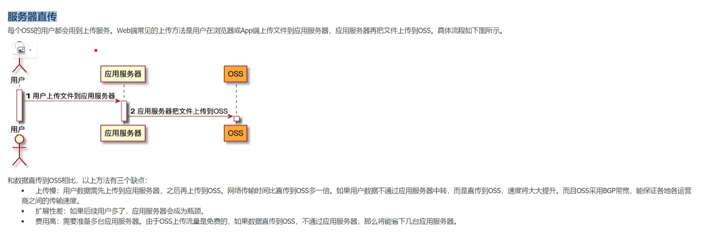
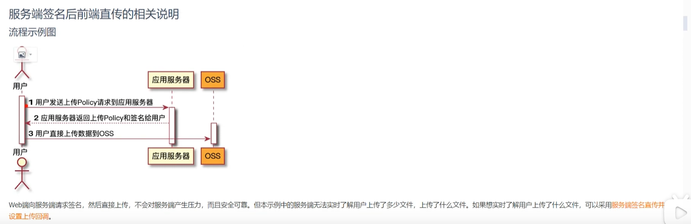
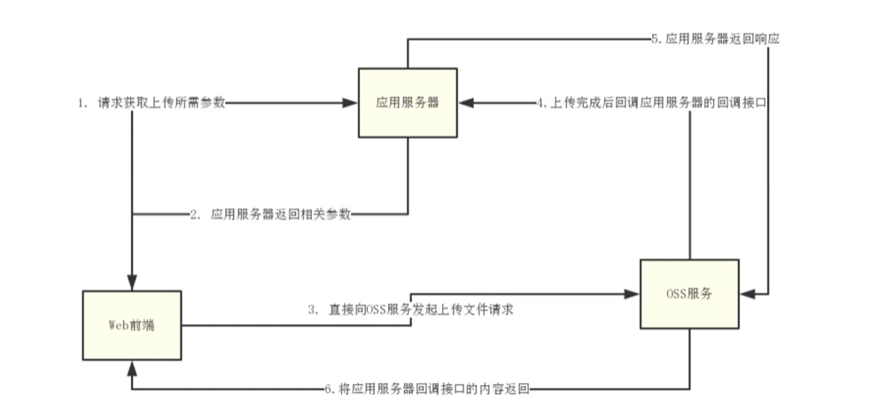

# OSS对象存储

官网教程：https://www.alibabacloud.com/help/zh/oss/use-cases/overview-16#36c322a137x9q

- 视频教程：https://www.bilibili.com/video/BV1Rf421q7bR?p=4&spm_id_from=pageDriver&vd_source=172e27a0e975b7231b48464889f1b58a

- https://www.cnblogs.com/l-y-h/p/12805028.html
