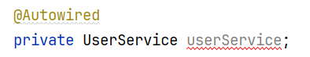

# 对象注入注解@Autowired和@Resource


- 参考文献：https://blog.csdn.net/Weixiaohuai/article/details/120853683
- https://www.cnblogs.com/think-in-java/p/5474740.html
- 





```java
Could not autowire. No beans of 'UserService' type found.
```


https://blog.csdn.net/luoluo95/article/details/125263985

在注入类的时候，@Autowired可能会出现


类似于
此类问题
出现此情况有多种解决方法

 

**文章目录
解决1:启动类位置**
解决方法 ：将启动类或者要注入的类放到启动类的同级或子级包内
**解决2:降低Bean的安全级别
解决3：将@Autowired改为@Resource**


**解决1:启动类位置**
可以查看本地启动类放置位置
**启动类一般要放在最外层的根目录位置**
这样才能扫到同级别以及子级的类


同上图，如果你的类放在gdcp包外，启动类是扫描不到的

**解决方法 ：将启动类或者要注入的类放到启动类的同级或子级包内**


**解决2:降低Bean的安全级别**
此问题是建立在：程序能正常运行，但是依旧有红色波浪线报错，但是无影响单纯是看红色碍眼


降低安全级别后，恢复正常
**此问题是Spring扫描问题，不造成太大影响**

 

**解决3：将@Autowired改为@Resource**
两个注解的区别是一个是@Autowired是Spring，@Resource是J2EE的
使用@Resource能减少Spring耦合度
@AutoWried按by type自动注入，而@Resource默认按byName自动注入。
@Resource的查询注入顺序是，去Bean中查找Name，如果查不到就去查Class，其次再从属性去查找，如果我们定义的类中有相同的Name可能会报错，因为查询到了多个。