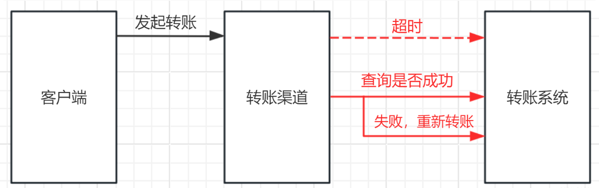

# 1.简介

## 1.1 什么是幂等性

- 幂等是一个数学与计算机科学概念，英文 idempotent [aɪˈdempətənt]。

  - 在数学中，某一元运算为幂等时，其作用在任一元素两次后会和其作用一次的结果相同。在数学中用函数表达式表示幂等就是：`f(x) = f(f(x))`，即可以使用相同参数重复执行，并能获得相同结果的函数。这些函数不会影响系统状态，也不用担心重复执行会对系统造成改变。。比如 求绝对值 的函数，就是幂等的，abs(x) = abs(abs(x))。

  - 计算机科学中，幂等表示一次和多次请求某一个资源所产生的影响应该相同。


- 若一个操作多次执行所产生的影响与单次执行一致，则称该操作具有幂等性（Idempotence）

## 1.2 什么是接口幂等性

- 接口幂等性是指在HTTP/1.1协议中定义的一个概念
- 接口幂等性指的是一个请求方法无论被执行多少次，对资源的影响都应与执行一次相同，不会产生新的副作用。简而言之，多次请求具有幂等性的接口不会导致资源状态的不一致或产生意外结果。这一概念对于保证网络不稳定时数据的一致性和服务稳定性特别重要。例如，通过为请求添加唯一ID确保即便重复发送，服务器也只处理一次。

## 1.3 为什么需要实现幂等性

> 我们开发一个转账功能，假设我们调用下游接口 **超时** 了。一般情况下，超时可能是网络传输丢包的问题，也可能是请求时没送到，还有可能是请求到了，**返回结果却丢了**。这时候我们是否可以 **重试** 呢？如果重试的话，是否会多赚了一笔钱呢？


在我们日常开发中，会存在各种不同系统之间的相互远程调用。调用远程服务会有三个状态：`成功`、`失败`、`超时`。

前两者都是明确的状态，但超时则是 **未知状态**。我们转账 **超时** 的时候，如果下游转账系统做好 **幂等性校验**，我们判断超时后直接发起重试，**既可以保证转账正常进行，又可以保证不会多转一笔**。

在接口调用时一般情况下都能正常返回信息不会重复提交，不过在遇见以下情况时就需要考虑幂等性了，如：

- **前端重复提交表单：** 在填写一些表格时候，用户填写完成提交，很多时候会因网络波动没有及时对用户做出提交成功响应，致使用户认为没有成功提交，然后一直点提交按钮，这时就会发生重复提交表单请求。
- **用户恶意进行刷单：** 例如在实现用户投票这种功能时，如果用户针对一个用户进行重复提交投票，这样会导致接口接收到用户重复提交的投票信息，这样会使投票结果与事实严重不符。
- **接口超时重复提交：** 很多时候 HTTP 客户端工具都默认开启超时重试的机制，尤其是第三方调用接口时候，为了防止网络波动超时等造成的请求失败，都会添加重试机制，导致一个请求提交多次。
- **消息进行重复消费：** 当使用 MQ 消息中间件时候，如果发生消息中间件出现错误未及时提交消费信息，导致发生重复消费。

使用幂等性最大的优势在于使接口保证任何幂等性操作，免去因重试等造成系统产生的未知的问题。

## 1.4 接口超时，应该如何处理？

如果我们调用下游接口超时了，我们应该如何处理？其实从生产者和消费者两个角度来看，有两种方案处理：

- 方案一：消费者角度。在接口超时后，**调用下游接口检查数据状态**：
  - 如果查询到是成功，就走成功流程；
  - 如果是失败，就按失败处理（重新请求）。



- 方案二：生产者角度。**下游接口支持幂等**，上有系统如果调用超时，发起重试即可。


两种方案都是可以的，但如果是 **MQ重复消费的场景**，方案一处理并不是很妥当，所以我们还是要求下游系统 **对外接口支持幂等**。

## 1.5 引入幂等性后对系统的影响

幂等性是为了简化客户端逻辑处理，能放置重复提交等操作，但却增加了服务端的逻辑复杂性和成本，其主要是：

- 把并行执行的功能改为串行执行，降低了执行效率。
- 增加了额外控制幂等的业务逻辑，复杂化了业务功能；

所以在使用时候需要考虑是否引入幂等性的必要性，根据实际业务场景具体分析，除了业务上的特殊要求外，一般情况下不需要引入的接口幂等性。

# 2.Restful API 接口的幂等性

现在流行的 Restful 推荐的几种HTTP接口方法中，不同的请求对幂等性的要求不同：

| 请求类型   | 是否幂等 | 描述                                                         |
| ---------- | -------- | ------------------------------------------------------------ |
| **GET**    | `是`     | GET 方法用于获取资源。一般不会也不应当对系统资源进行改变，所以是幂等的。 |
| **POST**   | `否`     | POST 方法用于创建新的资源。每次执行都会新增数据，所以不是幂等的。 |
| **PUT**    | `不一定` | PUT 方法一般用于修改资源。该操作分情况判断是否满足幂等，更新中直接根据某个值进行更新，也能保持幂等。不过执行累加操作的更新是非幂等的。 |
| **DELETE** | `不一定` | DELETE 方法一般用于删除资源。该操作分情况判断是否满足幂等，当根据唯一值进行删除时，满足幂等；但是带查询条件的删除则不一定满足。例如：根据条件删除一批数据后，又有新增数据满足该条件，再执行就会将新增数据删除，需要根据业务判断是否校验幂等。 |

# 3.如何实现幂等性

## 3.1 数据库层面：构建主键/唯一索引冲突

- 数据库主键/唯一索引实现接口幂等性校验，可以这样实现：
  1. 提前在数据库中为唯一存在的字段（如：**唯一流水号** bizSeq 字段）添加唯一索引，或者直接设置为主键。
  2. 请求过来，直接将数据插入、更新到数据库中，并进行 `try-catch` 捕获。
  3. **如果抛出异常，说明为重复请求**，可以直接返回成功，或提示请求重复。

> **补充：** 也可以新建一张 **防止重复点击表**，将唯一标识放到表中，存为主键或唯一索引，然后配合 tra-catch 对重复点击的请求进行处理。

- 伪代码如下：

  ```java
  /**
   * 幂等处理
   */
  Rsp idempotent（Request req）{
    
      try {
          insert(req);
      } catch (DuplicateKeyException e) {
          //拦截是重复请求，直接返回成功
          log.info("主键冲突，是重复请求，直接返回成功，流水号：{}",bizSeq);
          return rsp;
      }
  
      //正常处理请求
      dealRequest(req);
  
      return rsp;
  }
  ```

- **方案解释：**
  - 数据库唯一主键的实现主要是利用数据库中主键唯一约束的特性，一般来说唯一主键比较适用于“插入”时的幂等性，其能保证一张表中只能存在一条带该唯一主键的记录。
  - 使用数据库唯一主键完成幂等性时需要注意的是，该主键一般来说并不是使用数据库中自增主键，而是使用分布式 ID 充当主键（可以参考 Java 中分布式 ID 的设计方案 这篇文章），这样才能能保证在分布式环境下 ID 的全局唯一性。

- **适用操作：**

  - 插入操作

  - 删除操作


- **使用限制：**需要生成全局唯一主键 ID

- **主要流程：**
  - ① 客户端执行创建请求，调用服务端接口。
  - ② 服务端执行业务逻辑，生成一个分布式 ID，将该 ID 充当待插入数据的主键，然后执数据插入操作，运行对应的 SQL 语句。
  - ③ 服务端将该条数据插入数据库中，如果插入成功则表示没有重复调用接口。如果抛出主键重复异常，则表示数据库中已经存在该条记录，返回错误信息到客户端。


## 3.2 数据库层面：设置乐观锁

- 乐观锁是指在操作数据时，非常乐观，认为别人不会同时在修改数据。因此乐观锁不会上锁，只是在执行更新的时候判断一下，在此期间是否有人修改了数据。

- **乐观锁的实现：**

  - 首先给表多加一列 version 版本号，每次更新数据前，先查出来确认下是不是刚刚的版本号，没有改动再去执行更新，并升级 version（version=version+1）。比如，我们更新前，先查一下数据，查出来的版本号是 version=1。

    ```mysql
    select order_id, version from order where order_id='666'
    ```

  - 然后使用 version=1 和 订单ID 一起作为条件，再去更新：

    ```mysql
    update order set version = version +1, status='P' where  order_id='666' and version =1
    ```

  -  最后，更新成功才可以处理业务逻辑，如果更新失败，默认为重复请求，直接返回。

- **流程图如下：**


- **为什么版本号建议自增呢？**：因为乐观锁存在 ABA 的问题，如果 version 版本一直是自增的就不会出现 ABA 的情况。

- **方案描述：**数据库乐观锁方案一般只能适用于执行“更新操作”的过程，我们可以提前在对应的数据表中多添加一个字段，充当当前数据的版本标识。这样每次对该数据库该表的这条数据执行更新时，都会将该版本标识作为一个条件，值为上次待更新数据中的版本标识的值。

- **适用操作：**更新操作

- **使用限制：** 需要数据库对应业务表中添加额外字段；

- **描述示例：**


例如，存在如下的数据表中：

| id   | name     | price |
| :--- | :------- | :---- |
| 1    | 小米手机 | 1000  |
| 2    | 苹果手机 | 2500  |
| 3    | 华为手机 | 1600  |

为了每次执行更新时防止重复更新，确定更新的一定是要更新的内容，我们通常都会添加一个 version 字段记录当前的记录版本，这样在更新时候将该值带上，那么只要执行更新操作就能确定一定更新的是某个对应版本下的信息。

| id   | name     | price | version |
| :--- | :------- | :---- | :------ |
| 1    | 小米手机 | 1000  | 10      |
| 2    | 苹果手机 | 2500  | 21      |
| 3    | 华为手机 | 1600  | 5       |

这样每次执行更新时候，都要指定要更新的版本号，如下操作就能准确更新 version=5 的信息：

```mysql
UPDATE my_table SET price=price+50,version=version+1 WHERE id=1 AND version=5
```

上面 WHERE 后面跟着条件 id=1 AND version=5 被执行后，id=1 的 version 被更新为 6，所以如果重复执行该条 SQL 语句将不生效，因为 id=1 AND version=5 的数据已经不存在，这样就能保住更新的幂等，多次更新对结果不会产生影响。

## 3.3 数据库层面：悲观锁（select for update）【不推荐】

- 悲观锁：通俗点讲就是很悲观，每次去操作数据时，都觉得别人中途会修改，所以每次在拿数据的时候都会上锁。官方点讲就是，共享资源每次只给一个线程使用，其他线程阻塞，用完后再把资源转让给其它资源。

- **悲观锁的实现：** 在订单业务场景中，假设先查询出订单，如果查到的是处理中状态，就处理完业务，然后再更新订单状态为完成。如果查到订单，并且不是处理中的状态，则直接返回。

- 可以使用数据库悲观锁（select … for update）解决这个问题：

```sql
begin;  # 1.开始事务
select * from order where order_id='666' for update # 查询订单，判断状态,锁住这条记录
if（status !=处理中）{
   //非处理中状态，直接返回；
   return ;
}
## 处理业务逻辑
update order set status='完成' where order_id='666' # 更新完成
commit; # 5.提交事务
```

- 注意：

  - 这里的 order_id 需要是主键或索引，只用行级锁锁住这条数据即可，如果不是主键或索引，会锁住整张表。

  - 悲观锁在同一事务操作过程中，锁住了一行数据。这样 **别的请求过来只能等待**，如果当前事务耗时比较长，就很影响接口性能。所以一般 **不建议用悲观锁的实现方式**。

## 3.4 数据库层面：设置状态机

- 很多业务表，都是由状态的，比如：转账流水表，就会有 0-待处理，1-处理中，2-成功，3-失败的状态。转账流水更新的时候，都会涉及流水状态更新，即涉及 **状态机（即状态变更图）**。我们可以利用状态机来实现幂等性校验。

- **状态机的实现：**比如：转账成功后，把 **处理中** 的转账流水更新为成功的状态，SQL 如下：

  ```mysql
  update transfor_flow set status = 2 where biz_seq='666' and status = 1;
  ```

- **流程图如下：**
  - 第1次请求来时，bizSeq 流水号是 666，该流水的状态是处理中，值是 1，要更新为 2-成功的状态，所以该 update 语句可以正常更新数据，sql 执行结果的影响行数是 1，流水状态最后变成了 2。
  - 第2次请求也过来了，如果它的流水号还是 666，因为该流水状态已经变为 2-成功的状态，所以更新结果是0，不会再处理业务逻辑，接口直接返回。


- **伪代码实现如下：**

  ```java
  Rsp idempotentTransfer（Request req）{
      String bizSeq = req.getBizSeq();
      int rows= "update transfr_flow set status=2 where biz_seq=#{bizSeq} and status=1;"
      if(rows==1){
          log.info(“更新成功,可以处理该请求”);
          //其他业务逻辑处理
          return rsp;
      } else if(rows == 0) {
          log.info(“更新不成功，不处理该请求”);
          //不处理，直接返回
          return rsp;
      }
  
      log.warn("数据异常")
      return rsp：
  }
  ```

## 3.5 应用层面：防重Token令牌

- 防重令牌方案一般包括两个请求阶段：
  - 客户端请求申请获取请求接口用的token，服务端生成token返回；
  - 客户端带着token请求，服务端校验token。

- **主要流程：**

  - ① 服务端提供获取 Token 的接口，该 Token 可以是一个序列号，也可以是一个分布式 ID 或者 UUID 串。
  - ② 客户端调用接口获取 Token，这时候服务端会生成一个 Token 串。
  - ③ 然后将该串存入 Redis 数据库中，以该 Token 作为 Redis 的键（注意设置过期时间）。
  - ④ 将 Token 返回到客户端，客户端拿到后应存到表单隐藏域中。
  - ⑤ 客户端在执行提交表单时，把 Token 存入到 Headers 中，执行业务请求带上该 Headers。
  - ⑥ 服务端接收到请求后从 Headers 中拿到 Token，然后根据 Token 到 Redis 中查找该 key 是否存在。
  - ⑦ 服务端根据 Redis 中是否存该 key 进行判断，一般用 `redis.del(token)` 的方式，如果存在就将该 key 删除，然后正常执行业务逻辑。如果不存在就抛异常，返回重复提交的错误信息。

  


- **方案描述：** 针对客户端连续点击或者调用方的超时重试等情况，例如提交订单，此种操作就可以用 Token 的机制实现防止重复提交。简单的说就是调用方在调用接口的时候先向后端请求一个全局 ID（Token），请求的时候携带这个全局 ID 一起请求（Token 最好将其放到 Headers 中），后端需要对这个 Token 作为 Key，用户信息作为 Value 到 Redis 中进行键值内容校验，如果 Key 存在且 Value 匹配就执行删除命令，然后正常执行后面的业务逻辑。如果不存在对应的 Key 或 Value 不匹配就返回重复执行的错误信息，这样来保证幂等操作。

- **适用操作：**

  - 插入操作

  - 更新操作

  - 删除操作


- **使用限制：**

  - 需要生成全局唯一 Token 串；

  - 需要使用第三方组件 Redis 进行数据效验；

- 可能存在的问题：

  - 需要前后端联调才能实现，存在沟通成本，最终效果可能与设想不一致。
  - 如果前端多次获取多个Token，还是可以重复请求的，如果再在获取Token处加分布式锁控制，就不如直接用分布式锁来控制幂等性了
  - 在并发情况下，执行 Redis 查找数据与删除需要保证原子性，否则很可能在并发下无法保证幂等性。其实现方法可以使用分布式锁或者使用 Lua 表达式来注销查询与删除操作。

## 3.6 应用层面：分布式锁【推荐】

- 分布式锁 实现幂等性的逻辑就是，请求过来时，先去尝试获取分布式锁，如果获取成功，就执行业务逻辑，反之获取失败的话，就舍弃请求直接返回成功。

- 流程如下：
  - 分布式锁可以使用 Redis，也可以使用 Zookeeper，不过 Redis 相对好点，比较轻量级。
  - Redis 分布式锁，可以使用 `setIfAbsent()` 来实现，注意分布式锁的 key 必须为业务的唯一标识。
  - Redis 执行设置 key 的动作时，要设置过期时间，防止释放锁失败。这个过期时间不能太短，太短拦截不了重复请求，也不能设置太长，请求量多的话会占用存储空间。


## 3.7 应用层面：下游传递唯一序列号

**方案描述：**

所谓请求序列号，其实就是每次向服务端请求时候附带一个短时间内唯一不重复的序列号，该序列号可以是一个有序 ID，也可以是一个订单号，一般由下游生成，在调用上游服务端接口时附加该序列号和用于认证的 ID。

当上游服务器收到请求信息后拿取该序列号下游认证ID进行组合，形成用于操作 Redis 的 Key，然后到 Redis 中查询是否存在对应的 Key 的键值对，根据其结果：

- 如果存在，就说明已经对该下游的该序列号的请求进行了业务处理，这时可以直接响应重复请求的错误信息。
- 如果不存在，就以该 Key 作为 Redis 的键，以下游关键信息作为存储的值（例如下游商传递的一些业务逻辑信息），将该键值对存储到 Redis 中 ，然后再正常执行对应的业务逻辑即可。

**适用操作：**

- 插入操作
- 更新操作
- 删除操作

**使用限制：**

- 要求第三方传递唯一序列号；
- 需要使用第三方组件 Redis 进行数据效验；

**主要流程：**


主要步骤：

- ① 下游服务生成分布式 ID 作为序列号，然后执行请求调用上游接口，并附带“唯一序列号”与请求的“认证凭据ID”。
- ② 上游服务进行安全效验，检测下游传递的参数中是否存在“序列号”和“凭据ID”。
- ③ 上游服务到 Redis 中检测是否存在对应的“序列号”与“认证ID”组成的 Key，如果存在就抛出重复执行的异常信息，然后响应下游对应的错误信息。如果不存在就以该“序列号”和“认证ID”组合作为 Key，以下游关键信息作为 Value，进而存储到 Redis 中，然后正常执行接来来的业务逻辑。

> 上面步骤中插入数据到 Redis 一定要设置过期时间。这样能保证在这个时间范围内，如果重复调用接口，则能够进行判断识别。如果不设置过期时间，很可能导致数据无限量的存入 Redis，致使 Redis 不能正常工作。

# 4.防重Token令牌实现接口幂

## 4.1 Maven 引入相关依赖

```xml
<?xml version="1.0" encoding="UTF-8"?>
<project xmlns="http://maven.apache.org/POM/4.0.0" xmlns:xsi="http://www.w3.org/2001/XMLSchema-instance"
         xsi:schemaLocation="http://maven.apache.org/POM/4.0.0 https://maven.apache.org/xsd/maven-4.0.0.xsd">
    <modelVersion>4.0.0</modelVersion>

    <parent>
        <groupId>org.springframework.boot</groupId>
        <artifactId>spring-boot-starter-parent</artifactId>
        <version>2.3.4.RELEASE</version>
    </parent>

    <groupId>mydlq.club</groupId>
    <artifactId>springboot-idempotent-token</artifactId>
    <version>0.0.1</version>
    <name>springboot-idempotent-token</name>
    <description>Idempotent Demo</description>

    <properties>
        <java.version>1.8</java.version>
    </properties>

    <dependencies>
        <!--springboot web-->
        <dependency>
            <groupId>org.springframework.boot</groupId>
            <artifactId>spring-boot-starter-web</artifactId>
        </dependency>
        <!--springboot data redis-->
        <dependency>
            <groupId>org.springframework.boot</groupId>
            <artifactId>spring-boot-starter-data-redis</artifactId>
        </dependency>
        <dependency>
            <groupId>org.apache.commons</groupId>
            <artifactId>commons-pool2</artifactId>
        </dependency>
        <!--lombok-->
        <dependency>
            <groupId>org.projectlombok</groupId>
            <artifactId>lombok</artifactId>
        </dependency>
    </dependencies>

    <build>
        <plugins>
            <plugin>
                <groupId>org.springframework.boot</groupId>
                <artifactId>spring-boot-maven-plugin</artifactId>
            </plugin>
        </plugins>
    </build>

</project>
```

## 4.2 配置连接 Redis 的参数

```yaml
spring:
  redis:
    ssl: false
    host: 127.0.0.1
    port: 6379
    database: 0
    timeout: 1000
    password:
    lettuce:
      pool:
        max-active: 100
        max-wait: -1
        min-idle: 0
        max-idle: 20
```

## 4.3 创建与验证 Token 工具类

- 创建用于操作 Token 相关的 Service 类，里面存在 Token 创建与验证方法，其中：

  - **Token 创建方法：** 使用 UUID 工具创建 Token 串，设置以 “idempotent_token:“+“Token串” 作为 Key，以用户信息当成 Value，将信息存入 Redis 中。

  - **Token 验证方法：** 接收 Token 串参数，加上 Key 前缀形成 Key，再传入 value 值，执行 Lua 表达式（Lua 表达式能保证命令执行的原子性）进行查找对应 Key 与删除操作。执行完成后验证命令的返回结果，如果结果不为空且非0，则验证成功，否则失败。


```java
import java.util.Arrays;
import java.util.UUID;
import java.util.concurrent.TimeUnit;
import lombok.extern.slf4j.Slf4j;
import org.springframework.beans.factory.annotation.Autowired;
import org.springframework.data.redis.core.StringRedisTemplate;
import org.springframework.data.redis.core.script.DefaultRedisScript;
import org.springframework.data.redis.core.script.RedisScript;
import org.springframework.stereotype.Service;

@Slf4j
@Service
public class TokenUtilService {

    @Autowired
    private StringRedisTemplate redisTemplate;

    /**
     * 存入 Redis 的 Token 键的前缀
     */
    private static final String IDEMPOTENT_TOKEN_PREFIX = "idempotent_token:";

    /**
     * 创建 Token 存入 Redis，并返回该 Token
     *
     * @param value 用于辅助验证的 value 值
     * @return 生成的 Token 串
     */
    public String generateToken(String value) {
        // 实例化生成 ID 工具对象
        String token = UUID.randomUUID().toString();
        // 设置存入 Redis 的 Key
        String key = IDEMPOTENT_TOKEN_PREFIX + token;
        // 存储 Token 到 Redis，且设置过期时间为5分钟
        redisTemplate.opsForValue().set(key, value, 5, TimeUnit.MINUTES);
        // 返回 Token
        return token;
    }

    /**
     * 验证 Token 正确性
     *
     * @param token token 字符串
     * @param value value 存储在Redis中的辅助验证信息
     * @return 验证结果
     */
    public boolean validToken(String token, String value) {
        // 设置 Lua 脚本，其中 KEYS[1] 是 key，KEYS[2] 是 value
        String script = "if redis.call('get', KEYS[1]) == KEYS[2] then return redis.call('del', KEYS[1]) else return 0 end";
        RedisScript<Long> redisScript = new DefaultRedisScript<>(script, Long.class);
        // 根据 Key 前缀拼接 Key
        String key = IDEMPOTENT_TOKEN_PREFIX + token;
        // 执行 Lua 脚本
        Long result = redisTemplate.execute(redisScript, Arrays.asList(key, value));
        // 根据返回结果判断是否成功成功匹配并删除 Redis 键值对，若果结果不为空和0，则验证通过
        if (result != null && result != 0L) {
            log.info("验证 token={},key={},value={} 成功", token, key, value);
            return true;
        }
        log.info("验证 token={},key={},value={} 失败", token, key, value);
        return false;
    }

}
```

## 4.4 创建测试的 Controller 类

```java
import lombok.extern.slf4j.Slf4j;
import mydlq.club.example.service.TokenUtilService;
import org.springframework.beans.factory.annotation.Autowired;
import org.springframework.web.bind.annotation.*;

@Slf4j
@RestController
public class TokenController {

    @Autowired
    private TokenUtilService tokenService;

    /**
     * 获取 Token 接口
     *
     * @return Token 串
     */
    @GetMapping("/token")
    public String getToken() {
        // 获取用户信息（这里使用模拟数据）
        // 注：这里存储该内容只是举例，其作用为辅助验证，使其验证逻辑更安全，如这里存储用户信息，其目的为:
        // - 1)、使用"token"验证 Redis 中是否存在对应的 Key
        // - 2)、使用"用户信息"验证 Redis 的 Value 是否匹配。
        String userInfo = "mydlq";
        // 获取 Token 字符串，并返回
        return tokenService.generateToken(userInfo);
    }

    /**
     * 接口幂等性测试接口
     *
     * @param token 幂等 Token 串
     * @return 执行结果
     */
    @PostMapping("/test")
    public String test(@RequestHeader(value = "token") String token) {
        // 获取用户信息（这里使用模拟数据）
        String userInfo = "mydlq";
        // 根据 Token 和与用户相关的信息到 Redis 验证是否存在对应的信息
        boolean result = tokenService.validToken(token, userInfo);
        // 根据验证结果响应不同信息
        return result ? "正常调用" : "重复调用";
    }

}
```

## 4.5 创建 SpringBoot 启动类

```java
import org.springframework.boot.SpringApplication;
import org.springframework.boot.autoconfigure.SpringBootApplication;

@SpringBootApplication
public class Application {

    public static void main(String[] args) {
        SpringApplication.run(Application.class, args);
    }

}
```

## 4.6 写测试类进行测试

- 写个测试类进行测试，多次访问同一个接口，测试是否只有第一次能否执行成功。

```java
import org.junit.Assert;
import org.junit.Test;
import org.junit.runner.RunWith;
import lombok.extern.slf4j.Slf4j;
import org.springframework.beans.factory.annotation.Autowired;
import org.springframework.boot.test.context.SpringBootTest;
import org.springframework.http.MediaType;
import org.springframework.test.context.junit4.SpringRunner;
import org.springframework.test.web.servlet.MockMvc;
import org.springframework.test.web.servlet.request.MockMvcRequestBuilders;
import org.springframework.test.web.servlet.setup.MockMvcBuilders;
import org.springframework.web.context.WebApplicationContext;

@Slf4j
@SpringBootTest
@RunWith(SpringRunner.class)
public class IdempotenceTest {

    @Autowired
    private WebApplicationContext webApplicationContext;

    @Test
    public void interfaceIdempotenceTest() throws Exception {
        // 初始化 MockMvc
        MockMvc mockMvc = MockMvcBuilders.webAppContextSetup(webApplicationContext).build();
        // 调用获取 Token 接口
        String token = mockMvc.perform(MockMvcRequestBuilders.get("/token")
                .accept(MediaType.TEXT_HTML))
                .andReturn()
                .getResponse().getContentAsString();
        log.info("获取的 Token 串：{}", token);
        // 循环调用 5 次进行测试
        for (int i = 1; i <= 5; i++) {
            log.info("第{}次调用测试接口", i);
            // 调用验证接口并打印结果
            String result = mockMvc.perform(MockMvcRequestBuilders.post("/test")
                    .header("token", token)
                    .accept(MediaType.TEXT_HTML))
                    .andReturn().getResponse().getContentAsString();
            log.info(result);
            // 结果断言
            if (i == 0) {
                Assert.assertEquals(result, "正常调用");
            } else {
                Assert.assertEquals(result, "重复调用");
            }
        }
    }

}
```

显示如下：

```java
[main] IdempotenceTest:  获取的 Token 串：980ea707-ce2e-456e-a059-0a03332110b4
[main] IdempotenceTest:  第1次调用测试接口
[main] IdempotenceTest:  正常调用
[main] IdempotenceTest:  第2次调用测试接口
[main] IdempotenceTest:  重复调用
[main] IdempotenceTest:  第3次调用测试接口
[main] IdempotenceTest:  重复调用
[main] IdempotenceTest:  第4次调用测试接口
[main] IdempotenceTest:  重复调用
[main] IdempotenceTest:  第5次调用测试接口
[main] IdempotenceTest:  重复调用
```


# 5.分布式锁实现接口幂等性

## 5.1 定义@NotRepeat 注解

- @NotRepeat 注解用于修饰需要进行幂等性校验的类。

  ```java
  import java.lang.annotation.*;
  
  /**
   * 幂等性校验注解
   */
  @Target(ElementType.METHOD)
  @Retention(RetentionPolicy.RUNTIME)
  @Documented
  public @interface NotRepeat {
  
  }
  ```

## 5.2 定义AOP切面

- AOP切面监控被 @Idempotent 注解修饰的方法调用，实现幂等性校验逻辑。

```java
import com.demo.util.RedisUtils;
import lombok.extern.slf4j.Slf4j;
import org.aspectj.lang.JoinPoint;
import org.aspectj.lang.annotation.After;
import org.aspectj.lang.annotation.Aspect;
import org.aspectj.lang.annotation.Before;
import org.aspectj.lang.annotation.Pointcut;
import org.springframework.stereotype.Component;

import javax.annotation.Resource;
import javax.servlet.http.HttpServletRequest;
import java.util.concurrent.TimeUnit;

/**
 * 重复点击校验
 */
@Slf4j
@Aspect
@Component
public class IdempotentAOP {
    
    /** Redis前缀 */
    private String API_IDEMPOTENT_CHECK = "API_IDEMPOTENT_CHECK:";

    @Resource
    private HttpServletRequest request;
    @Resource
    private RedisUtils redisUtils;

    /**
     * 定义切面
     */
    @Pointcut("@annotation(com.demo.annotation.NotRepeat)")
    public void notRepeat() {
    }

    /**
     * 在接口原有的方法执行前，将会首先执行此处的代码
     */
    @Before("notRepeat()")
    public void doBefore(JoinPoint joinPoint) {
        String uri = request.getRequestURI();

        // 登录后才做校验
        UserInfo loginUser = AuthUtil.getLoginUser();
        if (loginUser != null) {
            assert uri != null;
            String key = loginUser.getAccount() + "_" + uri;
            log.info(">>>>>>>>>> 【IDEMPOTENT】开始幂等性校验，加锁，account: {}，uri: {}", loginUser.getAccount(), uri);

            // 加分布式锁
            boolean lockSuccess = redisUtils.setIfAbsent(API_IDEMPOTENT_CHECK + key, "1", 30, TimeUnit.MINUTES);
            log.info(">>>>>>>>>> 【IDEMPOTENT】分布式锁是否加锁成功:{}", lockSuccess);
            if (!lockSuccess) {
                if (uri.contains("contract/saveDraftContract")) {
                    log.error(">>>>>>>>>> 【IDEMPOTENT】文件保存中，请稍后");
                    throw new IllegalArgumentException("文件保存中，请稍后");

                } else if (uri.contains("contract/saveContract")) {
                    log.error(">>>>>>>>>> 【IDEMPOTENT】文件发起中，请稍后");
                    throw new IllegalArgumentException("文件发起中，请稍后");
                }
            }
        }
    }

    /**
     * 在接口原有的方法执行后，都会执行此处的代码（final）
     */
    @After("notRepeat()")
    public void doAfter(JoinPoint joinPoint) {
        // 释放锁
        String uri = request.getRequestURI();
        assert uri != null;
        UserInfo loginUser = SysUserUtil.getloginUser();
        if (loginUser != null) {
            String key = loginUser.getAccount() + "_" + uri;
            log.info(">>>>>>>>>> 【IDEMPOTENT】幂等性校验结束，释放锁，account: {}，uri: {}", loginUser.getAccount(), uri);
            redisUtils.del(API_IDEMPOTENT_CHECK + key);
        }
    }
}
```

## 5.3 定义RedisUtils 工具类

```java
import lombok.extern.slf4j.Slf4j;
import org.springframework.beans.factory.annotation.Autowired;
import org.springframework.data.redis.core.RedisTemplate;
import org.springframework.stereotype.Component;

import java.util.Arrays;
import java.util.concurrent.TimeUnit;


/**
 * redis工具类
 */
@Slf4j
@Component
public class RedisUtils {

    /**
     * 默认RedisObjectSerializer序列化
     */
    @Autowired
    private RedisTemplate<String, Object> redisTemplate;

    /**
     * 加分布式锁
     */
    public boolean setIfAbsent(String key, String value, long timeout, TimeUnit unit) {
        return redisTemplate.opsForValue().setIfAbsent(key, value, timeout, unit);
    }

    /**
     * 释放锁
     */
    public void del(String... keys) {
        if (keys != null && keys.length > 0) {
            //将参数key转为集合
            redisTemplate.delete(Arrays.asList(keys));
        }
    }
}
```

## 5.4 测试类

```java
import com.demo.annotation.NotRepeat;
import org.springframework.web.bind.annotation.GetMapping;
import org.springframework.web.bind.annotation.RequestMapping;
import org.springframework.web.bind.annotation.RestController;

import java.util.Arrays;
import java.util.List;

/**
 * 幂等性校验测试类
 */
@RequestMapping("/order")
@RestController
public class OrderController {

    @NotRepeat
    @GetMapping("/orderList")
    public List<String> orderList() {
        // 查询列表
        return Arrays.asList("Order_A", "Order_B", "Order_C");
        // throw new RuntimeException("参数错误");
    }
}
```

## 5.5 测试结果

- 请求地址：http://localhost:8080/order/orderList

- 日志信息如下：经测试，加锁后，正常处理业务、抛出异常都可以正常释放锁。


# 6.总结

- 幂等性是开发当中很常见也很重要的一个需求，尤其是支付、订单等与金钱挂钩的服务，保证接口幂等性尤其重要。在实际开发中，我们需要针对不同的业务场景我们需要灵活的选择幂等性的实现方式：

  - 对于下单等存在唯一主键的，可以使用“唯一主键方案”的方式实现。

  - 对于更新订单状态等相关的更新场景操作，使用“乐观锁方案”实现更为简单。

  - 对于上下游这种，下游请求上游，上游服务可以使用“下游传递唯一序列号方案”更为合理。

  - 类似于前端重复提交、重复下单、没有唯一ID号的场景，可以通过 Token 与 Redis 配合的“防重 Token 方案”实现更为快捷。


- 上面只是给与一些建议，再次强调一下，实现幂等性需要先理解自身业务需求，根据业务逻辑来实现这样才合理，处理好其中的每一个结点细节，完善整体的业务流程设计，才能更好的保证系统的正常运行。最后做一个简单总结，然后本博文到此结束，如下：

| 方案名称        | 适用方法                   | 实现复杂度 | 方案缺点                                                     |
| :-------------- | :------------------------- | :--------- | :----------------------------------------------------------- |
| 数据库唯一主键  | 插入操作 删除操作          | 简单       | - 只能用于插入操作；- 只能用于存在唯一主键场景；             |
| 数据库乐观锁    | 更新操作                   | 简单       | - 只能用于更新操作；- 表中需要额外添加字段；                 |
| 请求序列号      | 插入操作 更新操作 删除操作 | 简单       | - 需要保证下游生成唯一序列号；- 需要 Redis 第三方存储已经请求的序列号； |
| 防重 Token 令牌 | 插入操作 更新操作 删除操作 | 适中       | - 需要 Redis 第三方存储生成的 Token 串；                     |


# 参考文献

- https://blog.csdn.net/qq_33204709/article/details/134218663
- https://cloud.tencent.com/developer/article/1805463


