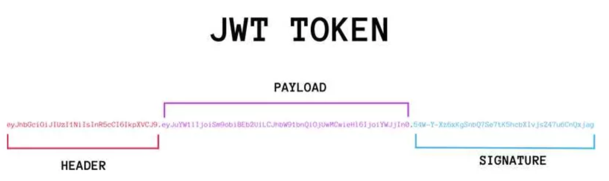

# jwt和token介绍

1. token介绍

   令牌（Token）：在计算机领域，令牌是一种代表某种访问权限或身份认证信息的令牌。它可以是一串随机生成的字符或数字，用于验证用户的身份或授权用户对特定资源的访问。普通的令牌可能以各种形式出现，如访问令牌、身份令牌、刷新令牌等。

   

   简单理解 : 每个用户生成的唯一字符串标识,可以进行用户识别和校验

   类似技术:  天王盖地虎 ,小鸡炖蘑菇

   优势: token验证标识无法直接识别用户的信息,盗取token后也无法\`登录\`程序! 相对安全!

2. jwt介绍

   Token是一项规范和标准(接口)

   JWT(JSON Web Token)是具体可以生成,校验,解析等动作Token的技术(实现类)

   

3. jwt工作流程

   -   用户提供其凭据（通常是用户名和密码）进行身份验证。
   -   服务器对这些凭据进行验证，并在验证成功后创建一个JWT。
   -   服务器将JWT发送给客户端，并客户端在后续的请求中将JWT附加在请求头或参数中。
   -   服务器接收到请求后，验证JWT的签名和有效性，并根据JWT中的声明进行身份验证和授权操作

4. jwt数据组成和包含信息

   JWT由三部分组成: header(头部).payload(载荷).signature(签名)

   

   我们需要理解的是, jwt可以携带很多信息! 一般情况,需要加入:有效时间,签名秘钥,其他用户标识信息!

   有效时间为了保证token的时效性,过期可以重新登录获取!

   签名秘钥为了防止其他人随意解析和校验token数据!

   用户信息为了我们自己解析的时候,知道Token对应的具体用户!

5. jwt使用和测试

   1. 导入依赖

      ```xml
      <dependency>
          <groupId>io.jsonwebtoken</groupId>
          <artifactId>jjwt</artifactId>
          <version>0.9.1</version>
      </dependency>
      
      <dependency>
          <groupId>javax.xml.bind</groupId>
          <artifactId>jaxb-api</artifactId>
          <version>2.3.0</version>
      </dependency>
      ```

   2. 编写配置

      application.yaml

      ```yaml
      #jwt配置
      jwt:
        token:
          tokenExpiration: 120 #有效时间,单位分钟
          tokenSignKey: headline123456  #当前程序签名秘钥 自定义
      ```

   3. 导入工具类

      封装jwt技术工具类

      ```java
      package com.atguigu.utils;
      
      import com.alibaba.druid.util.StringUtils;
      import io.jsonwebtoken.*;
      import lombok.Data;
      import org.springframework.boot.context.properties.ConfigurationProperties;
      import org.springframework.context.annotation.Configuration;
      import org.springframework.stereotype.Component;
      
      import java.util.Date;
      
      @Data
      @Component
      @ConfigurationProperties(prefix = "jwt.token")
      public class JwtHelper {
      
          private  long tokenExpiration; //有效时间,单位毫秒 1000毫秒 == 1秒
          private  String tokenSignKey;  //当前程序签名秘钥
      
          //生成token字符串
          public  String createToken(Long userId) {
              System.out.println("tokenExpiration = " + tokenExpiration);
              System.out.println("tokenSignKey = " + tokenSignKey);
              String token = Jwts.builder()
      
                      .setSubject("YYGH-USER")
                      .setExpiration(new Date(System.currentTimeMillis() + tokenExpiration*1000*60)) //单位分钟
                      .claim("userId", userId)
                      .signWith(SignatureAlgorithm.HS512, tokenSignKey)
                      .compressWith(CompressionCodecs.GZIP)
                      .compact();
              return token;
          }
      
          //从token字符串获取userid
          public  Long getUserId(String token) {
              if(StringUtils.isEmpty(token)) return null;
              Jws<Claims> claimsJws = Jwts.parser().setSigningKey(tokenSignKey).parseClaimsJws(token);
              Claims claims = claimsJws.getBody();
              Integer userId = (Integer)claims.get("userId");
              return userId.longValue();
          }
                      //判断token是否有效
          public  boolean isExpiration(String token){
              try {
                  boolean isExpire = Jwts.parser()
                      .setSigningKey(tokenSignKey)
                      .parseClaimsJws(token)
                      .getBody()
                      .getExpiration().before(new Date());
                  //没有过期，有效，返回false
                  return isExpire;
              }catch(Exception e) {
                  //过期出现异常，返回true
                  return true;
              }
          }
      }
      ```

​    4.  使用和测试

```java
@org.springframework.boot.test.context.SpringBootTest
public class SpringBootTest {

    @Autowired
    private JwtHelper jwtHelper;

    @Test
    public void test(){
        //生成 传入用户标识
        String token = jwtHelper.createToken(1L);
        System.out.println("token = " + token);

        //解析用户标识
        int userId = jwtHelper.getUserId(token).intValue();
        System.out.println("userId = " + userId);

        //校验是否到期! false 未到期 true到期
        boolean expiration = jwtHelper.isExpiration(token);
        System.out.println("expiration = " + expiration);
    }
}
```

-   **1.2  登录功能实现**


# 三方登陆

- https://www.cnblogs.com/zwqh/p/11579275.html

- https://cloud.tencent.com/developer/article/2107116

- https://www.cnblogs.com/tanqingfu1/p/16551954.html

- https://developer.aliyun.com/article/486142 
- https://www.cnblogs.com/zimug/p/11986912.html
- https://cloud.tencent.com/developer/article/1936090