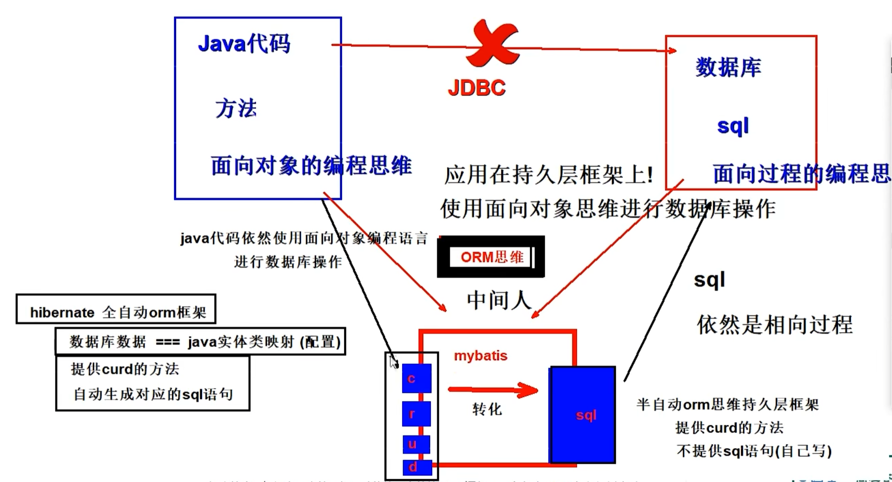
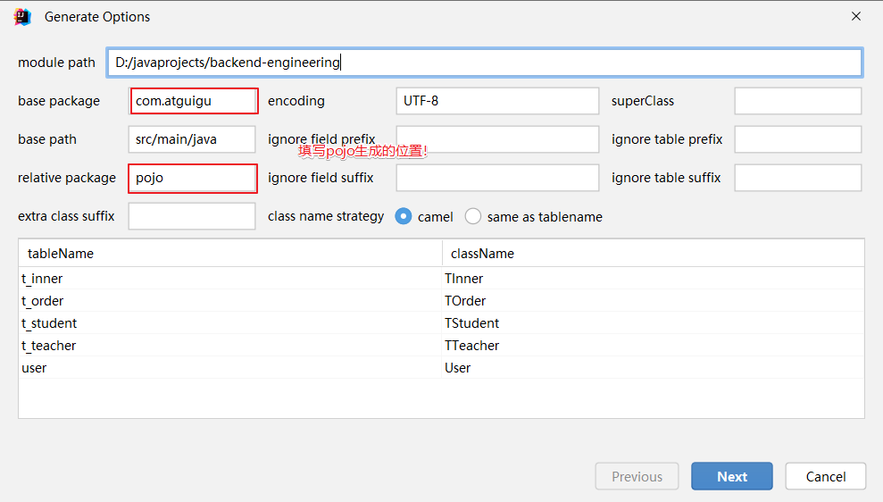

# 5.3 逆向工程和MybatisX插件




#### 5.3.1 ORM思维介绍

ORM（Object-Relational Mapping，对象-关系映射）是一种将数据库和面向对象编程语言中的对象之间进行转换的技术。它将对象和关系数据库的概念进行映射，最后我们就可以通过方法调用进行数据库操作!!

最终: **让我们可以使用面向对象思维进行数据库操作！！！**

**ORM 框架通常有半自动和全自动两种方式。**

-   半自动 ORM 通常需要程序员手动编写 SQL 语句或者配置文件，将实体类和数据表进行映射，还需要手动将查询的结果集转换成实体对象。
-   全自动 ORM 则是将实体类和数据表进行自动映射，使用 API 进行数据库操作时，ORM 框架会自动执行 SQL 语句并将查询结果转换成实体对象，程序员无需再手动编写 SQL 语句和转换代码。

**下面是半自动和全自动 ORM 框架的区别：**

1.  映射方式：半自动 ORM 框架需要程序员手动指定实体类和数据表之间的映射关系，通常使用 XML 文件或注解方式来指定；全自动 ORM 框架则可以自动进行实体类和数据表的映射，无需手动干预。
2.  查询方式：半自动 ORM 框架通常需要程序员手动编写 SQL 语句并将查询结果集转换成实体对象；全自动 ORM 框架可以自动组装 SQL 语句、执行查询操作，并将查询结果转换成实体对象。
3.  性能：由于半自动 ORM 框架需要手动编写 SQL 语句，因此程序员必须对 SQL 语句和数据库的底层知识有一定的了解，才能编写高效的 SQL 语句；而全自动 ORM 框架通过自动优化生成的 SQL 语句来提高性能，程序员无需进行优化。
4.  学习成本：半自动 ORM 框架需要程序员手动编写 SQL 语句和映射配置，要求程序员具备较高的数据库和 SQL 知识；全自动 ORM 框架可以自动生成 SQL 语句和映射配置，程序员无需了解过多的数据库和 SQL 知识。

常见的半自动 ORM 框架包括 MyBatis 等；常见的全自动 ORM 框架包括 Hibernate、Spring Data JPA、MyBatis-Plus 等。

#### 5.3.2 逆向工程

&#x20;   MyBatis 的逆向工程是一种自动化生成持久层代码和映射文件的工具，它可以根据数据库表结构和设置的参数生成对应的实体类、Mapper.xml 文件、Mapper 接口等代码文件，简化了开发者手动生成的过程。逆向工程使开发者可以快速地构建起 DAO 层，并快速上手进行业务开发。
&#x20;  MyBatis 的逆向工程有两种方式：通过 MyBatis Generator 插件实现和通过 Maven 插件实现。无论是哪种方式，逆向工程一般需要指定一些配置参数，例如数据库连接 URL、用户名、密码、要生成的表名、生成的文件路径等等。
&#x20;  总的来说，MyBatis 的逆向工程为程序员提供了一种方便快捷的方式，能够快速地生成持久层代码和映射文件，是半自动 ORM 思维像全自动发展的过程，提高程序员的开发效率。

**注意：逆向工程只能生成单表crud的操作，多表查询依然需要我们自己编写！**

#### 5.3.3 逆向工程插件MyBatisX使用

&#x20;  MyBatisX 是一个 MyBatis 的代码生成插件，可以通过简单的配置和操作快速生成 MyBatis Mapper、pojo 类和 Mapper.xml 文件。下面是使用 MyBatisX 插件实现逆向工程的步骤：

1. 安装插件：

   在 IntelliJ IDEA 中打开插件市场，搜索 MyBatisX 并安装。

2. 使用 IntelliJ IDEA连接数据库

   - 连接数据库

     

   - 填写信息

     

   - 展示库表

     

   - 逆向工程使用

     

     

     

3. 查看生成结果

   

4. 逆向工程案例使用

   正常使用即可，自动生成单表的crud方法！

   ```java
   package com.atguigu.mapper;
   
   import com.atguigu.pojo.User;
   
   /**
   * @author Jackiechan
   * @description 针对表【user】的数据库操作Mapper
   * @createDate 2023-06-02 16:55:32
   * @Entity com.atguigu.pojo.User
   */
   public interface UserMapper {
   
       int deleteByPrimaryKey(Long id);
   
       int insert(User record);
   
       int insertSelective(User record);
   
       User selectByPrimaryKey(Long id);
   
       int updateByPrimaryKeySelective(User record);
   
       int updateByPrimaryKey(User record);
   
   }
   
   ```


# 4 MyBatis-Plus代码生成器(MyBatisX插件)

## 2.4.1 Mybatisx插件逆向工程

- MyBatis-Plus为我们提供了强大的mapper和service模板，能够大大的提高开发效率。但是在真正开发过程中，MyBatis-Plus并不能为我们解决所有问题，例如一些复杂的SQL，多表联查，我们就需要自己去编写代码和SQL语句，我们该如何快速的解决这个问题呢，这个时候可以使用MyBatisX插件
- MyBatisX一款基于 IDEA 的快速开发插件，为效率而生。


## 2.4.2 MyBatisX快速代码生成

- 使用mybatisX插件,自动生成sql语句实现：<https://baomidou.com/guides/new-code-generator/>

