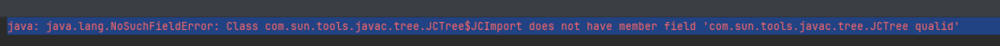
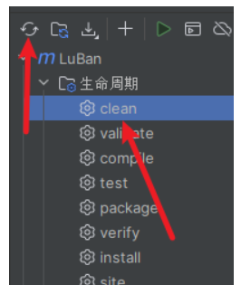

# 1.问题描述

- 毛毛张最近在做一个基于`SpringBoot + vue`的《音乐播放管理系统》，是一个练手的项目，里面使用到了`Lombok`插件，当我运行起项目之后报错

  ```java
  java: java.lang.NoSuchFieldError: Class com.sun.tools.javac.tree.JCTree$JCImport does not have member field 'com.sun.tools.javac.tree.JCTree qualid'
  ```

- 如下图所示：



# 2.报错原因及解决方案

- 报错原因：

  - **这是因为当前使用的Lombok版本与Java版本不兼容的问题，毛毛张使用的是Java8版本**
  - **毛毛张已经两次遇到这个问题，本质上的原因是在导入依赖的时候没有写Lombok的版本或者版本比较低**

- 解决方案：将Lombok依赖的版本更新到比较新或者最新的版本即可，注意是修改pom文件里面的版本，使用Maven将Lombok依赖的版本更新到新版本，毛毛张使用了`1.18.30`的版本就解决了

  ```xml
  <dependency>
      <groupId>org.projectlombok</groupId>
      <artifactId>lombok</artifactId>
      <version>1.18.30</version>
  </dependency>
  ```

- 如果更新完不行，可以使用Manen生命周期管理中的`clean`来清理一下缓存或者新建个项目重新加载`Maven`依赖



# 参考文献

- <https://blog.csdn.net/G971005287W/article/details/133350154>