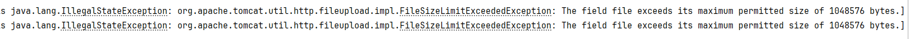

[toc]


# 异常：The field file exceeds its maximum permitted size of 1048576 bytes

# 1.问题描述

- 毛毛张最近在做一个基于`SpringBoot + vue`的《音乐播放管理系统》，是一个练手的项目，里面有一个主要的功能就是上传一个歌手的图片或者歌曲，在测试时发现报错，上传一个歌手的音乐，大小是3.89MB，报错内容如下：

```cmd
Resolved [org.springframework.web.multipart.MaxUploadSizeExceededException: Maximum upload size exceeded; nested exception is java.lang.IllegalStateException: org.apache.tomcat.util.http.fileupload.impl.FileSizeLimitExceededException: The field file exceeds its maximum permitted size of 1048576 bytes.]
```

- 详细报错内容如下图所示：



# 2.错误原因

- `SpringBoot`项目在文件上传时出现了上传的文件的大小超出了允许上传的范围，本质原因是`SpringBoot`内嵌的`tomcat`默认的所有上传的文件大小为 1MB，超出这个大小就会报错，解决这个问题需要更改以下两个默认参数
  - **multipart.maxFileSize**
  - **multipart.maxRequestSize**

# 3.解决方案

- 解决方案需要针对不同的SpringBoot的版本来确定，以下是几个不同的版本的`SpringBoot`的解决方案，可以根据自己项目的SpringBoot版本来对应：把默认的文件的大小限制修改一下即可，为了保险，毛毛张直接全部设置成1024MB了

## 3.1 SpringBoot 1.3.x 之前

- 方式1：`application.properties`

  ```properties
  multipart.maxFileSize=50Mb
  multipart.maxRequestSize=50Mb
  ```

- 方式2：`appllication.yaml`

  ```yaml
  multipart:
    maxFileSize: 50Mb
    maxRequestSize: 50Mb
  ```

### 3.2 SpringBoot 1.4.x

- 方式1：`application.properties`

  ```properties
  spring.http.multipart.maxFileSize=50Mb
  spring.http.multipart.maxRequestSize=50Mb
  ```

- 方式2：`appllication.yaml`

  ```yaml
  spring:
    # 文件上传相关配置
    http:
      multipart:
        maxFileSize: 1024MB # 单个文件最大大小为 1GB
        maxRequestSize: 1024MB # 单次请求所有文件最大总大小为 1GB
  ```

### 3.3 SpringBoot 2.0.x之后

- 方式1：`application.properties`

  ```properties
  spring.servlet.multipart.max-file-size=100Mb
  spring.servlet.multipart.max-request-size=1000Mb
  ```

- 方式2：`appllication.yaml`

  ```yaml
  spring:
    # 文件上传相关配置
    servlet:
      multipart:
        max-file-size: 1024MB # 单个文件最大大小为 1GB
        max-request-size: 1024MB # 单次请求所有文件最大总大小为 1GB
  ```

## 3.2 重启

- 根据你的版本修改完上述配置之后，重启你的SpringBoot项目即可！

# 参考文献

- <https://blog.csdn.net/weixin_44299027/article/details/126074192>